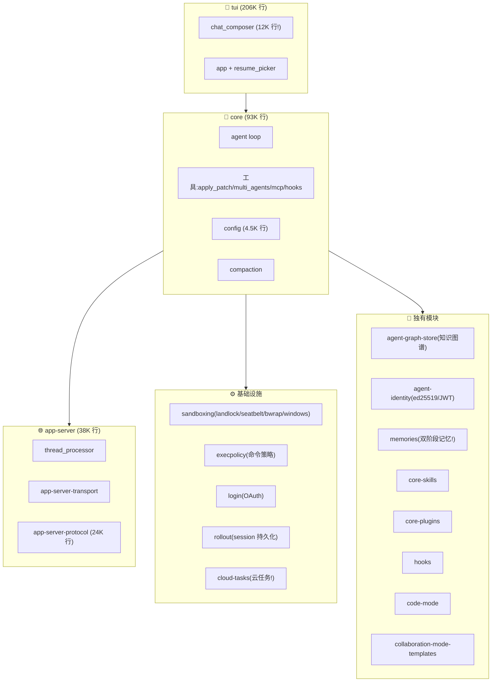

# OpenAI Codex CLI · 架构拆解

> 📁 **源码位置** · `~/codex/`(GitHub: [openai/codex](https://github.com/openai/codex))
>
> 📄 **核心 crate** · `core`(93K 行) · `tui`(206K 行) · `app-server`(38K 行) · `protocol`(20K 行) · `state`(18K 行) · `exec-server`(22K 行) · `cli`(20K 行)
>
> 🔌 **技术栈** · Rust(100 个 crate!) · Bazel(构建系统) · Nix(flake) · 跨平台(macOS/Linux/Windows)
>
> 🔖 **规模** · ~116 万行 Rust 代码(和 grok-build 同量级)

## 1. Codex 是什么

**OpenAI Codex CLI** 是 OpenAI 官方的终端 coding agent。和 grok-build 一样是 Rust，但规模更大（100 crate vs 70 crate），功能更全。

**和其他三个框架的根本区别**：

| 维度 | kimi-code | grok-build | Pi | **Codex** |
|---|---|---|---|---|
| **出品方** | Moonshot | SpaceXAI | earendil | **OpenAI** |
| **代码量** | ~10 万 | ~134 万 | ~10 万 | **~116 万** |
| **crate 数** | N/A(DI) | 70 | 7 包 | **100** |
| **云集成** | 无 | 无 | 无 | **✅ cloud-tasks** |
| **身份持久化** | 无 | 无 | 无 | **✅ agent-identity** |
| **知识图谱** | 无 | 无 | 无 | **✅ agent-graph-store** |
| **跨 session 记忆** | 无 | memory crate | 无 | **✅ memories(双阶段!)** |
| **协作模式** | swarm | skeptic | 无 | **✅ multi-agent + collaboration** |
| **平台支持** | macOS/Linux | macOS/Linux | macOS/Linux | **✅ + Windows** |

**Codex 是四个框架中功能最全的**。

## 2. 100 个 crate 分层



## 3. 十个独特设计（其他三个框架都没有）

### ① Cloud Tasks（云任务执行）

`codex-rs/cloud-tasks/` —— Codex 能**把任务提交到 OpenAI 云端**执行：

```rust
// cloud-tasks/src/new_task.rs
// 从本地提交任务到云端,在 chatgpt.com/codex 上跑
```

这意味着 Codex 不只是本地 agent，还能**卸载任务到云**。其他三个框架完全本地跑。

### ② Agent Identity（身份持久化）

`codex-rs/agent-identity/` —— 用 **ed25519 密钥对 + JWT** 管理 agent 身份：

```rust
use ed25519_dalek::SigningKey;
use jsonwebtoken::Algorithm;
```

每个 agent 有自己的密钥对，可以**签名和验证自己的操作**。这是我们在论文里提出的"identity persistence"的**真实实现**！其他三个框架完全没这个概念。

### ③ Agent Graph Store（知识图谱）

`codex-rs/agent-graph-store/` —— 存储线程生成的 agent 之间的**父子拓扑关系**：

```rust
//! Storage-neutral parent/child topology for thread-spawned agents.
```

多 agent 不是扁平的，是**树形结构**（谁 spawn 了谁、状态如何）。这让 Codex 能追踪整个 agent 家族。

### ④ Memories（双阶段跨 session 记忆）

`codex-rs/state/src/runtime/memories.rs` + `codex-rs/ext/memories/` —— Codex 有**跨 session 的长期记忆系统**：

```rust
const JOB_KIND_MEMORY_STAGE1: &str = "memory_stage1";
const JOB_KIND_MEMORY_CONSOLIDATE_GLOBAL: &str = "memory_consolidate_global";
```

**双阶段记忆巩固**：
1. **Stage 1**：从对话中提取记忆
2. **Consolidate Global**：把分散的记忆合并成全局知识

这正好对应我们论文里提的"多尺度记忆"和"离线巩固"！**Codex 已经在做了**。

### ⑤ ExecPolicy（命令策略引擎）

`codex-rs/execpolicy/` —— 一个完整的**命令权限策略 DSL**：

```rust
pub use rule::NetworkRuleProtocol;
pub use rule::PrefixPattern;
pub use rule::PrefixRule;
pub use rule::Rule;
```

不是简单的 allow/deny 列表，是一个**可编程的策略语言**（有 parser、有规则匹配、有网络协议级别的控制）。

### ⑥ Cross-Platform Sandbox（四平台沙箱）

`codex-rs/sandboxing/` 支持四种平台的原生沙箱：

```rust
#[cfg(target_os = "linux")]
mod bwrap;        // Linux: BubbleWrap
mod landlock;     // Linux: Landlock LSM
#[cfg(target_os = "macos")]
pub mod seatbelt; // macOS: Seatbelt
mod windows;      // Windows: Restricted Token
```

**grok-build 只有 Linux/macOS**。Codex 是唯一支持 Windows 沙箱的。

### ⑦ Multi-Agent Collaboration（协作模式）

`codex-rs/core/src/tools/handlers/multi_agents.rs` —— 不只是 spawn 子 agent，是**协作**：

```rust
//! Implements the collaboration tool surface for spawning and managing sub-agents.
//! Sub-agents start from the turn's effective config, inherit runtime-only state
//! such as provider, approval policy, sandbox, and cwd, and then optionally
//! layer role-specific config on top.
```

子 agent **继承**父 agent 的 provider / approval policy / sandbox / cwd，还可以叠加**角色特定配置**。

### ⑧ Code Mode（代码执行模式）

`codex-rs/code-mode/` —— 不同于普通的 shell 执行，有一个专门的"代码模式"。

### ⑨ Rollout Trace（会话回放）

`codex-rs/rollout/` + `codex-rs/rollout-trace/` —— 完整的 session 录制和回放系统：

```rust
pub(crate) mod recorder;
pub(crate) mod search;
pub(crate) mod session_index;
```

可以搜索历史 session、索引、压缩。

### ⑩ Collaboration Mode Templates（协作模板）

`codex-rs/collaboration-mode-templates/` —— 预定义的多 agent 协作模板。

## 4. 四框架全面对比

| 维度 | kimi-code | grok-build | Pi | **Codex** |
|---|---|---|---|---|
| **语言** | TS | Rust | TS | Rust |
| **代码量** | ~10 万 | ~134 万 | ~10 万 | **~116 万** |
| **架构** | DI × Scope | Crate + Actor | Harness | **Crate + Server/Client** |
| **Session 模型** | 线性(wire) | 线性(SQLite) | 树形(Tree) | **线性(rollout)** |
| **跨 session 记忆** | ❌ | ❌(有雏形) | ❌ | **✅ 双阶段** |
| **身份持久化** | ❌ | ❌ | ❌ | **✅ ed25519 + JWT** |
| **知识图谱** | ❌ | ❌ | ❌ | **✅ agent-graph-store** |
| **云任务** | ❌ | ❌ | ❌ | **✅ cloud-tasks** |
| **多 agent** | swarm(128) | skeptic | ❌ | **multi-agent(collaboration)** |
| **沙箱** | ❌ | nono | ❌ | **4 平台原生** |
| **权限** | 19 policy | shell parser | ❌ | **execpolicy DSL** |
| **Goal 验证** | 3 轮 | skeptic panel | ❌ | ❌ |
| **Doom loop** | max_steps | 服务端检测 | ❌ | ❌ |
| **Provider** | 5 | 3 | 8+ | **OpenAI 为主** |
| **Windows** | ❌ | ❌ | ❌ | **✅** |
| **eval** | 双轨道 | ❌ | 有 | **有 evals** |
| **MCP** | ✅ | ✅ | ❌ | ✅(codex-mcp) |
| **Skills** | ✅ | ✅ | ✅ | ✅(core-skills) |
| **Hooks** | ✅ | ✅ | ✅ | ✅ |

## 5. 反熵分析

| 反熵策略 | Codex 怎么做 | 和其他三个比 |
|---|---|---|
| **压缩** | compaction(类似 kimi-code) | 标准 |
| **隔离** | 4 平台原生沙箱(最强) | **最强**(唯一支持 Windows) |
| **验证** | 无 skeptic(和 Pi 一样信任 LLM) | 弱 |
| **恢复** | rollout(录制+回放+搜索+索引) | 最完整 |
| **约束** | execpolicy DSL(最灵活) | 最灵活 |

**Codex 的独特路线**：不像 grok-build 做"对抗性不信任"（skeptic panel），也不像 Pi 做"完全信任"。Codex 做**结构性约束**（沙箱 + execpolicy + 身份签名），但不做**结果验证**（不检查 agent 做得对不对）。

## 6. 一句话总结

> OpenAI Codex CLI 是四个框架中**功能最全、工程最成熟**的。它的独特优势在于：(1) **云任务**（卸载到 OpenAI 云端执行）、(2) **agent identity**（ed25519 + JWT 签名验证）、(3) **双阶段跨 session 记忆**（Stage1 提取 + Global 合并）、(4) **agent graph store**（多 agent 拓扑追踪）、(5) **四平台原生沙箱**（含 Windows）、(6) **execpolicy DSL**（可编程命令策略）。它的反熵路线是"**结构性约束**"（沙箱 + 策略 + 身份），而非"**结果验证**"（skeptic）。**Codex 是离 7×24 最近的框架** —— 它已经有了记忆巩固、身份持久化、云任务卸载，这些正是我们论文里提出的能力。

## 7. 源码索引

| 概念 | crate | 行数 |
|---|---|---|
| TUI | `tui/` | 206K |
| Agent core | `core/` | 93K |
| App server | `app-server/` | 38K |
| Protocol | `protocol/` | 20K |
| State | `state/` | 18K |
| Cloud tasks | `cloud-tasks/` | — |
| Agent identity | `agent-identity/` | — |
| Agent graph store | `agent-graph-store/` | — |
| Memories | `state/src/runtime/memories.rs` + `ext/memories/` | 5K+ |
| ExecPolicy | `execpolicy/` | — |
| Sandboxing(4 平台) | `sandboxing/` + `linux-sandbox/` + `windows-sandbox-rs/` | 23K |
| Multi-agent | `core/src/tools/handlers/multi_agents.rs` | 4.5K+ |
| Rollout(回放) | `rollout/` + `rollout-trace/` | 17K |
| Config | `core/src/config/` | 4.5K |
| Login(OAuth) | `login/` | 6.8K |
| Skills | `core-skills/` | — |
| Plugins | `core-plugins/` | 18.5K |
| Hooks | `hooks/` | 9.4K |
| MCP | `codex-mcp/` | 6.5K |
| Code mode | `code-mode/` | 6.8K |
| Collaboration | `collaboration-mode-templates/` | — |
| Network proxy | `network-proxy/` | 13.5K |
