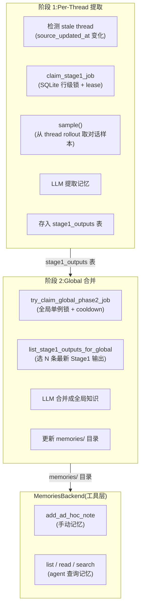

# OpenAI Codex CLI · 双阶段记忆系统深度拆解

> 📁 **源码位置** · `codex-rs/state/src/runtime/memories.rs`(5,290 行)+ `codex-rs/memories/write/src/phase1.rs` + `phase2.rs` + `codex-rs/ext/memories/src/`
>
> 🔬 **方法** · codegraph 索引(110,881 节点 / 415,134 边)精确追踪

## 1. 为什么这是重大发现

在 [05-agi-7x24.md](../../insights/05-agi-7x24.md) 里，我们**提出**了"多尺度记忆层级 + 离线巩固"作为 7×24 AGI 的必需能力。当时我们说"当前框架完全缺失"。

**Codex 已经实现了。**

这不是一个原型 —— 是一个带 **SQLite 持久化 + 作业队列 + 租约 + 重试 + 冷却期 + 用量追踪**的生产级系统。

## 2. 双阶段记忆架构



## 3. 阶段 1:Per-Thread 记忆提取

### 3.1 核心流程(从 codegraph 源码确认)

```rust
// codex-rs/memories/write/src/phase1.rs(verbatim from codegraph)
pub(super) async fn run_jobs(
    context: &StageOneRequestContext,
    db: &StateRuntime,
) -> Result<...> {
    let jobs = claim_startup_jobs(...).await?;   // ① 抢占作业
    for job in jobs {
        let result = run(context, db, &job).await; // ② 每个 thread 跑一次 LLM
        match result {
            JobResult::Success { .. } => success(db, &job, ...).await,
            JobResult::NoOutput => no_output(db, &job).await,
            JobResult::Failed { .. } => failed(db, &job, reason).await,
        }
    }
}
```

### 3.2 Stale 检测(什么时候触发?)

```rust
// memories.rs:88-131(verbatim)
async fn stage1_source_needs_update(
    &self,
    thread_id: ThreadId,
    source_updated_at: i64,
) -> anyhow::Result<bool> {
    // 查 stage1_outputs 表:这个 thread 上次提取时的 source_updated_at
    let existing_output = sqlx::query(
        "SELECT source_updated_at FROM stage1_outputs WHERE thread_id = ?"
    )...;
    
    if let Some(existing_output) = existing_output {
        let existing_source_updated_at: i64 = existing_output.try_get("source_updated_at")?;
        if existing_source_updated_at >= source_updated_at {
            return Ok(false);  // 没变化,不需要重新提取
        }
    }
    // 还检查 jobs 表的 last_success_watermark
    // ...
    Ok(true)
}
```

**两个条件触发 Stage 1**:
1. thread 的对话内容变化了(`source_updated_at` 更新)
2. 之前没提取过(新 thread)

### 3.3 作业队列(SQLite 行级锁 + Lease)

```rust
async fn try_claim_stage1_job(
    &self,
    thread_id: ThreadId,
    worker_id: ThreadId,
    source_updated_at: i64,
    lease_seconds: i64,
    max_running_jobs: usize,
) -> anyhow::Result<Stage1JobClaimOutcome>
```

**生产级作业队列特征**:
- **Lease(租约)**:抢到作业的 worker 有时间窗口完成,超时释放
- **max_running_jobs**:并发上限
- **ownership_token**:防止两个 worker 同时处理同一个 thread

### 3.4 用量追踪(Stage 1 输出被引用时计数)

```rust
// memories.rs:55-86(verbatim)
pub async fn record_stage1_output_usage(
    &self,
    thread_ids: &[ThreadId],
) -> anyhow::Result<usize> {
    // UPDATE stage1_outputs
    // SET usage_count = COALESCE(usage_count, 0) + 1,
    //     last_usage = ?
    // WHERE thread_id = ?
}
```

每条 Stage 1 输出记录被**引用的次数**和**最后引用时间**。这让 Stage 2 合并时能优先选择**高频引用**的记忆(类似 PageRank 的思路)。

## 4. 阶段 2:Global 合并

### 4.1 全局单例 + 冷却期

```rust
// phase2.rs:227-261(verbatim from codegraph)
pub(super) async fn claim(
    context: &MemoryStartupContext,
    db: &StateRuntime,
) -> Result<Claim, &'static str> {
    let claim = db
        .memories()
        .try_claim_global_phase2_job(context.thread_id(), crate::stage_two::JOB_LEASE_SECONDS)
        .await?;
    
    let (token, watermark) = match claim {
        Phase2JobClaimOutcome::Claimed { ownership_token, input_watermark } => {
            (ownership_token, input_watermark)  // 拿到了
        }
        Phase2JobClaimOutcome::SkippedRetryUnavailable => {
            return Err("skipped_retry_unavailable");
        }
        Phase2JobClaimOutcome::SkippedCooldown => {
            return Err("skipped_cooldown");  // 还在冷却期
        }
        Phase2JobClaimOutcome::SkippedRunning => {
            return Err("skipped_running");  // 另一个 worker 在跑
        }
    };
    Ok(Claim { token, watermark })
}
```

**关键常量**:
```rust
const PHASE2_SUCCESS_COOLDOWN_SECONDS: i64 = 6 * 60 * 60;  // 6 小时冷却
const PHASE2_INPUT_SELECTION_PAGE_SIZE: usize = 512;
const DEFAULT_RETRY_REMAINING: i64 = 3;
```

- **6 小时冷却**:Stage 2 每 6 小时最多跑一次(防止过于频繁地修改全局记忆)
- **512 页选择**:每次选 512 条 Stage 1 输出来合并
- **3 次重试**:失败最多重试 3 次

### 4.2 Token 用量追踪

```rust
// phase2.rs:594-625(verbatim)
fn emit_token_usage_metrics(context: &MemoryStartupContext, token_usage: &TokenUsage) {
    context.histogram(MEMORY_PHASE_TWO_TOKEN_USAGE, token_usage.total_tokens, ...);
    context.histogram(MEMORY_PHASE_TWO_TOKEN_USAGE, token_usage.input_tokens, ...);
    context.histogram(MEMORY_PHASE_TWO_TOKEN_USAGE, token_usage.cached_input(), ...);
    context.histogram(MEMORY_PHASE_TWO_TOKEN_USAGE, token_usage.output_tokens, ...);
    context.histogram(MEMORY_PHASE_TWO_TOKEN_USAGE, token_usage.reasoning_output_tokens, ...);
}
```

**每个 token 类型都被追踪**(input / output / cached / reasoning)。这让 OpenAI 能精确计算记忆巩固的成本。

## 5. MemoriesBackend(Agent 工具层)

Agent 通过工具读写记忆:

```rust
// codex-rs/ext/memories/src/backend.rs(verbatim from codegraph)
pub trait MemoriesBackend: Clone + Send + Sync + 'static {
    fn add_ad_hoc_note(&self, request: AddAdHocMemoryNoteRequest) -> ...;
    fn list(&self, request: ListMemoriesRequest) -> ...;
    fn read(&self, request: ReadMemoryRequest) -> ...;
    fn search(&self, request: SearchMemoriesRequest) -> ...;
}
```

**四种操作**:
| 操作 | 用途 |
|---|---|
| `add_ad_hoc_note` | Agent 手动添加记忆("这个项目的测试命令是 pnpm test") |
| `list` | 列出所有记忆文件 |
| `read` | 读特定记忆(分页 + token 限制) |
| `search` | 搜索记忆(支持 Any / AllOnSameLine / AllWithinLines 匹配模式) |

**存储**:目前是文件系统(`memories/` 目录),但接口设计支持远程后端:

```rust
/// Implementations should return paths relative to the memory store and enforce
/// their own storage-specific access rules. The local implementation uses the
/// filesystem today; a later implementation can satisfy the same contract from
/// a remote backend.
```

## 6. 和我们论文的对照

| 论文提出的(§4) | Codex 的实现 | 状态 |
|---|---|---|
| **多尺度记忆层级** | Stage 1(per-thread) + Stage 2(global) | ✅ **已实现**(两层) |
| **离线巩固("睡眠")** | Phase 2 全局合并(6 小时冷却) | ✅ **已实现** |
| **结构化提取** | LLM 从 rollout 提取(非自由摘要) | ✅ **已实现** |
| **身份持久化** | `agent-identity`(ed25519 + JWT) | ✅ **已实现**(另一个 crate) |
| **成本意识** | Phase 2 token 用量追踪 | ✅ **已实现** |
| **自适应验证** | 无 skeptic panel | ❌ 未实现 |
| **5 层记忆** | 只有 2 层(thread + global) | ⚠️ 部分 |

**Codex 实现了我们论文 7 项提案中的 5 项。** 这既验证了我们方向的正确性,也说明 OpenAI 已经走在前面。

## 7. 和其他三个框架的对比

| 维度 | kimi-code | grok-build | Pi | **Codex** |
|---|---|---|---|---|
| **跨 session 记忆** | ❌ | memory crate(雏形) | ❌ | **✅ 双阶段** |
| **记忆提取** | N/A | N/A | N/A | **Stage 1(per-thread LLM 提取)** |
| **记忆合并** | N/A | N/A | N/A | **Stage 2(global 合并,6h 冷却)** |
| **作业队列** | N/A | N/A | N/A | **SQLite(lease + retry + cooldown)** |
| **用量追踪** | telemetry | signals | N/A | **usage_count + last_usage** |
| **Agent 查询记忆** | N/A | N/A | N/A | **list / read / search 工具** |
| **Token 成本追踪** | per-turn | TDigest | N/A | **per-extraction 全 token 类型** |

## 8. 设计权衡

### 8.1 为什么用两层而不是五层?

我们论文提了五层(working / episodic / daily / weekly / identity)。Codex 只有两层(thread / global)。可能的原因:

- **实用性**:两层已经能覆盖主要场景(per-session 提取 + cross-session 合并)
- **成本控制**:每多一层就多一次 LLM 调用。两层是成本和效果的平衡点
- **渐进式**:先从两层开始,未来可以加中间层(daily / weekly)

### 8.2 为什么 6 小时冷却?

Stage 2 每 6 小时跑一次。这防止:
- 频繁修改全局记忆(稳定性)
- 成本爆炸(每次 Stage 2 都是一次 LLM 调用)
- 记忆抖动(快速来回变化让 agent 困惑)

### 8.3 为什么用 SQLite 作业队列而不是消息队列?

- **零依赖**:SQLite 嵌入式,不需要 Redis/RabbitMQ
- **持久化**:作业状态在磁盘上,重启不丢
- **行级锁**:SQLite 的 `UPDATE ... WHERE` 天然原子
- **够用**:记忆巩固不是高频操作,不需要专业 MQ

## 9. 一句话总结

> Codex 的双阶段记忆系统是**生产级的跨 session 知识管理**:Stage 1 从每个 thread 的对话中提取记忆(per-thread LLM 调用,SQLite 作业队列 + lease + retry),Stage 2 把分散的记忆合并成全局知识(6 小时冷却,512 条输入选择,全 token 类型成本追踪)。Agent 通过 `list / read / search / add_ad_hoc_note` 四种工具主动查询和管理记忆。**这是我们论文提出的"多尺度记忆 + 离线巩固"的真实生产实现**,验证了方向的正确性,同时展示了 OpenAI 已经走在了前面。

## 10. 源码索引

| 概念 | 文件 | 行数 |
|---|---|---|
| MemoryStore(核心) | `state/src/runtime/memories.rs` | 5,290 |
| StateRuntime(入口) | `state/src/runtime.rs` | — |
| 数据模型 | `state/src/model/memories.rs` | — |
| Stage 1 执行 | `memories/write/src/phase1.rs` | — |
| Stage 2 执行 | `memories/write/src/phase2.rs` | — |
| 启动上下文 | `memories/write/src/runtime.rs` | — |
| Agent 工具(list/read/search) | `ext/memories/src/backend.rs` | — |
| Agent 工具(list 实现) | `ext/memories/src/tools/list.rs` | — |
| Agent 工具(ad_hoc_note) | `ext/memories/src/tools/ad_hoc_note.rs` | — |
| Prompt | `ext/memories/src/prompts.rs` | — |
| TUI 设置 | `tui/src/bottom_pane/memories_settings_view.rs` | — |
