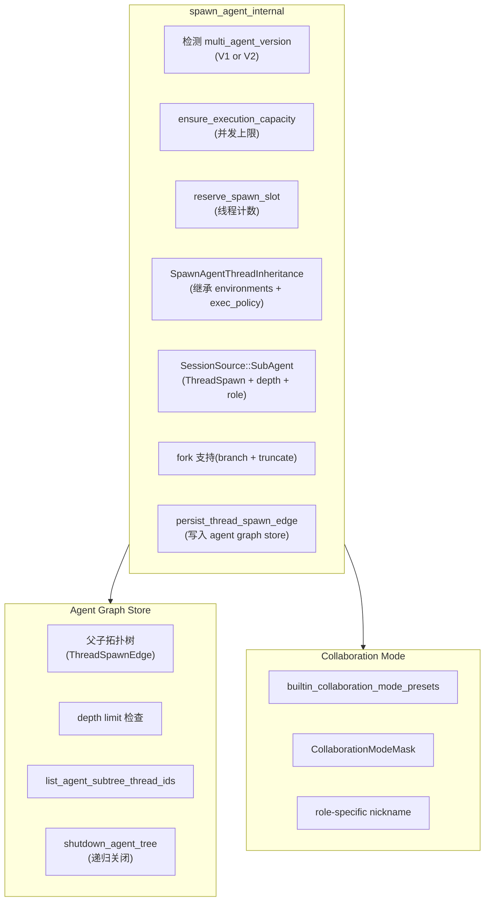

# OpenAI Codex CLI · Multi-Agent 协作 + ExecPolicy DSL 深度拆解

> 📁 **源码位置** · `codex-rs/core/src/agent/control/`(spawn)+ `codex-rs/agent-graph-store/`(拓扑) + `codex-rs/execpolicy/`(策略 DSL)
>
> 🔬 **codegraph 验证** · 精确追踪 spawn_agent_internal / CollabAgentTool / Rule / Decision / PolicyParser

---

## 第一部分：Multi-Agent 协作系统

### 1. 架构总览

Codex 的多 agent 不是简单的"父 spawn 子"（像 kimi-code swarm），而是一个**带拓扑追踪、深度限制、驻留管理、继承链和协作模式**的完整体系。



### 2. spawn_agent_internal 核心流程

从 codegraph 返回的完整源码（`spawn.rs:365-562`）提取关键步骤：

```rust
// codex-rs/core/src/agent/control/spawn.rs:365-562 (verbatim from codegraph)
async fn spawn_agent_internal(
    &self,
    config: Config,
    initial_input: SpawnInitialInput,
    session_source: Option<SessionSource>,
    options: SpawnAgentOptions,
) -> CodexResult<LiveAgent> {
    // ① 检测多 agent 版本(V1 旧版 / V2 新版)
    let multi_agent_version = state
        .effective_multi_agent_version_for_spawn(...)
        .await;

    // ② 检查执行容量(并发上限)
    self.ensure_execution_capacity(multi_agent_version, session_source)?;

    // ③ 预留线程槽位
    let agent_max_threads = config.effective_agent_max_threads(multi_agent_version);
    let mut reservation = self.state.reserve_spawn_slot(reservation_max_threads)?;

    // ④ 继承父 agent 的环境和策略
    let inheritance = SpawnAgentThreadInheritance {
        environments: self.inherited_environments_for_source(...).await,
        exec_policy: self.inherited_exec_policy_for_source(...).await,
    };

    // ⑤ 创建新线程(或 fork)
    let new_thread = state.spawn_new_thread_with_source(
        config, self.clone(), session_source, ...,
        inheritance.environments,
        inheritance.exec_policy,
    ).await?;

    // ⑥ 持久化拓扑边到 agent graph store
    self.persist_thread_spawn_edge_for_source(
        new_thread.thread.as_ref(),
        new_thread.thread_id,
        notification_source.as_ref(),
    ).await;

    // ⑦ 发送初始输入(用户消息 或 agent 间通信)
    match initial_input {
        SpawnInitialInput::UserInput(input) => {
            self.send_input_after_capacity_check(...).await?;
        }
        SpawnInitialInput::InterAgentCommunication(communication, context) => {
            self.send_inter_agent_communication_after_capacity_check(...).await?;
        }
    }

    Ok(LiveAgent { thread_id, metadata, status })
}
```

**七个关键步骤**：
1. 版本检测（V1/V2 兼容）
2. 容量检查（并发上限）
3. 槽位预留（线程计数 + 原子操作）
4. 环境继承（exec_policy + environments 从父传递）
5. 线程创建（支持 fork）
6. 拓扑持久化（写入 graph store）
7. 输入发送（支持两种：用户消息 / agent 间通信）

### 3. Inter-Agent Communication（agent 间通信）

```rust
enum SpawnInitialInput {
    UserInput(Vec<UserInput>),
    InterAgentCommunication(InterAgentCommunication, AgentCommunicationContext),
}
```

**这是 kimi-code 和 grok-build 都没有的**：子 agent 的初始输入不只是用户消息，还可以是**另一个 agent 发来的通信**。这让 agent 之间能**直接对话**（不只是父→子→父的单向流）。

### 4. Agent Graph Store（拓扑追踪）

```rust
// codex-rs/agent-graph-store/src/lib.rs
//! Storage-neutral parent/child topology for thread-spawned agents.
```

存储**谁 spawn 了谁**的关系。从测试文件可以看出它支持的操作：

| 操作 | 来源测试 |
|---|---|
| `list_agent_subtree_thread_ids` | 递归列出子树所有 thread |
| `shutdown_agent_tree` | 递归关闭整个 agent 树 |
| `ephemeral_spawn_does_not_persist_agent_graph_edge` | 临时 spawn 不持久化 |
| `resume_agent_from_rollout` | 恢复时重建拓扑 |
| `spawn_thread_subagents_persist_parent_originator` | 持久化父子关系 |

**比 grok-build 的 agent lifecycle 更强**：grok-build 是扁平 registry（没有拓扑），Codex 是**树形拓扑 + 持久化 + 可恢复**。

### 5. Collaboration Mode Presets（协作模式预设）

```rust
// codegraph 显示 18 个调用 CollaborationModeMask 的位置
CollaborationModeMask → ModeKind + Settings
```

预定义的协作模式（如"plan mode"），每种模式有特定的：
- 工具集（Mask 过滤）
- Reasoning effort 级别
- 系统提示

### 6. 和其他框架对比

| 维度 | kimi-code | grok-build | Pi | **Codex** |
|---|---|---|---|---|
| **拓扑** | 扁平 | 扁平 | 无多 agent | **树形 + 持久化** |
| **Agent 间通信** | ❌ | ❌ | ❌ | **✅ InterAgentCommunication** |
| **深度限制** | 子不能 spawn 子 | 子不能 spawn 子 | N/A | **exceeds_thread_spawn_depth_limit** |
| **Fork** | ❌ | checkpoint | session tree | **✅ fork + truncate** |
| **继承** | MCP/hooks/tools | MCP/hooks/tools | N/A | **environments + exec_policy** |
| **协作模式** | swarm(template) | skeptic panel | N/A | **CollaborationModeMask presets** |
| **恢复** | session resume | checkpoint | session tree | **resume_agent_from_rollout** |
| **递归关闭** | ❌ | ❌ | N/A | **shutdown_agent_tree** |

---

## 第二部分：ExecPolicy DSL

### 1. 这是什么

ExecPolicy 是一个**命令权限策略 DSL**（Domain-Specific Language）。不是简单的 allow/deny 列表，而是一个**可编程的策略语言**，有自己的 parser、rule engine 和 network-level 控制。

### 2. 策略规则体系

从 codegraph 返回的 `rule.rs` 完整源码：

```rust
// codex-rs/execpolicy/src/rule.rs (verbatim from codegraph)

// 三种决策
pub enum Decision { /* Allow / Deny / Prompt */ }

// 规则匹配结果
pub enum RuleMatch {
    PrefixRuleMatch {
        matched_prefix: Vec<String>,
        decision: Decision,
        resolved_program: Option<AbsolutePathBuf>,
        justification: Option<String>,
    },
    HeuristicsRuleMatch {
        command: Vec<String>,
        decision: Decision,
    },
}

// 前缀规则
pub struct PrefixRule {
    pub pattern: PrefixPattern,
    pub decision: Decision,
    pub justification: Option<String>,
}

// 网络协议级控制
pub enum NetworkRuleProtocol {
    Http,
    Https,
    Socks5Tcp,
    Socks5Udp,
}

// 规则 trait
pub trait Rule: Any + Debug + Send + Sync {
    fn program(&self) -> &str;
    fn matches(&self, cmd: &[String]) -> Option<RuleMatch>;
    fn as_any(&self) -> &dyn Any;
}
```

### 3. 前缀匹配（比 grok-build 的 shell 解析更精细）

```rust
// rule.rs:46-59 (verbatim)
impl PrefixPattern {
    pub fn matches_prefix(&self, cmd: &[String]) -> Option<Vec<String>> {
        let pattern_length = self.rest.len() + 1;
        if cmd.len() < pattern_length || cmd[0] != self.first.as_ref() {
            return None;
        }
        for (pattern_token, cmd_token) in self.rest.iter().zip(&cmd[1..pattern_length]) {
            if !pattern_token.matches(cmd_token) {
                return None;
            }
        }
        Some(cmd[..pattern_length].to_vec())
    }
}
```

**支持通配符匹配**（`PatternToken`），不只是精确字符串。

### 4. 策略文件加载（分层覆盖）

```rust
// codex-rs/core/src/exec_policy.rs:593-649 (verbatim from codegraph)
pub async fn load_exec_policy(config_stack: &ConfigLayerStack) -> Result<Policy> {
    let mut policy_paths = Vec::new();
    
    // 按 precedence 从低到高遍历配置层
    for layer in config_stack.get_layers(
        ConfigLayerStackOrdering::LowestPrecedenceFirst, false
    ) {
        // 可选:忽略 user/project 层的安全策略
        if config_stack.ignore_user_and_project_exec_policy_rules()
            && matches!(layer.name, User | Project)
        {
            continue;
        }
        if let Some(config_folder) = layer.config_folder() {
            let policy_dir = config_folder.join(RULES_DIR_NAME);
            let layer_policy_paths = collect_policy_files(&policy_dir).await?;
            policy_paths.extend(layer_policy_paths);
        }
    }

    // 用 PolicyParser 解析所有策略文件
    let mut parser = PolicyParser::new();
    for policy_path in &policy_paths {
        let contents = fs::read_to_string(policy_path).await?;
        parser.parse(&identifier, &contents)?;
    }
    
    let policy = parser.build();
    // 合并远程 requirements overlay
    Ok(policy.merge_overlay(requirements_policy.as_ref()))
}
```

**分层策略加载**（类似 CSS 层叠）：
1. 系统级策略
2. 用户级策略（`~/.codex/rules/`）
3. 项目级策略（`.codex/rules/`）
4. 远程 requirements overlay

高优先级层可以**覆盖**低优先级层的规则。

### 5. 策略修正（Amendment）

```rust
// exec_policy.rs:853-872 (verbatim)
fn try_derive_execpolicy_amendment_for_prompt_rules(
    matched_rules: &[RuleMatch],
) -> Option<ExecPolicyAmendment> {
    // 如果有 Prompt 级别的策略规则,不允许自动修正
    if matched_rules.iter().any(|rm| is_policy_match(rm) && rm.decision() == Decision::Prompt) {
        return None;
    }
    // 但 Heuristics 的 Prompt 可以自动 amend(让沙箱外运行)
    matched_rules.iter().find_map(|rm| match rm {
        RuleMatch::HeuristicsRuleMatch { command, decision: Decision::Prompt } => {
            Some(ExecPolicyAmendment::from(command.clone()))
        }
        _ => None,
    })
}
```

**两级 Prompt**：
- **Policy Prompt**（策略级）：不能自动修正，必须用户手动同意
- **Heuristics Prompt**（启发式）：可以自动 amend（在沙箱外运行后自动记住）

### 6. 网络策略（NetworkRule）

ExecPolicy 不只控制**命令执行**，还控制**网络访问**：

```rust
// 网络协议级控制
pub enum NetworkRuleProtocol {
    Http,
    Https,
    Socks5Tcp,
    Socks5Udp,
}
```

可以按**协议**和**域名**允许/拒绝网络访问。这是 grok-build 的 sandbox 没有的精度（grok-build 只能"全开/全关子进程网络"）。

### 7. 和其他框架对比

| 维度 | kimi-code | grok-build | Pi | **Codex** |
|---|---|---|---|---|
| **权限模型** | 19 policy 链 | shell parser + sandbox | 无 | **ExecPolicy DSL** |
| **粒度** | 工具级 | 命令级 + 文件级 | N/A | **命令级 + 网络协议级** |
| **可编程性** | 固定 policy | 固定规则 | N/A | **DSL(parser + rule engine)** |
| **分层** | 无 | 无 | N/A | **系统/用户/项目/远程 四层** |
| **自动学习** | session grant | persisted grant | N/A | **Heuristics auto-amend** |
| **网络控制** | 无 | 子进程全关 | N/A | **按协议 + 域名** |

---

## 综合：Codex 的反熵路线

| 反熵策略 | Codex 的实现 | 和其他三个比 |
|---|---|---|
| **压缩** | compaction（标准） | 标准 |
| **隔离** | 4 平台原生沙箱 + ExecPolicy 网络级 | **最强**（唯一 Windows + 网络协议级） |
| **验证** | 无 skeptic | 弱（和 Pi 一样信任 LLM） |
| **恢复** | rollout（录制 + 回放 + 搜索 + 索引） | 最完整 |
| **约束** | ExecPolicy DSL + 深度限制 + 容量管理 | **最灵活**（可编程策略语言） |
| **记忆**（跨 session） | 双阶段（Stage1 + Stage2） | **独有** |
| **身份** | ed25519 + JWT | **独有** |
| **拓扑** | agent graph store | **独有** |

**Codex 的路线是"结构性约束"**：不检查 agent 做得对不对（skeptic），但用沙箱、策略、身份、拓扑让**错误的影响范围可控**。这是"不信任但放权" —— 我不验证你的结论，但我限制你的行动空间。

## 源码索引

| 概念 | 文件 |
|---|---|
| spawn_agent_internal | `core/src/agent/control/spawn.rs:365-562` |
| SpawnInitialInput(含 InterAgentCommunication) | `core/src/agent/control/spawn.rs:20-23` |
| SpawnAgentOptions | `core/src/agent/control.rs:68` |
| AgentControl(12 个调用者) | `core/src/agent/control.rs:95` |
| Agent graph store | `agent-graph-store/src/lib.rs` |
| 拓扑持久化 | `core/src/agent/control/spawn.rs:521-526` |
| Multi-agent 工具 | `core/src/tools/handlers/multi_agents.rs` |
| Collaboration mode | `app-server-protocol/src/protocol/v2/collaboration_mode.rs` |
| ExecPolicy Rule | `execpolicy/src/rule.rs` |
| ExecPolicy Decision | `execpolicy/src/decision.rs` |
| ExecPolicy Parser | `execpolicy/src/parser.rs` |
| ExecPolicy Policy | `execpolicy/src/policy.rs` |
| 策略加载(分层) | `core/src/exec_policy.rs:593-649` |
| 策略修正 | `core/src/exec_policy.rs:853-872` |
| 网络策略 | `execpolicy/src/rule.rs:118-137` + `core/src/network_policy_decision.rs` |
