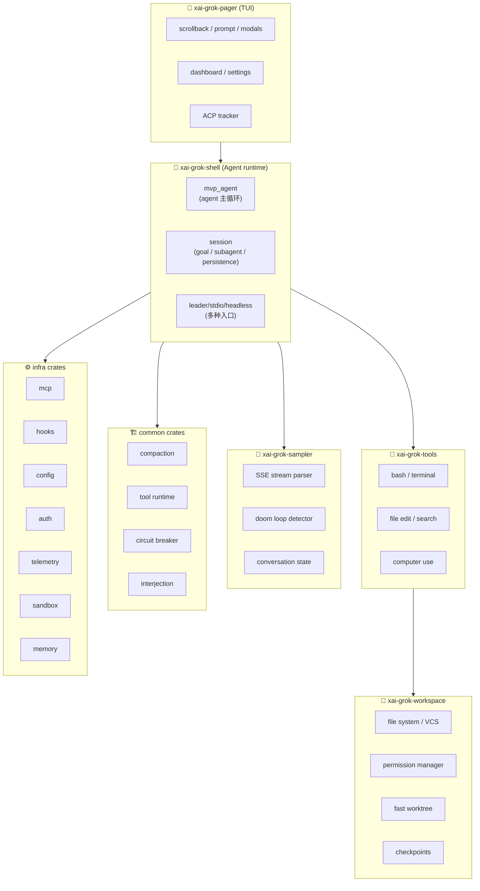

# Grok Build · 架构总览拆解(自我拆解)

> 📁 **源码位置** · `~/grok-build/`(从 SpaceXAI monorepo 同步)
>
> 📄 **核心 crate** · `xai-grok-shell`(agent runtime,338K 行) · `xai-grok-pager`(TUI,~150K 行) · `xai-grok-tools`(工具,113K 行) · `xai-grok-workspace`(fs/vcs/权限,78K 行) · `xai-grok-sampler`(LLM 调用,11K 行)
>
> 🔌 **技术栈** · Rust(workspace 70+ crate) · ratatui(TUI) · tokio(async runtime) · ACP(IDE 协议)
>
> 🔖 **基线** · `SOURCE_REV` 文件记录的 monorepo commit(2026-07)

## 1. 这是什么

**Grok Build**(命令名 `grok`)是 SpaceXAI 的终端 AI coding agent —— 就是**我自己**。你现在正在和我对话的这个工具,源码就在这。

**和 kimi-code 的根本区别**:

| 维度 | kimi-code | grok-build |
|---|---|---|
| **语言** | TypeScript | **Rust** |
| **架构** | DI × Scope(wire/Op/model) | **Crate 分层 + Actor 模式** |
| **UI 框架** | 自研 pi-tui | **ratatui**(社区主流) |
| **持久化** | wire.jsonl(事件溯源) | **SQLite journal + checkpoint** |
| **权限** | 19 policy 责任链 | **compiled policy + shell parser** |
| **goal 验证** | model 自报 | **adversarial skeptic panel**(N 个对抗验证 agent) |
| **LLM 调用** | kosong(5 provider) | **sampler**(xAI + OpenAI compat) |
| **特色** | wire/Op 事件溯源 | **doom loop 检测 + circuit breaker + worktree** |

## 2. 仓库布局(70+ crate)



**分层逻辑**:
- **Pager**(UI):用户看到的一切(150K 行,最大单体 crate)
- **Shell**(agent runtime):agent 主循环、session 管理、goal/subagent(338K 行,**最大的代码集合**)
- **Tools**:具体工具实现(113K 行)
- **Workspace**:fs/vcs/权限/checkpoint(78K 行)
- **Sampler**:LLM 调用 + 流式解析(11K 行,小而精)
- **Common**:跨 crate 共享的叶子 crate
- **Infra**:配置/auth/MCP/hooks/sandbox/memory 等基础设施

## 3. 五个独特设计(和 kimi-code 对比)

### 3.1 Doom Loop 检测(最独特的创新)

kimi-code 没有,只有简单的 `max_steps` 上限。grok-build 有**专门的 doom loop 检测器**:

```rust
// xai-grok-sampler/src/doom_loop.rs
pub struct DoomLoopSignalCollector {
    signals: Vec<DoomLoopSignal>,
    policy: DoomLoopRecoveryPolicy,
    abort_disarmed: bool,
}
```

**什么是 doom loop**:agent 陷入重复行为的死循环(例如反复调用同一个工具、反复说"I'll do X" 但不做)。这是 agent 最常见的失败模式。

**grok-build 的解法**:
- **服务端检测**:xAI 的 API 在 SSE 流里发 `response.doom_loop_check` 事件
- **客户端检测**:`DoomLoopSignalCollector` 分析信号,判定是否 doom loop
- **mid-stream abort**:如果 confidence 高,在流式响应中途就 abort + retry
- **recovery budget**:重试有预算(避免重试本身变成 doom loop)

**比 kimi-code 强的地方**:kimi-code 只能靠 `max_steps`(事后发现),grok-build 能**实时检测 + 中断 + 恢复**。

### 3.2 Adversarial Skeptic Panel(goal 验证)

kimi-code 的 goal 完成:**模型自己说 complete 就 complete**(虽然有 3 轮 blocked 审计)。这是"让学生自己批改作业"。

grok-build 的 goal 完成:**spawn N 个独立的 skeptic subagent 做对抗验证**:

```rust
// xai-grok-shell/src/session/goal_classifier.rs
//! The adversarial skeptic panel is the whole verification: it
//! spawns N independent skeptic subagents in parallel,
//! parses each one's JSON verdict (with terminal-token fallback), and
//! aggregates via majority-refute to drive `update_goal(completed: true)`.
```

**流程**:
1. Agent 声明"goal 完成"
2. **不是直接相信**,而是 spawn 3-10 个独立的 skeptic subagent
3. 每个 skeptic 审查 diff + 验证规则,给出 JSON verdict(pass/fail)
4. **majority-refute**:多数 skeptic 否决 → goal 没完成
5. 只有通过 skeptic panel 的 goal 才真的 complete

**这比 kimi-code 严格得多**。kimi-code 是"信任 LLM",grok-build 是"**不信任 LLM,让另一组 LLM 做对抗审查**"。

### 3.3 Circuit Breaker(熔断器)

kimi-code 没有这个概念。grok-build 有完整的熔断器:

```rust
// xai-circuit-breaker/src/lib.rs
//! Sliding-window-with-min-samples algorithm: the breaker trips when
//! `sample_count >= min_samples AND error_rate >= error_rate_threshold`
```

**这是什么**:HTTP 请求的错误率超阈值时,**熔断**(停止发请求),过一段时间半开试探。

**对 agent 的意义**:如果 xAI API 持续 5xx,与其让 agent 反复重试浪费 token,不如**熔断 + 等 + 试探**。这是来自分布式系统工程的成熟模式,应用到 agent 上。

### 3.4 Permission:Compiled Policy + Shell Parser

kimi-code 的权限是 19 个 policy 的责任链(运行时遍历)。grok-build 用**编译时 policy + shell 解析器**:

```rust
// xai-grok-workspace/src/permission/manager.rs
mod reasons {
    pub const YOLO: &str = "yolo";
    pub const POLICY_ALLOW: &str = "policy_allow";
    pub const AUTO_FAST_PATH: &str = "auto_fast_path";
    pub const AUTO_CLASSIFIER_ALLOW: &str = "auto_classifier_allow";
    pub const SANDBOX_AUTO: &str = "sandbox_auto";
    pub const PERSISTED_GRANT: &str = "persisted_grant";
    // ... 15+ 种 decision reason
}

// 解析 bash 命令,判断是否安全
mod bash_command_splitting {
    pub fn try_parse_shell(cmd: &str) -> ...;
    pub fn is_setup_command(cmd: &str) -> ...;
}
```

**grok-build 真的解析 bash 命令语法**(`try_parse_shell`),不只是匹配字符串。这让权限判断更精确(例如能区分 `rm -rf /tmp/*` 和 `rm -rf /*`)。

### 3.5 Fast Worktree + Sandbox

kimi-code 没有内置 worktree(靠 git 原生命令)。grok-build 有**专用的 fast worktree crate**:

```
crates/codegen/xai-fast-worktree/    — 快速创建 git worktree
crates/codegen/xai-grok-sandbox/      — 沙箱执行环境
```

**Sandbox** 让 agent 在隔离环境里跑命令(限制 fs 访问、网络访问)。kimi-code 没有这个(靠 permission 系统),grok-build **两套都有**(permission + sandbox)。

## 4. Agent 主循环(MvpAgent)

核心在 `xai-grok-shell/src/agent/mvp_agent/mod.rs`。

**"MvpAgent" 这个名字有意思** —— 说明这是"最小可行产品"的 agent,可能还在迭代。

### 4.1 和 kimi-code loop 的对比

| 维度 | kimi-code | grok-build |
|---|---|---|
| **循环单元** | Prompt → Turn → Step | prompt → turn(AcpSession) |
| **LLM 调用** | kosong.generate | sampler.stream |
| **工具执行** | toolExecutor + 权限链 | workspace permission + tool runtime |
| **流式** | 脏标记 + 定时 flush | ratatui 事件驱动 |
| **取消** | AbortController | CancellationToken(tokio) |
| **重试** | StepRetry(指数退避) | circuit breaker + retry policy |

### 4.2 单线程 LocalSet

```rust
// mvp_agent/mod.rs
/// A `'static` reference to a value on a single-threaded `LocalSet`.
pub(crate) struct LocalRef<T> {
    ptr: *const T,
}
```

grok-build 的 agent 跑在 **tokio LocalSet(单线程异步)** 上,不是多线程。这和 kimi-code 的"单 turn 串行"理念一致 —— agent 内部不需要真并发,需要并发时 spawn 子 agent。

**LocalRef 是裸指针** —— 在单线程环境下安全(不需要 Send),比 Arc<Mutex> 轻量。

## 5. Goal 系统(带对抗验证)

### 5.1 和 kimi-code goal 的对比

| 维度 | kimi-code | grok-build |
|---|---|---|
| **状态机** | active/paused/blocked/complete | 类似(有 goal_tracker) |
| **完成判定** | 模型自报 complete | **skeptic panel 对抗验证** |
| **验证强度** | 弱(信任 LLM) | **强(不信任,交叉验证)** |
| **stall 检测** | max_steps + 3 轮 blocked | GOAL_CLASSIFIER_STALL_THRESHOLD |
| **预算** | turn/token/wall-clock | 类似 |

### 5.2 Goal Classifier(skeptic panel)

```rust
// goal_classifier.rs 的核心常量
pub(crate) const GOAL_CLASSIFIER_MAX_RUNS_DEFAULT: u32 = 10;
pub(crate) const GOAL_CLASSIFIER_MAX_RUNS_MIN: u32 = 1;
pub(crate) const GOAL_CLASSIFIER_DIFF_MAX_BYTES: usize = 256 * 1024;
pub(crate) const GOAL_VERIFIER_PANEL_MAX_BYTES: usize = 512 * 1024;
```

**流程**:
1. Agent 声明完成
2. 取当前 diff(最多 256KB)
3. Spawn N 个 skeptic subagent(每个独立看 diff + 规则)
4. 每个 skeptic 返回 JSON verdict
5. **majority-refute**:多数否决 → 不 complete
6. 最多重试 10 次(`GOAL_CLASSIFIER_MAX_RUNS_DEFAULT`)
7. stall 检测:连续 N 次没有新进展 → 提前退出

**这是 grok-build 最强的设计** —— 比 kimi-code 的"3 轮 blocked 审计"严格得多。

## 6. 持久化:SQLite Journal

kimi-code 用 wire.jsonl(事件溯源)。grok-build 用 **SQLite journal**:

```
crates/codegen/xai-sqlite-journal/
crates/codegen/xai-chat-state/src/persistence.rs
```

**对比**:

| 维度 | kimi-code(wire.jsonl) | grok-build(SQLite) |
|---|---|---|
| **格式** | JSON lines 追加日志 | 关系型数据库 |
| **查询** | 只能全量重放 | SQL 查询 |
| **并发** | 单写者 | SQLite WAL 模式 |
| **恢复** | 重放所有 Op | 读 checkpoint + 增量 |
| **检查点** | 无(靠 compaction) | **有(checkpoint)** |

**SQLite 的优势**:
- 可以**按条件查询**(例如"找所有 status=blocked 的 goal")
- **checkpoint 机制**:定期存快照,恢复时不需要从头重放
- **WAL 模式**支持并发读

**wire.jsonl 的优势**:
- 极简(纯文本,可读)
- 可 diff
- 无依赖(不用 SQLite)

## 7. 和 kimi-code 的本质区别

### 7.1 工程哲学

| 维度 | kimi-code | grok-build |
|---|---|---|
| **信任模型** | 相对信任 LLM(goal 自报) | **对抗性不信任**(skeptic panel) |
| **安全层次** | permission(1 层) | permission + sandbox(2 层) |
| **失败恢复** | retry + paused | retry + circuit breaker + doom loop |
| **语言哲学** | TS 的灵活性 | Rust 的**正确性保证**(编译时检查) |
| **架构** | DI(运行时注入) | Crate(编译时依赖) |

### 7.2 Rust vs TypeScript 的深层影响

**Rust 的所有权系统**强制了:
- 没有循环引用(编译器不允许)
- 线程安全(Send/Sync 强制)
- 错误处理(Result<T, E> 强制)
- 零成本抽象(性能更好)

**代价**:
- 编译慢(70+ crate 全量编译很久)
- 开发迭代慢(编译时错误比 TS 多)
- 泛型复杂(trait bound 可以很深)

**TS 的优势**:
- 灵活(可以绕过类型系统)
- 快速迭代
- 生态丰富(npm)

### 7.3 不同的"不信任"策略

| 不信任的方面 | kimi-code 怎么做 | grok-build 怎么做 |
|---|---|---|
| **LLM 说完成了** | 3 轮 blocked 审计 | skeptic panel 对抗验证 |
| **LLM 调危险工具** | 19 policy 权限链 | compiled policy + shell parser + sandbox |
| **LLM 陷入死循环** | max_steps | doom loop 检测器 |
| **provider 持续失败** | retry(5 次) | circuit breaker(熔断) |
| **prompt injection** | AGENTS.md 是"参考数据" | sandbox(物理隔离) |

grok-build 的**不信任更深、更系统化**。

## 8. 边界条件与设计权衡

### 8.1 为什么用 Rust 而不是 TS?

- **性能**:agent 要流式渲染 + 跑 shell + 解析大量代码,Rust 比 TS 快 10-100x
- **正确性**:Rust 的所有权系统在编译时消除大量 bug(空指针、数据竞争)
- **部署**:单个二进制文件,不需要 Node.js runtime
- **安全**:Rust 的类型系统 + 内存安全,适合做权限相关的代码
- **xAI 的工程文化**:SpaceX 用 Rust(星链、航天软件),这是一脉相承的选择

### 8.2 为什么用 SQLite 而不是 wire.jsonl?

- **查询能力**:需要"找所有 blocked 的 goal"、"查历史 session"这种 SQL 查询
- **并发**:WAL 模式支持并发读,不会阻塞 agent
- **checkpoint**:恢复不需要从头重放,性能更好
- **成熟**:SQLite 是世界上最成熟的嵌入式数据库

### 8.3 为什么用 ratatui 而不是自研?

kimi-code 自研 pi-tui(因为性能)。grok-build 用 ratatui(社区主流):
- ratatui 已经足够快(纯 Rust,零分配渲染)
- 社区维护,生态丰富
- 不用自己造轮子

**代价**:没有 pi-tui 那种"完全控制"的灵活性。

## 9. 一句话总结

> Grok Build 是 **Rust 实现的终端 AI agent**,70+ crate 模块化,核心设计理念是**对抗性不信任**:goal 完成要过 skeptic panel(多个独立 agent 交叉验证),命令执行要过 permission + sandbox(双层防护),LLM 调用要过 doom loop 检测 + circuit breaker(实时熔断)。和 kimi-code(TypeScript)相比,grok-build 用 Rust 的类型系统和所有权换取更强的正确性保证,用 SQLite + checkpoint 替代 wire.jsonl 的全量重放,用 ratatui 替代自研 TUI。**最独特的创新是 doom loop 检测和 skeptic panel** —— 这两个都是 kimi-code 没有的。

## 10. 拆解路线图

| # | 模块 | 状态 | 核心问题 |
|---|---|---|---|
| 01 | 架构总览 | ✅ 本篇 | crate 分层 + 和 kimi-code 对比 |
| 02 | Doom Loop 检测 | ⏳ | 服务端信号 + 客户端检测 + mid-stream abort |
| 03 | Skeptic Panel | ⏳ | goal 完成的对抗验证 |
| 04 | Permission + Sandbox | ⏳ | shell parser + 双层防护 |
| 05 | Sampler(LLM 调用) | ⏳ | SSE 解析 + circuit breaker |
| 06 | Agent Loop | ⏳ | MvpAgent + LocalSet + CancellationToken |
| 07 | Persistence(SQLite) | ⏳ | journal + checkpoint + WAL |
| 08 | Worktree + VCS | ⏳ | fast worktree + git 集成 |
| 09 | TUI(ratatui) | ⏳ | scrollback + dashboard + 流式渲染 |
| 10 | Subagent | ⏳ | coordinator + spawn + isolation |

## 11. 本篇用到的核心源码索引

| 概念 | crate | 关键文件 |
|---|---|---|
| Agent 主循环 | xai-grok-shell | `src/agent/mvp_agent/mod.rs` |
| Agent 配置 | xai-grok-shell | `src/agent/config.rs`(11283 行!) |
| Goal tracker | xai-grok-shell | `src/session/goal_tracker.rs` |
| Goal classifier(skeptic) | xai-grok-shell | `src/session/goal_classifier.rs`(6586 行) |
| Goal orchestrator | xai-grok-shell | `src/session/goal_orchestrator.rs` |
| Subagent coordinator | xai-grok-shell | `src/agent/mvp_agent/subagent_coordinator.rs` |
| Permission manager | xai-grok-workspace | `src/permission/manager.rs`(6069 行) |
| Permission policy | xai-grok-workspace | `src/permission/policy.rs`(CompiledPolicy) |
| Shell parser | xai-grok-workspace | `src/permission/bash_command_splitting.rs` |
| Sandbox | xai-grok-sandbox | `src/` |
| Sampler | xai-grok-sampler | `src/doom_loop.rs` / `src/stream/` |
| Doom loop | xai-grok-sampler | `src/doom_loop.rs` |
| Circuit breaker | xai-circuit-breaker | `src/` |
| Compaction | xai-grok-compaction | `src/code_compaction/` |
| Chat state | xai-chat-state | `src/`(persistence + compaction) |
| SQLite journal | xai-sqlite-journal | `src/` |
| Worktree | xai-fast-worktree | `src/` |
| MCP | xai-grok-mcp | `src/servers.rs`(7538 行) |
| Hooks | xai-grok-hooks | `src/` |
| Config | xai-grok-config | `src/` |
| Memory | xai-grok-memory | `src/` |
| TUI | xai-grok-pager | `src/`(~150K 行) |
| Tools | xai-grok-tools | `src/`(~113K 行) |

## 参考资料

- 官方文档:https://docs.x.ai/build/overview
- kimi-code 拆解(对比参考):[../kimi-code/](../kimi-code/)
- [insights/03-agent-essence.md](../../insights/03-agent-essence.md) —— agent 本质(五大特征)
