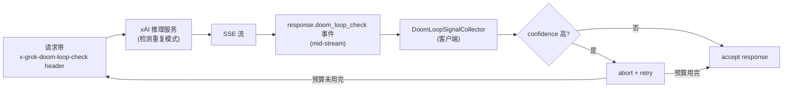
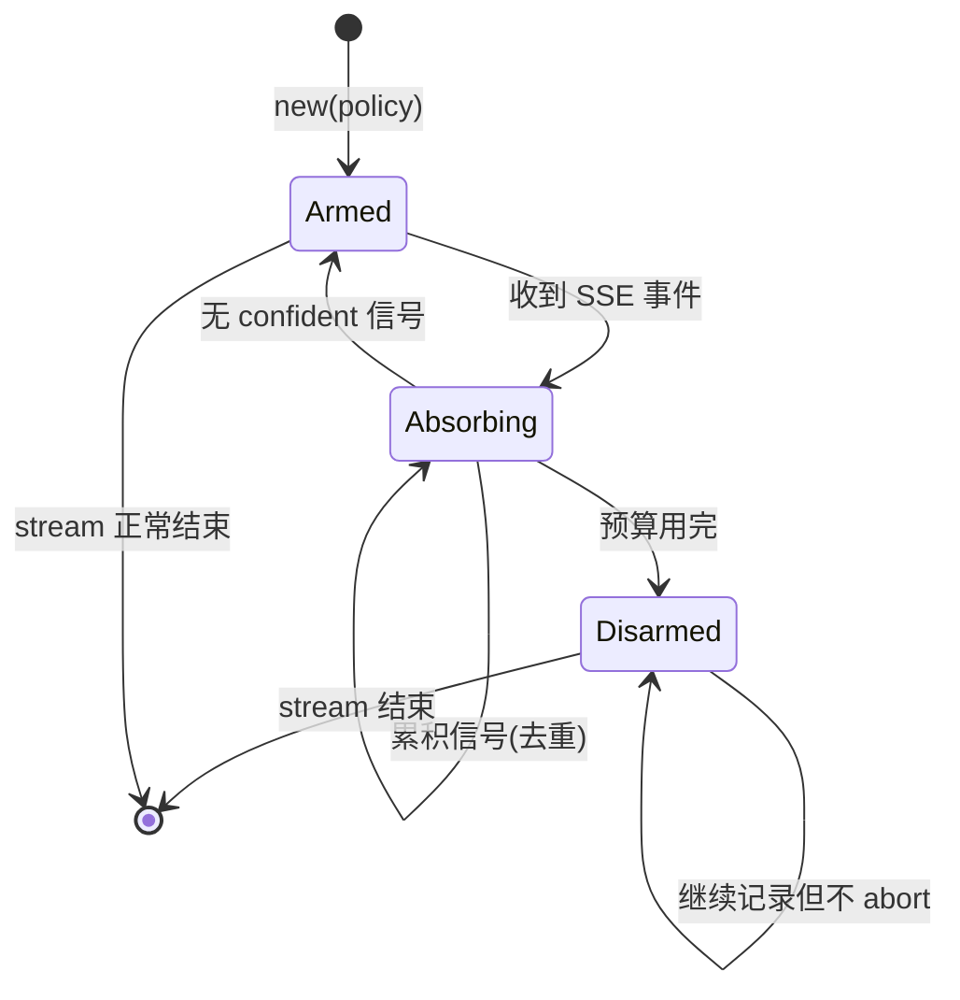
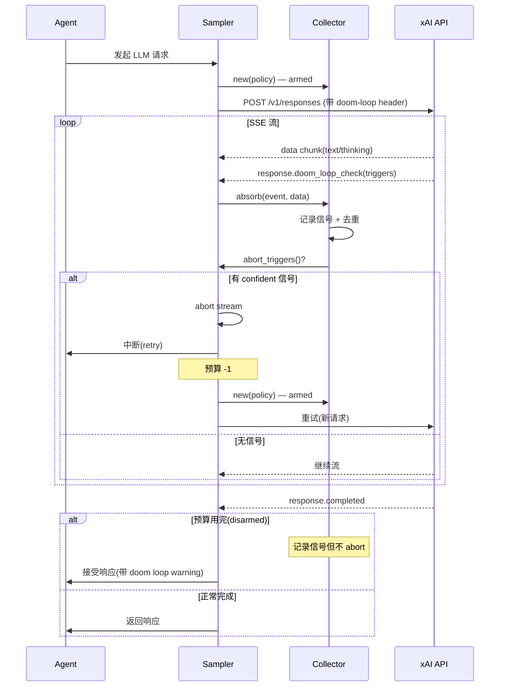

# Grok Build · Doom Loop 检测拆解

> 📁 **源码位置** · `crates/codegen/xai-grok-sampling-types/src/doom_loop.rs`(wire contract) + `crates/codegen/xai-grok-sampler/src/doom_loop.rs`(transport)
>
> 📄 **核心文件** · `doom_loop.rs`(types,~300 行) + `sampler/src/doom_loop.rs`(collector,~150 行) + `tests/test_doom_loop_recovery.rs` + `tests/test_doomloop_capture.rs`

## 1. 什么是 Doom Loop

Agent 陷入**重复行为的死循环**,常见模式:
- 反复调用同一个工具(例如 Read → Read → Read 同一个文件)
- 反复说"I'll fix this" 但不动手
- thinking 里绕圈子(同一个推理路径重复 N 遍)

这是 LLM agent **最常见的失败模式**,用户极其反感。

**kimi-code 的解法**:只有 `max_steps`(事后发现,粗暴截断)。
**grok-build 的解法**:**服务端实时检测 + 客户端 mid-stream abort + 预算化恢复**。

## 2. 检测机制:服务端 + 客户端协作



### 2.1 Opt-in 机制

客户端通过请求头启用:

```rust
pub const DOOM_LOOP_CHECK_HEADER: &str = "x-grok-doom-loop-check";
```

**默认不开**(需要 `DoomLoopRecoveryPolicy` 存在于 `SamplerConfig` 才开)。`None` = 关闭。

### 2.2 两种触发信号

服务端报告的 trigger 是**不透明 label**,有固定语法:

```
tail_repetition:{threshold}@{channel}
low_logprob@{channel}
```

| 信号 | 含义 | 例子 |
|---|---|---|
| `tail_repetition:4@thinking` | thinking 流的尾部重复了 4 次 | "Let me check. Let me check. Let me check." |
| `tail_repetition:2@response` | 可见输出尾部重复了 2 次 | "Done. Done. Done." |
| `low_logprob@thinking` | thinking 里低概率 token(熵太低,退化) | 重复用同一个词 |

**threshold 越低越严重**(2 比 8 更紧张,因为更少的重复就触发了检测)。

### 2.3 只对 thinking channel 做 confident 判定

```rust
pub fn is_confident(&self, signal: &DoomLoopSignal) -> bool {
    signal.channel == THINKING_CHANNEL                         // ① 只管 thinking
        && matches!(signal.kind, DoomLoopSignalKind::TailRepetition(t) if t <= self.max_threshold)  // ② 阈值内
}
```

**为什么只管 thinking**:可见输出的重复是**用户自己能看到的**,用户可以自己判断是否要中断。但 thinking 里的循环用户看不到,需要系统自动处理。

## 3. DoomLoopRecoveryPolicy:恢复策略

```rust
pub struct DoomLoopRecoveryPolicy {
    pub max_threshold: u32,      // 只对 ≤ 这个阈值的 tail_repetition 响应
    pub max_retries: u32,        // 每个 turn 最多重试次数
}

impl DoomLoopRecoveryPolicy {
    pub const MAX_THRESHOLD_RANGE: RangeInclusive<u32> = 2..=64;
    pub const MAX_RETRIES_RANGE: RangeInclusive<u32> = 0..=5;
    pub const DEFAULT_MAX_THRESHOLD: u32 = 8;
    pub const DEFAULT_MAX_RETRIES: u32 = 2;
}
```

**配置优先级**:env > config.toml > remote settings > default。

**默认值**:
- `max_threshold = 8`:只对 thinking 里重复 ≤ 8 次的循环响应(这是 backtest corpus 确认的最低通用阈值)
- `max_retries = 2`:每个 turn 最多 abort + retry 2 次

## 4. DoomLoopSignalCollector:per-attempt 状态机

```rust
pub struct DoomLoopSignalCollector {
    inner: Arc<Mutex<CollectorState>>,
}

struct CollectorState {
    signals: Vec<DoomLoopSignal>,           // 累积的信号(去重)
    malformed_logged: bool,                  // 只 log 一次 malformed payload
    policy: DoomLoopRecoveryPolicy,
    abort_disarmed: bool,                    // 用完预算后 disarm
}
```

**关键设计**:collector **per-attempt 创建**(每次 retry 新建一个),防止失败 attempt 的信号泄漏到下一次。

### 4.1 三阶段生命周期



**三个状态**:
1. **Armed**:可以 abort(预算未用完)
2. **Absorbing**:正在收集信号
3. **Disarmed**:预算用完,不再 abort(但继续记录信号用于诊断)

### 4.2 abort_triggers:决策函数

```rust
pub(crate) fn abort_triggers(&self) -> Option<Vec<String>> {
    let state = self.inner.lock().ok()?;
    if state.abort_disarmed {
        return None;                          // ① 预算用完,不 abort
    }
    let confident = state.policy.confident_triggers(&state.signals);
    (!confident.is_empty()).then_some(confident)  // ② 有 confident 信号才 abort
}
```

### 4.3 absorb:拦截 SSE 事件

```rust
pub(crate) fn absorb(&self, event_name: &str, data: &str) -> bool {
    let named = event_name == DOOM_LOOP_CHECK_EVENT_TYPE;
    let (signals, swallow) = match peek_doom_loop(data) {
        DoomLoopPeek::CheckEvent(signals) => (signals, true),    // ① 吞掉非标准事件
        DoomLoopPeek::ResponseField(signals) => (signals, false), // ② 终端响应字段
        DoomLoopPeek::None => { ... }                              // ③ 无法解析
    };
    // 记录信号(去重)
    // 返回 true = "这个事件被吞了,不要传给 typed deserializer"
}
```

**为什么要"吞掉"**:`response.doom_loop_check` 是非标准 SSE 事件类型,async-openai 的 typed deserializer 不认识,如果不拦截会报错。

## 5. 完整的检测 + 恢复流程



## 6. 容错设计

整个 doom loop 系统是**best-effort**的:

> Everything here is best-effort by design — malformed payloads yield `Unknown` kinds or empty trigger sets, never an error, so the feature can never fail a stream.

| 故障 | 行为 |
|---|---|
| 服务端不发信号 | 不检测,正常流 |
| 信号格式 malformed | 记录 Unknown,log 一次,不报错 |
| `response.doom_loop_check` 事件 payload 无法解析 | `DoomLoopPeek::None`,不吞事件 |
| collector lock 失败 | 返回 None(不 abort) |
| 预算用完 | disarm,接受响应 + warning |

**核心原则**:**doom loop 检测永远不能让流失败**。它是可选优化,不是关键路径。

## 7. 和 kimi-code 的对比

| 维度 | kimi-code | grok-build |
|---|---|---|
| **检测位置** | 客户端(max_steps) | 服务端(API 检测)+ 客户端(collector) |
| **检测时机** | 事后(step 完成后) | 实时(SSE mid-stream) |
| **响应方式** | 截断 turn | abort + retry(预算化) |
| **精度** | 低(只看 step 数) | 高(分析重复模式 + threshold) |
| **可配置** | max_steps(硬编码 1000) | max_threshold + max_retries(可配) |
| **影响** | 暴力截断(可能丢失进度) | 精准(只 abort 流,保留之前 step) |

## 8. 一句话总结

> Doom Loop 检测是 grok-build 独有的创新:**服务端**在 SSE 流里实时分析 LLM 输出的重复模式,通过 `response.doom_loop_check` 事件报告触发信号;**客户端**的 `DoomLoopSignalCollector` 按 `DoomLoopRecoveryPolicy`(threshold=8, retries=2)判定是否 confident,如果 confident 就 **mid-stream abort + retry**。每个 attempt 独立 collector(防止信号泄漏),预算用完就 disarm(接受响应 + warning)。整个系统是 **best-effort** 的 —— 永远不会因为检测失败而让流失败。

## 9. 源码索引

| 概念 | 文件 |
|---|---|
| Wire contract(types) | `crates/codegen/xai-grok-sampling-types/src/doom_loop.rs` |
| `DoomLoopRecoveryPolicy` | 同上 |
| `DoomLoopSignal` / `DoomLoopSignalKind` | 同上 |
| `peek_doom_loop` parser | 同上 |
| Transport(collector) | `crates/codegen/xai-grok-sampler/src/doom_loop.rs` |
| `DoomLoopSignalCollector` | 同上 |
| 集成测试 | `crates/codegen/xai-grok-shell/tests/test_doom_loop_recovery.rs` |
| 捕获测试 | `crates/codegen/xai-grok-shell/tests/test_doomloop_capture.rs` |
