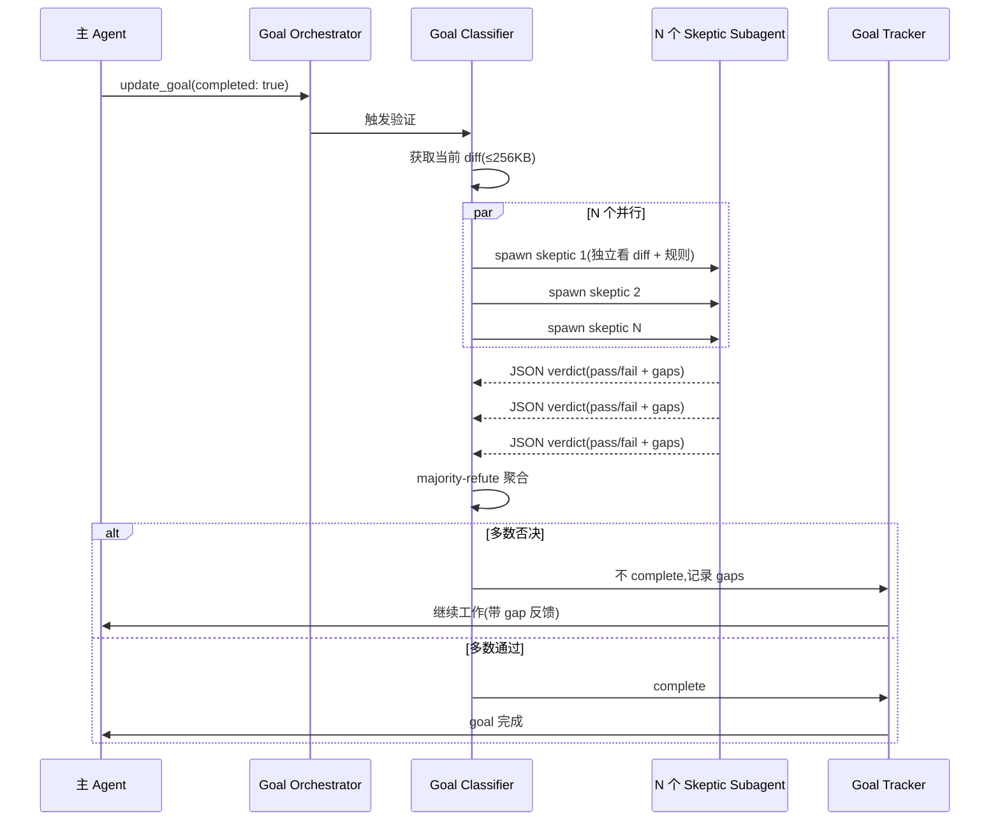
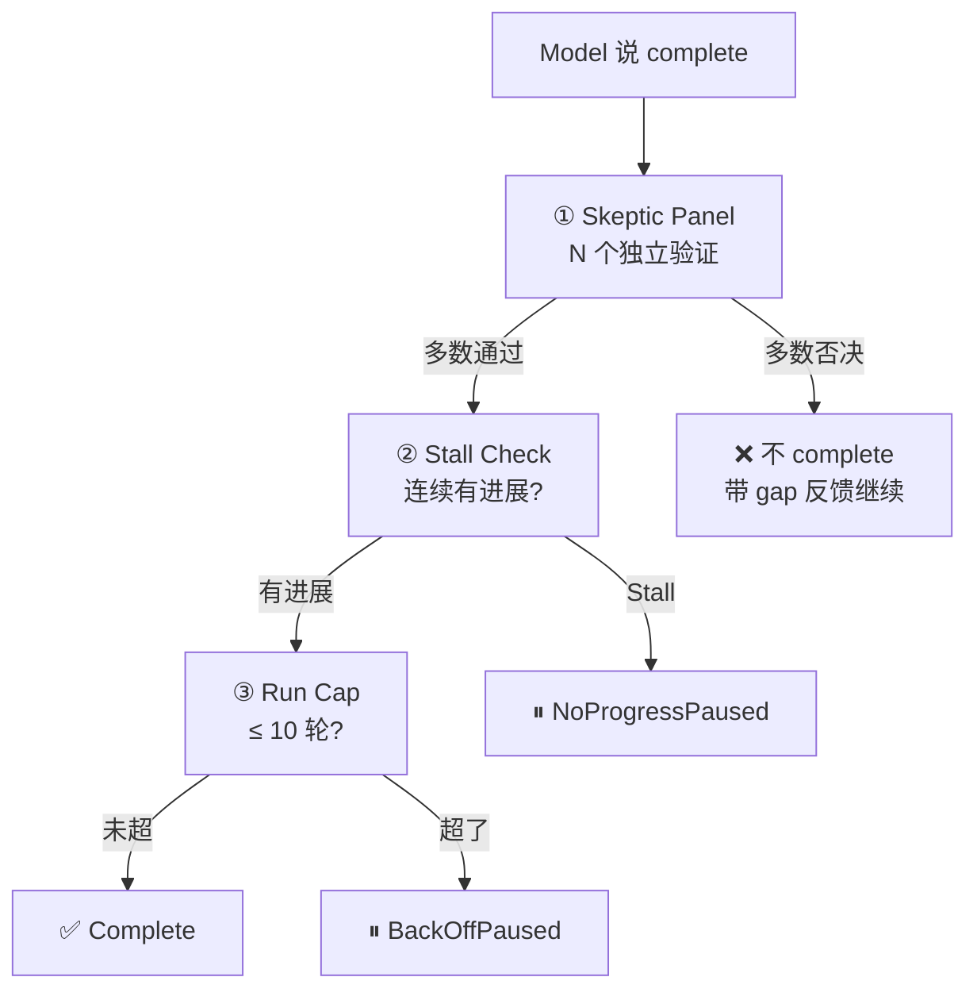

# Grok Build · Skeptic Panel(Goal 对抗验证)拆解

> 📁 **源码位置** · `crates/codegen/xai-grok-shell/src/session/goal_classifier.rs`(6586 行) + `goal_tracker.rs`(状态机) + `goal_orchestrator.rs`(通知) + `goal_planner.rs`(规划) + `goal_role_tools.rs`(角色工具)
>
> 📄 **核心概念** · **adversarial skeptic panel**(对抗性怀疑者小组)— 多个独立 subagent 交叉验证 goal 是否真的完成

## 1. 核心问题

**kimi-code 的 goal 完成判定**:模型自己调 `UpdateGoal(complete: true)`,最多有"连续 3 轮 blocked 审计"防止过早放弃。但这是**让学生自己批改作业** —— 如果模型谎报"我做完了",系统就信了。

**grok-build 的解法**:**模型说完成了不算数**,必须 spawn N 个独立的 skeptic subagent 做对抗审查,每个 skeptic 独立判定 pass/fail,**多数否决 → 不 complete**。

## 2. Goal 状态机(比 kimi-code 更细)

```rust
pub enum GoalStatus {
    Active,
    UserPaused,           // 用户主动 pause(Ctrl+C / /goal pause)
    BackOffPaused,        // classifier run cap 到了
    NoProgressPaused,     // 连续 N 次验证没进展(stall)
    InfraPaused,          // 基础设施错误
    Blocked,              // 模型判断不可达
    Complete,             // 通过 skeptic panel 验证
}
```

**kimi-code 只有 4 个状态**(active/paused/blocked/complete)。grok-build 有 **7 个**,区分了不同的 pause 原因。

### 关键常量

```rust
pub(crate) const GOAL_CLASSIFIER_STALL_THRESHOLD: u32 = 2;      // 连续 2 次相同 → stall
pub(crate) const GOAL_CLASSIFIER_MAX_RUNS_DEFAULT: u32 = 10;    // 最多 10 轮验证
pub(crate) const GOAL_CLASSIFIER_DIFF_MAX_BYTES: usize = 256 * 1024;  // diff 最多 256KB
pub(crate) const GOAL_STRATEGIST_CAP_BONUS: u32 = 3;            // 策略家额外轮次
```

## 3. Skeptic Panel 工作流程



### 3.1 Skeptic 的输入

每个 skeptic subagent 收到:
1. **当前 diff**(最多 256KB,超出截断)
2. **验证规则**(要求检查的规则集)
3. **原始 goal 描述**

### 3.2 Skeptic 的输出

```json
{
  "verdict": "pass" | "fail",
  "gaps": ["规则1 不满足:...", "规则3 不满足:..."],
  "summary": "整体评估"
}
```

### 3.3 聚合策略:Majority-Refute

**不是 majority-approve**(多数通过),是 **majority-refute**(多数否决):
- 只要有**多数 skeptic 说 fail**,goal 就不 complete
- 这比 majority-approve **更保守**(倾向于不放行)

**为什么保守**:误判"完成"的代价(用户以为做完了但其实没)比误判"没完成"的代价(多跑几轮)大得多。

## 4. 三种 Goal 角色(Role)

grok-build 的 goal 系统有**三种独立角色**,每个都是独立的 subagent:

| 角色 | 职责 | 触发时机 |
|---|---|---|
| **Planner** | 制定执行计划 | goal 启动时 |
| **Strategist** | 遇到 stall 时重组策略 | 连续失败后 |
| **Skeptic** | 验证是否完成 | 模型声明 complete 时 |

### 4.1 Planner(规划者)

```rust
// goal_planner.rs
//! Goal planner subagent runner. Mirrors goal_classifier but is FAIL-CLOSED:
//! any failure pauses the goal.
```

**Fail-CLOSED**:planner 失败 → goal paused(安全失败)。和 classifier 不同(classifier 是 fail-open —— 失败时放行)。

**为什么 planner fail-closed 而 classifier fail-open**?
- planner 失败 = 没有计划 = 不应该继续跑
- classifier 失败 = 验证系统挂了 = **不应该阻止 model 声明的完成**(避免验证系统成为单点故障)

### 4.2 Strategist(策略家)

```rust
pub(crate) const GOAL_STRATEGIST_CAP_BONUS: u32 = 3;
pub(crate) const GOAL_STRATEGIST_STALL_THRESHOLD: u32 =
    GOAL_CLASSIFIER_STALL_THRESHOLD + GOAL_STRATEGIST_CAP_BONUS;  // 2 + 3 = 5
```

当连续 stall 时,strategist 被触发:
- 额外给 3 轮 classifier 预算(cap bonus)
- 放宽 stall 阈值(从 2 放到 5)
- 重组策略后让 model 再试

### 4.3 所有角色都是 general-purpose subagent

```rust
pub(crate) const GOAL_ROLE_SUBAGENT_TYPE: &str = "general-purpose";
```

**所有角色都用 `general-purpose` subagent type**,但通过 `harness_agent_type` 选择不同的 system prompt + toolset。这让每个角色都有完整的工具能力,但行为受 prompt 引导。

## 5. Stall 检测(连续无进展)

```rust
pub(crate) const GOAL_CLASSIFIER_STALL_THRESHOLD: u32 = 2;
```

**Stall 判定**:连续 2 次 classifier 运行,如果 gap fingerprints 完全相同(没有新进展),自动 pause。

这防止了"模型反复尝试同一个修不好的问题,无限消耗 token"。

**指纹对比**:不是比较整个 diff(太大),是比较**"哪些规则不满足"的指纹**(gap fingerprint)。只有 gap 变了才算有进展。

## 6. Goal 完成的三层验证



**三层验证**:
1. **Skeptic panel**(对抗验证)—— N 个独立 agent 判定
2. **Stall check**(进展检查)—— 连续 2 次相同指纹 → stall
3. **Run cap**(预算控制)—— 最多 10 轮

## 7. 和 kimi-code 的深度对比

| 维度 | kimi-code | grok-build |
|---|---|---|
| **完成判定** | 模型自报 complete | skeptic panel 多数通过 |
| **验证强度** | 弱(信任 LLM) | 强(独立对抗验证) |
| **fail 模式** | fail-open(验证失败也放行) | classifier fail-open + planner fail-closed |
| **stall 检测** | 3 轮 blocked 审计 | 2 次指纹相同(stall) |
| **策略调整** | 无 | strategist 重组策略 |
| **状态数** | 4 | 7(区分不同 pause 原因) |
| **角色** | 无 | 3 种(planner/strategist/skeptic) |

## 8. 一句话总结

> Grok-build 的 goal 验证是**对抗性的**:模型说"完成了"不算数,必须 spawn N 个独立的 skeptic subagent,每个独立看 diff + 验证规则,给 JSON verdict。**majority-refute** 聚合(多数否决 → 不完成),保守倾向。三种角色(planner fail-closed / strategist 重组策略 / skeptic 验证),stall 检测(2 次指纹相同 → pause),run cap(最多 10 轮)。比 kimi-code 的"信任 LLM 自报"严格得多 —— 这是 grok-build **对抗性不信任**哲学的核心体现。

## 9. 源码索引

| 概念 | 文件 |
|---|---|
| Skeptic panel(对抗验证) | `session/goal_classifier.rs`(6586 行) |
| 状态机 | `session/goal_tracker.rs` |
| 通知 + 编排 | `session/goal_orchestrator.rs` |
| 规划者(fail-closed) | `session/goal_planner.rs` |
| 角色工具 | `session/goal_role_tools.rs` |
| ACP 支持 | `session/acp_session_impl/goal.rs` / `goal_support.rs` |
| Evidence 模块 | `session/goal_classifier/evidence.rs` |
| 规划 prompt 模板 | `session/templates/goal_planner_prompt.md` |
