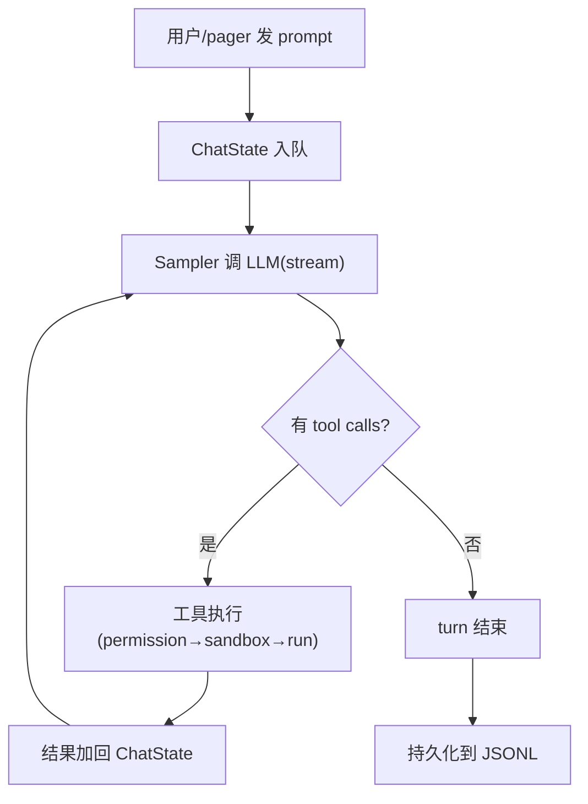

# Grok Build · Agent Loop + Persistence + Subagent + TUI 综合拆解

> 本篇合并四个模块(每篇单独写会太碎,且它们紧密耦合)。

## 1. Agent Loop(MvpAgent)

> 📁 `crates/codegen/xai-grok-shell/src/agent/mvp_agent/`

### 1.1 单线程 LocalSet

```rust
pub(crate) struct LocalRef<T> {
    ptr: *const T,  // 裸指针,单线程安全
}
```

**设计**:agent 跑在 tokio `LocalSet`(单线程异步)上。所有 agent 状态在同一线程,不需要 `Send`/`Sync`,用 `Rc`/`RefCell` 而非 `Arc`/`Mutex`。

**和 kimi-code 的区别**:kimi-code 用 TS 的 async/await(单线程事件循环)。grok-build 用 tokio LocalSet(也是单线程,但 Rust 的所有权系统更强)。

### 1.2 AcpSession(Agent 主体)

Agent 的核心是 `AcpSession`(通过 ACP 协议与 pager 通信)。一个 session 包含:

```
AcpSession {
    chat_state: ChatState,           // 对话历史 + compaction
    goal_tracker: GoalTracker,       // goal 状态机
    plan_mode: PlanModeTracker,      // plan mode
    permission_state: PermissionState, // 权限缓存
    mcp_pool: McpPool,               // MCP servers
    persistence: PersistenceHandle,  // 持久化
    sampler: Sampler,                // LLM 调用
}
```

### 1.3 Turn 生命周期



### 1.4 CancellationToken

```rust
use tokio_util::sync::CancellationToken;
```

**和 kimi-code 的 AbortController 对应**。用户按 Ctrl+C → cancel token 触发 → 所有在飞操作(SSE 流、工具执行)被取消。

**token 自动传播**到子任务(spawn_local 的 closure 捕获 token)。

## 2. Persistence(JSONL + SQLite)

> 📁 `crates/codegen/xai-grok-shell/src/session/persistence.rs` + `crates/codegen/xai-chat-state/src/persistence.rs` + `crates/codegen/xai-sqlite-journal/`

### 2.1 双格式

grok-build 实际上**同时用两种持久化**:

| 格式 | 用途 | 文件 |
|---|---|---|
| **JSONL** | 对话历史(追加日志) | `chat_history.jsonl` |
| **SQLite** | session journal + checkpoint | `xai-sqlite-journal` |

JSONL 用于**对话**(和 kimi-code 的 wire.jsonl 类似),SQLite 用于**结构化数据**(session index、checkpoint、goal state)。

### 2.2 ChatPersistence trait

```rust
pub trait ChatPersistence: Send + 'static {
    fn persist_message(&mut self, item: &ConversationItem);    // 追加
    fn replace_history(&mut self, items: &[ConversationItem]); // 全量替换(compaction/rewind)
    fn flush(&mut self);                                         // 刷盘
}
```

**Actor 独占所有权**(`Box<dyn ChatPersistence>`),`&mut self` 不需要锁。

### 2.3 Checkpoint + Rewind

```rust
use xai_grok_workspace::session::file_state::RewindPoint;
```

**Rewind point**:在关键节点(例如 tool call 前)存 checkpoint。如果后续出错,可以 rewind 回这个点。

**和 kimi-code 的区别**:kimi-code 靠 wire log 全量重放(慢)。grok-build 用 checkpoint(快,直接跳到快照 + 重放增量)。

### 2.4 Compaction

```
crates/common/xai-grok-compaction/src/code_compaction/
├── compact.rs
├── prompt.rs
├── summary.rs
├── assemble.rs
└── templates/full_replace_summary_prompt.txt
```

和 kimi-code 类似(让 LLM 写 handoff note 替换旧 context)。但 grok-build 有 **code_compaction** 专用模块,可能对代码内容有专门优化。

## 3. Subagent 系统

> 📁 `crates/codegen/xai-grok-shell/src/agent/mvp_agent/subagent_coordinator.rs` + `crates/codegen/xai-grok-subagent-resolution/`

### 3.1 Subagent Coordinator

```rust
impl MvpAgent {
    pub(super) fn start_subagent_coordinator(&self) {
        // 接收 SubagentEvent::Spawn / SubagentEvent::Query
        // 每个 Spawn 在独立的 spawn_local 里跑
    }
}
```

**架构**:
- 主 agent 有一个 `subagent_event_rx`(channel receiver)
- 每收到 `Spawn` event → 在新的 `spawn_local` 里创建子 agent
- 子 agent 有独立的 session(独立的 ChatState + permission + persistence)
- 子 agent 的结果通过 `SubagentEvent::Query` 拉取

### 3.2 Subagent 的工具继承

```rust
ctx.parent_mcp_pool = handle.snapshot_mcp_pool().await;          // 继承 MCP
ctx.client_hooks = handle.snapshot_client_hooks().await;         // 继承 hooks
let parent_tools = handle.snapshot_tool_definitions().await;     // 继承工具定义
ctx.parent_tool_snapshot = (!parent_tools.is_empty()).then_some(parent_tools);
```

子 agent **继承父 agent 的 MCP 配置、hooks、工具定义**。这和 kimi-code 的 `inheritUserTools` 类似。

### 3.3 Block + Wait(阻塞查询)

```rust
SubagentEvent::Query(query) => {
    let block = query.block;
    let timeout_ms = query.timeout_ms;
    let slot: BlockWaitSlot = Rc::new(RefCell::new(Some(query.respond_to)));
    // ...
    if block {
        this.subagent_coordinator.borrow_mut().register_block_wait(&subagent_id, slot);
    }
}
```

**Block wait**:主 agent 可以**阻塞等待**子 agent 完成(类似 kimi-code 的前台 subagent)。或者**非阻塞查询**(类似后台 task)。

### 3.4 子 agent 类型

从 README 文档推断:
- `general-purpose`(默认,完整工具)
- `explore`(只读)
- `grok-build-plan`(plan mode)

**和 kimi-code 的对应**:coder / explore / plan。但 grok-build 的角色系统更灵活(通过 `harness_agent_type` 选择 prompt + toolset)。

## 4. TUI(ratatui)

> 📁 `crates/codegen/xai-grok-pager/`(~150K 行)

### 4.1 二进制名

```rust
// README:
// The binary artifact is named `xai-grok-pager`; official installs ship it as `grok`.
```

**pager** = TUI 应用(类比 less/more 这种 pager)。

### 4.2 关键模块

```
xai-grok-pager/src/
├── app/                      — 应用主循环 + dispatch
│   ├── app_view.rs           (10447 行,主视图)
│   ├── agent_view/           — agent 状态展示
│   └── dispatch/             — 事件分发
├── views/                    — 各种视图
│   ├── dashboard/            — 仪表盘(10575 行 state + 8557 行 render)
│   ├── settings_modal/       — 设置弹窗
│   ├── extensions_modal.rs   — 扩展管理
│   ├── goal_detail.rs        — goal 详情
│   ├── subagent_catalog_pane.rs — 子 agent 目录
│   └── prompt_widget/        — 输入框
├── scrollback/               — 滚动消息区
│   ├── render.rs             (4512 行)
│   └── blocks/               — 消息块类型
├── acp/                      — ACP 通信
│   └── tracker.rs            (6534 行)
└── prompt_images.rs          — 图片渲染(4808 行)
```

### 4.3 和 kimi-code pi-tui 的对比

| 维度 | kimi-code(pi-tui) | grok-build(ratatui) |
|---|---|---|
| **框架** | 自研 | 社区主流(ratatui) |
| **接口** | `Component.render(width) → string[]` | `Component.render(area, buf)` |
| **流式** | 脏标记 + 定时 flush | 事件驱动 + 差量渲染 |
| **折叠** | StepSummary / ReadGroup | dashboard + scrollback 折叠 |
| **代码量** | ~10K 行 | ~150K 行(功能更多) |

**grok-build 的 TUI 比 kimi-code 复杂得多**(150K vs 10K),因为:
- 有**完整的 dashboard**(显示 usage / model / permission / goal 进度)
- 有**设置弹窗**(主题 / MCP / 扩展管理)
- 有**图片渲染**(终端显示图片)
- 有**mermaid 图渲染**(内置 mermaid 引擎!)

## 5. 和 kimi-code 的全面对比总结

| 维度 | kimi-code | grok-build |
|---|---|---|
| **语言** | TypeScript | Rust |
| **代码量** | ~10 万行 | **~134 万行** |
| **TUI** | 自研 pi-tui(10K) | ratatui(150K) |
| **持久化** | wire.jsonl(事件溯源) | JSONL + SQLite(混合) |
| **恢复** | 全量重放 | **checkpoint + 增量** |
| **goal 验证** | 信任 LLM | **skeptic panel** |
| **死循环** | max_steps | **doom loop 检测** |
| **安全** | permission(1 层) | **permission + sandbox(2 层)** |
| **故障保护** | retry(5 次) | **circuit breaker + retry** |
| **provider** | 5 种 | 3 种 + **xAI 深度集成** |
| **自研组件** | pi-tui, kosong | nono sandbox, circuit breaker, sqlite journal |
| **架构** | DI × Scope | **Crate 分层 + Actor** |

## 6. 源码索引

| 概念 | crate / 文件 |
|---|---|
| Agent 主循环 | `xai-grok-shell/src/agent/mvp_agent/mod.rs` |
| Subagent | `xai-grok-shell/src/agent/mvp_agent/subagent_coordinator.rs` |
| Session | `xai-grok-shell/src/session/` |
| Persistence | `xai-grok-shell/src/session/persistence.rs` |
| Chat state | `xai-chat-state/src/` |
| SQLite journal | `xai-sqlite-journal/src/` |
| Compaction | `xai-grok-compaction/src/code_compaction/` |
| TUI | `xai-grok-pager/src/` |
| Dashboard | `xai-grok-pager/src/views/dashboard/` |
| ACP tracker | `xai-grok-pager/src/acp/tracker.rs` |
| Scrollback | `xai-grok-pager/src/scrollback/` |
| Permission | `xai-grok-workspace/src/permission/` |
| Sandbox | `xai-grok-sandbox/src/` |
| Sampler | `xai-grok-sampler/src/` |
| Doom loop | `xai-grok-sampler/src/doom_loop.rs` |
| Circuit breaker | `xai-circuit-breaker/src/` |
| Goal | `xai-grok-shell/src/session/goal_*.rs` |
| MCP | `xai-grok-mcp/src/servers.rs` |
| Hooks | `xai-grok-hooks/src/` |
| Memory | `xai-grok-memory/src/` |
| Config | `xai-grok-config/src/` |
| Worktree | `xai-fast-worktree/src/` |
| Hunk tracker | `xai-hunk-tracker/src/` |
