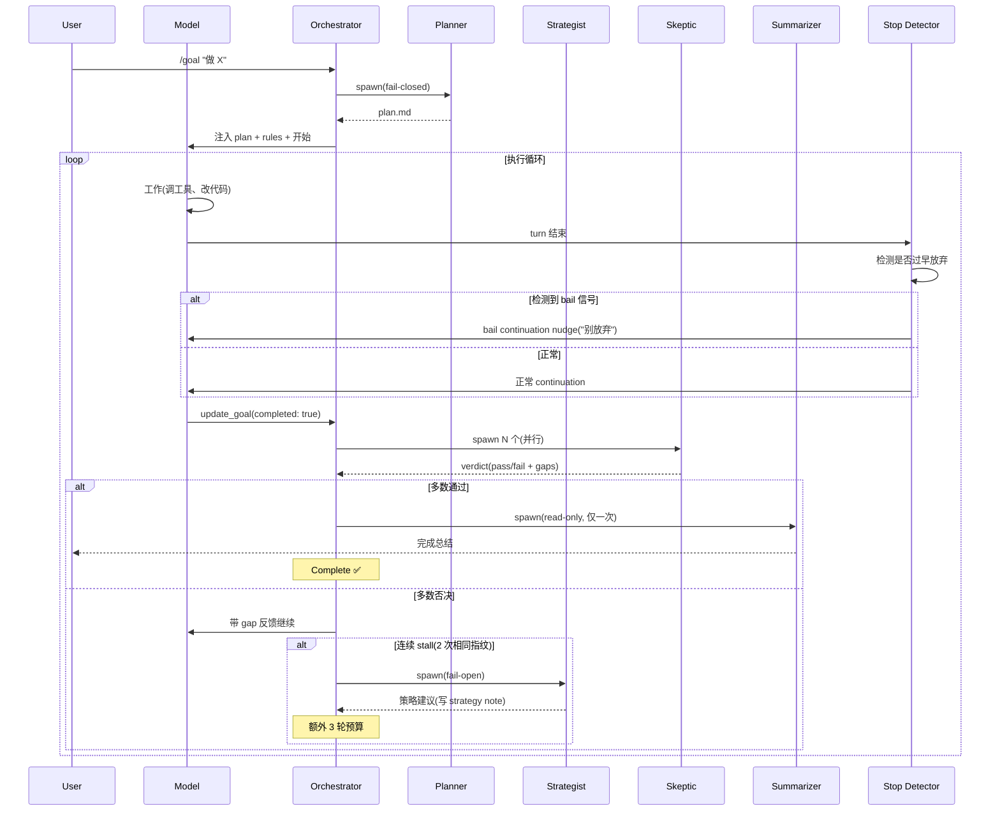

# Grok Build · Goal 完整系统拆解(6 子系统 + 7 模板)

> 📁 **源码位置** · `crates/codegen/xai-grok-shell/src/session/goal_*.rs`(8 个文件 + 子目录)+ `templates/goal_*.md`(7 个 prompt 模板)
>
> 📄 **核心文件** · `goal_tracker.rs`(3703 行,状态机) · `goal_classifier.rs`(6586 行,skeptic panel) · `goal_planner.rs` · `goal_strategist.rs` · `goal_stop_detector.rs` · `goal_summarizer.rs` · `goal_next_step.rs`

## 1. 之前拆少了 —— 实际有 6 个子系统

上一篇(03-skeptic-panel.md)只提了 3 种角色(planner/strategist/skeptic)。实际有 **6 个**:

| # | 子系统 | 文件 | 何时触发 | Fail 模式 |
|---|---|---|---|---|
| ① | **Planner** | `goal_planner.rs` | goal 启动时 | **fail-CLOSED**(失败 → pause) |
| ② | **Strategist** | `goal_strategist.rs` | 连续 stall 时 | **fail-OPEN**(失败 → 继续) |
| ③ | **Skeptic/Classifier** | `goal_classifier.rs` | 模型声明 complete 时 | fail-OPEN |
| ④ | **Stop Detector** | `goal_stop_detector.rs` | 每次 turn 结束 | 纯 heuristic |
| ⑤ | **Summarizer** | `goal_summarizer.rs` | goal verified-ACHIEVED 后(仅一次) | fail-OPEN |
| ⑥ | **Next Step** | `goal_next_step.rs` | continuation 时 | fail-OPEN(失败 → fallback) |

**为什么 fail 模式不同**:
- **Planner fail-closed**:没计划就不应该跑(安全)
- **其他 fail-open**:已经在跑了,辅助系统挂了不应阻断(可用性)

## 2. Goal Stop Detector(检测过早放弃)

**这是 kimi-code 完全没有的!**

### 2.1 问题

模型经常在 goal mode 里**过早放弃**:
- "I'll stop here for now."
- "Let me know if you want me to continue."
- "I'll check back later."
- "Stopping here, pending your review."

这些是模型的"bail 信号" —— 它其实**还没做完**,但用礼貌的话试图退出。

### 2.2 解法:Regex 模式匹配

```rust
//! The model is judged to be bailing out when the LAST non-empty
//! paragraph of its turn-final text starts with one of the patterns
//! commonly used as a bail / hand-off / verdict signal.
```

grok-build 维护一组 regex,检测模型最后一段话是否是"放弃信号"。如果是,触发特殊的 continuation nudge(不是普通 continuation,而是告诉模型"别放弃,继续做")。

### 2.3 精心设计的 regex

```rust
//! Each regex is locked to a source-string constant in STOP_REGEX_SOURCES
//! by a regression test (asserting each Regex::as_str() matches) so a
//! later refactor cannot silently swap a pattern out.
```

**每个 regex 都有回归测试锁定**,防止重构时悄悄改掉。模式包括:
- `check_back_later`(两阶段:先 broad regex,再 post-filter "your/you")
- `stopping_here`(带 trailer set:`.|$|—|-|until|pending|since|because`)
- 故意**不加** broad catch-all(`once|when|after|until`)—— 因为 false-positive 太多

### 2.4 和 kimi-code 的对比

| 维度 | kimi-code | grok-build |
|---|---|---|
| **检测过早放弃** | ❌ 无 | ✅ regex 模式匹配 |
| **放弃后的行为** | N/A | 特殊 continuation nudge("别放弃") |
| **false-positive 控制** | N/A | 每个 regex 有回归测试 + 故意不加 broad pattern |

## 3. Goal Summarizer(完成后总结)

### 3.1 触发时机

**仅在 goal 被 skeptic panel 验证为 ACHIEVED 后,触发一次**。不是每次 turn 都跑。

### 3.2 作用

生成**用户可见的完成总结** —— 用户最后看到的东西。

```rust
//! Fail-OPEN: the goal is already complete before it runs, so any failure
//! is logged via GoalSummarizerFailOpen and ignored — completion is never
//! blocked.
//!
//! Read-only: the summary IS the subagent's terminal output (no file
//! read-back), and the spawn pins a read-only capability mode.
```

**关键设计**:
- **Fail-OPEN**:goal 已经完成了,summarizer 失败不应该阻断完成
- **Read-only**:summarizer 用只读模式(不能改文件)
- **硬长度上限**:summary 太长会被截断(防止模型写废话)

### 3.3 和 kimi-code 的对比

kimi-code 的 goal 完成后也有"收尾总结"(让模型写一段),但不spawn独立 subagent 来做。grok-build 用**独立的 read-only subagent** 生成总结,更干净(不和主 agent 的 context 混)。

## 4. Goal Strategist(策略重组)

### 4.1 触发时机

连续 N 次 skeptic 验证 `NotAchieved` 后(stall),strategist 被触发。

### 4.2 作用

不改变 plan.md(验证契约),只写**策略建议**到独立文件:

```rust
//! plan.md safety: the strategist writes ONLY to the strategy note
//! (GoalTracker::strategy_path), never to plan.md (which holds the
//! verifier-judged contract).
```

**RAII PlanGuard**:strategist 运行前**快照 plan.md**,运行后恢复(即使 cancel 也恢复)。这防止 strategist 意外修改验证契约。

### 4.3 和 kimi-code 的对比

kimi-code **完全没有 strategist**。stall 后只能靠模型自己想新办法,或者 pause。grok-build 的 strategist 是**主动干预** —— 系统发现卡住了,主动 spawn 一个 agent 来建议新策略。

## 5. Goal Next Step(提取下一步)

### 4.1 作用

从 planner 写的 plan 文件中提取**下一个未完成的步骤**,注入到 continuation nudge 里。

```rust
//! Caps the file at MAX_READ_BYTES (8 KiB) and never panics — parse
//! failures yield None.
```

- 读取 plan 文件前 8KB
- 如果到达 cap,丢弃最后一行(不返回半截)
- 解析失败返回 None(fallback 到通用 "check your todo list")

这让 continuation nudge 更具体:不是泛泛说"继续",而是"下一步是:运行 cargo test"。

## 6. 七个 Prompt 模板

grok-build 的 goal 系统有 **7 个独立的 prompt 模板**:

```
templates/
├── goal_rules.md              — goal 的基本规则(注入到 system prompt)
├── goal_continuation_directive.md — continuation 时的指令
├── goal_plan_block.md         — plan 的格式
├── goal_planner_prompt.md     — planner subagent 的 prompt
├── goal_strategist_prompt.md  — strategist subagent 的 prompt
├── goal_summarizer_prompt.md  — summarizer subagent 的 prompt
├── goal_verifier_prompt.md    — skeptic subagent 的 prompt
└── goal_task_discipline.md    — 任务纪律约束
```

**kimi-code 只有 3 个** reminder(active/paused/blocked)。grok-build 有 **7 个**,每个对应一个独立角色或阶段。

## 7. Goal 状态机(7 个状态,完整版)

```
                    ┌──────────────┐
                    │    Active    │ ←──── resume
                    └──────┬───────┘
                           │
              ┌────────────┼────────────┐──────────────┐
              ↓            ↓            ↓              ↓
        ┌──────────┐ ┌──────────┐ ┌──────────┐ ┌──────────┐
        │UserPaused│ │BackOff   │ │NoProgress│ │ Infra    │
        │          │ │Paused    │ │Paused    │ │Paused    │
        └──────────┘ └──────────┘ └──────────┘ └──────────┘
              │            │            │              │
              └────────────┼────────────┘──────────────┘
                           │
                    ┌──────┴───────┐
                    │   Blocked    │
                    └──────┬───────┘
                           │
                    ┌──────┴───────┐
                    │   Complete   │
                    └──────────────┘
```

| 状态 | 触发原因 | 可恢复? |
|---|---|---|
| `Active` | goal 启动 / resume | — |
| `UserPaused` | Ctrl+C / /goal pause | ✅ |
| `BackOffPaused` | classifier run cap(10 次)到了 | ✅ |
| `NoProgressPaused` | 连续 2 次相同 gap 指纹(stall) | ✅ |
| `InfraPaused` | turn 基础设施错误(provider/API) | ✅ |
| `Blocked` | 模型判断不可达(3 次 blocked 后) | ✅ |
| `Complete` | skeptic panel 验证通过 | — |

**kimi-code 只有 4 个**(active/paused/blocked/complete)。grok-build 区分了 **5 种不同的 pause 原因**,每种有不同的 UI 展示和恢复策略。

## 8. 完整的 Goal 生命周期



## 9. 和 kimi-code 的全面对比

| 维度 | kimi-code | grok-build |
|---|---|---|
| **子系统数** | 1(continuation driver) | **6**(planner/strategist/skeptic/stop-detector/summarizer/next-step) |
| **完成验证** | 模型自报 | **skeptic panel 对抗验证** |
| **过早放弃检测** | ❌ 无 | **regex 模式匹配** |
| **完成后总结** | 模型自己写一段 | **独立 read-only subagent** |
| **stall 重组** | ❌ 无 | **strategist + PlanGuard** |
| **下一步提示** | 泛泛 continuation | **从 plan 提取具体步骤** |
| **状态数** | 4 | **7** |
| **prompt 模板** | 3(reminder) | **7**(每个角色一个) |
| **fail 策略** | 统一 | **fail-closed(planner) vs fail-open(其他)** |

**结论**:grok-build 的 goal 系统比 kimi-code **复杂 3-4 倍**,因为它把每个职责都拆成独立的 subagent,用不同的 fail 策略和 prompt 模板。这是**航天工程的多重冗余思维** —— 每个环节都有独立的验证和建议机制。

## 10. 一句话总结

> Grok-build 的 goal 系统有 **6 个独立子系统**(planner fail-closed / strategist 重组 / skeptic 对抗验证 / stop-detector 检测过早放弃 / summarizer 完成总结 / next-step 提取具体步骤)+ **7 个 prompt 模板** + **7 个状态**(区分 5 种 pause 原因)。每个子系统都是独立的 subagent,用不同的 fail 策略(closed vs open),互为冗余。**最独特的是 stop-detector**(用 regex 检测"我停在这里"等 bail 信号)和 **strategist**(stall 时主动重组策略 + PlanGuard 保护验证契约)。整体复杂度是 kimi-code goal 系统的 3-4 倍。

## 11. 源码索引

| 子系统 | 文件 | 行数 |
|---|---|---|
| 状态机 | `goal_tracker.rs` | 3703 |
| Skeptic panel | `goal_classifier.rs` + `goal_classifier/evidence.rs` | 6586 + 2199 |
| Planner | `goal_planner.rs` | — |
| Strategist | `goal_strategist.rs` | — |
| Stop detector | `goal_stop_detector.rs` | — |
| Summarizer | `goal_summarizer.rs` | — |
| Next step | `goal_next_step.rs` | — |
| Orchestrator | `goal_orchestrator.rs` | — |
| Role tools | `goal_role_tools.rs` | — |
| ACP goal impl | `acp_session_impl/goal.rs` | 2475 |
| ACP goal support | `acp_session_impl/goal_support.rs` | — |
| Prompt 模板 | `templates/goal_*.md`(7 个) | — |
| 测试 | `acp_session_tests/goal/`(6 个测试文件) | — |
