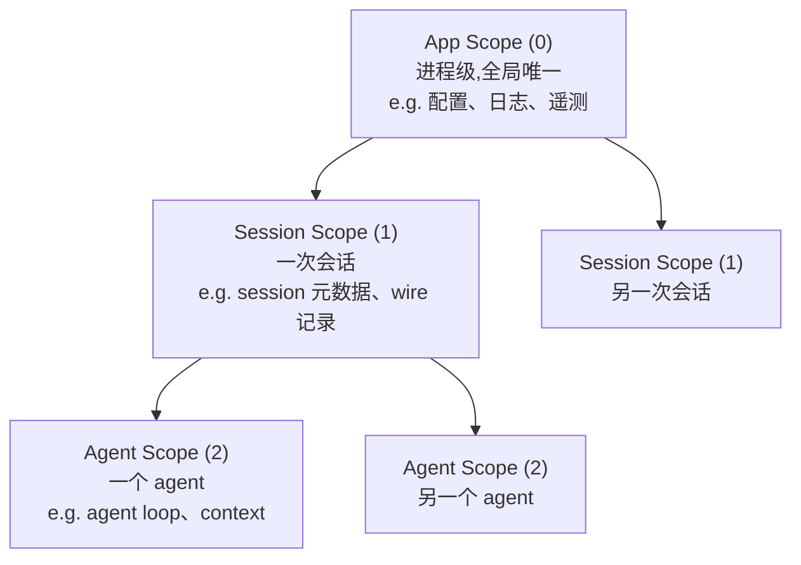
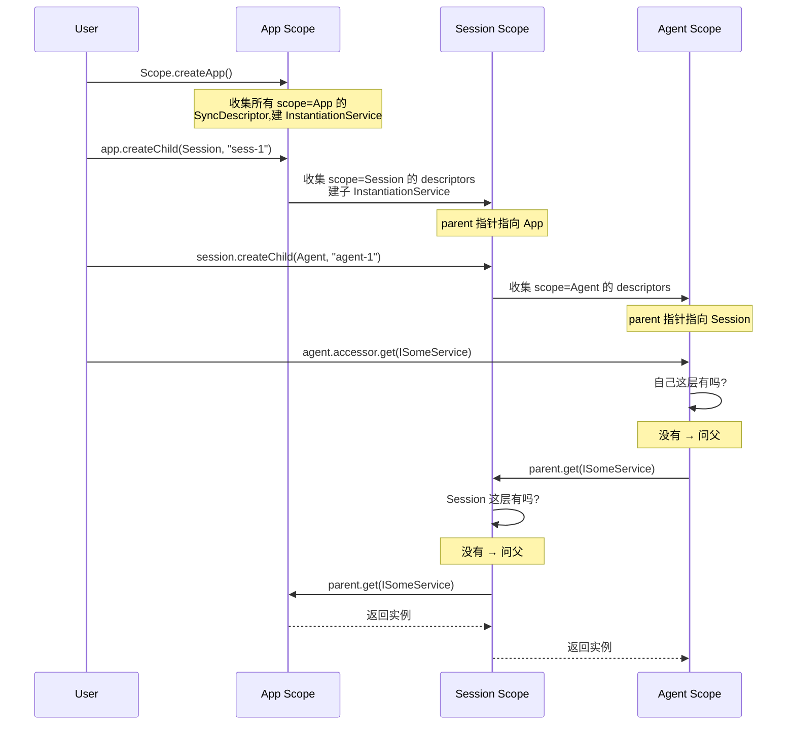
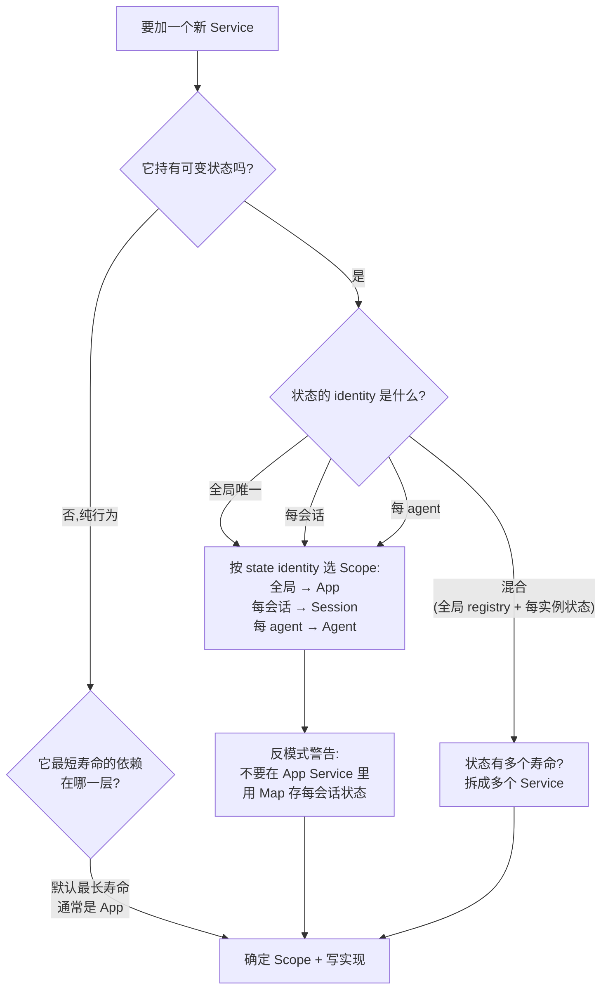

# Kimi Code · 架构总览拆解

> 本篇是 kimi-code 拆解的**地基**。后续所有模块拆解(swarm、goal、subagent、loop...)都会引用本篇定义的概念。如果你只读一篇,读这篇。

**源码位置**:`packages/agent-core-v2/`(新一代引擎,TS)
**设计文档**:`packages/agent-core-v2/docs/di.md` + `service-design.md`(写得非常清楚,强烈推荐)
**拆解基线**:main 分支(2026-07)

## 1. 这个项目要解决什么问题

kimi-code 是一个 **AI coding agent 框架**。它要支撑的场景远超"一个聊天 + 工具调用"的简单 agent:

- **一个用户同时开多个会话**(每个会话独立上下文)
- **一个会话里同时跑多个 agent**(主 agent + swarm 的 N 个子 agent)
- **每个 agent 有自己的工具、权限、profile**
- **会话可以中断、恢复、fork**(状态必须可持久化、可重放)
- **UI(TUI/Web/IDE)与引擎解耦**(同一个引擎要服务多种前端)

这不是写一个 `Agent` class 就能解决的。它需要一个**架构**来组织几百个 service 之间的关系,决定谁活多久、谁能见到谁。

## 2. 核心设计:DI × Scope 架构

整个 agent-core-v2 的地基是两个概念:**DI(依赖注入)** 和 **Scope(生命周期树)**。这是从 VS Code 的 `InstantiationService` 抄过来的 + 自己加了一层 scope 分层。

### 2.1 什么是 Scope?

一个 Scope = **一段生命周期的边界**。同一个 Scope 里的服务共享同一份"单例",Scope 销毁时所有服务一起销毁。

kimi-code 定义了**三层 Scope**,数值越大寿命越短:



对应代码(`packages/agent-core-v2/src/_base/di/scope.ts:12-16`):

```typescript
export enum LifecycleScope {
  App = 0,      // 进程级,全局一份
  Session = 1,  // 一次会话
  Agent = 2,    // 一个 agent
}
```

### 2.2 关键规则:子 Scope 看得见父 Scope,反之不行

这是整个架构的**铁律**,由数据结构强制保证:

> **短寿命的服务可以注入长寿命的服务,反过来不行。**

- ✅ Agent 服务可以注入 Session/App 服务(往上找,找得到)
- ❌ App 服务不能注入 Session 服务(App 创建时 Session 还不存在,且父不会往下找)

这保证了依赖图永远是 **DAG(有向无环图)**,不会有"App 服务等 Session 创建、Session 又等 App 服务"的死锁。

### 2.3 一个服务是怎么注册的?

标准四步(`packages/agent-core-v2/docs/di.md` 里总结的):

```typescript
// 1. 写接口(契约)
export interface IGreeter {
  readonly _serviceBrand: undefined;
  hello(): string;
}
export const IGreeter = createDecorator<IGreeter>('greeter');

// 2. 写实现类
export class Greeter implements IGreeter {
  declare readonly _serviceBrand: undefined;
  hello() { return 'hi'; }
}

// 3. 注册到某一层 Scope
registerScopedService(
  LifecycleScope.App,
  IGreeter,
  Greeter,
  InstantiationType.Eager,   // 或 Delayed
  'greet',                    // 域名,用于排错
);

// 4. barrel 导出
// greet/index.ts: export * from './greet'; export * from './greetService';
// src/index.ts:    export * from './greet/index';
```

**关键洞察**:**没有中心装配文件**。绑定散落在各自域的实现文件里,靠 import 副作用收集。`import 这个包` = `加载全部注册`。

### 2.4 依赖怎么注入?

用 `@IService` 装饰构造器参数:

```typescript
export class SessionMetadata extends Disposable implements ISessionMetadata {
  constructor(
    @ISessionContext private readonly ctx: ISessionContext,
    @IAtomicDocumentStore private readonly store: IAtomicDocumentStore,
    @ILogService private readonly log: ILogService,
  ) { super(); }
}
```

`@ISessionContext` 只做一件事:把"第 0 个参数需要 `ISessionContext`"记到类的元数据上。容器 new 这个类时读元数据,把依赖填好。

**三条红线**:
1. 不要 `new` 带 `@IService` 依赖的类(绕过容器,注册不生效)
2. `@IService` 只能装饰构造器参数
3. 服务参数排在静态参数之后(容器按位置注入)

## 3. Scope 树的实际工作方式

光讲概念太虚。看一下 `Scope` 类的核心方法(`scope.ts:107-178`):



### 3.1 `createChild` 的关键代码

```typescript
// scope.ts:139-154
createChild(kind: LifecycleScope, id: string, options: ScopeOptions = {}): Scope {
  this._assertNotDisposed();
  if (kind <= this.kind) {                                    // ① 子必须比父寿命短
    throw new Error(`child scope kind ${kind} must be greater than parent kind ${this.kind}`);
  }
  if (this.children.has(id)) {                                // ② 同 id 不能重复
    throw new Error(`Scope '${this.id}' already has a child with id '${id}'`);
  }
  const collection = buildCollection(kind, options.extra);    // ③ 筛出这一层的 descriptors
  const childInstantiation = this.instantiation.createChild(collection);  // ④ 派生子容器
  const child = new Scope(id, kind, childInstantiation, this);
  this.children.set(id, child);
  return child;
}
```

四个关键检查/操作:
- ① 强制 scope kind 严格递增(App < Session < Agent)
- ② 同一个父不能有两个同 id 的子
- ③ `buildCollection` 从全局 registry 里筛出某一层的所有 descriptor
- ④ `createChild` 建立父子容器的 parent 指针

### 3.2 销毁顺序:子先死

```typescript
// scope.ts:160-178
dispose(): void {
  if (this._disposed) return;
  this._disposed = true;

  const kids = Array.from(this.children.values());
  this.children.clear();
  for (const child of kids) {      // ① 先递归销毁所有子 scope
    child.dispose();
  }

  this._store.dispose();            // ② 销毁本 scope 注册的资源
  this.instantiation.dispose();    // ③ 销毁本 scope 的所有服务实例

  if (this._parent) {
    this._parent.children.delete(this.id);  // ④ 从父的 children 里移除
  }
}
```

**销毁顺序是确定性的**:子 scope 先死,同 scope 内按构造逆序释放(后 new 的先 dispose)。业务代码只声明"我活在哪一层",从不手动释放。

## 4. 循环依赖:容器会拒绝

这是整个架构里我最喜欢的设计:**不允许循环依赖,撞上就抛错,让你重构**。

### 4.1 检测机制

```typescript
// instantiationService.ts:293-301
protected _getOrCreateServiceInstance<T>(id: ServiceIdentifier<T>, _trace: Trace): T {
  // ...
  if (entry instanceof SyncDescriptor) {
    const root = this._root();
    if (root._inProgress.includes(id)) {                    // ① 正在构造中又被要?
      const path = [...root._inProgress, id].map(String);
      throw new CyclicDependencyError(path);                // ② 直接抛
    }
    return this._safeCreateAndCacheServiceInstance(id, entry, _trace.branch(id, true));
  }
  return entry as T;
}
```

`_inProgress` 是一个数组,记录"当前正在构造的服务链"。如果 A 构造中要 B,B 构造中又要 A,`_inProgress` 会是 `[A, B]`,再要 A 时命中 `includes(A)`,抛 `CyclicDependencyError`,错误信息里带完整路径 `['A', 'B', 'A']`。

### 4.2 撞上循环依赖怎么办?

文档里给出了明确的重构方向(优先级排序):

1. **抽出第三个服务 C**。把 A、B 互相需要的那部分逻辑提到 C,让 A、B 都依赖 C。
2. **用事件解耦**。如果 A 只是想知道 B 的变化,让 B 发事件、A 订阅,而不是 A 直接持有 B。
3. **重新划分 Scope**。也许其中一个本不该在这一层。

**注意**:代码里有一个 `InstantiationType.Delayed` 的"逃生舱"——用 Proxy 让软循环不立即炸。但文档明确说**禁止用这个绕循环依赖**,它只用来兼容历史代码。

## 5. 服务怎么设计:三层决策

`service-design.md` 给出了一个清晰的决策树,我用 mermaid 重画:



### 5.1 最常见的反模式:Map 存子 scope 状态

> **不要在 App Service 里用 `Map<sessionId, ...>` 存每会话状态。**

这是最容易犯的错。后果:
- 没人清理 entry → **内存泄漏**
- 每个调用方都要传 `sessionId` → **类型安全丢失**
- 无法注入 Session/Agent scope 的协作者 → **架构退化**

正确做法:把这部分拆成两个 Service:
- App 层:`XxxRegistry`(全局目录,知道"有哪些")
- Session/Agent 层:`XxxService`(单个实例的状态)

### 5.2 标准拆分模式:Registry + Instance

| 层 | 角色 | 命名惯例 |
|---|---|---|
| App | **全局 registry/catalog/factory** | `XxxStore` / `XxxRegistry` / `XxxCatalog` |
| Session/Agent | **单个实例的状态** | `XxxService` / `ISessionXxx` / `IAgentXxx` |

代码库里反复出现的例子:

| 域 | App 层 | Session/Agent 层 |
|---|---|---|
| records | `ISessionIndex`(所有持久化 session 的读模型) | `ISessionMetadata`(本 session 元数据)<br/>`IAgentWireRecordService`(本 agent 的 wire 记录流) |
| config | `IConfigRegistry` / `IConfigService` | — |
| chatProvider | `IChatProviderFactory`(按 provider 类型分派) | `IModelService`(model-alias 解析) |

## 6. Wire 协议:状态可持久化的秘密

(本节是预告,详细拆解见 `07-wire-protocol.md`)

所有状态变更都走一个统一的抽象:**Op → Model**。

- **Model**:某一类状态的当前值(例如 `SwarmModel` 记录当前是否处于 swarm mode)
- **Op**:一个改变 Model 的操作(例如 `swarm_mode.enter` / `swarm_mode.exit`)

```typescript
// swarmOps.ts:22-39
export const SwarmModel = defineModel<SwarmModeTrigger | null>('swarm', () => null);

export const swarmEnter = SwarmModel.defineOp('swarm_mode.enter', {
  schema: z.object({ trigger: z.custom<SwarmModeTrigger>() }),
  apply: (_s, p) => p.trigger,                    // 纯函数:旧状态 + 参数 → 新状态
  toEvent: () => ({ type: 'agent.status.updated', swarmMode: true }),
});
```

**精妙之处**:
- `apply` 是纯函数,可重放
- Op 可以序列化持久化,session resume 时重放就能恢复状态
- `toEvent` 把状态变更广播给 UI(wire),UI 不需要直接读状态

这让"session 中断 → 恢复"变成了一个**自然结果**,而不是需要特别处理的复杂逻辑。

## 7. 模块地图:整个引擎长什么样

把 `packages/agent-core-v2/src/` 的主要目录按 Scope 分层:

```
src/
├── _base/             # L0: DI、Scope、Disposable、日志、错误(基础设施)
│   └── di/            #   ← 本篇拆解的核心
├── wire/              # L1: Wire 协议、Op/Model、事件总线
├── app/               # L2: App-scope 服务(配置、认证、模型、插件、遥测)
│   ├── config/
│   ├── auth/
│   ├── modelCatalog/
│   ├── plugin/
│   ├── llmProtocol/   # provider 抽象
│   └── telemetry/
├── session/           # L3: Session-scope 服务(会话元数据、子 agent 管理、cron)
│   ├── sessionMetadata/
│   ├── sessionContext/
│   ├── subagent/      # ← 04-subagent.md 拆解的对象
│   ├── swarm/         # ← 02-swarm.md 已拆解
│   ├── todo/
│   └── cron/
├── agent/             # L4: Agent-scope 服务(agent loop、工具、context、permission)
│   ├── loop/          # ← 09-loop.md 拆解的对象
│   ├── contextMemory/ # ← 08-context-memory.md 拆解的对象
│   ├── toolRegistry/
│   ├── toolExecutor/
│   ├── permission*/   # ← 06-tool-system.md 拆解的对象
│   ├── swarm/         # swarm mode 的 Agent-scope 部分
│   ├── goal/          # ← 03-goal-mode.md 拆解的对象
│   ├── plan/          # ← 05-plan-mode.md 拆解的对象
│   ├── task/          # 后台任务
│   ├── mcp/           # MCP 集成
│   └── skill/         # skill 系统
├── os/                # L5: 文件系统、进程抽象(kaos 的 v2 版)
├── persistence/       # L6: 存储后端(append-log、atomic-doc、blob)
└── tool/              # 工具协议(input schema、权限规则匹配)
```

**命名约定**:每个域(domain)一个目录,内部三件套:
- `<domain>.ts` —— 接口/身份(`IXxx` + `createDecorator`)
- `<domain>Service.ts` —— 实现
- `index.ts` —— barrel 导出

注释约定(强制):每个 `.ts` 文件顶部必须有 `/** <domain> domain (Ln) — <role> */`,例如:

```typescript
/**
 * `sessionMetadata` domain (L6) — `ISessionMetadata` implementation.
 *
 * Persists the session metadata document (state.json) through the storage
 * access-pattern store (IAtomicDocumentStore), rooted at the metaScope
 * namespace from sessionContext. Bound at Session scope.
 */
```

`Ln` 是**层级编号**(L0 基础设施 → L6 存储),标识这个域在依赖图里的位置。

## 8. 设计权衡:为什么不用更简单的方式?

### 8.1 为什么不用 React Context / Vue Provide 那种方式?

那些方案解决的是"组件树里的依赖注入",粒度是组件实例。kimi-code 要解决的是"**长生命周期服务**的依赖注入",粒度是 session/agent。组件树 unmount 时上下文就没了,但 session 可能要跨进程恢复。

### 8.2 为什么不用 NestJS / InversifyJS 那种成熟 DI 框架?

- **它们没有 Scope 分层**。NestJS 有 module scope,但没有"App/Session/Agent"这种业务语义的 scope 树。
- **它们没有循环依赖检测**。kimi-code 的 `CyclicDependencyError` 是**故意**的架构约束,用错误倒逼设计。
- **它们不支持 Op/Model 持久化**。kimi-code 的 DI 是和 wire 协议一起设计的,scope 销毁时可以把所有 Op 序列化出去,下次重放恢复。

### 8.3 为什么抄 VS Code?

VS Code 的 `InstantiationService` 是生产环境验证过的、支持大规模代码库(几千个 service)的 DI 实现。kimi-code 在它基础上加了:
- 三层 Scope + 父子树(对应 session/agent 业务语义)
- 循环依赖硬约束
- 与 Wire 协议的深度集成

### 8.4 有什么遗憾?

- **`@IService` 装饰器依赖 `reflect-metadata`**,这是运行时反射,不是 TS 编译期能检查的。类型不匹配只能运行时炸。
- **注册散落在各文件**,没有中心装配文件。好处是解耦,坏处是"我想看这个项目到底有哪些服务"需要全局搜索 `registerScopedService`。
- **scope 只有三层**(App/Session/Agent),遇到"每用户一份"或"每组织一份"这种需求就得重新设计。不过对 coding agent 场景,三层够用了。
- **Delayed 逃生舱的存在**。文档说"禁止用 Delayed 绕循环依赖",但代码并没有阻止你这么做。应该加个 lint 规则。

## 9. 一句话总结

> kimi-code 的架构地基是 **DI × Scope 树 + Op/Model wire 协议**。Scope 用"App/Session/Agent"三层生命周期 + "子可见父、父不可见子"的铁律,把几百个 service 组织成 DAG;Op/Model 让所有状态变更天然可持久化、可重放。这不是"为了优雅而优雅",而是为了支撑"多会话、多 agent、可恢复"这个真实需求。

## 10. 本篇用到的核心源码索引

| 概念 | 文件 | 关键行 |
|---|---|---|
| `LifecycleScope` enum | `src/_base/di/scope.ts` | 12-16 |
| `registerScopedService` | `src/_base/di/scope.ts` | 27-46 |
| `Scope` 类 | `src/_base/di/scope.ts` | 107-179 |
| `Scope.createApp` / `createChild` | `src/_base/di/scope.ts` | 126-154 |
| `Scope.dispose`(销毁顺序) | `src/_base/di/scope.ts` | 160-178 |
| `InstantiationService` | `src/_base/di/instantiationService.ts` | 112-... |
| `invokeFunction` | `src/_base/di/instantiationService.ts` | 147-174 |
| `createInstance` | `src/_base/di/instantiationService.ts` | 180-202 |
| `createChild`(容器层) | `src/_base/di/instantiationService.ts` | 204-215 |
| 循环依赖检测 | `src/_base/di/instantiationService.ts` | 293-301 |
| `createDecorator` | `src/_base/di/instantiation.ts` | (见文件) |

## 参考资料

- 官方设计文档(强烈推荐):
  - `packages/agent-core-v2/docs/di.md` —— DI 场景化指南,10 个场景从简到繁
  - `packages/agent-core-v2/docs/service-design.md` —— Service 设计决策树
  - `packages/agent-core-v2/docs/di-testing.md` —— DI 测试规范
- VS Code 的 `InstantiationService` 实现:https://github.com/microsoft/vscode/blob/main/src/vs/platform/instantiation/common/instantiationService.ts
- 后续拆解(本仓库内):
  - [02-swarm.md](02-swarm.md) —— 群体智能调度
  - 03-goal-mode.md —— 自治状态机(待写)
  - 04-subagent.md —— 子 agent 系统(待写)
  - 07-wire-protocol.md —— Wire/Op/Model 协议(待写)
