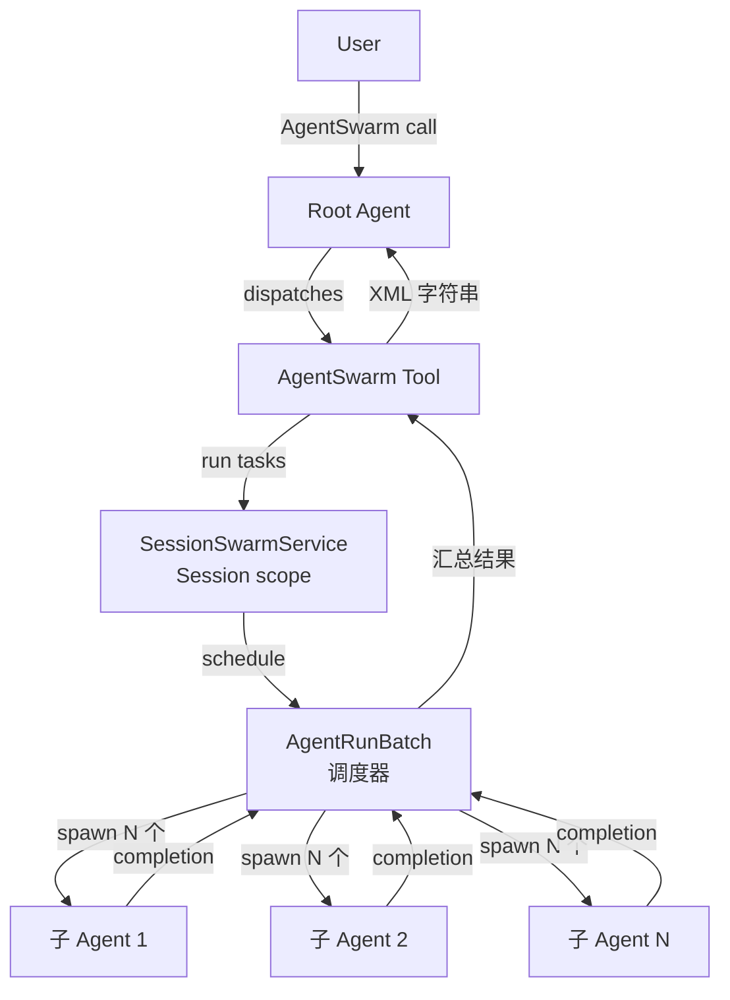
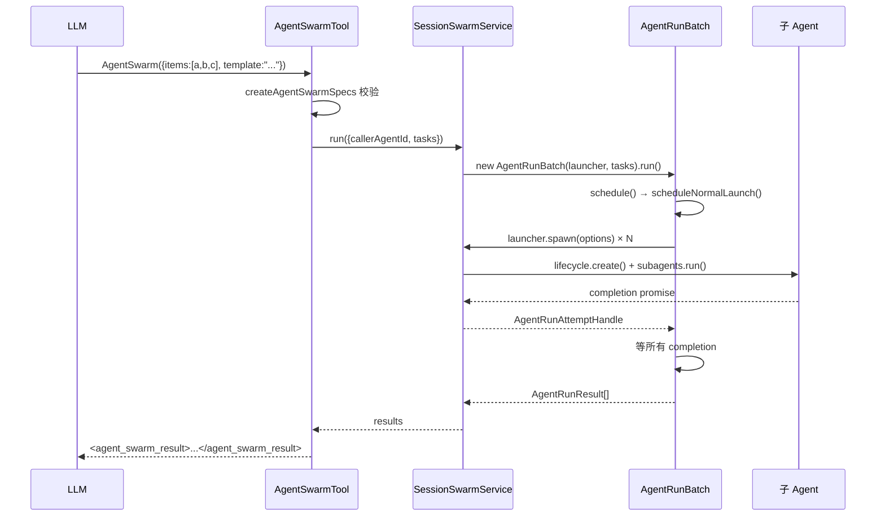
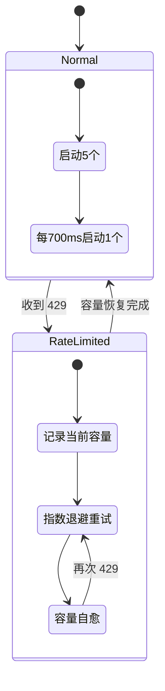

# Kimi Code · Swarm 群体智能拆解

> 📁 **源码位置** · `packages/agent-core-v2/src/agent/swarm/` 与 `packages/agent-core-v2/src/session/swarm/`
>
> 📄 **核心文件** · `agentRunBatch.ts`(644 行)、`sessionSwarmService.ts`(271 行)、`agent-swarm.ts`(工具入口)
>
> • **对应 Python 版** · `packages/agent-core/src/session/subagent-batch.ts`(legacy)


## 1. 这个模块要解决什么问题

**场景**:用户给主 agent 一个可以切分的任务,例如"审查这 30 个文件里有没有回归"、"给这 10 个微服务各自加上监控"。单 agent 串行做会很慢,而且每个子任务互相独立,天然适合并行。

**没有 swarm 会怎样**:主 agent 只能顺序调用 `Agent` 工具,每次阻塞等待一个子 agent 跑完,30 个任务串行下来可能要半小时。

**Swarm 的解决方案**:提供 `AgentSwarm` 工具,接受一个 `prompt_template`(带 `{{item}}` 占位符)和一组 `items`,**一次性**启动多个子 agent 并行执行,最多支持 128 个。

**在整个架构中的位置**:



注意:Swarm 是 **"批量子 agent 启动器"**,不是多 agent 协作框架。子 agent 之间不通信,只把结果汇报给父 agent。

## 2. 架构概览

### 2.1 三层职责分离

| 层 | 文件 | 职责 | 生命周期 |
|---|---|---|---|
| **工具层** | `agent/swarm/tools/agent-swarm.ts` | 暴露给 LLM 的 `AgentSwarm` 工具,参数校验、prompt 模板渲染 | 每次 tool call |
| **会话层** | `session/swarm/sessionSwarmService.ts` | Session 级别的 swarm 入口,管理在飞任务、向 wire 发事件 | Session |
| **调度层** | `session/swarm/agentRunBatch.ts` | 纯调度逻辑:并发控制、rate limit 退避、重试 | 一次 batch |

同时还有模式管理层 `agent/swarm/swarmService.ts`,负责 swarm mode 的进入/退出(注入 system reminder)。

### 2.2 核心抽象

| 抽象 | 位置 | 职责 |
|---|---|---|
| `AgentSwarmTool` | `agent-swarm.ts` | 工具实现,LLM 直接调用 |
| `SessionSwarmService` | `sessionSwarmService.ts` | 把工具请求翻译成 `AgentRunBatch` 的输入 |
| `AgentRunBatch` | `agentRunBatch.ts` | 调度器核心,纯逻辑、不持有 DI 依赖 |
| `AgentRunBatchLauncher` | `agentRunBatch.ts:68` | 注入到 batch 的执行器接口(spawn/resume/retry) |
| `SwarmModel` | `swarmOps.ts:22` | wire 上的状态模型,记录当前是否处于 swarm mode |

**关键设计**:`AgentRunBatch` 是一个**纯类**,不依赖任何 DI 服务,通过 `AgentRunBatchLauncher` 接口注入执行能力。这让调度器可以独立单测。

## 3. 关键流程

### 3.1 启动一次 swarm(正常路径)



**源码追踪**(从工具入口到调度):

```
agent-swarm.ts:130      execution(args)
  → agent-swarm.ts:149    runSwarm(args)
    → sessionSwarmService.ts:101  run(args)
      → sessionSwarmService.ts:118  new AgentRunBatch(launcher, linkedTasks, {maxConcurrency}).run()
        → agentRunBatch.ts:156       run()
          → agentRunBatch.ts:181       schedule()
            → agentRunBatch.ts:194     scheduleNormalLaunch()
              → agentRunBatch.ts:254   startAttempt(state)
                → agentRunBatch.ts:274   runAttempt(attempt)
                  → launcher.spawn / resume / retry
```

### 3.2 并发控制的三个阶段

这是整个调度器最精巧的部分。`scheduleNormalLaunch` 不是一次性把 N 个任务全启动,而是**分批逐渐铺开**:

```typescript
// agentRunBatch.ts:194-222
private scheduleNormalLaunch(): void {
  while (
    this.normalLaunchCount < INITIAL_LAUNCH_LIMIT &&      // 阶段1:前 5 个立即启动
    this.pending.length > 0 &&
    !this.rateLimitMode &&
    !this.isAtConcurrencyLimit()                           // 阶段2:不超过 maxConcurrency
  ) {
    this.startAttempt(this.pending.shift()!);
    this.normalLaunchCount += 1;
  }
  // ...
  this.normalLaunchTimer = setTimeout(() => {              // 阶段3:700ms 后再启一个
    // ...
    this.startAttempt(this.pending.shift()!);
    this.normalLaunchCount += 1;
    this.schedule();                                       // 递归调度
  }, INITIAL_LAUNCH_INTERVAL_MS);
}
```

**三阶段并发策略**:

| 阶段 | 触发条件 | 行为 | 常量 |
|---|---|---|---|
| 1. 立即启动 | `normalLaunchCount < 5` | 同步循环里直接 spawn | `INITIAL_LAUNCH_LIMIT=5` |
| 2. 限流启动 | 已经启动过 5 个 | 每 700ms 再启一个 | `INITIAL_LAUNCH_INTERVAL_MS=700` |
| 3. 上限封顶 | `active.size >= maxConcurrency` | 停止,等有任务完成再继续 | `KIMI_CODE_AGENT_SWARM_MAX_CONCURRENCY` 环境变量 |

**为什么这么设计**(推测 + 证据):

- **阶段 1 的 5 个立即启动**:避免冷启动太慢,但留出观察 provider 反应的窗口。如果一次性 spawn 128 个,provider 会立刻返回 429。
- **阶段 2 的 700ms 间隔**:让前一批任务有足够时间到达 `onReady` 回调(即真的开始消耗 provider 配额),再决定是否继续加速。
- **阶段 3 的可选上限**:默认无上限(只有 5+700ms 的自然节流),用户可以通过环境变量强制限制。

### 3.3 Rate limit 退避(自适应容量)

这是最复杂的部分。一旦任意一个子 agent 收到 provider 的 429,调度器会**切换模式**:



**关键代码**:

```typescript
// agentRunBatch.ts:440-454
private enterRateLimitMode(now: number): void {
  if (!this.rateLimitMode) {
    this.rateLimitMode = true;
    this.clearNormalTimer();
    this.rateLimitCapacity = Math.max(1, this.startedSuccessCount);  // 关键!
    this.nextRateLimitLaunchAt = Math.max(
      this.nextRateLimitLaunchAt,
      now + RATE_LIMIT_RETRY_BASE_MS,
    );
    this.shrinkRateLimitCapacity(now, true);
    return;
  }
  this.shrinkRateLimitCapacity(now, false);  // 再次 429,继续缩小
}
```

**精妙之处**:
- `rateLimitCapacity = startedSuccessCount` —— 用**已经成功启动的数量**作为新容量上限。如果 5 个启动成功了 3 个就触发 429,那容量就是 3。这是经验性地用"已知能跑通"的并发作为安全上限。
- 容量**只缩不涨**,直到 `RATE_LIMIT_CAPACITY_RECOVERY_INTERVAL_MS = 3 分钟`无事故才恢复一档。
- 退避用 `retry` 库的指数退避(`factor=2, base=3000ms`)。

### 3.4 任务的 requeue 与恢复

被 429 的任务不会失败,而是**重新入队**等待重试:

```typescript
// agentRunBatch.ts:403-438
private requeueRateLimited(attempt: ActiveAttempt<T>, agentId: string): void {
  // ... 更新 state,通知 launcher.suspended
  this.pending.unshift(state);        // 放回队首,优先重试
  this.enterRateLimitMode(now);
  // ... 计算下一次允许启动的时间
}
```

任务状态机:

| 状态 | 字段 | 含义 |
|---|---|---|
| `not_started` | `state.agentId === undefined` | 还没成功 spawn 过 |
| `started` | `state.agentId !== undefined` | 至少 spawn 成功过一次 |
| `completed` | `results[i].status === 'completed'` | 正常完成 |
| `failed` | `results[i].status === 'failed'` | 非 429 错误失败 |
| `aborted` | 用户取消 | |

`resume_agent_ids` 字段允许 LLM 在 batch 结束后,**继续那些没完成的子 agent**(不是重新 spawn,是 resume 同一个 agent_id,保留上下文)。

## 4. 边界条件与失败模式

| 触发条件 | 行为 | 源码位置 |
|---|---|---|
| `items.length < 2` 且无 `resume_agent_ids` | 拒绝(强制至少 2 个) | `agent-swarm.ts:208-213` |
| `items` 存在但 `prompt_template` 缺失 | 拒绝 | `agent-swarm.ts:216-219` |
| `prompt_template` 不含 `{{item}}` | 拒绝 | `agent-swarm.ts:221-225` |
| 两个 item 展开后 prompt 相同 | 拒绝(避免重复工作) | `agent-swarm.ts:243-249` |
| `items.length + resume_count > 128` | 拒绝 | `agent-swarm.ts:214-216` |
| `AgentSwarm` 不是 response 里唯一的 tool call | 拒绝(强制独占) | `agent-swarm.md:10` |
| 并发超过 `maxConcurrency` | 暂停启动新任务 | `isAtConcurrencyLimit()` |
| Provider 返回 429 | 任务 requeue + 切换到 rate limit 模式 | `requeueRateLimited()` |
| 用户 abort 整个 batch | 所有在飞任务取消,用 `finishWithUserCancellation` | `batchAbortListener` |
| 单个任务超时 | 该任务的 abort signal 触发,其他任务不受影响 | `linkAttemptSignals` |
| `resume_agent_ids` 指向不属于当前 caller 的 agent | 拒绝 | `requireOwnedSubagent` |
| `resume_agent_ids` 指向正在运行的 agent | 拒绝(防止并发跑同一个 agent) | `requireIdleSubagent` |
| Batch 结束时有未完成的任务 | 返回结果里带 `resume_hint` | `renderSwarmResults` |

## 5. 硬编码参数表

| 参数 | 默认值 | 配置方式 | 含义 |
|---|---|---|---|
| `MAX_AGENT_SWARM_SUBAGENTS` | 128 | 硬编码 | 单次 swarm 最多子 agent 数 |
| `INITIAL_LAUNCH_LIMIT` | 5 | 硬编码 | 启动阶段立即 spawn 的数量 |
| `INITIAL_LAUNCH_INTERVAL_MS` | 700ms | 硬编码 | 启动阶段后每次启动的间隔 |
| `RATE_LIMIT_RETRY_BASE_MS` | 3000ms | 硬编码 | rate limit 退避的初始延迟 |
| `RATE_LIMIT_RETRY_FACTOR` | 2 | 硬编码 | 指数退避因子 |
| `RATE_LIMIT_CAPACITY_RECOVERY_INTERVAL_MS` | 3 分钟 | 硬编码 | 容量自愈的观察窗口 |
| `KIMI_CODE_AGENT_SWARM_MAX_CONCURRENCY` | 无上限 | 环境变量 | 强制并发上限 |

**注意**:绝大多数参数是硬编码的,用户无法配置。只有最后一个并发上限通过环境变量暴露。这说明 Moonshot 把这些值调成了"开箱即用"的合理默认,不希望用户瞎调。

## 6. 设计权衡

### 6.1 为什么不用真正的多 agent 协作?

对比 AutoGen / CrewAI 这类真正的多 agent 框架(子 agent 之间可以互相通信、共享上下文),kimi-code 的 swarm **是"批处理"而非"协作"**:

- 子 agent 各自跑各自的 prompt,看不到其他子 agent 的输出
- 只有父 agent 在最后汇总时看到所有结果
- 子 agent 不能 spawn 子子 agent(防止递归爆炸)

**推测原因**:
1. **成本控制**:协作需要子 agent 之间多次往返通信,token 消耗指数级增长。批处理是 O(N),协作是 O(N²) 甚至更高。
2. **可预测性**:批处理的结果是确定的(每个子 agent 独立完成),协作可能出现死循环或对话发散。
3. **provider 友好**:批处理模式下,每个子 agent 是独立的 HTTP 会话,provider 的负载均衡和 rate limit 可以自然工作。
4. **场景匹配**:大多数真实任务(代码审查、批量重构、文档生成)天然适合批处理,不需要协作。

### 6.2 为什么把调度器抽成纯类?

`AgentRunBatch` 不依赖任何 DI 服务,通过 `AgentRunBatchLauncher` 接口注入执行能力。这是非常干净的设计:

```typescript
export type AgentRunBatchLauncher = {
  spawn(options: AgentSpawnAttemptOptions): Promise<AgentRunAttemptHandle>;
  resume(agentId: string, options: AgentRunAttemptOptions): Promise<AgentRunAttemptHandle>;
  retry(agentId: string, options: AgentRunAttemptOptions): Promise<AgentRunAttemptHandle>;
  suspended?(event: AgentRunSuspendedEvent): void;
};
```

好处:
- **可测试**:单测时可以注入 mock launcher,不需要起整个 DI 容器(`createMockAgentRunBatchRunner` 就是这么做的)
- **可复用**:同样的调度器可以用于非 LLM 场景(任何需要批量异步任务 + rate limit 退避的地方)
- **关注点分离**:调度逻辑(何时启动)与执行逻辑(怎么启动)解耦

### 6.3 遗憾与可改进点

- **参数全硬编码**:`INITIAL_LAUNCH_LIMIT`、`RATE_LIMIT_RETRY_BASE_MS` 这些都是硬编码。不同 provider 的 rate limit 差异很大(OpenAI vs Anthropic vs 本地 ollama),应该允许配置。
- **没有动态调参**:调度器不会根据历史成功率动态调整 `INITIAL_LAUNCH_LIMIT`。如果上次 5 个全 429 了,下次还是从 5 个开始。可以加一个"学习"机制。
- **错误恢复策略单一**:非 429 错误直接 fail,不会重试。对于网络抖动这种瞬时错误,应该允许有限次重试。
- **结果大小无限制**:128 个子 agent 各自返回几 KB 的 summary,汇总后可能撑爆主 agent 的上下文。应该有截断或分页策略。
- **子 agent 不能 spawn 子子 agent**:这个限制合理(防止递归),但没在代码层面强制,只在文档里说。应该改成运行时检查。

## 7. 一句话总结

> kimi-code 的群体智能本质是一个**带自适应 rate limit 退避的批处理调度器**,通过"立即启动 5 个 → 700ms 一个 → 触发 429 就退避并自适应容量"的三阶段策略,在 provider 配额和用户期望延迟之间找平衡。它**不是多 agent 协作框架**,而是"并行 fan-out + 汇总 fan-in"的工程化实现。

## 参考资料

- 源码:`packages/agent-core-v2/src/agent/swarm/`、`packages/agent-core-v2/src/session/swarm/`
- 工具描述:`packages/agent-core-v2/src/agent/swarm/tools/agent-swarm.md`
- Swarm mode 提示词:`packages/agent-core-v2/src/agent/swarm/enter-reminder.md`
- 对比 Python 版(legacy):`packages/agent-core/src/session/subagent-batch.ts`
