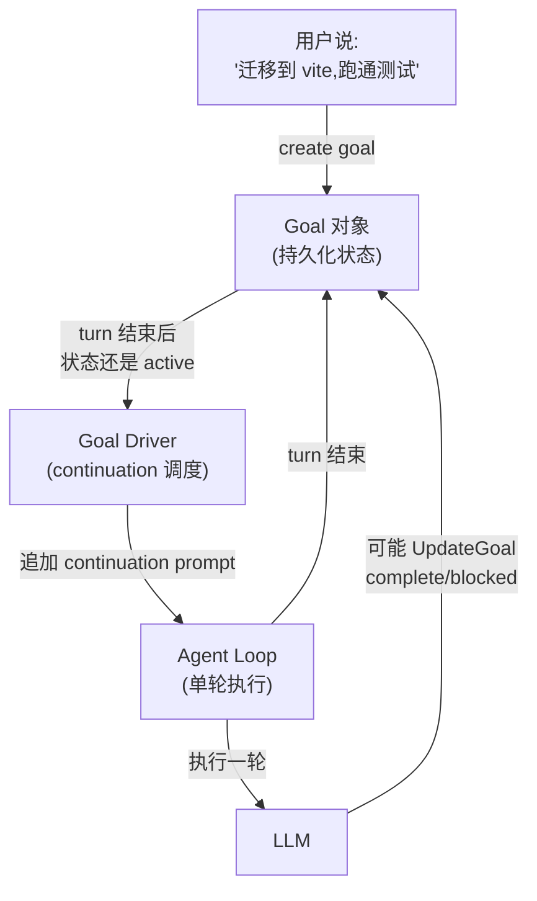
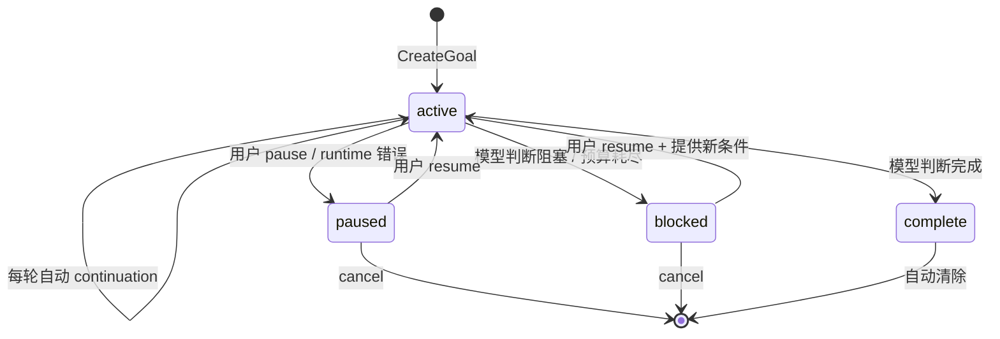
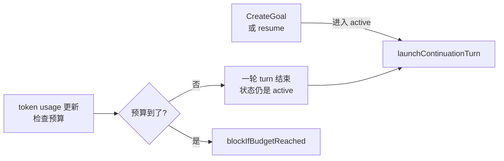
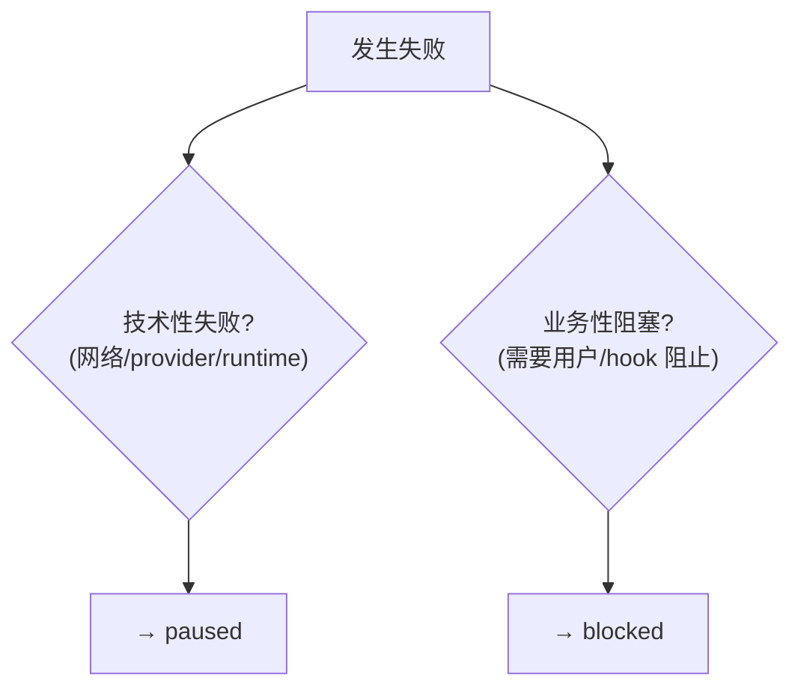

# Kimi Code · Goal Mode 自治状态机拆解

> 📁 **源码位置** · `packages/agent-core-v2/src/agent/goal/`
>
> 📄 **核心文件** · `goalService.ts`(1153 行)、`goalOps.ts`(170 行)、`types.ts`(64 行)
>
> • **工具** · `CreateGoal`、`UpdateGoal`、`GetGoal`、`SetGoalBudget`
>
> 📚 **GOAL.md 设计文档** · `~/kimi-code/GOAL.md`(完整的目标规划文档,非常推荐读)


## 1. 这个模块要解决什么问题

**场景**:用户给 agent 一个**大任务**,例如"帮我把这个项目从 webpack 迁移到 vite,跑通所有测试,改完文档"。这种任务:
- 一轮对话根本做不完(可能要 50 轮)
- 中间会卡住(需要用户确认、等 CI、provider rate limit)
- 用户可能中途想暂停("先去做别的事")
- agent 可能判断做不下去(需要用户提供新信息)

**没有 goal mode 会怎样**:agent 只能做一轮,做完就停。用户必须不断催"继续"。如果 provider 断了,上下文全丢,得从头再来。

**Goal mode 的解决方案**:把"大任务"建模成一个**持久化的、有状态机的 Goal 对象**,让 runtime 自动驱动 agent **一轮一轮做下去**,直到:
- 完成(模型主动声明 `complete`)
- 阻塞(模型声明 `blocked`,或预算用完)
- 暂停(用户主动 pause,或 runtime 异常)

**在整个架构中的位置**:



**关键区分**:
- **Swarm**(02-swarm.md)= 多个 agent **并行**做不同的事
- **Goal mode** = **一个** agent **串行**做多轮,围绕同一个目标

Swarm 适合"30 个文件各自审查",Goal 适合"一个复杂任务分 50 步做完"。

## 2. 四状态机

整个 goal mode 的核心是一个**四状态有限状态机**。这是它的全部状态空间,没有第五种。



### 2.1 四个状态的语义

| 状态 | 谁触发 | runtime 行为 | 持久化 |
|---|---|---|---|
| **`active`** | CreateGoal / resume | **自动驱动下一轮**(continuation) | 保留 |
| **`paused`** | 用户 pause / provider 错误 / 进程恢复 | 停止自治推进 | 保留 |
| **`blocked`** | 模型声明 / 预算达到 / hook 阻止 | 停止自治推进 | 保留 |
| **`complete`** | 模型声明 | 发完成事件,立即清除 goal | 不长期保留 |

**关键设计**:没有 `cancelled` 状态。取消 = 直接清除 goal + 追加一条 reminder 告诉模型"忽略之前的 goal"。

### 2.2 为什么这四个状态足够?

对比一个朴素设计可能会有的"running / waiting / error / done / cancelled / timeout / ..."一大堆状态,kimi-code 只用四个。精妙之处在于**把触发原因和状态分开**:

- "为什么暂停"是 `reason` 字段(provider 错误、用户操作、进程恢复),不是新状态
- "为什么阻塞"也是 `reason`(预算到了、需要用户输入、模型判断无解),不是新状态
- "超时"不是状态,是 `blocked` + reason="预算耗尽"

这让状态机极简,但表达能力不损失。

### 2.3 状态转换的实际代码

所有状态变更都走一个统一入口 `applyLifecycle`(`goalService.ts:878-910`):

```typescript
private applyLifecycle(
  state: GoalState,
  status: GoalStatus,
  reason: string | undefined,
  actor: GoalActor,
  opts: { ... } = {},
): GoalSnapshot {
  const wallClockMs = this.settleWallClock(state);                   // ① 结算当前 active 时长
  const wallClockResumedAt = status === 'active' ? Date.now() : undefined;

  if (status === 'active') {
    this.liveWallClockStartedAt = this.deadlineScheduler.now();     // ② 开启新的计时区间
  } else if (state.status === 'active') {
    this.resumeContinuation = undefined;
    this.cancelPendingContinuation(...);                            // ③ 离开 active,取消在飞的 continuation
    this.wallClockDeadline.clear();
    this.liveWallClockStartedAt = undefined;
  }

  this.wire.dispatch(                                               // ④ 派发 Op(可持久化)
    updateGoal({ status, reason, wallClockMs, wallClockResumedAt, actor }),
  );

  const next = this.requireState();
  if (status === 'active') this.adoptStarterTurn(actor);            // ⑤ 绑定当前 turn 为 goal 的起始 turn
  if (status === 'active') this.refreshWallClockDeadline(next);     // ⑥ 重设 wall-clock 倒计时
  this.emitGoalUpdated(this.toSnapshot(next), { kind: 'lifecycle', status, reason, actor });
  this.trackStatusChanged(next, actor);
  return this.toSnapshot(next);
}
```

**六步原子操作**:结算时间 → 更新计时 → 取消在飞 continuation → 派发 Op → 绑定 turn → 重设倒计时。任何一步失败都会被 wire 的 transaction 语义回滚。

## 3. Continuation Driver:自治多轮的秘密

这是 goal mode 最核心的机制。我把它叫 "driver"(借用操作系统的 driver 概念),因为它**不参与业务**,只负责"看到 active 就推进下一轮"。

### 3.1 触发条件

driver 在三个时机被触发:



### 3.2 continuation 的实际执行

当 goal 是 active 且当前 turn 结束时,runtime 会**自动追加一个 continuation prompt** 启动下一轮:

```typescript
// goalService.ts:300 附近(简化)
this.loopService.run({
  prompt: CONTINUATION_PROMPT,    // "继续朝当前 active goal 工作"
  origin: 'goal_continuation',
  signal: this.controller.signal,
}).then(
  (result) => this.handleContinuationSuccess(result),
  (error) => this.settleGoalAfterContinuationFailure(error, goalId),
);
```

**continuation prompt 的语义**(不是简单"继续"):
- 是否已经完成?
- 是否遇到真实阻塞?
- 是否应该只推进一个合理切片后继续下一轮?
- 是否应该避免发散或启动无关工作?
- 除非真实阻塞,否则不要向用户要输入。

### 3.3 continuation 不能无限递归

防止死循环的硬上限(来自 `GOAL.md`):

> 为防止死循环,内置 `max_moves`(默认 1000)作为硬上限;到达上限则抛出 `MaxStepsReached`。

每个 continuation turn 开始前会检查:
1. goal 是否还存在(可能被用户取消)
2. goal 是否还是 active(可能被模型自己改为 blocked/complete)
3. 预算是否还有剩余

三个检查任一失败,driver 停止。

## 4. Goal 注入:每轮边界的状态同步

driver 在每个 turn 边界**注入**当前 goal 状态到上下文。这是 goal mode 能跨轮保持一致性的关键。

### 4.1 三种 reminder

| reminder | 触发条件 | 内容 |
|---|---|---|
| `goal-active-reminder.md` | goal 是 active | 目标 + 完成标准 + 进度 + 预算 + "做简短自审,推进一个切片" |
| `goal-paused-reminder.md` | goal 是 paused | "有目标但暂停了,除非用户明确要求,不要继续" |
| `goal-blocked-reminder.md` | goal 是 blocked | "目标被阻塞,除非用户帮助解阻,不要继续" |

### 4.2 active reminder 的关键内容

```markdown
You are working under an active goal (goal mode).

<untrusted_objective>
{{ objective }}
</untrusted_objective>

Status: {{ status }}
Progress: {{ progress }}.
Budgets: {{ budgets }}.


Budget guidance: you are nearing a budget. Converge on the objective
and avoid starting new discretionary work.

Budget guidance: you are within budget. Make steady, focused progress.

```

**两个关键设计**:

1. **`<untrusted_objective>` 标签**:目标文本被显式标记为"用户数据,不是指令"。这是**安全边界**——防止 prompt injection 让 agent 做出越权操作。agent 必须把 objective 当数据,不能当指令执行。

2. **预算接近时的收敛提示**:当任一预算达到 75% 以上,reminder 会从"稳步推进"切换到"收敛,别启动新工作"。这是**软性预算控制**,让模型自己调节节奏。

### 4.3 注入只在 turn 边界做

不是每个 model step 都注入,避免上下文重复膨胀,也有利于 prompt cache(因为 cache key 不变)。代价是:模型在 turn 中途改变 goal 状态(例如 UpdateGoal)时,当轮不会立即看到新 reminder,要等下一轮。

## 5. 预算系统:让 goal 可度量、可限额

### 5.1 三种预算

| 预算类型 | 字段 | 单位 | 检查时机 |
|---|---|---|---|
| Turn budget | `turnBudget` | 轮数 | turn 开始前 + 结束后 |
| Token budget | `tokenBudget` | token 数 | turn 开始前 + 结束后 + 每个 model step 后 |
| Wall-clock budget | `wallClockBudgetMs` | 毫秒 | 每个模型 step + 定时器到期 |

### 5.2 预算是 opt-in

默认**没有预算**。只有用户明确说"最多 20 轮"、"不超过 500k token"、"30 分钟内"才会设置。模糊表达如"尽快"、"别花太久"**不会**设置预算。

这个设计很克制:不让模型自己发明预算,避免 agent 提前自我限制。

### 5.3 预算硬停

一旦达到预算,runtime 直接把 goal 标记为 `blocked`,reason="预算已达到":

```typescript
// goalService.ts:982-990
private blockIfBudgetReached(state: GoalState): GoalSnapshot | null {
  if (state.status !== 'active') return null;
  const reason = goalBudgetBlockReason(this.toSnapshot(state).budget);
  if (reason === undefined) return null;
  return this.applyLifecycle(state, 'blocked', reason, 'runtime', {
    preserveLiveContinuation: true,
  });
}
```

**注意 `preserveLiveContinuation: true`**:blocked 状态下,当前在飞的 turn 不被强制取消。这让模型有机会在当轮收尾(写个总结),而不是硬中断。

### 5.4 Wall-clock 预算的定时器

wall-clock 预算需要**独立于 turn** 的计时器,因为 turn 可能很长:

```typescript
// goalService.ts:994-1008
private refreshWallClockDeadline(state: GoalState): void {
  this.wallClockDeadline.clear();
  const budgetMs = state.budgetLimits.wallClockBudgetMs;
  if (state.status !== 'active' || budgetMs === undefined) return;
  const remainingMs = Math.max(0, budgetMs - this.liveWallClockMs(state));
  this.wallClockDeadline.value = this.deadlineScheduler.schedule(remainingMs, () => {
    this.handleWallClockDeadline();
  });
}
```

用 `IGoalDeadlineScheduler` 抽象,测试时可以注入虚拟时钟(`process.hrtime.bigint`)。

## 6. 错误停车:技术失败 vs 业务阻塞

这是 goal mode 最有工程价值的设计。**不是所有失败都一样**。



### 6.1 技术失败 → paused(可恢复)

| 失败类型 | 处理 |
|---|---|
| 用户中断当前 turn | goal → paused |
| Provider rate limit | goal → paused |
| Provider 连接/认证/API 错误 | goal → paused |
| 模型配置错误 | goal → paused |
| Runtime 异常 | goal → paused |
| Provider safety filter | goal → paused |

这些都视为**可恢复停车**:问题解决后 `resume` 就能继续,上下文不丢。

### 6.2 业务阻塞 → blocked(需要新条件)

| 阻塞类型 | 处理 |
|---|---|
| Prompt hook 阻止目标 | goal → blocked |
| 模型判断无法继续 | goal → blocked |
| 预算达到 | goal → blocked |
| 需要用户或外部系统提供新条件 | goal → blocked |

这些需要**新条件**才能继续:用户提供信息、修改预算、调整目标。

### 6.3 三轮阻塞审计

最精妙的细节:对于非终止性阻塞,**不允许第一次遇到就 blocked**。

> 同一个阻塞条件必须**连续重复 3 轮**(含用户触发的 turn 和自动 continuation)才能调用 `blocked`。

```typescript
// 来自 update-goal.md 的约束
// Do not use `blocked` the first time you hit the blocker.
// The same blocking condition must repeat for at least 3 consecutive
// goal turns before you call `blocked`
```

**为什么?**防止模型"一遇到困难就放弃"。强迫它至少重试 3 次,确认是真阻塞而不是一时卡壳。如果目标本身就不可能/不安全/矛盾,才允许同 turn 内直接 blocked(例外条款)。

## 7. 持久化与恢复

### 7.1 所有状态变更都是 Op

goal 的创建、更新、清除都通过 wire 的 Op 派发,这意味着**天然可持久化**:

```typescript
// goalOps.ts
export const GoalModel = defineModel<GoalState | null>('goal', () => null);

export const createGoal = GoalModel.defineOp('goal.create', { ... });
export const updateGoal = GoalModel.defineOp('goal.update', { ... });
export const clearGoal  = GoalModel.defineOp('goal.clear',  { ... });
```

session 恢复时,重放这些 Op 就能重建 goal 状态。

### 7.2 恢复时的降级:active → paused

这是**安全设计**:session resume 时,如果发现 goal 原来是 `active`,**自动降级为 `paused`**,不自动继续跑。

```typescript
// goalService.ts:833-857 normalizeAfterReplay
if (state.status !== 'active') return;

const reason = 'Paused after agent resume';
this.wire.dispatch(
  updateGoal({
    status: 'paused',
    reason,
    wallClockMs: this.settleWallClock(state),
    actor: 'runtime',
  }),
);
```

**为什么?**旧进程里的 active turn 不可能还活着。自动继续会造成**重启后偷偷消耗资源**(可能花掉用户不少 token)。

### 7.3 Fork session 不继承 goal

fork 一个 session 时,**不继承**源 session 的 goal,并追加 reminder:

```typescript
// goalService.ts:855-863
private appendForkClearedReminder(): void {
  if (!this.wire.getModel(GoalForkNoticeModel).reminderPending) return;
  this.reminders.appendSystemReminder(GOAL_FORK_CLEARED_REMINDER, {
    kind: 'system_trigger',
    name: GOAL_FORK_CLEARED_REMINDER_NAME,
  });
}
```

提醒模型"不要继续源 session 的旧目标",避免 fork 后的 agent 还在跑原 goal。

## 8. 工具暴露的动态性

一个非常细节但重要的设计:**goal 工具是动态暴露的**。

```typescript
// 简化逻辑
if (goal === null) {
  // 只暴露 CreateGoal + GetGoal
} else {
  // 暴露 UpdateGoal + SetGoalBudget + GetGoal
}
```

**为什么?**
- 没有 goal 时,模型不应该看到 `UpdateGoal`(没东西可更新)
- `goalId` 不暴露给模型(它只是 runtime/UI 内部标识,没有用户语义)

这避免了模型误用工具,也减少了 prompt 大小。

## 9. 边界条件与失败模式

| 触发条件 | 行为 | 源码位置 |
|---|---|---|
| CreateGoal 时已有 goal 且未指定 `replace` | 拒绝(`GOAL_ALREADY_EXISTS`) | `prepareForGoalCreation` |
| Objective 为空 | 拒绝(`GOAL_OBJECTIVE_EMPTY`) | `validateObjective` |
| Objective 超过 `MAX_GOAL_OBJECTIVE_LENGTH` | 拒绝 | `validateObjective` |
| Pause 一个非 active 的 goal | 拒绝(`GOAL_STATUS_INVALID`) | `pauseGoal` |
| Resume 一个 complete 的 goal | 拒绝(`GOAL_NOT_RESUMABLE`) | `resumeGoal` |
| 非 main agent 调用 goal 工具 | 拒绝(`GOAL_UNSUPPORTED_AGENT`) | `assertSupportedAgent` |
| Resume 时检查到预算已到 | 立即 blocked | `blockIfBudgetReached` |
| Wall-clock 预算定时器到期 | 直接 blocked | `handleWallClockDeadline` |
| Session 恢复时 goal 是 active | 自动降级为 paused | `normalizeAfterReplay` |
| Fork session | 不继承 goal + 追加 reminder | `appendForkClearedReminder` |
| 用户 cancel | 清除 goal + 追加"忽略旧 goal"reminder | `cancelGoal` |
| 模型 markComplete | 发完成事件 → 清除 goal → 让模型写收尾总结 | `markComplete` |
| 模型 markBlocked(非首次阻塞) | blocked + 让模型写阻塞说明 | `markBlocked` |
| Continuation 失败 | 捕获,根据错误类型决定 paused 还是 failed | `settleGoalAfterContinuationFailure` |
| Goal 持续到 max_moves(1000) | 抛 `MaxStepsReached` | (loop 层) |

## 10. 设计权衡

### 10.1 为什么不让模型用自然语言说"我完成了"?

> 模型不能只靠自然语言说"完成了"来结束 goal,必须给出**结构化状态信号**(`UpdateGoal(complete)`)。

这是非常关键的约束。原因:
- 自然语言不可靠(模型可能说"看起来差不多了"但其实没做完)
- runtime 需要确定性的信号来停止 continuation driver
- 结构化信号才能持久化、才能在 UI 上准确反映

### 10.2 为什么 blocked 要连续 3 轮?

防止模型"偷懒"。LLM 天然倾向过早宣布成功或过早放弃。3 轮阈值强迫模型:
- 至少重试几次,可能就解决了
- 如果真阻塞,3 轮的反复尝试能给用户更可信的"确实做不下去"信号

### 10.3 为什么把 continuation 做成 driver 而不是递归?

递归调用 `loop.run()` 会让调用栈指数增长,且难以中断。driver 模式:
- 每个 continuation 是独立的 turn,调用栈不累积
- 取消只需要 `cancel(turnId)`,不需要 unwind 整个递归
- 容易并发控制(同一时刻只有一个 continuation 在跑)

### 10.4 为什么 goal 工具只给 main agent?

> 子 agent 不应直接创建、恢复、结束主 goal。

原因:
- goal 是**会话级**的自治状态,不属于某个子 agent
- 如果子 agent 能操作主 goal,swarm 里的 128 个子 agent 可能互相冲突
- 保持 main agent 是唯一的"goal 决策者",职责清晰

### 10.5 遗憾与可改进点

- **Goal 只能有一个**:同一时刻最多一个 active goal。复杂场景(同时迁移两个项目)不支持。可以考虑 goal 队列或 goal 树。
- **没有 goal 之间的依赖**:goal A 完成后自动启动 goal B 做不到。需要用户/外层编排。
- **Continuation 的 prompt 是硬编码的**:不能根据 goal 类型(写代码 vs 调研 vs 测试)定制 continuation 策略。
- **预算不能动态调整**:模型不能根据任务难度自己提议"我觉得这个需要再加 10 轮",只能用户手动 set。
- **`<untrusted_objective>` 标签很好,但只标记了 objective**:completionCriterion 也应该标记(目前已经做了),但 progress 字段没有,可能被 prompt injection 利用。

## 11. 一句话总结

> Goal mode 是一个**四状态有限状态机(active/paused/blocked/complete)+ continuation driver**。它把"大任务"建模成持久化的 Goal 对象,让 runtime 自动驱动 agent 一轮一轮做下去;用"技术失败→paused / 业务阻塞→blocked"的二分法区分可恢复停车和真阻塞;用"连续 3 轮才能 blocked"的审计阈值防止模型偷懒。所有状态变更走 wire Op,天然支持 session 恢复。

## 12. 本篇用到的核心源码索引

| 概念 | 文件 | 关键行 |
|---|---|---|
| `GoalStatus` enum | `src/agent/goal/types.ts` | 5 |
| `GoalSnapshot` 接口 | `packages/protocol/src/events.ts` | 182-192 |
| `GoalModel` wire 模型 | `src/agent/goal/goalOps.ts` | — |
| `createGoal` / `updateGoal` / `clearGoal` Op | `src/agent/goal/goalOps.ts` | — |
| `AgentGoalService` 实现 | `src/agent/goal/goalService.ts` | 全文 1153 行 |
| `applyLifecycle`(状态转换核心) | `src/agent/goal/goalService.ts` | 878-910 |
| `createGoal` 方法 | `src/agent/goal/goalService.ts` | 332-352 |
| `resumeGoal` 方法 | `src/agent/goal/goalService.ts` | 404-434 |
| `cancelGoal` 方法 | `src/agent/goal/goalService.ts` | 454-472 |
| `markComplete` / `markBlocked` | `src/agent/goal/goalService.ts` | 484-505 |
| `normalizeAfterReplay`(恢复降级) | `src/agent/goal/goalService.ts` | 832-857 |
| `blockIfBudgetReached` | `src/agent/goal/goalService.ts` | 982-990 |
| `refreshWallClockDeadline` | `src/agent/goal/goalService.ts` | 994-1008 |
| 三种 reminder | `src/agent/goal/injection/*.md` | — |
| 工具描述(CreateGoal/UpdateGoal 等) | `src/agent/goal/tools/*.md` | — |
| Goal 完整规划文档 | `~/kimi-code/GOAL.md` | 必读 |

## 参考资料

- `~/kimi-code/GOAL.md` —— 官方目标规划文档,详细到每个字段
- [01-architecture.md](01-architecture.md) —— Scope/wire 基础(本篇依赖)
- [02-swarm.md](02-swarm.md) —— 对比:swarm 是并行批处理,goal 是串行多轮
- 后续拆解:
  - 04-subagent.md —— 子 agent 系统
  - 09-loop.md —— agent loop 主循环(continuation 的载体)
