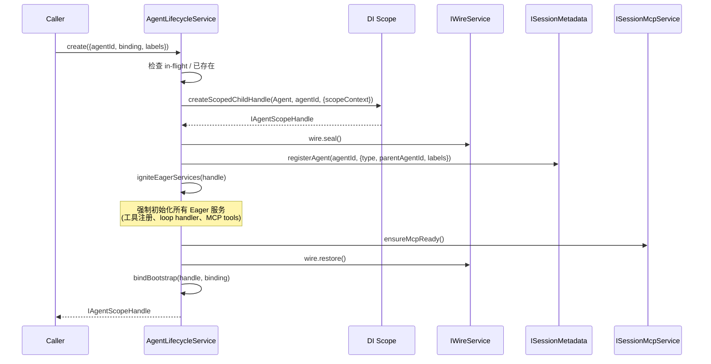

# Kimi Code · Subagent 系统拆解

> 📁 **源码位置** · `packages/agent-core-v2/src/session/subagent/` + `packages/agent-core-v2/src/session/agentLifecycle/`
>
> 📄 **核心文件** · `agentLifecycleService.ts`(337 行)、`runAgentTurn.ts`(233 行)、`mirrorAgentRun.ts`(188 行)、`subagentService.ts`(80 行)
>
> • **工具** · `Agent`(单子 agent)、`AgentSwarm`(批量子 agent,见 [02-swarm.md](02-swarm.md))


## 1. 这个模块要解决什么问题

**场景**:主 agent 在做一个复杂任务,其中某一步可以外包给一个**专门的、隔离的**子 agent。例如:
- "探索一下这个代码库,告诉我用户认证逻辑在哪"(只读 explore profile)
- "在 worktree 里重构这个模块,不要影响主分支"(coder profile)
- "规划一下这个功能的实现步骤,先不要写代码"(plan profile)

**为什么需要子 agent?**
- **上下文隔离**:子 agent 的对话历史不污染主 agent
- **权限隔离**:explore profile 没有写文件工具,plan profile 不能跑 shell
- **并行**:swarm 可以同时跑 128 个子 agent
- **可恢复**:子 agent 是持久化的,可以中断后 resume

**Subagent 系统在整个架构中的位置**:

```mermaid
flowchart TB
    Main["Main Agent<br/>(agentId=main)"]
    Tool["Agent Tool"]
    LC["AgentLifecycleService<br/>(Session scope, flat registry)"]
    Sub["ISessionSubagentService<br/>(Session scope)"]
    C1["子 Agent 1<br/>(agent-1)"]
    C2["子 Agent 2<br/>(agent-2)"]
    C3["子 Agent N<br/>(agent-N)"]

    Main -->|Agent(prompt, type=coder)| Tool
    Tool -->|create + run| Sub
    Sub -->|createChild(Agent scope)| LC
    LC --> C1
    LC --> C2
    LC --> C3
    C1 & C2 & C3 -->|summary| Sub
    Sub -->|mirrorAgentRun: 把事件转发给父| Main
```

**关键洞察**:`AgentLifecycleService` 是一个**扁平的** registry(没有树形父子关系)。父子关系是**业务层数据**(metadata),不是 scope 结构本身。这让 swarm、fork、resume 都能灵活组合。

## 2. 三层职责分离

整个子 agent 系统,我把它拆成三层来理解:

| 层 | 职责 | 代表 Service / 函数 |
|---|---|---|
| **生命周期层** | 创建、跟踪、销毁 agent scope | `AgentLifecycleService`(Session scope) |
| **运行层** | 在 agent 上跑一个 turn、distill summary | `ISessionSubagentService` + `runAgentTurn`(纯函数) |
| **镜像层** | 把子 agent 的运行事件**转发**给父 agent 的 UI | `mirrorAgentRun`(纯函数) |

这三层是**解耦**的:运行层不知道谁在调用它,镜像层不负责实际执行。这是非常干净的设计。

## 3. Agent 的诞生:AgentLifecycleService.create

这是整个系统的入口。所有 agent(包括 main agent)都通过 `create` 产生。

### 3.1 核心流程



### 3.2 关键代码

```typescript
// agentLifecycleService.ts:131-149
async create(opts: CreateAgentOptions = {}): Promise<IAgentScopeHandle> {
  // Create-or-get:并发的同 id 创建会 join 同一个 in-flight promise,
  // 而不是创建重复 scope。这让 swarm 调度器可以安全地并发创建。
  if (opts.agentId !== undefined) {
    const inflight = this.creating.get(opts.agentId);
    if (inflight !== undefined) return inflight;
    const existing = this.handles.get(opts.agentId);
    if (existing !== undefined) return existing;
  }
  const agentId = opts.agentId ?? `agent-${nextAgentId++}`;
  const promise = this.doCreate(agentId, opts);
  this.creating.set(agentId, promise);
  try {
    return await promise;
  } finally {
    this.creating.delete(agentId);
  }
}
```

**两个亮点**:
- **`creating` Map**:并发创建相同 id 的调用会 join 同一个 Promise。这对 swarm 非常关键 —— 调度器可能并发启动多个任务,如果两个任务恰好用了同一个 agentId(例如 resume),不会创建两个 scope。
- **`handles` Map**:已经存在的 agent 直接返回。这让 resume 安全。

### 3.3 `doCreate` 的详细步骤

```typescript
// agentLifecycleService.ts:152-199 (简化)
private async doCreate(agentId: string, opts: CreateAgentOptions): Promise<IAgentScopeHandle> {
  const mcpReady = this.sessionMcp.ensureMcpReady();              // ① 不阻塞地启动 MCP
  const agentHomedir = this.bootstrap.agentHomedir(...);
  const agentScope = this.bootstrap.agentScope(...);

  // ② 创建 Agent scope(唯一注入的 seed 是 scopeContext)
  const handle = createScopedChildHandle(
    this.instantiation,
    LifecycleScope.Agent,
    agentId,
    { extra: [[IAgentScopeContext, makeAgentScopeContext({ agentId, agentScope })]] },
  );
  this.handles.set(agentId, handle);

  try {
    const wire = handle.accessor.get(IWireService);
    await wire.seal();                                            // ③ 锁定 wire
    await this.sessionMetadata.registerAgent(agentId, {          // ④ 注册到 session 元数据
      type: agentId === 'main' ? 'main' : 'sub',
      parentAgentId: agentId === 'main' ? undefined : 'main',    // ★ 默认父是 main
      labels: opts.labels,
    });
    this.onDidCreateEmitter.fire(handle);
    this.igniteEagerServices(handle);                            // ⑤ 强制初始化 Eager 服务
    await mcpReady;                                              // ⑥ 等 MCP 加载完
    await wire.restore();                                        // ⑦ 恢复 wire 历史
    await this.bindBootstrap(handle, opts);                      // ⑧ 绑定 profile/model/cwd
    return handle;
  } catch (error) {
    // 启动失败:丢弃半成品 agent,下次 create 从头开始
    if (this.handles.get(agentId) === handle) this.handles.delete(agentId);
    try { handle.dispose(); } catch {}
    this.onDidDisposeEmitter.fire(agentId);
    throw error;
  }
}
```

**关键洞察 #1**:parent agent 不是 scope 结构,是**元数据**。`parentAgentId: agentId === 'main' ? undefined : 'main'` 这行说明 —— 除了 main agent,默认所有子 agent 的 parent 都是 main。但 swarm 场景下,`registerAgent` 的 `labels` 会带上真正的 caller 信息(见 `subagentLabels` 函数)。

**关键洞察 #2**:`igniteEagerServices` 是**反延迟初始化**的 hack:

```typescript
// agentLifecycleService.ts:208-228
private igniteEagerServices(handle: IAgentScopeHandle): void {
  handle.accessor.get(IAgentBuiltinToolsRegistrar);    // 注册内置工具
  handle.accessor.get(IAgentMediaToolsRegistrar);
  handle.accessor.get(IAgentExternalHooksService);     // 订阅 hook
  handle.accessor.get(IAgentMcpService);               // 注册 MCP 工具
  handle.accessor.get(IAgentGoalService);              // 初始化 goal 状态
  handle.accessor.get(IAgentPlanService);
  // ... 一长串
}
```

> **`InstantiationType.Eager` does NOT auto-instantiate in this DI** — it only skips the lazy proxy at resolve time — so they must be resolved here or their registrations (built-in tools, loop error handlers, MCP tools) would never happen.

这是 DI 设计的一个**已知妥协**。Eager 只是"不用 Proxy",但还是要有人去 `get` 它才会构造。所以 lifecycle service 在创建 agent 时主动 `get` 一遍所有"靠构造副作用工作"的服务。

## 4. 在 Agent 上跑一轮:runAgentTurn

这是 subagent 系统的"运行时"。注意它**不是 Service**,是一个**纯函数**。

### 4.1 为什么是纯函数?

> `runAgentTurn` is a pure function that borrows services from the target agent's scope. It has no notion of a caller: it emits no record signals, runs no hooks, and tracks no telemetry.

**纯粹性**让它可以:
- 被任何调用方复用(Agent 工具、swarm 调度器、测试 harness)
- 不耦合 UI 事件、不耦合 telemetry
- 调用方自己决定要不要做"镜像"(下一节)

### 4.2 核心流程

```mermaid
sequenceDiagram
    participant Caller
    import pytest
pytest
    participant RAT as runAgentTurn
    participant Prompt as IAgentPromptService
    participant Loop as IAgentLoopService
    participant Mem as IAgentContextMemoryService

    Caller->>RAT: runAgentTurn(target, request, options)
    RAT->>Prompt: enqueue({message}) 或 retry()
    Prompt-->>RAT: Turn(包含 result promise)
    RAT->>Loop: 等 turn.result
    Note over RAT: classifyTurnResult:<br/>completed / failed / cancelled
    RAT->>Mem: 读取最新的 assistant 消息
    RAT->>RAT: isSummaryAdequate? (长度 >= minChars)
    alt summary 太短
        RAT->>Prompt: enqueue(continuationPrompt)
        Note over RAT: 最多重试 policy.retries 次
    end
    RAT-->>Caller: {agentId, turn, completion}
```

### 4.3 Summary 续写机制

这是 runAgentTurn 最有意思的细节。子 agent 跑完后,会检查它输出的 summary 是否**够长**:

```typescript
// runAgentTurn.ts:176-178
function isSummaryAdequate(summary: string, policy: AgentProfileSummaryPolicy): boolean {
  return summary.trim().length >= policy.minChars;
}
```

如果不够(默认阈值 200 字符),会**自动追加一个 continuation prompt** 让子 agent 写得更详细:

```markdown
Your previous response was too brief. Please provide a more comprehensive summary that includes:

1. Specific technical details and implementations
2. Detailed findings and analysis
3. All important information that the parent agent should know
```

最多重试 `policy.retries` 次(默认 1 次)。

**为什么这么设计?**子 agent 的 summary 是父 agent **唯一能看到的东西**(子 agent 的完整对话历史不暴露给父)。如果 summary 太简短,父 agent 就丢失了关键信息。这个机制是"LLM 倾向于过早停止"的工程补偿。

### 4.4 turn 结果的分类

```typescript
// runAgentTurn.ts:180-198
function classifyTurnResult(result: TurnResult): void {
  switch (result.type) {
    case 'completed':
      if (result.truncated) {                                    // ① token 用完没写完
        throw new Error(SUBAGENT_MAX_TOKENS_ERROR);
      }
      return;
    case 'failed': {
      const error = result.error;
      if (isProviderRateLimitError(error)) throw error;          // ② 让 swarm 退避
      const payload = toKimiErrorPayload(error);
      if (payload.code === ErrorCodes.PROVIDER_RATE_LIMIT) {
        throw providerRateLimitErrorFromPayload(payload);         // ③ 同上,错误形态不同
      }
      throw toRunError(error);                                    // ④ 其他错误
    }
    case 'cancelled':
      throw toRunError(result.reason ?? userCancellationReason());
  }
}
```

**关键**:rate limit 错误被**特别识别**并原样抛出。这是 swarm 调度器(`AgentRunBatch`)能识别并退避的前提 —— 见 [02-swarm.md § 3.3](02-swarm.md)。

## 5. 镜像层:mirrorAgentRun

父 agent 怎么知道子 agent 在干什么?通过 `mirrorAgentRun`。

### 5.1 它做什么

```typescript
// mirrorAgentRun.ts:117-170(简化)
export async function mirrorAgentRun(
  requester: IAgentScopeHandle,   // 父 agent
  run: AgentRunHandle,            // 子 agent 的 run
  options: MirrorAgentRunOptions,
): Promise<{ summary: string; usage?: TokenUsage }> {
  const eventBus = requester.accessor.get(IEventBus);

  eventBus.publish({ type: 'subagent.started', subagentId: run.agentId });

  // ① 触发 SubagentStart hook(用户可配置外部命令)
  await subagents.hooks.onWillStartAgentTask.run({ agentName, prompt, signal });

  try {
    const result = await run.completion;                          // ② 等子 agent 跑完

    // ③ 把结果转发给父 agent 的 event bus
    eventBus.publish({
      type: 'subagent.completed',
      subagentId: run.agentId,
      resultSummary: result.summary,
      usage: result.usage,
      contextTokens: childContextTokens(agentLifecycle, run.agentId),
    });

    return result;
  } catch (error) {
    if (!shouldSuppressFailure(options, error)) {
      eventBus.publish({
        type: 'subagent.failed',
        subagentId: run.agentId,
        error: errorMessage(error),
      });
    }
    throw error;
  }
}
```

### 5.2 "镜像"的含义

注意 `requester.accessor.get(IEventBus)` —— 这里用的是**父 agent 的 event bus**,不是子 agent 的。所以子 agent 的运行事件(spawned/started/completed/failed)被"镜像"到父 agent 的 event stream,让父 agent 的 UI 能看到嵌套的子 agent 活动。

### 5.3 为什么不让子 agent 自己发事件?

> Wire shape note: the signals are still named `subagent.spawned / started / completed / failed` and telemetry still tracks `subagent_created` so existing session recordings and dashboards stay valid.

让父 agent 发事件的好处:
- **父 agent 知道"我为什么要 spawn 这个子 agent"**(parentToolCallId、swarmIndex)
- **父 agent 能控制事件过滤**(例如 swarm 的 rate limit 失败可以 suppress)
- **子 agent 保持纯粹**:它不知道自己被谁调用,只管跑自己的 turn

代价是:子 agent 的内部细节(每一步 tool call)不在父 agent 的事件流里,需要单独去读子 agent 的 transcript。

## 6. Profile 系统:三种内置子 agent 类型

### 6.1 三种 profile

| Profile | 工具集 | 适用场景 |
|---|---|---|
| **`coder`** | Shell + 文件读写 + Grep/Glob + Web | 通用软件工程(默认) |
| **`explore`** | Shell(只读)+ 文件读 + Grep/Glob + Web | 快速代码探索,**没有写工具** |
| **`plan`** | 文件读 + Grep/Glob + Web(无 Shell) | 规划与架构设计,**只读** |

### 6.2 explore 的额外 overlay

explore profile 会在系统提示词里追加一段 overlay(`explore-overlay.md`):

```markdown
You are now running as a subagent. All the `user` messages are sent by the main agent.
The main agent cannot see your context, it can only see your last message when you finish the task.
You must treat the parent agent as your caller. Do not directly ask the end user questions.

You are a codebase exploration specialist. Your role is EXCLUSIVELY to search, read,
and analyze existing code and resources. You do NOT have access to file editing tools.

- Use Glob for broad file pattern matching
- Use Grep for searching code contents
- Use Read when you know the specific file path
- Use Bash ONLY for read-only operations (ls, git status, git log, git diff, find)
- NEVER use Bash for any file creation or modification commands
```

**两层权限**:
- **工具层**:profile 不注册写工具(硬性)
- **提示层**:overlay 告诉模型"你是 explore,只能读"(软性,引导行为)

双层设计的好处:即使模型被 prompt injection 骗了,它也调不到写工具。

### 6.3 关键约束:子 agent 不能嵌套 spawn

> All subagent types cannot nest use the `Agent` tool (i.e., subagents cannot create their own subagents). The `Agent` tool is only available in the root agent.

这个限制在工具注册层强制:子 agent 的 profile 不包含 `Agent` 工具。防止:
- 递归爆炸(agent 建 agent 建 agent...)
- 权限混淆(子 agent 通过 spawn 绕过自己的只读限制)
- 资源失控(每个子 agent 都能 fan-out 128 个)

## 7. 父子关系:不是 scope,是元数据

这是整个系统**最重要**的设计决策之一。

### 7.1 扁平 registry vs 树形 scope

```
Session Scope (registry 是扁平的)
├── agent: main      (parentAgentId: undefined)
├── agent: agent-0   (parentAgentId: main, labels: {swarmItem: "src/a.ts"})
├── agent: agent-1   (parentAgentId: main, labels: {swarmItem: "src/b.ts"})
└── agent: agent-2   (parentAgentId: agent-0, 通过 fork 创建)
```

**scope 树**只有三层(App → Session → Agent),所有 agent 都是 Session 的直接子 scope,**没有 agent-of-agent 的 scope 嵌套**。

**父子关系**存储在 `ISessionMetadata` 里(`sessionMetadata.ts:registerAgent`),是业务数据。

### 7.2 为什么不做成树形 scope?

如果做成树形,agent-0 的 scope 销毁时,它的子 agent agent-2 也会被销毁。但 kimi-code 的需求是:
- agent-0 可以被销毁(failed/cancelled),但 agent-2(fork 出来的)可能还要继续跑
- swarm 的 128 个子 agent 都是 main 的"逻辑子",但它们的 scope 是独立的,可以并行销毁/恢复

扁平 registry 让**销毁策略**和**逻辑关系**解耦:
- scope 销毁只看"这个 agent 还活着吗"
- 父子关系只影响 UI 展示、telemetry、swarm 的 resume 逻辑

### 7.3 `requireOwnedSubagent`

swarm 的 resume 逻辑里会检查父子关系:

```typescript
// sessionSwarmService.ts:255-262
private async requireOwnedSubagent(callerAgentId: string, agentId: string): Promise<void> {
  const meta = await this.agentMeta(agentId);
  if (!isSubagentMeta(meta)) {
    throw new Error(`Agent instance "${agentId}" is not a subagent`);
  }
  if (subagentParentAgentId(meta) !== callerAgentId) {
    throw new Error(`Agent instance "${agentId}" does not belong to this parent agent`);
  }
}
```

这是**业务层**的权限检查:agent-0 不能 resume agent-1(除非它真的是 agent-1 的父)。scope 结构本身不强制这个。

## 8. Agent 的消亡:dispose

```typescript
// agentLifecycleService.ts(简化)
async remove(agentId: string): Promise<void> {
  const handle = this.handles.get(agentId);
  if (handle === undefined) return;

  // ① 等 agent 的所有后台任务优雅退出
  await this.agentTaskManager.awaitGracefulExit(agentId);

  // ② 排空所有 pending turns
  await this.drainTurns(agentId);

  // ③ 跑 full compaction(把 context 压缩成持久化形式)
  await handle.accessor.get(IAgentFullCompactionService).compact();

  // ④ 销毁 scope(递归销毁所有子资源)
  handle.dispose();

  this.handles.delete(agentId);
  this.onDidDisposeEmitter.fire(agentId);
}
```

**关键**:`dispose` 之前会做**优雅退出**(等后台任务、排空 turn、compaction)。这让 agent 即使被销毁,它的对话历史和中间状态都被持久化了,以后可以 fork/resume。

## 9. 边界条件与失败模式

| 触发条件 | 行为 | 源码位置 |
|---|---|---|
| 并发 create 同一个 agentId | join 同一个 in-flight promise | `creating` Map |
| create 已存在的 agentId | 直接返回已有 handle | `handles` Map |
| create 过程中失败 | 删除半成品 handle + dispose + fire onDidDispose | `doCreate` catch |
| Resume 一个正在运行的 agent | 拒绝(防止并发跑同一个 agent) | `requireIdleSubagent` |
| Resume 别人的子 agent | 拒绝(`does not belong to this parent`) | `requireOwnedSubagent` |
| 子 agent turn 被 cancel | 把 cancel reason 原样抛出(保留身份信息) | `awaitTurn` |
| 子 agent summary 太短 | 追加 continuation prompt 重试 | `distillSummary` |
| 子 agent 触发 max_tokens | 抛 `SUBAGENT_MAX_TOKENS_ERROR` | `classifyTurnResult` |
| Provider rate limit | 原样抛出,让上层(swarm)识别 | `classifyTurnResult` |
| 子 agent 被 user abort | 镜像层 suppress 失败事件 | `shouldSuppressFailure` |
| explore 子 agent 尝试调用写工具 | 工具未注册,调用失败 | profile 配置 |
| 子 agent 尝试用 Agent 工具 spawn 子子 agent | Agent 工具未注册,无法调用 | profile 配置 |
| Main agent 被销毁 | 不会自动销毁子 agent(scope 是扁平的) | 设计决策 |

## 10. 设计权衡

### 10.1 为什么 runAgentTurn 是纯函数,不是 Service?

- **可复用**:`Agent` 工具、swarm 调度器、测试 harness 都能直接调用
- **可测试**:不需要起整个 DI 容器,直接传 `IAgentScopeHandle` 就行
- **职责单一**:它只负责"跑一轮 + distill summary",不耦合事件、不耦合 telemetry

代价:调用方要自己组合 `mirrorAgentRun`(如果需要事件转发)。这是合理的代价 —— 不是所有调用方都需要镜像(例如测试)。

### 10.2 为什么不把父子关系做成 scope 结构?

见 § 7.2。核心是**销毁策略与逻辑关系解耦**。如果做成树形 scope,很多场景(swarm、fork)会变得复杂。

### 10.3 为什么强制 igniteEagerServices?

这是 DI 设计的一个**已知缺陷**。Eager 类型本意是"创建容器时就构造",但 kimi-code 的 DI 实现里 Eager 只是"不延迟到首次访问"。所以需要 lifecycle service 在 create 完 agent 后主动 `get` 一遍所有靠构造副作用工作的服务。

更好的设计应该是:
- Eager = 容器创建时立即构造
- Delayed = 首次访问时构造(可以 Proxy)

或者:让那些靠构造副作用的服务改成显式 `init()` 方法,lifecycle 在合适时机调用。

### 10.4 遗憾与可改进点

- **`igniteEagerServices` 是反模式**:硬编码了一长串服务列表,加新服务容易漏。
- **summary 续写只看长度**:`minChars` 是字符数,不是质量。可能模型写了 300 字符的废话也过了。
- **镜像层的事件是 fire-and-forget**:如果父 agent 的 event bus 已经 dispose,事件会丢。没有持久化保证。
- **子 agent 没有 priority/swarm 内通信**:swarm 的 128 个子 agent 是完全孤立的,不能协作。如果某个子 agent 发现"这个问题需要父 agent 重新切分",它没办法主动告诉父 agent —— 只能在 summary 里写,等父 agent 读到。
- **fork 不继承 goal 但继承 context**:fork 一个有 active goal 的 agent,goal 被清除但 context 保留。这可能导致 fork 后的 agent 困惑(上下文里有 goal 相关的痕迹,但 goal 不存在)。

## 11. 一句话总结

> Subagent 系统是**扁平 lifecycle registry + 纯函数运行层 + 镜像事件层**的三层组合。`AgentLifecycleService` 在 Session scope 下管理所有 agent(包括 main),用扁平 registry 而非树形 scope,让销毁策略与逻辑父子关系解耦;`runAgentTurn` 作为纯函数执行单 turn 并 distill summary,通过 `minChars` 阈值触发自动续写;`mirrorAgentRun` 把子 agent 的运行事件转发到父 agent 的 event bus,让 UI 能看到嵌套活动。三种 profile(coder/explore/plan)通过**工具层 + 提示层**双重隔离实现权限控制。

## 12. 本篇用到的核心源码索引

| 概念 | 文件 | 关键行 |
|---|---|---|
| `IAgentLifecycleService` | `src/session/agentLifecycle/agentLifecycle.ts` | — |
| `AgentLifecycleService.create` | `src/session/agentLifecycle/agentLifecycleService.ts` | 131-149 |
| `AgentLifecycleService.doCreate` | `src/session/agentLifecycle/agentLifecycleService.ts` | 152-199 |
| `igniteEagerServices` | `src/session/agentLifecycle/agentLifecycleService.ts` | 208-228 |
| `ISessionSubagentService` | `src/session/subagent/subagent.ts` | — |
| `SessionSubagentService.run` | `src/session/subagent/subagentService.ts` | 53 |
| `runAgentTurn`(纯函数) | `src/session/subagent/runAgentTurn.ts` | 48-72 |
| `distillSummary`(summary 续写) | `src/session/subagent/runAgentTurn.ts` | 145-174 |
| `classifyTurnResult` | `src/session/subagent/runAgentTurn.ts` | 180-198 |
| `mirrorAgentRun` | `src/session/subagent/mirrorAgentRun.ts` | 117-170 |
| `emitAgentRunSpawned` | `src/session/subagent/mirrorAgentRun.ts` | 94-115 |
| Profile 定义 | `src/session/agentLifecycle/profile/profiles.ts` | — |
| explore overlay | `src/session/agentLifecycle/profile/explore-overlay.md` | 全文 |
| summary 续写 prompt | `src/session/agentLifecycle/profile/summary-continuation.md` | 全文 |
| 子 agent 元数据 | `src/session/agentLifecycle/subagentMetadata.ts` | — |

## 参考资料

- [01-architecture.md](01-architecture.md) —— DI × Scope 基础
- [02-swarm.md](02-swarm.md) —— Swarm 调度器(消费 subagent 系统的最大用户)
- [03-goal-mode.md](03-goal-mode.md) —— Goal 只在 main agent 上跑(见 `assertSupportedAgent`)
- 后续拆解:
  - 06-tool-system.md —— Profile 的工具集是怎么注册的
  - 09-loop.md —— Agent loop(子 agent 跑 turn 的底层)
