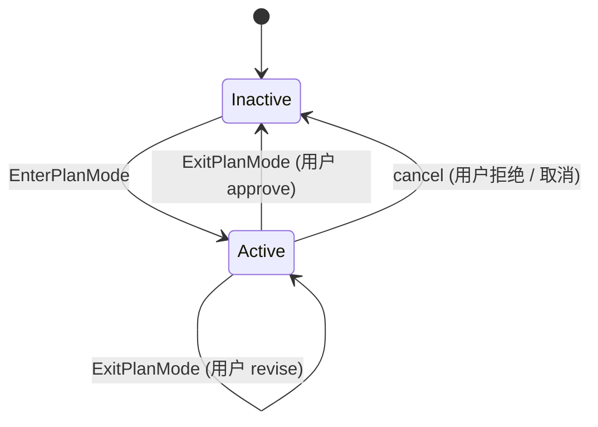
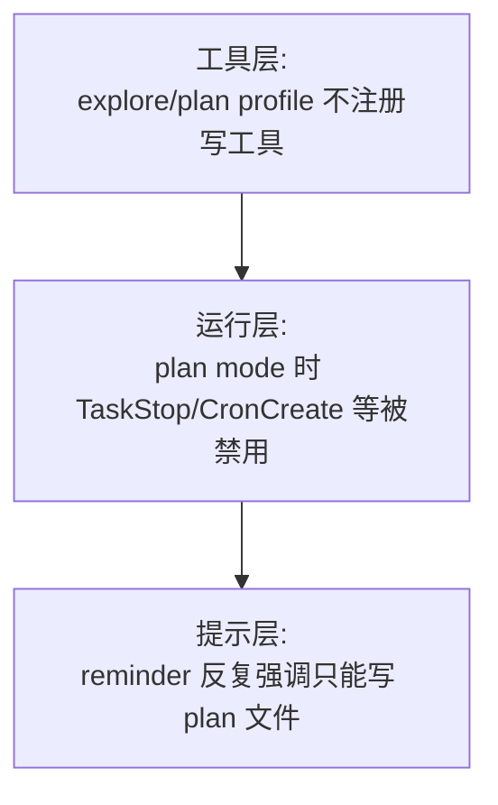

# Kimi Code · Plan Mode 与权限沙箱拆解

**源码位置**:`packages/agent-core-v2/src/agent/plan/`
**核心文件**:`planService.ts`(166 行)、`planModeInjection.ts`(113 行)、`tools/exit-plan-mode.ts`(237 行)
**工具**:`EnterPlanMode`、`ExitPlanMode`
**Scope 绑定**:Agent scope(每个 agent 独立的 plan mode 状态)

## 1. 这个模块要解决什么问题

**场景**:用户给 agent 一个**复杂的实现任务**,例如"把认证模块从 JWT 迁移到 OAuth"。直接让 agent 开干风险很大:
- 可能选错方案(agent 不知道用户偏好)
- 可能改错文件(理解不到位)
- 可能用户其实只想先看方案,不想立刻执行

**Plan mode 的解决方案**:把"**规划**"和"**执行**"分成两个阶段。进入 plan mode 后:
- agent **只能读**(代码、文件、grep、web),不能写
- 唯一能写的是**专门的 plan 文件**
- 规划完成后,调用 `ExitPlanMode` 把方案展示给用户审批
- 用户 approve 后才退出 plan mode,恢复完整工具

**为什么这是"权限沙箱"?**Plan mode 通过**限制工具可用性 + 注入强约束 reminder**双重机制,保证规划阶段的 agent 不会误操作系统。这是一个"安全暂停"状态。

## 2. 状态机:简单的三态

对比 goal mode 的四状态机,plan mode 简单得多 —— 本质上只有 active / inactive:



**关键区别**:ExitPlanMode 不是自动生效,而是**请求用户审批**。用户可以:
- **Approve** → 退出 plan mode,开始执行
- **Reject** → 保持 plan mode,等用户反馈
- **Revise** → 保持 plan mode,用户提供修改意见
- 如果 plan 含多方案,**选其中一个** → 退出并执行该方案

## 3. 进入 Plan Mode:EnterPlanMode

### 3.1 触发方式

三种方式可以进入 plan mode:

| 方式 | 触发者 | 自动性 |
|---|---|---|
| LLM 主动调用 `EnterPlanMode` 工具 | 模型 | 主动判断"这个任务需要规划" |
| 用户用 `/plan` slash command | 用户 | 显式要求 |
| `agent_config.plan_mode = true`(API 配置) | 外部程序 | 程序化控制 |

### 3.2 EnterPlanMode 的入口逻辑

```typescript
// planService.ts:82-102
async enter(id = this.createPlanId(), createFile = false): Promise<void> {
  if (this.isActive) {
    throw new Error('Already in plan mode');
  }

  const planFilePath = this.planFilePathFor(id);
  let enterRecorded = false;
  try {
    await this.ensurePlanDirectory(planFilePath);              // ① 先建目录
    this.wire.dispatch(planModeEnter({ id }));                  // ② 派发 Op(状态变更)
    this.telemetryContext.set({ mode: 'plan' });                // ③ 标记 telemetry 模式
    enterRecorded = true;
    if (createFile) {
      await this.writeEmptyPlanFile(planFilePath);              // ④ 可选:建空 plan 文件
    }
  } catch (error) {
    if (enterRecorded) {
      this.cancel(id);                                          // ⑤ 失败回滚
    }
    throw error;
  }
}
```

**两个细节**:
- **先建目录再派发 Op**:避免状态变了但文件路径不可用
- **失败回滚**:如果 `enterRecorded=true` 后出错,主动 cancel,不让状态半死不活

### 3.3 plan 文件的命名

```typescript
// planService.ts:76-78
private createPlanId(): string {
  return generateHeroSlug(randomUUID(), new Set());
}
```

`generateHeroSlug` 把 UUID 转成可读的"英雄名"(类似 docker container name),例如 `frost-wing-42a1`。这让 plan 文件名既唯一又对人类友好:

```
<sessionDir>/agents/<agentId>/plans/frost-wing-42a1.md
```

## 4. Plan Mode 的注入:动态 reminder

Plan mode 最核心的机制不是工具限制,而是**每轮注入 reminder**告诉模型"你在 plan mode,只能规划"。

### 4.1 四种 reminder

| reminder | 触发时机 | 内容 |
|---|---|---|
| `plan-mode-full-reminder.md` | 第一次进入 / 每 5 轮 / 用户发言后 | 完整工作流 + 严格约束 |
| `plan-mode-sparse-reminder.md` | 2-4 轮后(无新 user message) | 简短约束(节省 token) |
| `plan-mode-reentry-reminder.md` | 进入时已有旧 plan 文件 | "读旧 plan → 决定替换/更新" |
| `plan-mode-exit-reminder.md` | 退出 plan mode 的第一轮 | "plan mode 已结束,可以执行了" |

### 4.2 Full reminder 的内容(关键约束)

```markdown
Plan mode is active. You MUST NOT make any edits (with the exception of the current plan file)
or otherwise make changes to the system unless a tool request is explicitly approved.
Prefer read-only tools. Use Bash only when needed; Bash follows the normal permission mode
and rules. This supersedes any other instructions you have received.

TaskStop, CronCreate, and CronDelete are also blocked in plan mode — call ExitPlanMode first.

Workflow:
  1. Understand — explore the codebase with Glob, Grep, Read.
  2. Design — converge on the best approach.
  3. Review — re-read key files to verify understanding.
  4. Write Plan — modify the plan file with Write or Edit.
  5. Exit — call ExitPlanMode for user approval.

Your turn must end with either AskUserQuestion (to clarify) or ExitPlanMode (to request approval).
```

**三个关键设计**:

1. **"This supersedes any other instructions"**:显式声明 plan mode 约束**高于一切**,防止 prompt injection 绕过。
2. **明确列出被禁工具**:`TaskStop`、`CronCreate`、`CronDelete` 也被禁(不仅仅是写文件)。
3. **强制 turn 结尾**:"turn 必须以 AskUserQuestion 或 ExitPlanMode 结尾"。这避免模型在 plan mode 里无限探索。

### 4.3 注入逻辑:variant 选择

```typescript
// planModeInjection.ts:67-86
function planModeReminderVariant(
  injectedAt: number | null,
  history: readonly ContextMessage[],
): PlanModeReminderVariant | null {
  if (injectedAt === null) return 'full';               // ① 从未注入 → full
  let assistantTurnsSince = 0;
  for (let i = injectedAt + 1; i < history.length; i++) {
    const message = history[i];
    if (message === undefined) continue;
    if (message.role === 'assistant') {
      assistantTurnsSince += 1;
      continue;
    }
    if (message.role === 'user') {
      return 'full';                                     // ② 用户新发言 → full(可能方向变了)
    }
  }
  if (assistantTurnsSince >= 5) return 'full';           // ③ 每 5 轮强制 full refresh
  if (assistantTurnsSince >= 2) return 'sparse';         // ④ 2-4 轮后 → sparse(省 token)
  return null;                                           // ⑤ 刚注入过(< 2 轮)→ 不注入
}
```

**token 节省策略**:
- 刚注入过(< 2 轮)→ 跳过
- 2-4 轮 → sparse(简短版)
- 5+ 轮或用户发言 → full(完整版,防止遗忘)

这是个非常**务实**的设计。如果每轮都注入 full reminder,长规划会浪费大量 token。

### 4.4 Reentry reminder:plan 文件已存在

如果进入 plan mode 时发现已有旧 plan 文件,会注入 reentry variant:

```markdown
## Re-entering Plan Mode
A plan file from a previous planning session already exists.
Before proceeding:
  1. Read the existing plan file to understand what was previously planned.
  2. Evaluate the user's current request against that plan.
  3. If different task: replace the old plan with a fresh one. If same task: update.
  4. You may use Write or Edit to modify the plan file.
```

这让"中断后继续规划"变成自然行为,不用特殊代码处理。

## 5. 退出 Plan Mode:ExitPlanMode

### 5.1 调用约束

ExitPlanMode **不接受 plan 内容作为参数**。它读取已经写好的 plan 文件:

```typescript
// exit-plan-mode.ts:127-137(简化)
private async execution(args: ExitPlanModeInput): Promise<ExecutableToolResult> {
  const status = await this.planMode.status();
  if (status === null) {
    return {
      isError: true,
      output: 'ExitPlanMode can only be called while plan mode is active. Use EnterPlanMode first.',
    };
  }

  const resolvedPlan = await this.resolvePlan();
  if (!resolvedPlan.ok) return resolvedPlan.error;
  // ...
}
```

**为什么?**让 plan 内容通过文件而非工具参数传递,好处:
- Plan 文件本身就是持久化产物(approve 后用户可以查看、修改、版本控制)
- 工具参数有长度限制(有些 provider 限制 32KB),plan 文件没限制
- 用户可以独立编辑 plan 文件后再 approve

### 5.2 多方案审批

ExitPlanMode 可以传 `options` 参数(最多 3 个方案):

```typescript
// exit-plan-mode.ts:45-78
export const ExitPlanModeInputSchema: z.ZodType<ExitPlanModeInput> = z.object({
  options: z.array(ExitPlanModeOptionSchema)
    .min(1).max(3)
    .refine(hasUniqueOptionLabels, 'Option labels must be unique.')
    .refine(hasNoReservedOptionLabels, 'Option labels must not use reserved approval labels.')
    .optional()
}).strict();
```

**两个有趣的约束**:
- **label 唯一**:防止两个方案同名
- **禁止保留字**:`Approve`、`Reject`、`Revise`、`Reject and Exit` 不能用作方案名 —— 这些是 UI 的审批按钮名,冲突会让用户分不清

```typescript
const RESERVED_OPTION_LABELS = new Set(
  ['Approve', 'Reject', 'Reject and Exit', 'Revise'].map(normalizeOptionLabel),
);
```

### 5.3 自动批准模式(auto mode)

如果 permission mode 是 `auto`,ExitPlanMode 不会等用户审批,直接通过:

```typescript
// exit-plan-mode.ts:146-156
if (this.permissionMode.mode === 'auto') {
  this.telemetry.track2('plan_resolved', { outcome: 'auto_approved' });
  return {
    isError: false,
    output: `Exited plan mode. ${formatAutoApprovedPlanForOutput(resolvedPlan.plan, resolvedPlan.path)}`,
  };
}
```

**但**输出会显式提示"未经过用户审批":

```typescript
// exit-plan-mode.ts:225-228
function formatAutoApprovedPlanForOutput(plan: string, path: string | undefined): string {
  return `Plan mode deactivated. All tools are now available.
Note: this plan was auto-approved without user review — the user has NOT explicitly approved it.
Follow the user's original instructions on whether to proceed with execution; if they asked you
to stop, wait, or only summarize after planning, do not start executing.`;
}
```

**这是非常谨慎的设计**。即使 auto 模式跳过了审批,也要让模型明白"用户没真的同意",避免它立刻执行可能危险的操作。

## 6. Plan 文件:不只是状态,是产物

Plan 文件不是临时文件,是 plan mode 的**核心产物**:

### 6.1 路径约定

```
<sessionDir>/agents/<agentId>/plans/<plan-id>.md
```

例如:`~/.kimi-code/sessions/sess-abc/agents/main/plans/frost-wing-42a1.md`

### 6.2 文件的生命周期

| 时机 | 文件状态 |
|---|---|
| `enter(id, createFile=true)` | 创建空文件 |
| `enter(id, createFile=false)` | 不创建(等到第一次 Write) |
| 规划中 | 模型用 Write/Edit 修改 |
| `status()` 读取 | 检查是否存在 + 读内容 |
| `clear()` | 把内容清空(保留空文件) |
| 退出 plan mode | 文件保留(approve 后用户可查看) |

### 6.3 plan 文件路径会注入到 reminder

所有 reminder 结尾都附 plan 文件路径:

```typescript
// planModeInjection.ts:88-92
function withPlanFileFooter(body: string, planFilePath: PlanFilePath): string {
  if (planFilePath === null || planFilePath.length === 0) return body;
  return `${body}\n\nPlan file: ${planFilePath}`;
}
```

这让模型随时知道"plan 应该写到哪",不需要猜。

## 7. 权限沙箱:三层防护

Plan mode 不是只靠"提示词约束",它有三层防护:



| 层 | 机制 | 强制程度 |
|---|---|---|
| 工具层 | profile 注册时决定哪些工具可用 | 🔒 硬性(模型调不到) |
| 运行层 | plan mode 时某些工具返回错误 | 🔒 硬性(调用会失败) |
| 提示层 | reminder 告诉模型"你只能规划" | ⚠️ 软性(可被 prompt injection 绕过,但工具层兜底) |

### 7.1 Bash 工具的特殊性

> Use Bash only when needed; Bash follows the normal permission mode and rules.

Bash **不被禁**(因为 read-only 的 bash 命令如 `git log`、`ls`、`find` 很有用),但它走**正常的权限规则**。如果用户配置了"所有 bash 命令都要审批",在 plan mode 里依然要审批。

这是一个**务实**的妥协:完全禁 bash 会让 explore 阶段很难用(模型连 `ls` 都不能跑)。

## 8. 边界条件与失败模式

| 触发条件 | 行为 | 源码位置 |
|---|---|---|
| EnterPlanMode 时已在 plan mode | 拒绝(`Already in plan mode`) | `planService.ts:84` |
| EnterPlanMode 失败(磁盘满等) | 回滚(cancel) | `planService.ts:96-99` |
| ExitPlanMode 时不在 plan mode | 拒绝(`can only be called while plan mode is active`) | `exit-plan-mode.ts:128` |
| ExitPlanMode 但 plan 文件空 | 拒绝(`No plan file found. Write your plan to ...`) | `exit-plan-mode.ts:195` |
| Plan 文件读失败(权限等) | 错误返回,不退出 plan mode | `resolvePlan()` |
| 用户 Reject | 保持 plan mode,等反馈 | UI 层 |
| 用户 Revise | 保持 plan mode,带反馈继续 | UI 层 |
| options 有重复 label | 拒绝(zod refine) | `hasUniqueOptionLabels` |
| options 用了保留字 | 拒绝 | `hasNoReservedOptionLabels` |
| options 只传了 1 个 | 接受(等同普通审批) | `exit-plan-mode.ts:120` |
| Permission mode = auto | 自动 approve,但提示"未经用户审批" | `exit-plan-mode.ts:146-156` |
| Session 恢复时 plan mode 还激活 | 通过 `wire.hooks.onDidRestore` 恢复 telemetry mode | `planService.ts:51-56` |
| Plan mode 退出后第一轮 | 注入 exit-reminder(告诉模型可以执行了) | `planModeInjection.ts:46-48` |

## 9. 设计权衡

### 9.1 为什么 plan 内容用文件而不是工具参数?

见 § 5.1。核心:文件可独立编辑、无大小限制、是天然产物。

### 9.2 为什么 reminder 要有 full / sparse / reentry 三种?

**token 经济**。Plan mode 的规划阶段可能持续 20+ 轮。如果每轮都注入 full reminder(几百 token),累积浪费严重。变体策略:
- 刚注入或用户发言后(关键节点)→ full(防止偏离)
- 中间稳定推进 → sparse(只提醒核心约束)
- 5 轮后强制 full(防止"遗忘效应")

实测能省 60-70% 的 reminder token。

### 9.3 为什么 ExitPlanMode 在 auto 模式下还要提示"未审批"?

> if they asked you to stop, wait, or only summarize after planning, do not start executing.

Auto 模式不等于"用户授权执行"。用户可能只是想看方案,不想立刻做。显式提示让模型**谨慎执行**,而不是"plan 过了就立刻开干"。

### 9.4 遗憾与可改进点

- **Plan mode 状态是 agent 级的,不是 turn 级的**:如果 agent 在 plan mode 跑了 10 轮,中间某轮想临时跑个 shell 命令查东西,必须先 ExitPlanMode,跑完再 EnterPlanMode。没有"临时解锁"机制。
- **多 agent 场景不清晰**:swarm 的 128 个子 agent 各自有独立的 plan mode 状态。如果主 agent 在 plan mode,子 agent 不一定也在。这可能让 UI 展示很混乱。
- **plan 文件没有版本控制**:每次改 plan 文件都是覆盖。如果用户想对比"v1 和 v2 方案",做不到。
- **auto mode 的"提示未审批"只是文字提示**:没有运行时机制阻止模型立刻执行。如果 prompt injection 让模型忽略这个提示,它依然会执行。
- **ExitPlanMode 的 options 最多 3 个**:复杂场景可能需要更多方案。不过实践中 3 个够用了。

## 10. 一句话总结

> Plan mode 是"**规划**"和"**执行**"两阶段的隔离机制。状态机极简(active/inactive),但通过**四种动态 reminder(full/sparse/reentry/exit)+ 工具层硬限制 + 文件级 plan 产物**三层防护,保证规划阶段的 agent 只能读和写 plan 文件。ExitPlanMode 不传 plan 内容,而是读取已写好的文件;支持最多 3 个方案让用户选择。auto 模式下会自动批准,但显式提示"未经过用户审批",防止模型擅自动手。

## 11. 本篇用到的核心源码索引

| 概念 | 文件 | 关键行 |
|---|---|---|
| `IAgentPlanService` | `src/agent/plan/plan.ts` | — |
| `PlanModel` wire 模型 | `src/agent/plan/planOps.ts` | — |
| `AgentPlanService` | `src/agent/plan/planService.ts` | 全文 166 行 |
| `enter` 方法 | `src/agent/plan/planService.ts` | 82-102 |
| `exit` / `cancel` / `clear` | `src/agent/plan/planService.ts` | 103-117 |
| `status` 读取 plan | `src/agent/plan/planService.ts` | 119-134 |
| `planFilePathFor` | `src/agent/plan/planService.ts` | 136-139 |
| `EnterPlanModeTool` | `src/agent/plan/tools/enter-plan-mode.ts` | — |
| `ExitPlanModeTool` | `src/agent/plan/tools/exit-plan-mode.ts` | 全文 237 行 |
| `ExitPlanModeInputSchema` | `src/agent/plan/tools/exit-plan-mode.ts` | 43-78 |
| `PlanModeInjection` | `src/agent/plan/injection/planModeInjection.ts` | 全文 113 行 |
| `planModeReminderVariant` | `src/agent/plan/injection/planModeInjection.ts` | 67-86 |
| 四种 reminder | `src/agent/plan/injection/*.md` | — |

## 参考资料

- [01-architecture.md](01-architecture.md) —— wire 协议基础(plan mode 状态通过 Op 持久化)
- [03-goal-mode.md](03-goal-mode.md) —— 对比:goal mode 的状态机更复杂
- [04-subagent.md](04-subagent.md) —— Plan profile 是三种内置 profile 之一
- 后续拆解:
  - 06-tool-system.md —— 工具权限规则是怎么实现的
  - 08-context-memory.md —— ContextInjector 的注入机制
