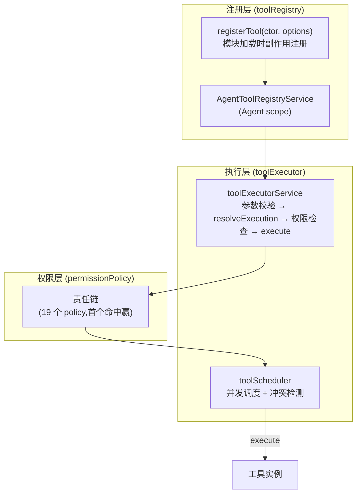
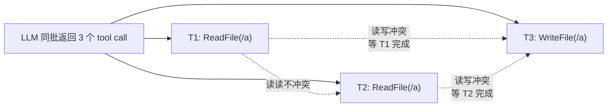
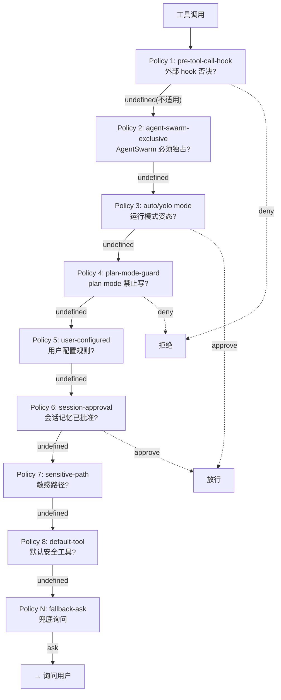

# Kimi Code · 工具系统与权限责任链拆解

**源码位置**:`packages/agent-core-v2/src/tool/` + `packages/agent-core-v2/src/agent/toolRegistry/` + `packages/agent-core-v2/src/agent/toolExecutor/` + `packages/agent-core-v2/src/agent/permissionPolicy/`
**核心文件**:`toolContract.ts`(235 行,工具协议)、`toolExecutorService.ts`(901 行,执行器)、`Permission.md`(设计文档,必读)
**Scope 绑定**:Agent scope(每个 agent 有独立的工具注册表)

## 1. 这个模块要解决什么问题

**场景**:Agent 要做各种事 —— 读文件、写文件、跑 shell、调 MCP、启动子 agent。每种工具:
- 有不同的**权限要求**(写文件要审批,读文件不用)
- 访问不同的**资源**(文件路径、子进程、网络)
- 可能**互相冲突**(两个工具同时写同一个文件)
- 来源不同(内置、用户注册、MCP、插件)

**工具系统要回答的问题**:
1. **注册**:工具从哪来?怎么注册到 agent?
2. **执行**:LLM 调用工具时,从参数校验到结果返回走什么流程?
3. **权限**:每次调用,在当前 agent/mode 下,应该放行 / 拒绝 / 询问用户?
4. **并发**:多个工具调用能并行吗?哪些会冲突?
5. **资源声明**:工具怎么告诉系统"我要访问什么"?

这是一个比"函数调用"复杂得多的系统。

## 2. 核心设计:三层分离



三层职责:
- **注册层**:工具从哪来,怎么实例化
- **执行层**:一次工具调用的完整生命周期
- **权限层**:决策放行/拒绝/询问

## 3. 工具契约:ExecutableTool

所有工具都必须实现这个接口(`toolContract.ts:91-92`):

```typescript
export interface ExecutableTool<Input = unknown> extends Tool {
  resolveExecution(input: Input): ToolExecution | Promise<ToolExecution>;
}
```

只有**一个方法**:`resolveExecution(input)`,输入是 LLM 给的参数,输出是 `ToolExecution`(执行计划)。

### 3.1 为什么是 `resolveExecution` 而不是直接 `execute`?

这是整个工具系统**最精妙**的设计。`resolveExecution` 不是执行,而是**声明执行计划**:

```typescript
// toolContract.ts:78-88
export interface RunnableToolExecution {
  readonly isError?: false | undefined;
  readonly accesses?: ToolAccesses | undefined;          // ① 访问什么资源
  readonly display?: ToolInputDisplay | undefined;       // ② UI 展示
  readonly description?: string;
  readonly stopBatchAfterThis?: boolean | undefined;     // ③ 批次控制
  readonly approvalRule: string;                          // ④ 权限规则 key
  readonly matchesRule?: ((ruleArgs: string) => boolean); // ⑤ 自定义规则匹配
  readonly execute: (ctx: ExecutableToolContext) => Promise<ExecutableToolResult>;  // ⑥ 实际执行
}
```

**六个字段的语义**:

| 字段 | 用途 | 例子 |
|---|---|---|
| `accesses` | 声明访问的资源(用于冲突检测) | `ToolAccesses.writeFile('/foo/bar')` |
| `display` | 给 UI 的展示信息 | `{ kind: 'plan_review', plan: '...' }` |
| `stopBatchAfterThis` | 强制后续工具串行 | AgentSwarm 工具会设为 true |
| `approvalRule` | 权限审批用的规则 key | `'Bash(rm -rf *)'` |
| `matchesRule` | 自定义规则匹配函数 | 检查命令是否匹配某个模式 |
| `execute` | 真正的执行函数 | 只有审批通过才会被调用 |

### 3.2 两阶段的好处

**阶段 1:resolveExecution**(同步/快)
- 解析参数
- 声明要访问什么资源
- 可以**直接返回错误**(`isError: true`)而不执行

**阶段 2:execute**(异步/慢)
- 只有权限通过才执行
- 拿到 `ExecutableToolContext`(包含 signal、turnId、trace)

这让权限系统可以在**执行前**看到工具要做什么,决定是否放行。

### 3.3 CronCreate 的例子(展示完整流程)

`packages/agent-core/src/tools/cron/cron-create.ts:125-313` 是个非常好的范例:

```typescript
resolveExecution(args: CronCreateInput): ToolExecution {
  // ① 全局 killswitch
  if (process.env['KIMI_DISABLE_CRON'] === '1') {
    return { isError: true, output: 'Cron scheduling is disabled.' };
  }

  // ② 参数规范化
  const normalizedCron = args.cron.trim().split(/\s+/).join(' ');

  // ③ 解析 cron 表达式
  let parsed: ParsedCronExpression;
  try {
    parsed = parseCronExpression(normalizedCron);
  } catch (err) {
    return { isError: true, output: `Invalid cron expression: ${err.message}` };
  }

  // ④ "5 年内不会触发" 检查
  if (!hasFireWithinYears(parsed, 5, nowAtPrepare)) {
    return { isError: true, output: '...has no fire within 5 years; refusing.' };
  }

  // ⑤ Session 级别上限
  if (this.manager.store.list().length >= MAX_CRON_JOBS_PER_SESSION) {
    return { isError: true, output: `Cron job cap reached (max ${MAX_CRON_JOBS_PER_SESSION}).` };
  }

  // ⑥ 字节长度上限
  if (Buffer.byteLength(args.prompt, 'utf8') > MAX_PROMPT_BYTES) {
    return { isError: true, output: `Prompt exceeds ${MAX_PROMPT_BYTES} bytes.` };
  }

  return {
    description: `Scheduling cron ${normalizedCron}`,
    approvalRule: literalRulePattern(this.name, JSON.stringify({...})),  // 带完整 payload
    execute: async () => {
      // 实际执行:re-check 上限 → addTask → 计算下次触发 → 发 telemetry
      // ...
    },
  };
}
```

**注意 `approvalRule` 包含完整 payload**:

```typescript
approvalRule: literalRulePattern(
  this.name,
  JSON.stringify({ cron: normalizedCron, prompt: args.prompt, recurring }),
)
```

这意味着"approve for session"只对**完全相同的 cron+prompt+recurring** 生效。如果模型改了任何一个字段,必须重新审批。防止"批准了一个无害的 cron,模型偷偷改成恶意 prompt"。

## 4. 资源访问声明:ToolAccesses

工具通过 `accesses` 字段声明它要访问的资源,系统据此做**冲突检测**。

### 4.1 资源类型

```typescript
// toolContract.ts:119-176
export type ToolFileAccessOperation = 'read' | 'write' | 'readwrite' | 'search';

export interface ToolFileAccess {
  readonly kind: 'file';
  readonly operation: ToolFileAccessOperation;
  readonly path: string;
  readonly recursive?: boolean;
}

export interface ToolResourceAccessAll {
  readonly kind: 'all';    // 万能匹配,和任何其他 access 冲突
}
```

辅助构造器(避免手写对象字面量):

```typescript
ToolAccesses.none()                          // []
ToolAccesses.all()                           // [{kind: 'all'}]  万能冲突
ToolAccesses.readFile('/foo')                // 读单文件
ToolAccesses.readTree('/foo')                // 递归读
ToolAccesses.writeFile('/foo')               // 写单文件
ToolAccesses.writeTree('/foo')               // 递归写
ToolAccesses.readWriteFile('/foo')           // 读写
ToolAccesses.searchTree('/foo')              // 搜索
```

### 4.2 冲突检测规则

```typescript
// toolContract.ts:178-189
function resourceAccessesConflict(left: ToolResourceAccess, right: ToolResourceAccess): boolean {
  if (left.kind === 'all' || right.kind === 'all') return true;          // ① all 与任何冲突
  if (!fileOperationsConflict(left.operation, right.operation)) return false;  // ② 操作不冲突
  return fileAccessesOverlap(left, right);                                 // ③ 路径重叠
}

function fileOperationsConflict(left, right): boolean {
  return fileOperationWrites(left) || fileOperationWrites(right);         // 任一方写 → 冲突
}
```

**三条规则**:
1. `kind: 'all'` 与任何其他 access 冲突(bash 命令、网络请求等无法静态分析)
2. 两个读操作**不冲突**(可以并行读)
3. 任一方是写,且路径重叠 → 冲突(防止 race condition)

### 4.3 用途:并发调度

`toolScheduler` 用这个信息决定哪些工具调用可以并行:



这让 kimi-code 能安全地并行执行 LLM 一次返回的多个工具调用,而不是傻傻串行。

## 5. 工具注册:import = register

工具注册采用和 DI 一样的"import 副作用"模式。

### 5.1 registerTool

```typescript
// toolRegistry/toolContribution.ts:43-54
const _toolContributions: ToolContribution[] = [];

export function registerTool<T extends AnyExecutableTool>(
  ctor: ToolCtor<T>,
  options: ToolContributionOptions = {},
): void {
  _toolContributions.push({ ctor: ctor as ToolCtor, options });
}
```

工具类在自己的文件末尾调用 `registerTool(MyTool)`,这个文件被 import 时就注册了。

### 5.2 AgentToolRegistryService

每个 Agent 有自己的 tool registry。构造时遍历所有 contribution,用 `when` 过滤后实例化:

```typescript
// 简化逻辑
for (const contribution of getToolContributions()) {
  if (contribution.options.when && !contribution.options.when(accessor)) continue;
  const tool = instantiation.createInstance(contribution.ctor, ...staticArgs);
  registry.set(tool.name, tool);
}
```

**`when` 谓词**让工具可以按条件注册:
- `when: (a) => a.get(IAgentScopeContext).agentId === 'main'` → 只在 main agent 注册
- `when: (a) => a.get(IAgentPlanService).isActive === false` → 不在 plan mode 时注册

### 5.3 动态注册:运行时加工具

除了 import 时静态注册,还支持运行时动态注册(通过 `IAgentRPCService.registerTool`),用于:
- 用户通过 API 注册自定义工具
- 插件运行时贡献工具

## 6. 权限责任链:可组合的微内核

这是整个工具系统**最有设计感**的部分。来自官方 `Permission.md`:

> **权限系统应是一个「可组合、可注册的责任链(微内核)」**:内核只负责按顺序跑链、首个命中赢;具体权限维度由各自的 Domain Service 通过注册表插入。

### 6.1 责任链模式



### 6.2 首个命中赢

```typescript
// 简化逻辑(来自 v1, v2 同样模式)
for (const policy of this.policies) {
  const result = await policy.evaluate(context);
  if (result !== undefined) return { policyName: policy.name, result };
}
```

- 每个 policy 返回 `undefined` 表示"我不适用,问下一个"
- 第一个返回非 `undefined` 的 policy **胜出**,后面的不再跑
- 链的顺序就是**优先级**

### 6.3 为什么不是 Casbin?

官方 `Permission.md` 说得很清楚:

> **不引入 Casbin** —— 因为这里「难的是决策行为」(续体、副作用、RPC、状态机),不是「匹配 + 标量决策」。

Casbin 擅长 `(sub, obj, act) → allow/deny` 的矩阵决策。但 kimi-code 的权限决策是**行为包**:

```typescript
// permissionPolicy/types.ts:39
type PermissionPolicyResult =
  | { kind: 'approve'; reason?; executionMetadata? }
  | { kind: 'deny';    reason?; message? }
  | { kind: 'ask';     reason?; resolveApproval?; resolveError? };
```

- `approve` 可以带执行元数据(例如"批准但记录 telemetry")
- `deny` 可以带用户可见消息
- `ask` 可以带**续体**(`resolveApproval`):用户点 approve 后要做什么、点 deny 后要做什么。这可能涉及 RPC、状态写入、hook 调用。

这种"决策携带行为"的模式,Casbin 表达不了。

### 6.4 11 个权限维度,19 个 policy

完整的责任链(从高到低):

| # | 维度 | policy | 决策看什么 |
|---|---|---|---|
| 1 | 外部钩子否决 | `pre-tool-call-hook` | 用户 `PreToolUse` hook 是否返回 block |
| 2 | 工具批量排他 | `agent-swarm-exclusive-deny` | AgentSwarm 必须是同批唯一工具 |
| 3 | 运行模式 | `auto-mode-approve` / `yolo-mode-approve` | `permission.mode` |
| 4 | Plan 模式约束 | `plan-mode-guard-deny` / `plan-mode-tool-approve` | plan mode + 文件路径 |
| 5 | Goal 启动审批 | `goal-start-review-ask` | CreateGoal 且非 auto |
| 6 | 静态配置规则 | `user-configured-deny/ask/allow` | 用户/项目/turn 配置 |
| 7 | 会话批准记忆 | `session-approval-history` | 本会话 "approve for session" |
| 8 | 敏感路径 | `sensitive-file-access-ask` / `git-control-path-access-ask` | 文件路径(.env、.ssh、.git) |
| 9 | 工具内在风险 | `default-tool-approve` | 工具名 ∈ 默认安全集合(Read/Grep/Glob) |
| 10 | 工作区写信任 | `git-cwd-write-approve` | cwd + git worktree 内写 |
| 11 | 兜底 | `fallback-ask` | 都不适用 → 询问 |

链的顺序是一条**从高到低的安全级联**:外部强制 → 结构性拒绝 → 状态机拒绝 → 静态 deny → mode 放行 → 会话记忆放行 → 静态 ask → 静态 allow → 流程放行 → 敏感路径 ask → 兜底 ask。

### 6.5 Plan mode policy 的实际代码

以 `plan-mode-guard-deny` 为例,展示 policy 怎么写:

```typescript
// permissionPolicy/policies/plan-mode-guard-deny.ts
export class PlanModeGuardDenyPermissionPolicyService implements PermissionPolicy {
  readonly name = 'plan-mode-guard-deny';

  constructor(@IAgentPlanService private readonly plan: AgentPlanService) {}

  async evaluate(context: ResolvedToolExecutionHookContext): Promise<PermissionPolicyResult | undefined> {
    const plan = await this.plan.status();
    if (plan === null) return undefined;                                    // ① 不在 plan mode → 不适用

    const toolName = context.toolCall.name;

    if (toolName === 'Write' || toolName === 'Edit') {
      const planFilePath = plan.path;
      if (planFilePath !== null && writesOnlyPlanFile(context, planFilePath)) {
        return undefined;                                                   // ② 只写 plan 文件 → 放行(问下一个)
      }
      return { kind: 'deny', message: planModeWriteDeniedMessage(planFilePath) };  // ③ 其他写 → 拒绝
    }

    if (toolName === 'TaskStop' || toolName === 'CronCreate' || toolName === 'CronDelete') {
      return { kind: 'deny', message: `${toolName} is not available in plan mode.` };
    }

    return undefined;                                                       // ④ 其他工具 → 不适用
  }
}
```

**关键设计**:policy 只关心自己负责的维度,不适用就 return undefined,让下一个 policy 决定。这让 policy 可以独立增删,不影响其他维度。

## 7. Permission Mode:四种姿态

全局 `permission.mode` 决定默认姿态:

| Mode | 行为 | 适用场景 |
|---|---|---|
| **`manual`** (默认) | 大部分操作 ask 用户 | 谨慎模式,新手用户 |
| **`yolo`** | 自动 approve 几乎一切 | 信任 agent,快速迭代 |
| **`auto`** | 自动 approve,但有安全护栏 | 生产自动化 |
| **`plan`** | (不是独立 mode,plan mode 是叠加的) | 规划阶段 |

```typescript
// permissionPolicy/policies/auto-mode-approve.ts(简化)
if (mode === 'auto') {
  // auto 模式下,只有"绝对安全"的工具自动 approve
  if (isAlwaysSafeTool(toolName)) return { kind: 'approve', reason: 'auto-mode-safe' };
  // 其他工具依然走后续 policy(可能被 sensitive-path 拦截)
  return undefined;
}
```

**注意**:即使 yolo/auto 模式,某些 policy(如 `pre-tool-call-hook`、`sensitive-file-access-ask`)**依然生效**。这是"安全护栏",防止用户开 yolo 后被 prompt injection 删了 `.ssh`。

## 8. 边界条件与失败模式

| 触发条件 | 行为 | 源码位置 |
|---|---|---|
| 工具参数不符合 schema | 直接返回 error,不走权限链 | args-validator |
| 工具 `resolveExecution` 抛错 | 返回 error 给 LLM | toolExecutorService |
| 工具 `resolveExecution` 返回 `isError` | 不执行,直接返回 | toolContract.ts |
| 权限链所有 policy 都 return undefined | `fallback-ask` 兜底询问 | fallback-ask.ts |
| 用户拒绝审批 | 工具返回 error,LLM 看到拒绝原因 | approval flow |
| 用户 abort 整个 turn | 所有在飞工具被 cancel(signal) | ExecutableToolContext.signal |
| 工具执行超时 | 由工具自己的 timeout 逻辑处理(不是框架强制) | — |
| 同批两个工具写同一文件 | toolScheduler 串行化 | toolScheduler |
| Plan mode 下调用 Write(非 plan 文件) | 第二个 policy 拒绝 | plan-mode-guard-deny |
| Plan mode 下调用 TaskStop | 拒绝 | plan-mode-guard-deny |
| Auto mode 下调用敏感路径工具 | 被 sensitive-file-access 拦截 | sensitive-file-access-ask |
| Session 批准了 Bash(ls) | 后续完全相同的 Bash(ls) 自动通过 | session-approval-history |
| Session 批准了 Bash(ls),模型改成 Bash(ls -la) | 必须重新审批(payload 不同) | approvalRule 含完整 payload |
| AgentSwarm 不是同批唯一工具调用 | 拒绝 | agent-swarm-exclusive-deny |

## 9. 设计权衡

### 9.1 为什么是 `resolveExecution` + `execute` 两阶段,而不是直接 execute?

核心好处:**让权限系统在执行前看到工具要做什么**。

如果直接 `execute(input)`,权限系统只能在执行中或执行后才知道发生了什么。两阶段让权限决策基于**意图**(工具声明要做什么),而不是**行为**(已经做了什么)。

代价:工具作者要写两份逻辑(resolveExecution 和 execute)。但实践中大多数工具的 resolveExecution 很简单(解析参数 + 返回 execute 闭包)。

### 9.2 为什么责任链而不是 if-else 瀑布?

- **可组合**:policy 可以独立增删,不影响其他维度
- **可测试**:每个 policy 独立单测
- **可扩展**:插件可以贡献自己的 policy(插到链的特定位置)
- **关注点分离**:每个 policy 只管自己的维度

代价:链太长会有性能开销(每次工具调用都跑一遍)。但 19 个 policy 的顺序遍历在现代机器上 < 1ms,可以忽略。

### 9.3 为什么 approvalRule 要带完整 payload?

见 § 3.3 的 CronCreate 例子。核心:**防止"批准一次,永久授权"的攻击面**。

如果 approvalRule 只是工具名(`'Bash'`),那用户批准了 `Bash(ls)`,后续 `Bash(rm -rf /)` 也会自动通过。带 payload 后,只有**完全相同**的调用才复用批准。

### 9.4 为什么不用 Casbin / RBAC?

见 § 6.3。核心:**决策携带行为,不是标量决策**。

### 9.5 遗憾与可改进点

- **责任链的顺序是硬编码的**:`policies/index.ts#createPermissionDecisionPolicies()` 里写死了 19 个 policy 的顺序。增删 policy 要改这个函数。可以改成声明式优先级。
- **没有 policy 的运行时禁用**:不能通过配置"临时禁用某个 policy"(例如调试时)。只能改代码。
- **`accesses` 只支持文件**:网络、子进程、MCP 等资源的冲突检测用 `kind: 'all'` 兜底,粒度太粗。两个 bash 命令即使完全不相关也会被串行化。
- **审批记忆是 session 级的**:不能跨 session 记忆"用户总是批准这个操作"。需要用户每次 session 都重新批准。
- **Plan mode 的工具禁用是 policy 层**:不是工具注册层。这意味着 plan mode 下,工具还是被实例化了,只是调用时被拒绝。浪费了少量内存。

## 10. 一句话总结

> 工具系统是**注册层(import 副作用)+ 执行层(resolveExecution → 权限 → execute 两阶段)+ 权限层(19 policy 责任链,首个命中赢)**的三层组合。`resolveExecution` 让工具在执行前声明意图(accesses + approvalRule),让权限系统基于意图决策;`ToolAccesses` 的冲突检测让 scheduler 能安全并行不冲突的工具调用;责任链让权限维度可组合、可扩展、可独立测试,且每个 policy 只关心自己的维度。`approvalRule` 带完整 payload,防止"批准一次,永久授权"的攻击面。

## 11. 本篇用到的核心源码索引

| 概念 | 文件 | 关键行 |
|---|---|---|
| `ExecutableTool` 接口 | `src/tool/toolContract.ts` | 91-92 |
| `RunnableToolExecution` | `src/tool/toolContract.ts` | 78-88 |
| `ExecutableToolResult` | `src/tool/toolContract.ts` | 38-54 |
| `ToolAccesses` 构造器 | `src/tool/toolContract.ts` | 132-176 |
| `resourceAccessesConflict` | `src/tool/toolContract.ts` | 178-189 |
| `registerTool` | `src/agent/toolRegistry/toolContribution.ts` | 45-50 |
| `AgentToolRegistryService` | `src/agent/toolRegistry/toolRegistryService.ts` | — |
| `toolExecutorService` | `src/agent/toolExecutor/toolExecutorService.ts` | 全文 901 行 |
| `toolScheduler` | `src/agent/toolExecutor/toolScheduler.ts` | — |
| `PermissionPolicy` 接口 | `src/agent/permissionPolicy/types.ts` | — |
| `PermissionPolicyResult` | `src/agent/permissionPolicy/types.ts` | 39 |
| `permissionPolicyService` | `src/agent/permissionPolicy/permissionPolicyService.ts` | — |
| `plan-mode-guard-deny` policy | `src/agent/permissionPolicy/policies/plan-mode-guard-deny.ts` | 全文 |
| CronCreate 范例 | `packages/agent-core/src/tools/cron/cron-create.ts` | 125-313 |
| 权限设计文档 | `packages/agent-core-v2/docs/Permission.md` | 必读 |

## 参考资料

- `packages/agent-core-v2/docs/Permission.md` —— 官方权限系统设计文档,非常详细
- [01-architecture.md](01-architecture.md) —— DI 基础(工具是 Agent scope 服务)
- [04-subagent.md](04-subagent.md) —— Profile 通过工具注册控制子 agent 能力
- [05-plan-mode.md](05-plan-mode.md) —— Plan mode 是 policy 之一
- 后续拆解:
  - 09-loop.md —— Agent loop 怎么调用工具系统
