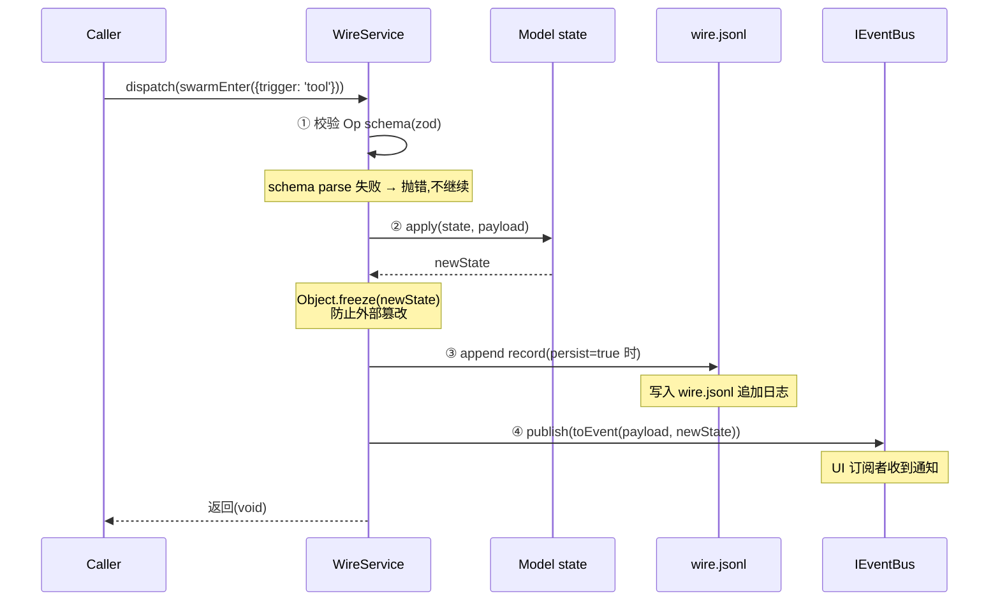
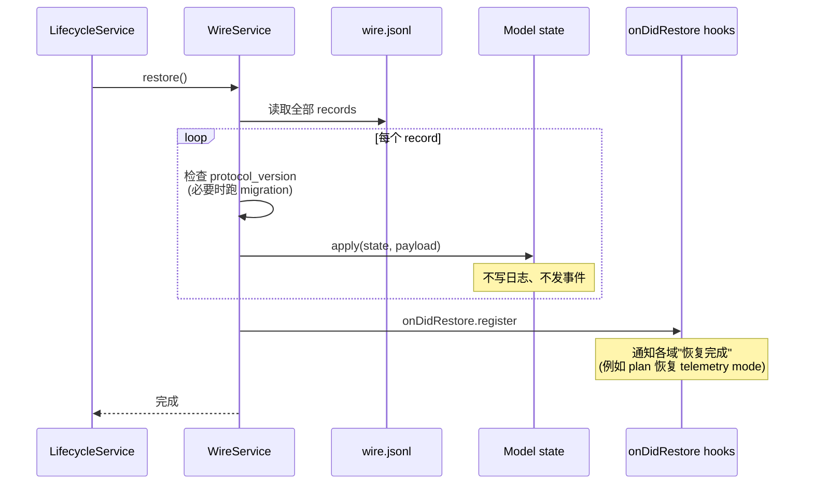

# Kimi Code · Wire 协议与 Op/Model 持久化架构拆解

> 📁 **源码位置** · `packages/agent-core-v2/src/wire/`
>
> 📄 **核心文件** · `model.ts`(107 行)、`op.ts`(126 行)、`wireService.ts`(335 行)、`record.ts`(68 行)
>
> 📚 **设计文档** · `packages/agent-core-v2/docs/rw-model-design.md`(必读,详细的提案稿)
>
> 🔌 **Scope 绑定** · Agent scope(每个 agent 一条独立的 wire log)


> 本篇是整个 kimi-code 架构的**神经中枢**。前面所有拆解(swarm 的 SwarmModel、goal 的 GoalModel、plan 的 PlanModel)都建立在本篇描述的机制之上。

## 1. 这个模块要解决什么问题

**场景**:Agent 运行时有大量状态 —— 当前是否在 swarm mode、goal 是什么状态、plan mode 是否激活、context 用了多少 token。这些状态:
- 需要**持久化**(session 中断后能恢复)
- 需要**可重放**(从日志重建状态)
- 需要**广播给 UI**(TUI/Web/IDE 实时看到变化)
- 需要**跨进程一致**(kap-server 模式下,引擎和 UI 在不同进程)

**传统做法**:
- 把状态存在内存对象里
- 用事件总线通知变化
- 单独写持久化逻辑(序列化到 JSON)
- 单独写恢复逻辑(从 JSON 反序列化)

**问题**:这三份逻辑(内存状态、事件、持久化)很容易**不一致**。状态变了忘了发事件,或者持久化漏了某个字段,都是非常常见的 bug。

**kimi-code 的解决方案**:**事件溯源(Event Sourcing)的简化版 —— Op/Model 架构**。所有状态变更都是 Op,Op 被 apply 到 Model 产生新状态,Op 同时被持久化和广播。

## 2. 核心抽象:Model + Op

借鉴 Redux 的 reducer 模式,但做了重要调整。

### 2.1 Model:某一类状态的声明

```typescript
// model.ts:62-94
export function defineModel<S>(
  name: string,
  initial: () => S,
  opts?: {
    blobs?: ModelBlobCodec<S>;
    reducers?: ModelReducers<S>;
  },
): ModelDef<S> {
  const def: ModelDef<S> = {
    name,
    initial,
    blobs: opts?.blobs,
    defineOp: bindDefineOp(() => def),     // ← 闭包引用,让 Op 能找到自己的 Model
  };
  // ...注册跨 model reducer
  return def;
}
```

一个 Model 就是:
- **`name`**:唯一标识(例如 `'swarm'`、`'goal'`、`'plan'`)
- **`initial`**:初始状态工厂(每次创建新 scope 时调用)
- **`defineOp`**:用来声明改变这个 Model 的 Op(见下文)

### 2.2 Op:一个状态变更操作

```typescript
// op.ts:43-55
export interface OpDescriptor<K extends string, S, P> {
  readonly type: K;                           // 唯一类型名(例如 'swarm_mode.enter')
  readonly model: ModelDef<S>;                 // 作用于哪个 Model
  readonly schema: z.ZodType<P>;               // payload 的 zod schema
  readonly apply: (state: S, payload: P) => S; // ★ 纯函数:旧状态 + payload → 新状态
  readonly toEvent?: (payload: P, state: S) => unknown;  // 可选:转成 IEventBus 事件
  readonly persist?: boolean;                  // 是否持久化(默认 true)
}
```

**`apply` 是纯函数**是整个架构的关键:
- 输入:旧状态 + payload
- 输出:新状态(不修改旧状态)
- 没有 side effect

这让 Op 可以**安全重放** —— 给定初始状态和 Op 序列,一定能重建出当前状态。

### 2.3 实际例子:SwarmModel

```typescript
// swarm/swarmOps.ts:22-39(来自 02-swarm.md)
export const SwarmModel = defineModel<SwarmModeTrigger | null>('swarm', () => null);

export const swarmEnter = SwarmModel.defineOp('swarm_mode.enter', {
  schema: z.object({ trigger: z.custom<SwarmModeTrigger>() }),
  apply: (_s, p) => p.trigger,                    // 忽略旧状态,直接返回 trigger
  toEvent: () => ({ type: 'agent.status.updated', swarmMode: true }),
});

export const swarmExit = SwarmModel.defineOp('swarm_mode.exit', {
  schema: z.object({}),
  apply: () => null,                              // 重置为 null
  toEvent: () => ({ type: 'agent.status.updated', swarmMode: false }),
});
```

**整个 swarm mode 的状态管理就这 18 行代码**。对比传统写法:
- 不用写 `enterSwarmMode()` 方法
- 不用写 `onSwarmModeChanged` 事件
- 不用写 `persistSwarmState()` 序列化
- 不用写 `restoreSwarmState()` 反序列化

一切由 Model + Op 的声明式定义自动获得。

### 2.4 为什么不是 Redux?

| 维度 | Redux | kimi-code Wire |
|---|---|---|
| Model 数量 | 全局一个 store | **每个域一个 Model**(几十个) |
| 持久化 | 需要额外中间件 | 内置(可选 `persist: false`) |
| 事件广播 | 需要 selector + connect | 内置 `toEvent` |
| Scope | 全局 | **每个 Agent scope 一份独立状态** |
| Blob 处理 | 无 | 内置 `dehydrate`/`rehydrate` |

Wire 是**专门为 agent 场景定制的 Redux 变种**。

## 3. WireService:Op 的调度中枢

`WireService` 是 Model/Op 和外界之间的桥梁。每个 Agent scope 有一个 `WireService` 实例。

### 3.1 三个核心 API

```typescript
export interface IWireService {
  dispatch(...ops: Op[]): void;                            // 派发 Op(改变状态)
  getModel<S>(model: ModelDef<S>): DeepReadonly<S>;         // 读取当前状态
  hooks: {                                                  // 生命周期 hook
    onDidRestore: IRegisteredHook;
    // ...
  };
  seal(): Promise<void>;                                    // 锁定(进入只读?)
  restore(): Promise<void>;                                 // 从日志恢复
}
```

### 3.2 dispatch 的完整流程



**四个步骤原子化**:
1. **Schema 校验**:确保 payload 类型正确
2. **Apply**:纯函数计算新状态,并 `Object.freeze` 防篡改
3. **持久化**:追加到 `wire.jsonl`(如果 `persist !== false`)
4. **广播**:调用 `toEvent` 生成事件,发布到 IEventBus

这四步**要么全部成功,要么全部不执行**(实践中如果 disk 写失败,会抛错;但 apply 已经发生的状态变更在下次 restore 时会从 log 重建)。

### 3.3 getModel:深度只读

```typescript
// model.ts:96-105
export type DeepReadonly<T> = T extends (...args: infer A) => infer R
  ? (...args: A) => R
  : T extends ReadonlyMap<infer K, infer V>
    ? ReadonlyMap<DeepReadonly<K>, DeepReadonly<V>>
    : T extends ReadonlySet<infer V>
      ? ReadonlySet<DeepReadonly<V>>
      : T extends readonly (infer E)[]
        ? ReadonlyArray<DeepReadonly<E>>
        : T extends object
          ? { readonly [K in keyof T]: DeepReadonly<T[K]> }
          : T;
```

`getModel` 返回 `DeepReadonly<S>` —— 编译时和运行时双重保证不可变:
- **编译时**:TypeScript 类型映射,所有属性变 readonly
- **运行时**:`Object.freeze` 递归冻结

任何尝试修改 state 的代码都会**编译失败 + 运行时抛错**。这强制所有变更必须走 `dispatch`,不能偷偷改状态。

## 4. 持久化:wire.jsonl 追加日志

### 4.1 文件布局

```
~/.kimi-code/
└── sessions/
    └── <sessionId>/
        └── agents/
            ├── main/
            │   └── wire.jsonl       ← 主 agent 的 wire 日志
            ├── agent-0/
            │   └── wire.jsonl       ← 子 agent 0 的 wire 日志
            └── agent-1/
                └── wire.jsonl       ← 子 agent 1 的 wire 日志
```

**每个 agent 一个独立的 wire.jsonl**。这让:
- 子 agent 的状态独立持久化
- 并发写不冲突(不同 agent 写不同文件)
- 单个 agent 的日志可以单独 fork/resume

### 4.2 文件路径推导

```
wire.jsonl 路径 = sha256(agentHomedir)[0:16] + scope='wire'
```

`agentHomedir` 包含 workspaceId/sessionId/agentId,所以每个 agent 的路径唯一。

### 4.3 记录格式

每行一个 JSON,包含:

```typescript
interface PersistedWireRecord {
  type: string;                  // Op type(例如 'swarm_mode.enter')
  payload: unknown;              // Op payload
  time: number;                  // 时间戳
  metadata?: {                   // 信封(可选)
    protocol_version: string;    // 协议版本(用于 migration)
    // ...
  };
}
```

**追加式**(append-only),永不修改历史记录。这让:
- Fork = 复制日志 + 插入 `forked` 标记
- Undo = 找到对应记录,反向操作(不是删除)
- Audit = 完整历史可追溯

## 5. 恢复(restore):从日志重建状态

这是 Op/Model 架构的最大价值。

### 5.1 restore 流程



**关键差异**:restore 期间 apply 不触发 `toEvent`、不写日志。因为:
- 事件是给 live UI 的,restore 时 UI 还没准备好
- 日志已经持久化了,不需要再写

### 5.2 Migration 链

```typescript
// wire/migration/ 目录
v1.1.ts    // 协议版本 1.0 → 1.1 的迁移
v1.2.ts    // 1.1 → 1.2
v1.3.ts    // 1.2 → 1.3
v1.4.ts    // 1.3 → 1.4
v1.5.ts    // 1.4 → 1.5
```

每条 wire record 带 `protocol_version`。restore 时如果版本旧了,按链顺序跑 migration。这让**老 session 能在新版代码上恢复**,不会因为协议升级而丢失历史。

### 5.3 恢复时的特殊处理

某些域需要在 restore 完成后做特殊动作,通过 `wire.hooks.onDidRestore` 注册:

```typescript
// planService.ts:51-56(来自 05-plan-mode.md)
this._register(
  this.wire.hooks.onDidRestore.register('plan', async (_ctx, next) => {
    this.restoreTelemetryMode();      // 恢复 telemetry 的 mode 标记
    await next();
  }),
);
```

这种链式 hook 让多个域的恢复逻辑可以**有序执行**,不依赖 DI 构造顺序。

## 6. Blob 处理:大对象卸载

如果状态包含大对象(例如图片的 data URI),全部塞进 wire.jsonl 会让日志爆炸。

### 6.1 ModelBlobCodec

```typescript
// model.ts:45-50
export interface ModelBlobCodec<S> {
  dehydrate(record: WireRecord, transform: PartsTransformer): WireRecord | Promise<WireRecord>;
  rehydrate(state: S, transform: PartsTransformer): S | Promise<S>;
}
```

- **`dehydrate`**:dispatch 时调用,把大对象卸载到 blob store,记录里只存引用(`blobref://xxx`)
- **`rehydrate`**:restore 后调用一次,把引用还原成内联数据

### 6.2 只 rehydrate 存活的数据

> Only the *surviving* state is rehydrated, skipping data that was later removed by compaction.

如果一张图被 compaction 删掉了,它的 blob 不会被恢复。这避免了无谓的 IO。

## 7. 跨 Model Reducer:v1 兼容

有些 Op 会影响多个 Model。例如某些 v1 的 record 类型在 v2 里需要同时更新多个 model。

```typescript
// model.ts:84-93
if (opts?.reducers !== undefined) {
  for (const [opType, reducer] of Object.entries(opts.reducers)) {
    if (reducer === undefined) continue;
    let list = MODEL_CROSS_REDUCERS.get(opType);
    if (list === undefined) {
      list = [];
      MODEL_CROSS_REDUCERS.set(opType, list);
    }
    list.push({ model: def, reducer });
  }
}
```

这让 `WireService` 在 dispatch 一个 Op 时,可以**联动更新其他 Model**。主要用于 v1 → v2 的过渡期,新代码不推荐用(破坏单一数据流)。

## 8. 回环控制:防止无限循环

订阅者收到事件后可能再派发 Op,形成回环。例如:

```
goal.updated 事件 → goal driver 启动 continuation → 新 turn → 又触发 goal 相关 Op
```

`rw-model-design.md` 梳理出几条真实存在的回环:

| 回环 | 截断机制 |
|---|---|
| `turn.onEnded → goal 续跑 → 新 turn` | goal 状态机(不是 active 就停) |
| `loop.afterStep → steer flush → splice → 再 step` | 显式计数器 |
| `onContextOverflow → compaction → splice → 再 overflow` | 显式计数器(`fullCompactionService.ts:100-105`) |
| `foldViews 同步 fire → onChange 处理器再 append` | **无检测**(已知的坑) |

最后一条是**已知缺陷**:onChange 处理器如果触发新的 dispatch,会无检测地重入。设计文档明确标出需要修。

## 9. 事件可见性与相位

状态变更在不同**相位**(phase)下有不同行为:

| 相位 | dispatch 行为 | toEvent 行为 |
|---|---|---|
| **live**(正常运行) | 写日志 + apply + 发事件 | ✅ 发布到 IEventBus |
| **restoring**(恢复中) | apply + **不写日志** + **不发事件** | ❌ 静默 |
| **postRestoring**(恢复后) | 视具体 hook 而定 | 部分发,部分不发 |

这让恢复期间不会**污染事件流**(UI 还没准备好,发了也白发)。

## 10. 同一事实的四种表达(历史包袱)

`rw-model-design.md` 梳理出现状里"同一事实最多有 4 种表达":

1. **wire record**(`goal.update`)
2. **AgentEvent signal**(`goal.updated`)
3. **replay 记录**(`goal_updated`)
4. **getter snapshot**(`getGoal()`)

这是 v2 还没完全收敛的**技术债**。理想状态应该是:**唯一的 wire record + 自动派生的 view**,其他三种都消除。

设计文档的目标就是收敛到这个理想状态,但还没完成。

## 11. 边界条件与失败模式

| 触发条件 | 行为 | 源码位置 |
|---|---|---|
| 注册重复的 Op type | `DuplicateOpError` | `op.ts:108-110` |
| dispatch 时 schema 校验失败 | 抛错,不 apply | wireService dispatch |
| getModel 未知的 Model | 返回 `undefined` 或抛错 | wireService |
| Restore 时日志损坏 | 跳过坏行,继续后续(尽力恢复) | wireService restore |
| Restore 时 protocol_version 旧 | 跑 migration 链 | migration/ |
| 磁盘满,append 失败 | 抛错,但内存状态已更新(不一致) | (已知问题) |
| fork session | 复制 wire log + 插入 forked 标记 | sessionLifecycleService |
| onChange 触发新 dispatch | **无重入保护**(已知缺陷) | recordService.ts:282-295 |
| Restore 期间发 dispatch | 静默吞掉(只 apply,不持久化) | wireRecordService.ts:81 |
| Session 域借 main agent 写 | main 不存在时静默丢写(已知 bug) | sessionTodoService.ts:99-100 |

## 12. 设计权衡

### 12.1 为什么选 Op/Model 而不是直接持久化内存对象?

- **可重放**:Op 序列 + 初始状态 = 当前状态。调试时可以"回放到出错前一刻"。
- **审计友好**:完整的操作历史,谁能改了什么一目了然。
- **undo/redo 天然支持**:反向操作即可。
- **schema 演进**:通过 migration 链处理老日志。

代价:
- 日志会无限增长(需要 compaction)
- apply 必须是纯函数(对副作用多的逻辑不友好)
- 调试栈深(每次状态变更都要经过 dispatch → apply → persist → event)

### 12.2 为什么每个 Agent 一个日志,而不是 session 一个?

- **并发**:swarm 的 128 个子 agent 可以并发写自己的日志,不冲突。
- **隔离**:单个 agent 的日志损坏不影响其他 agent。
- **Fork 友好**:fork 一个 agent 只需要复制它的日志,不用过滤。

代价:跨 agent 的状态关联(例如 swarm 的 parent-child)需要通过元数据建立,不能直接查日志。

### 12.3 为什么 persist 是可选的?

有些 Op 是**派生状态**(可以从其他 Op 计算),持久化它们是浪费。`persist: false` 让这类 Op 只在内存 apply,不写日志。restore 时通过其他 Op 的 apply 重新推导出来。

### 12.4 遗憾与可改进点

`rw-model-design.md` 列了一长串已知问题,我挑最关键的几个:

- **同一事实 4 种表达**:wire record / AgentEvent / replay 记录 / getter snapshot,需要收敛到一种。
- **6 种事件机制并存**:Emitter、OrderedHookSlot、ViewHandle.onChange、IEventService、AsyncEventQueue、裸回调。应该统一到 wire 的事件机制。
- **session 域借 main agent 写**:如果 main agent 不存在,写入静默丢失。
- **foldViews 无重入保护**:onChange 处理器再 dispatch 会无限递归。
- **server-v2 有一本独立的 SessionEventJournal**:第二本日志 + 第二套序号,和核心的 wire log 并存,造成双重事实源。

这些是**未完成的重构**,设计文档已经识别清楚,只是还没落地。

## 13. 一句话总结

> Wire 协议是 **Op(纯函数 apply)+ Model(状态声明)+ 追加日志(wire.jsonl)** 的事件溯源架构。每个 Agent scope 一份独立的 Model 状态和日志,所有变更通过 `dispatch(op)` 走"schema 校验 → 纯函数 apply → 持久化 → 广播事件"四步原子流程;restore 时重放日志的 apply 序列即可重建状态,期间不发事件不写日志。这让 session 的中断恢复、fork、undo 都变成了"重放 Op 序列"的自然结果,而不是需要特别处理的复杂逻辑。当前还有"同一事实 4 种表达、6 种事件机制并存"等技术债,`rw-model-design.md` 已经规划好收敛路径。

## 14. 本篇用到的核心源码索引

| 概念 | 文件 | 关键行 |
|---|---|---|
| `defineModel` | `src/wire/model.ts` | 62-94 |
| `ModelDef` 接口 | `src/wire/model.ts` | 56-60 |
| `ModelBlobCodec` | `src/wire/model.ts` | 45-50 |
| `DeepReadonly` | `src/wire/model.ts` | 96-105 |
| `defineOp` | `src/wire/op.ts` | 105-125 |
| `OpDescriptor` | `src/wire/op.ts` | 43-55 |
| `OP_REGISTRY`(全局注册表) | `src/wire/op.ts` | 61 |
| `DuplicateOpError` | `src/wire/op.ts` | 32-42 |
| `IWireService.dispatch` | `src/wire/wireService.ts` | — |
| `IWireService.getModel` | `src/wire/wireService.ts` | — |
| `IWireService.restore` | `src/wire/wireService.ts` | — |
| `PersistedWireRecord` | `src/wire/record.ts` | — |
| Migration 链 | `src/wire/migration/v1.1-v1.5.ts` | — |
| SwarmModel 实例 | `src/agent/swarm/swarmOps.ts` | 22-39 |
| GoalModel 实例 | `src/agent/goal/goalOps.ts` | — |
| PlanModel 实例 | `src/agent/plan/planOps.ts` | — |
| 官方设计文档 | `packages/agent-core-v2/docs/rw-model-design.md` | 必读 |

## 参考资料

- `packages/agent-core-v2/docs/rw-model-design.md` —— 官方读写模型设计提案,详细到每个 file:line
- [01-architecture.md](01-architecture.md) —— Wire 是架构地基之一
- [02-swarm.md](02-swarm.md) —— SwarmModel 实例
- [03-goal-mode.md](03-goal-mode.md) —— GoalModel 实例 + 持久化恢复
- [05-plan-mode.md](05-plan-mode.md) —— PlanModel + onDidRestore hook
- Redux 官方文档(概念对照):https://redux.js.org/tutorials/fundamentals/part-3-state-actions-reducers
- Event Sourcing 模式:https://martinfowler.com/eaaDev/EventSourcing.html
