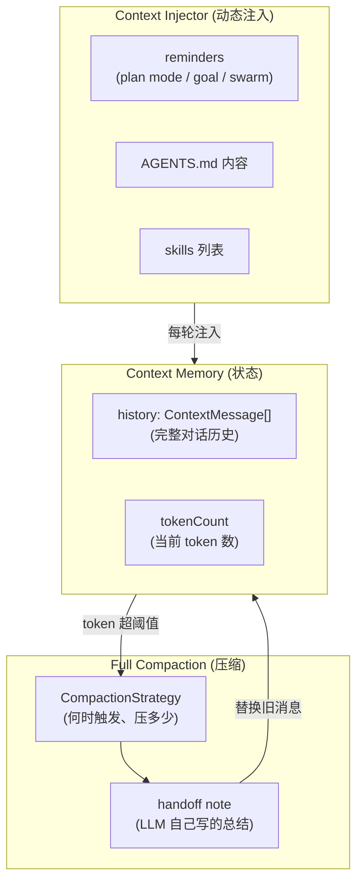
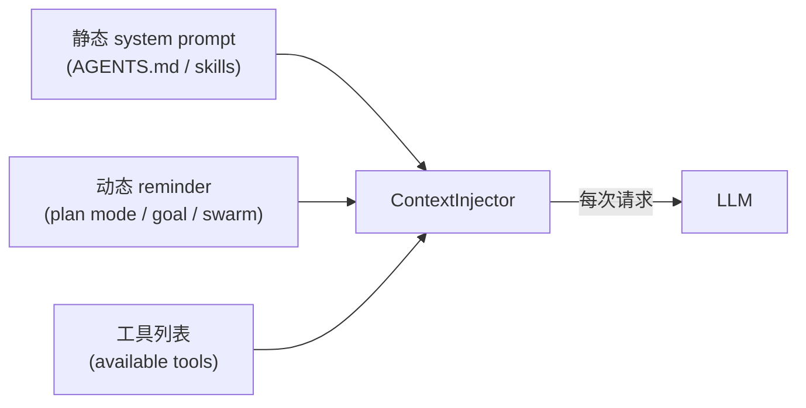

# Kimi Code · Context Memory 与 Compaction 拆解

> 📁 **源码位置** · `packages/agent-core-v2/src/agent/contextMemory/` + `packages/agent-core-v2/src/agent/fullCompaction/` + `packages/agent-core-v2/src/agent/contextInjector/`
>
> 📄 **核心文件** · `contextMemoryService.ts`(164 行)、`fullCompactionService.ts`(799 行)、`strategy.ts`(260 行)、`compaction-instruction.md`(LLM 指令)
>
> 🔌 **Scope 绑定** · Agent scope(每个 agent 独立的 context)


## 1. 这个模块要解决什么问题

**场景**:LLM 的上下文窗口是**有限的**(即使是 200K token 的模型,也会用完)。Agent 做复杂任务时,对话会越来越长:
- 用户的多轮指令
- agent 读过的文件内容
- 工具调用结果(命令输出、grep 结果)
- agent 自己的思考

**问题**:当 token 数逼近上限时:
- 请求会**失败**(provider 返回 context length exceeded)
- 即使没失败,**性能下降**(长上下文让 LLM 注意力分散,容易忽略关键信息)
- **成本上升**(每 token 都要付费)

**Kimi-code 的解决方案**:**Full Compaction**(全量压缩) —— 当 token 达到阈值时,把**前面的对话**让 LLM 自己**总结成一份 handoff note**,然后用这份 note 替换掉前面的历史。Agent 继续工作时,看到的是"最近的几轮 + 一份自述笔记"。

这不是简单的"丢掉旧消息",而是让 agent 把自己的思考**传递给未来的自己**。

## 2. 核心概念

### 2.1 三层概念



- **Context Memory**:对话历史 + token 计数(状态层)
- **Context Injector**:动态注入的系统提示(plan mode reminder、goal reminder 等)
- **Full Compaction**:当 token 超阈值时,让 LLM 总结旧消息,替换之

### 2.2 ContextMessage 的结构

每条消息除了标准的 `Message`(role + content),还带元数据:

```typescript
// contextMemory/types.ts:102-108
export type ContextMessage = Message & {
  readonly id?: string;
  readonly providerMessageId?: string;
  readonly origin?: PromptOrigin | undefined;      // 这条消息从哪来
  readonly isError?: boolean;
  readonly note?: string;
};
```

`origin` 字段非常关键,它记录消息的**来源类型**:

```typescript
export type PromptOrigin =
  | UserPromptOrigin          // 用户输入
  | SkillActivationOrigin     // skill 被激活
  | PluginCommandOrigin       // 插件命令
  | InjectionOrigin           // 系统注入(reminder)
  | ShellCommandOrigin        // shell 输入/输出
  | CompactionSummaryOrigin   // ★ compaction 的 handoff note
  | SystemTriggerOrigin       // 系统触发(continuation 等)
  | TaskOrigin                // 后台任务通知
  | CronJobOrigin             // cron 任务触发
  | CronMissedOrigin          // cron 错过的触发
  | HookResultOrigin          // hook 结果
  | RetryOrigin;              // 重试
```

**`CompactionSummaryOrigin`** 是 compaction 产物的标记。这让下游逻辑(例如 UI、compaction 自己)能识别"这条消息是 handoff note,不是正常对话"。

## 3. Compaction 策略:何时触发

### 3.1 两个阈值

```typescript
// fullCompaction/strategy.ts:13-27
export const DEFAULT_COMPACTION_CONFIG: CompactionConfig = {
  triggerRatio: 0.85,                       // 触发压缩:达到 85% 容量
  blockRatio: 0.85,                         // 阻塞新请求:达到 85% 容量
  reservedContextSize: 50_000,              // 预留 50k token(防止刚好卡线)
  maxCompactionPerTurn: Infinity,           // 每个 turn 最多压缩次数
  maxOverflowCompactionAttempts: 3,         // overflow 时最多尝试 3 次
  maxRecentMessages: 4,                     // 压缩时保留最近 4 条消息
  maxRecentUserMessages: Infinity,
  maxRecentSizeRatio: 0.2,                  // 保留的消息最多占 20% 容量
  minOverflowReductionRatio: 0.05,          // overflow 时至少减少 5%
};
```

### 3.2 触发逻辑

```typescript
// strategy.ts:113-133
shouldCompact(usedSize: number): boolean {
  if (this.maxSize <= 0) return false;
  return (
    usedSize >= this.maxSize * this.config.triggerRatio ||           // ① 达到 85%
    this.shouldUseReservedContext(usedSize)                          // ② 预留区被侵占
  );
}

shouldBlock(usedSize: number): boolean {
  if (this.maxSize <= 0) return false;
  return (
    usedSize >= this.maxSize * this.config.blockRatio ||             // ① 达到 85%(默认同触发)
    this.shouldUseReservedContext(usedSize)
  );
}

private shouldUseReservedContext(usedSize: number): boolean {
  const reservedSize = this.config.reservedContextSize;
  return reservedSize > 0 && reservedSize < this.maxSize
    && usedSize + reservedSize >= this.maxSize;                      // 剩余空间 < 50k
}
```

**两个触发条件**:
1. **比例阈值**:token 达到 `maxSize × 0.85`
2. **预留区保护**:即使没到 85%,如果剩余空间 < 50k(预留大小),也触发。防止"虽然只用了一半,但模型回复需要 100k,会爆"。

### 3.3 `triggerRatio` 与 `blockRatio` 的区别

默认两者相同(都是 0.85)。但**可以配置成不同**:

- `triggerRatio = 0.7, blockRatio = 0.85` → 70% 时**异步触发** compaction,但请求还能继续;85% 时**阻塞**新请求,等 compaction 完成

```typescript
// strategy.ts:58-60
get checkAfterStep(): boolean {
  return this.config.triggerRatio !== this.config.blockRatio;
}
```

如果两者不同,loop 会在**每个 step 后检查**是否该触发异步 compaction;如果相同,只在 turn 边界检查(性能更好)。

## 4. Compaction 的核心:让 LLM 给自己写 handoff

这是整个机制最精彩的部分。Compaction 不是用算法裁剪历史,而是**让 LLM 自己写一份"给未来自己的笔记"**。

### 4.1 Handoff instruction(精彩!)

`compaction-instruction.md` 是给 LLM 的指令。节选关键部分:

```markdown
You are about to run out of context. Write a first-person handoff note to
yourself so you can seamlessly continue this task after the earlier
conversation is cleared.

Write the note as your own continuing train of thought — first person, present
tense, the way you would reason through the next move. Do not write a
third-party report about someone else's work.

Make the note self-sufficient: the next turn will see only your most recent user
messages and this note — every assistant message, tool call, and tool result
above will be gone.
```

**关键设计**:
- **第一人称**:"给你的未来自己",不是第三方报告
- **现在时**:像你正在思考下一步
- **自给自足**:未来 turn 只看到这条笔记 + 最近几条消息,其他都没了

### 4.2 Handoff 要包含什么

```markdown
- What the latest request is actually asking for: 你的理解,不只是 re-transcription
- The instructions and constraints currently in force
- What has actually been done, at high fidelity: 确切的命令、文件路径、结果
- What you still don't know: 下一步依赖但还没查的东西
- The forward plan — invest in it now! 现在是你上下文最全的时候
```

**最关键的是最后一条**:

> Right now you hold more context on this task than you ever will again;
> the next turn resumes with less, so the plan you commit here is the one it will follow.

这是**对 LLM 心理的精准把握** —— 告诉它"现在不写清楚,以后就忘了",驱动它认真写。

### 4.3 明确不要做什么

```markdown
Your TODO list is re-attached automatically below this note from its live
source, so do not transcribe it — copying it wastes space and can contradict
the live version.
```

**TODO 列表会自动重附** —— 不需要写到 note 里。这避免了"LLM 抄一遍 TODO"的浪费,也防止"抄的版本和实际 TODO 不一致"。

```markdown
Be honest about uncertainty. If an earlier step claimed something was done but
was never verified (tests "passing", a fix "working"), say so plainly and treat
it as unverified rather than fact.
```

**诚实面对不确定性**:之前声称"做完了"但没验证的东西,要标注为"未验证"。防止 handoff 把错觉传给未来。

### 4.4 Compaction 的实际流程

```mermaid
sequenceDiagram
    participant Loop as Agent Loop
    participant CS as ContextSize
    participant FCS as FullCompactionService
    participant LLM
    participant CM as ContextMemory

    Loop->>CS: 每个 step 后检查 token
    CS->>FCS: shouldCompact(usedSize)?
    FCS->>FCS: computeCompactCount(messages)<br/>决定压多少条
    FCS->>LLM: 发送 handoff instruction + 旧消息
    Note over LLM: LLM 写第一人称 handoff note
    LLM-->>FCS: handoff summary
    FCS->>CM: 删除旧消息,替换为 handoff
    Note over CM: history = [handoff, ...recent]
    FCS-->>Loop: compaction 完成
```

## 5. 压多少条消息:窗口算法

`computeCompactCount` 决定要压缩多少条旧消息、保留多少条最近消息。

### 5.1 核心逻辑

```typescript
// strategy.ts:135-170(简化)
computeCompactCount(messages: readonly Message[], source: CompactionSource): number {
  // manual 模式:从最后一条往前找可分割点,压掉前面所有
  if (source === 'manual') {
    for (let i = messages.length - 1; i > 0; i--) {
      if (canSplitAfter(messages, i)) {
        return this.fitCompactCountToWindow(messages, i + 1);
      }
    }
    return 0;
  }

  // 自动模式:在窗口约束下找最佳分割点
  let recentMessages = 1;
  let recentUserMessages = 0;
  let recentSize = 0;
  let bestN: number | undefined;

  for (; recentMessages < messages.length; recentMessages++) {
    const splitIndex = messages.length - recentMessages - 1;
    const m2 = messages[messages.length - recentMessages]!;

    if (m2.role === 'user') {
      recentUserMessages++;
    }
    recentSize += estimateTokensForMessage(m2);

    if (canSplitAfter(messages, splitIndex)) {
      bestN = splitIndex + 1;                        // 记录最佳分割点
    }

    // 三个约束任一满足就停
    const reachesMax =
      recentMessages >= this.config.maxRecentMessages ||              // ① 最多 4 条
      recentUserMessages >= this.config.maxRecentUserMessages ||
      recentSize >= this.maxSize * this.config.maxRecentSizeRatio;    // ② 最多占 20%
    if (reachesMax && bestN !== undefined) break;
  }

  return this.fitCompactCountToWindow(messages, bestN ?? 0);
}
```

### 5.2 三个窗口约束

| 约束 | 默认值 | 含义 |
|---|---|---|
| `maxRecentMessages` | 4 | 保留最近 4 条消息 |
| `maxRecentUserMessages` | ∞ | 不限用户消息数 |
| `maxRecentSizeRatio` | 0.2 | 保留部分最多占 20% 总容量 |

这些约束防止两种极端:
- **保留太少**:只剩最后 1 条消息,handoff note 压力过大
- **保留太多**:压缩效果不明显,下次很快又触发

### 5.3 `canSplitAfter`:消息的边界

不能在任意位置切分。例如不能切在"工具调用"和"工具结果"之间(那样 tool call 就丢了对应的 result)。

```typescript
// messageProjection.ts(简化)
function canSplitAfter(messages: readonly Message[], index: number): boolean {
  // 不能切在 tool_call / tool_result 中间
  if (messages[index]?.role === 'assistant' && hasToolCalls(messages[index]!)) {
    return false;
  }
  if (messages[index + 1]?.role === 'tool') {
    return false;
  }
  return true;
}
```

这让 compaction 总是切在"语义完整"的位置(user/assistant 对的边界)。

## 6. Overflow 处理:压缩不够怎么办?

即使触发了 compaction,可能出现:
- LLM 写的 handoff note 太长
- 保留的最近消息本身就超容量

### 6.1 Overflow 重试策略

```typescript
// strategy.ts:172-186
reduceCompactOnOverflow(messages: readonly Message[]): number {
  const minReducedSize = Math.max(
    1,
    Math.ceil(this.maxSize * this.config.minOverflowReductionRatio),  // 至少减 5%
  );
  let reducedSize = 0;
  let bestN: number | undefined;

  for (let i = messages.length - 2; i > 0; i--) {
    reducedSize += estimateTokensForMessage(messages[i + 1]!);
    if (canSplitAfter(messages, i)) {
      bestN = i + 1;
      if (reducedSize >= minReducedSize) {                              // 达到最小减少量
        return i + 1;
      }
    }
  }
  return bestN ?? messages.length;
}
```

**策略**:
- 计算需要至少减少多少 token(总容量的 5%)
- 从末尾往前找,找到第一个能减少这个量的分割点

最多重试 3 次(`maxOverflowCompactionAttempts: 3`),如果 3 次都压不下来,就报错。

### 6.2 Overflow 的回环陷阱

理论上 compaction 会触发新的 LLM 调用,这个调用本身也产生 token。如果 handoff note 让 context 反而变大了,会无限触发 compaction。

防御机制:
- **maxCompactionPerTurn**:每个 turn 最多压缩多少次(默认无限,但 overflow 时变 3)
- **minOverflowReductionRatio**:每次必须至少减少 5%,防止"压了等于没压"
- **显式计数器**:`fullCompactionService.ts:100-105` 有计数器截断,防止死循环

## 7. Context Injector:动态注入

`ContextInjectorService` 负责把**动态生成的提示**注入到每次请求的 system 消息里。

### 7.1 三种注入来源



### 7.2 注册式注入

每个域(plan、goal、swarm)通过 `register(variant, provider)` 注册自己的注入:

```typescript
// contextInjectorService.ts 简化
dynamicInjector.register('plan_mode', async ({ lastInjectedAt }) => {
  const data = await this.plan.status();
  if (data === null) return undefined;             // 不在 plan mode,不注入
  // ... 根据 lastInjectedAt 决定 full/sparse/不注入
});
```

注入器负责决定:
- **要不要注入**(当前状态是否需要)
- **注入什么**(full reminder / sparse reminder)
- **上次注入过没**(避免重复)

这让每个域能**独立管理自己的注入逻辑**,不需要中心化的"system prompt 拼装"函数。

## 8. Blob 处理:大文件的卸载

如果用户粘贴了一张 10MB 的图片(转成 base64 的 data URI),context 会瞬间爆炸。

### 8.1 Blob offload

```typescript
// blob/agentBlobServiceImpl.ts:124-143
private async maybeOffloadString(value: string): Promise<string> {
  if (this.isBlobRef(value)) return value;           // 已经是 blobref,不动

  const match = DATA_URI_HEADER_RE.exec(value);
  if (match === null) return value;                  // 不是 data URI,不动

  const mimeType = match[1]!;
  const payload = value.slice(match[0].length);
  if (payload.length < this.threshold) return value; // 小于 4KB,不值得卸载

  return this.writeBlob(mimeType, payload);          // 写入 blob store
}

private async writeBlob(mimeType: string, base64Payload: string): Promise<string> {
  const hash = createHash('sha256').update(base64Payload, 'utf8').digest('hex');
  const binary = Buffer.from(base64Payload, 'base64');
  await this.blobs.put(this.storageScope, hash, binary);
  this.cache.set(hash, binary);
  return formatBlobRef(mimeType, hash);              // 返回 blobref://mime;hash
}
```

**流程**:
- data URI > 4KB → 计算 sha256 → 写入 `<agentDir>/blobs/<sha256>` → 替换为 `blobref://mime;hash`
- 读的时候反向:解析 blobref → 读文件 → 转回 data URI

**内容寻址**:相同内容只存一份(`sha256` 天然去重)。

### 8.2 LRU 缓存

```typescript
// blob/agentBlobServiceImpl.ts:31
private readonly cache = new ByteLruCache(DEFAULT_MAX_CACHE_SIZE);  // 50MB
```

热数据在内存 LRU(50MB),冷数据在磁盘。读 blobref 时先查缓存,miss 才读文件。

## 9. Context Size:token 计数

`IAgentContextSizeService` 负责估算当前 context 用了多少 token。

```typescript
// contextSize/contextSizeService.ts(简化)
get(): { size: number } {
  return { size: this.wire.getModel(ContextSizeModel).size };
}
```

每次消息变更,自动重新估算(基于 `estimateTokensForMessage`)。

**估算而非精确**:不同 provider 的 tokenizer 不同,kimi-code 用通用估算器(不依赖具体 provider)。误差 5-10%,但够用了。

## 10. 边界条件与失败模式

| 触发条件 | 行为 | 源码位置 |
|---|---|---|
| token 达到 85% | 触发 compaction | strategy.ts:114 |
| token 达到 blockRatio | 阻塞新请求,等 compaction | strategy.ts:119 |
| 剩余空间 < 50k | 触发 compaction(预留保护) | shouldUseReservedContext |
| Compaction 失败 | turn 报错 | fullCompactionService |
| Compaction 被用户取消 | abort,error.name = 'AbortError' | compactionCancelledReason |
| Overflow 重试 3 次仍不够 | 报错 | maxOverflowCompactionAttempts |
| 压缩后 token 反而增加 | 要求至少减 5%,否则继续找分割点 | reduceCompactOnOverflow |
| LLM 写 handoff 时调工具 | 拒绝(instruction 明说"不要调工具") | compaction-instruction.md |
| 单条消息超过总容量 | 压不掉,报错 | (无解) |
| 用户在 compaction 中途发新消息 | steer 机制,把消息加到队列 | compactionHandoff |
| Blob 文件丢失(磁盘问题) | 返回 `[media missing]` 占位 | MISSING_MEDIA_PLACEHOLDER |
| 连续多次 compaction | 每个 turn 最多 1 次(默认) | maxCompactionPerTurn |

## 11. 设计权衡

### 11.1 为什么用 LLM 总结而不是算法裁剪?

**算法裁剪**(滑动窗口、token 截断)的问题:
- 丢失关键上下文(用户最初的需求、已经做过的决策)
- LLM 不知道中间发生了什么,会重复或矛盾

**LLM 总结**的好处:
- handoff note 包含 agent 的**理解和推理**,不是原始日志
- 可以选择性保留关键信息(文件路径、命令结果、决策原因)
- 第一人称的"思维流",让未来 turn 能自然续接

代价:
- **贵**:每次 compaction 是一次完整的 LLM 调用
- **慢**:compaction 期间 turn 会阻塞
- **不可预测**:LLM 可能写得不好(漏掉关键信息、胡编)

### 11.2 为什么 handoff 用第一人称?

> Do not write a third-party report about someone else's work.

第三方报告("The agent did X")会让未来 turn 觉得这是"别人的工作",可能重新质疑或推翻。第一人称("I did X, next I'll do Y")让续接自然。

### 11.3 为什么 maxRecentMessages = 4?

这是个经验值。太少(1-2)会让最近上下文丢失;太多(10+)压缩效果差。4 条足够让未来 turn 知道"刚才在做什么"。

### 11.4 遗憾与可改进点

- **Compaction 是全量的,不是增量的**:每次都重新总结整个历史。如果 50 轮做一次 compaction,总结的是前 46 轮;下次再 compaction,总结的是"上次 handoff + 后续",会层层失真。可以设计"增量 compaction"——只总结新增部分,追加到旧 handoff。
- **handoff 没有结构化**:纯文本,LLM 可能写得乱七八糟。可以给一个 template(虽然 instruction 说"不要强加 section headings")。
- **token 估算是近似的**:不同 provider 的实际 token 数差异很大,可能"估了 80% 实际已经 95%"。
- **Blob 只支持图片/视频**:其他大对象(例如长 JSON 工具结果)不能卸载。
- **没有"部分重放"**:compaction 后想看被压缩掉的原始消息,做不到(已经从内存删了,只有 wire log 里有,但需要专门工具重放)。

## 12. 一句话总结

> Context Memory 的核心是 **Full Compaction** —— 当 token 达到 85% 或剩余 < 50k 时,触发一次 LLM 调用,让 agent 给"未来的自己"写一份**第一人称的 handoff note**,替换掉旧消息。这不是算法裁剪,而是**让 LLM 自己决定保留什么**:最近的需求、已做的事、未知的信息、下一步的计划。通过三层约束(`maxRecentMessages=4`、`maxRecentSizeRatio=0.2`、`canSplitAfter`)保证压缩既有效果又不破坏语义完整性。大文件(图片/视频)通过 blob offload 卸载到磁盘,只保留 `blobref://` 引用。

## 13. 本篇用到的核心源码索引

| 概念 | 文件 | 关键行 |
|---|---|---|
| `ContextMessage` | `src/agent/contextMemory/types.ts` | 102-108 |
| `PromptOrigin` 联合类型 | `src/agent/contextMemory/types.ts` | 85-99 |
| `IAgentContextMemoryService` | `src/agent/contextMemory/contextMemory.ts` | — |
| `ContextMemoryService` | `src/agent/contextMemory/contextMemoryService.ts` | — |
| `IAgentContextInjectorService` | `src/agent/contextInjector/contextInjector.ts` | — |
| `ContextInjectorService` | `src/agent/contextInjector/contextInjectorService.ts` | — |
| `IAgentFullCompactionService` | `src/agent/fullCompaction/fullCompaction.ts` | — |
| `AgentFullCompactionService` | `src/agent/fullCompaction/fullCompactionService.ts` | 全文 799 行 |
| `CompactionStrategy` | `src/agent/fullCompaction/strategy.ts` | 全文 260 行 |
| `DEFAULT_COMPACTION_CONFIG` | `src/agent/fullCompaction/strategy.ts` | 13-27 |
| `shouldCompact` / `shouldBlock` | `src/agent/fullCompaction/strategy.ts` | 113-133 |
| `computeCompactCount` | `src/agent/fullCompaction/strategy.ts` | 135-170 |
| `reduceCompactOnOverflow` | `src/agent/fullCompaction/strategy.ts` | 172-186 |
| `canSplitAfter` | `src/agent/contextMemory/messageProjection.ts` | — |
| Handoff instruction | `src/agent/fullCompaction/compaction-instruction.md` | 必读 |
| `IAgentBlobService` | `src/agent/blob/agentBlobService.ts` | — |
| Blob offload 实现 | `src/agent/blob/agentBlobServiceImpl.ts` | 48-143 |
| `IAgentContextSizeService` | `src/agent/contextSize/contextSize.ts` | — |

## 参考资料

- `compaction-instruction.md` —— 给 LLM 的 handoff 指令,非常值得读
- [01-architecture.md](01-architecture.md) —— ContextMemory 是 Agent scope 服务
- [03-goal-mode.md](03-goal-mode.md) —— Goal 的 reminder 通过 contextInjector 注入
- [05-plan-mode.md](05-plan-mode.md) —— Plan mode 的 reminder variant 策略
- [07-wire-protocol.md](07-wire-protocol.md) —— Blob 的 dehydrate/rehydrate 是 wire 层做的
- 后续拆解:
  - 09-loop.md —— Agent loop 在每个 step 后检查是否该 compact
