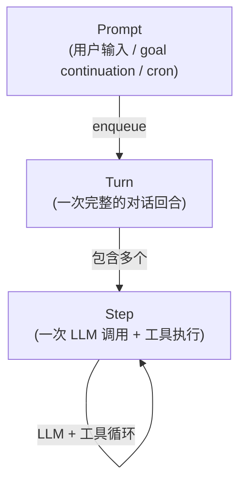
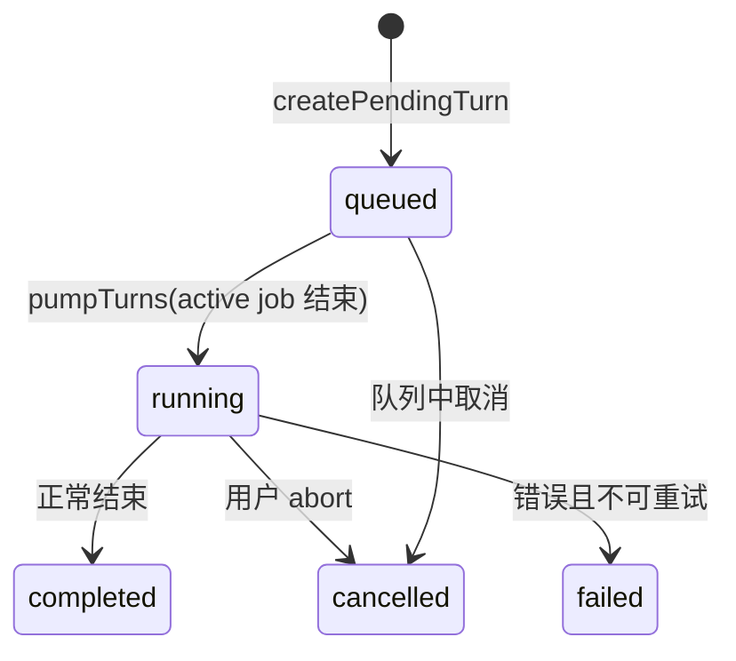

# Kimi Code · Agent Loop 主循环拆解

**源码位置**:`packages/agent-core-v2/src/agent/loop/` + `packages/agent-core-v2/src/agent/prompt/` + `packages/agent-core-v2/src/agent/stepRetry/`
**核心文件**:`loopService.ts`(1064 行,核心)、`promptService.ts`(247 行)、`stepRetryService.ts`(139 行)、`turnEvents.ts`(129 行)
**Scope 绑定**:Agent scope(每个 agent 独立的 loop)

## 1. 这个模块要解决什么问题

**场景**:Agent 接到用户输入后,要**循环地**和 LLM 交互:
1. 把 context 发给 LLM
2. LLM 返回一段回复(可能带工具调用)
3. 如果有工具调用,执行工具,把结果加回 context
4. 再次调用 LLM,看它还要不要继续
5. 重复,直到 LLM 不再调用工具(说"我做完了")

这个循环是 agent 的**心跳**。它要处理:
- **多轮工具调用**(一次可能调多个工具,工具结果还要喂回去)
- **失败重试**(provider 429、网络抖动)
- **用户中途插话**(steer,例如用户在 agent 工作时补充信息)
- **取消**(用户按 Ctrl+C,或超时)
- **Token 超限**(触发 compaction)
- **并发**(多个 prompt 排队)

这就是 Agent Loop 的职责。

## 2. 三层抽象:Prompt → Turn → Step

Kimi-code 把循环拆成三层:



| 层 | 含义 | 数量关系 |
|---|---|---|
| **Prompt** | 一次外部输入(用户消息、goal continuation、cron 触发) | 1 prompt → 1 turn |
| **Turn** | 一次完整的 agent 工作周期(从开始到停止) | 1 turn → N steps |
| **Step** | 一次"调用 LLM → 处理响应 → 执行工具"的循环 | 直到 LLM 不再调用工具 |

### 2.1 为什么是三层?

- **Prompt 层**负责**入队**(谁先来谁先处理,可以排队)
- **Turn 层**负责**生命周期管理**(开始、结束、取消、重试)
- **Step 层**负责**实际的 LLM 交互**(调用、解析、工具执行)

这种分层让每一层关注自己的问题,不互相干扰。

## 3. Step:最小执行单元

一个 step 包含:

```mermaid
sequenceDiagram
    participant Loop
    participant LLM
    participant ToolExec as ToolExecutor
    participant CM as ContextMemory

    Loop->>CM: 准备 context(history + injections)
    Loop->>LLM: chat(messages, tools)
    LLM-->>Loop: response(text + tool_calls)
    Loop->>CM: append assistant message

    alt 有 tool_calls
        Loop->>ToolExec: resolveExecution + 权限 + execute
        ToolExec-->>Loop: tool results
        Loop->>CM: append tool results
        Loop->>Loop: 进入下一个 step
    else 无 tool_calls
        Loop->>Loop: turn 结束(completed)
    end
```

### 3.1 Step 的终止条件

Step 结束的方式:

| 终止原因 | 含义 | Turn 是否也结束 |
|---|---|---|
| LLM 不再调用工具 | 正常完成 | ✅ Turn 也结束 |
| `max_steps` 达到 | 步数超限 | ❌ Turn 被强制结束(`MaxStepsReached`) |
| Provider 返回错误 | LLM 调用失败 | ⚠️ 先重试,重试用完才结束 |
| 用户 abort | 取消 | ✅ Turn cancelled |
| Token 超限 | context 爆了 | ⚠️ 先 compaction,compaction 失败才结束 |

### 3.2 MaxSteps 保护

防止 agent 陷入无限循环(例如反复调用同一个工具):

```typescript
// loopService.ts(简化)
const MAX_STEPS = 1000;  // 或来自 config

if (step.stepNumber >= MAX_STEPS) {
  throw new MaxStepsReached(n_steps);
}
```

`MaxStepsReached` 是 goal mode 的 continuation driver 的停止信号(见 [03-goal-mode.md](03-goal-mode.md))。

## 4. Turn:生命周期管理

### 4.1 Turn 的状态机



### 4.2 Turn 的创建

```typescript
// loopService.ts:249-269(简化)
private createPendingTurn(request: StepRequest, seed: TurnSeed): TurnJob {
  const id = this.reserveTurnId();                              // ① 单调递增的 turnId
  const controller = new AbortController();                     // ② 取消控制器
  const ready = createControlledPromise<void>();                // ③ ready promise
  const result = createControlledPromise<TurnResult>();         // ④ result promise
  const queue = new StepRequestQueue();                         // ⑤ step 队列

  const turn: MutableTurn = {
    id,
    state: 'queued',
    signal: controller.signal,
    ready,                                                       // turn 真正开始时 resolve
    result,                                                      // turn 结束时 resolve
    cancel: (reason) => this.cancel(id, reason),
  };

  const job = { request, seed, controller, ready, result, queue, steps, turn };
  this.assignStep(job, request);                                 // ⑥ 第一个 step 入队
  this.moveStandaloneStepsTo(job);                               // ⑦ 合并之前积压的 step
  return job;
}
```

**两个 promise 的语义**:
- **`ready`**:turn 真正开始跑(从 `queued` 变成 `running`)时 resolve。调用方可以 `await turn.ready` 等 turn 开始。
- **`result`**:turn 完全结束时 resolve。调用方可以 `await turn.result` 拿最终结果。

### 4.3 TurnId 的分配

```typescript
// loopService.ts:271-276
private reserveTurnId(): number {
  const modelNextId = this.wire.getModel(TurnModel).nextTurnId;    // 从 wire 读已恢复的最大 id
  const id = Math.max(modelNextId, this.nextReservedTurnId ?? modelNextId);
  this.nextReservedTurnId = id + 1;
  return id;
}
```

TurnId 是**单调递增**的,即使 session resume 后也能正确继续(从 wire log 恢复 `nextTurnId`)。

### 4.4 Turn 的四种结束原因

```typescript
// turnEvents.ts:22
export type TurnEndReason = 'completed' | 'cancelled' | 'failed' | 'blocked';
```

| Reason | 含义 | 谁触发 |
|---|---|---|
| `completed` | LLM 说做完了(不调用工具了) | LLM 自然终止 |
| `cancelled` | 用户按了取消 / abort | 用户 / 父 agent timeout |
| `failed` | 错误且重试次数用完 | provider 错误 / 内部异常 |
| `blocked` | (wire 边缘会 fold 成 failed) | 内部使用,wire 上归并 |

**注意**:`blocked` 在内部区分,但 wire 协议上**归并到 `failed`**。这是为了简化消费端(UI 不用处理两种失败)。

## 5. StepRequestQueue:入队策略

不同的 prompt 来源有不同的入队策略。

### 5.1 四种 admission(准入策略)

```typescript
// loopService.ts:138-170
enqueue(request: StepRequest, options?: StepEnqueueOptions): EnqueueReceipt {
  switch (request.admission) {
    case 'newTurn':
      this.createAndQueueTurn(request);                           // ① 总是开新 turn
      break;
    case 'activeOrNewTurn':
      if (active === undefined) this.createAndQueueTurn(request); // ② 有则加入,无则开新
      else this.assignStep(active, request, options);
      break;
    case 'activeOrNextTurn':
      if (active === undefined) this.standaloneStepQueue.enqueue(request);  // ③ 等下个 turn
      else this.assignStep(active, request, options);
      break;
    case 'activeTurnOnly':
      if (active === undefined) throw new BugIndicatingError(...);  // ④ 必须有 active turn
      this.assignStep(active, request, options);
      break;
  }
}
```

| Admission | 含义 | 典型来源 |
|---|---|---|
| `newTurn` | 强制开新 turn | 用户主消息、goal continuation |
| `activeOrNewTurn` | 有则加入,无则开新 | skill 激活 |
| `activeOrNextTurn` | 排队等下个 turn | 后台任务通知、cron 触发 |
| `activeOrNewTurn` | 必须有 active turn | 内部 step retry |

**设计目的**:让不同来源按**紧急程度**排队。用户输入永远是 `newTurn`(立即响应),后台通知可以 `activeOrNextTurn`(不抢当前 turn)。

### 5.2 Steer:用户中途插话

`steer` 是个特殊操作 —— 用户在 agent 工作时补充信息。不取消当前 turn,把消息**塞进当前 context**。

```typescript
// packages/agent-core/src/agent/turn/index.ts:166-183(legacy,概念相同)
steer(input: readonly ContentPart[], origin: PromptOrigin): number | null {
  // Buffer while a turn is active OR a manual compaction holds the context
  if (this.activeTurn || this.agent.fullCompaction.isCompacting) {
    this.steerBuffer.push({ input, origin });
    return null;
  }
  return this.launch(gated, origin);
}
```

**steer 的处理**:
- 如果当前没有 turn,**立即 launch 新 turn**
- 如果有 active turn,**buffer 起来**,在合适的时机(step 边界)flush 进去
- 如果正在 compaction,也 buffer,等 compaction 完

这让用户**不需要打断 agent**就能补充信息,非常优雅。

## 6. PromptService:对外接口

外部调用方(用户消息、API、subagent)通过 `IAgentPromptService` 触发 turn。

### 6.1 两个核心 API

```typescript
// prompt/prompt.ts
interface IAgentPromptService {
  enqueue(request: PromptRequest): Promise<{ launched: Promise<Turn> }>;
  retry(): Promise<Turn | undefined>;
}
```

- **`enqueue`**:把 prompt 加入队列,返回一个 promise,await 它拿到 turn
- **`retry`**:重试上一次 prompt(用于 goal continuation 的 retry 路径)

### 6.2 enqueue 的两阶段返回

```typescript
const { launched } = await promptService.enqueue({ message });
const turn = await launched;    // ← 等到 turn 真正开始
```

为什么要两阶段?
- `enqueue` 立即返回(不等 turn 开始)
- `launched` 在 turn 从 `queued` 变成 `running` 时 resolve

这让调用方能**同时**:
- 知道 prompt 已经被接收(`enqueue` 返回)
- 等到 turn 真正跑起来(`await launched`)

## 7. 错误恢复:StepRetry

provider 错误(429、5xx、网络抖动)是常态。`StepRetryService` 是 loop 的错误恢复插件。

### 7.1 注册错误处理器

```typescript
// stepRetryService.ts:71-76
this._register(
  this.loopService.registerLoopErrorHandler({
    id: 'step-retry',
    match: (context) => isRetryableGenerateError(unwrapErrorCause(context.error)),
    handle: (context) => this.recover(context),
  }),
);
```

**注册式**:loop 暴露 `registerLoopErrorHandler`,任何域都可以注册自己的错误处理器。`step-retry` 是其中一个(也是最重要的)。

### 7.2 重试策略

```typescript
// 使用 retry 库的指数退避
const delays = retryBackoffDelays(failedAttempts, {
  minTimeout: 1000,
  maxTimeout: 60000,
  factor: 2,
});
```

| 重试次数 | 延迟 |
|---|---|
| 1 | 1s |
| 2 | 2s |
| 3 | 4s |
| 4 | 8s |
| 5 | 16s |
| ... | ... |
| 上限 | 60s |

**默认最多 5 次**(`DEFAULT_MAX_RETRY_ATTEMPTS`)。用完后才让错误传到上层(turn failed)。

### 7.3 provider 的 `Retry-After` header

如果 provider 返回 429 且带 `Retry-After` header,优先用它的值:

```typescript
const retryAfter = readRetryAfterMs(error);  // 从 HTTP header 读
const delay = retryAfter ?? retryBackoffDelays(...);
```

这是对 provider 友好的做法 —— 它告诉你多久后重试,你就听它的。

### 7.4 重试不是"重新跑整个 turn"

重试只是**重新执行失败的 step**。之前的 step 结果都在 context 里,不需要重跑。这让重试很轻量。

**失败计数器**:

```typescript
// stepRetryService.ts:78-82
this.loopService.hooks.onDidFinishStep.register('step-retry', async (_ctx, next) => {
  this.resetAttempts();      // 任何 step 成功就重置计数
  await next();
});
```

**只要有一个 step 成功,重试计数归零**。这避免了"一个错误用完所有重试额度"。

## 8. Loop Hooks:扩展点

Loop 提供两个 hook 让其他域"插手":

```typescript
// loop.ts
hooks: {
  onWillBeginStep: new OrderedHookSlot();    // step 开始前
  onDidFinishStep: new OrderedHookSlot();    // step 结束后
}
```

使用者:
- **`step-retry`**:onDidFinishStep 重置失败计数
- **`fullCompaction`**:onDidFinishStep 检查是否该 compact(checkAfterStep)
- **`contextInjector`**:onWillBeginStep 准备 reminder
- **`toolExecutor`**:onWillBeginStep / onDidFinishStep 做 tool 相关 hook

`OrderedHookSlot` 是**有序 hook**:按注册顺序执行,每个 hook 可以 `await next()` 让链继续。这让多个 hook 可以协作,不互相打架。

## 9. Cancel:取消的传播

取消是 loop 最重要的控制流之一。

### 9.1 三种取消来源

| 来源 | 传播路径 |
|---|---|
| 用户按 Ctrl+C | UI → promptService → loopService.cancel(turnId) |
| 父 agent timeout | sessionSwarmService → loopService.cancel(turnId, timeoutReason) |
| Session dispose | lifecycle.dispose → 所有 turn cancel |

### 9.2 AbortController 的传播

```typescript
// loopService.ts:202-208
private cancelActiveTurn(turnId, cancellation): boolean {
  const job = this.activeTurnJob;
  if (job === undefined || (turnId !== undefined && job.turn.id !== turnId)) return false;
  this.wire.dispatch(cancelTurn({ turnId }));           // ① 持久化 cancel 到 wire log
  job.controller.abort(cancellation);                    // ② 触发 AbortController
  return true;
}
```

`controller.abort(cancellation)` 会:
- 让 `turn.signal` 变成 aborted 状态
- 所有用这个 signal 的 fetch / sleep / 工具执行都会被取消
- 错误从 await 点抛出,被 loop 的错误处理捕获

### 9.3 Cancel reason 的语义

```typescript
const cancelReason = reason ?? userCancellationReason();
```

**默认是 "user cancellation"**,但允许传自定义 reason(例如 timeout、provider 错误)。这让下游逻辑能**通过 reason 身份判断**取消来源:

```typescript
if (isUserCancellation(error)) {
  // 用户主动取消,不算错误
} else {
  // 其他原因(超时、provider 错误等)
}
```

## 10. Pump:Turn 调度

Loop 同时只能跑**一个 turn**(单线程)。`pumpTurns` 负责从队列取下一个:

```typescript
// loopService.ts(简化)
private pumpTurns(): void {
  if (this.activeTurnJob !== undefined) return;         // 当前还在跑
  if (this.pendingTurns.length === 0) return;            // 队列空
  const job = this.pendingTurns.shift()!;
  this.activeTurnJob = job;
  job.turn.state = 'running';
  job.ready.resolve();                                   // 通知等待者 turn 开始了
  void this.runTurn(job).then((result) => {
    this.activeTurnJob = undefined;
    job.result.resolve(result);
    this.maybeSettle();                                  // 通知 settle waiters
    this.pumpTurns();                                    // ★ 递归 pump 下一个
  });
}
```

**为什么单 turn**?
- 同一个 agent 的 context 是共享状态,并发跑两个 turn 会互相覆盖
- 子 agent 有自己的独立 loop,可以真正并行(swarm 场景)
- 简化了并发控制(不需要锁)

## 11. 边界条件与失败模式

| 触发条件 | 行为 | 源码位置 |
|---|---|---|
| 同一个 agent enqueue 第二个 `newTurn` | 排队,等当前 turn 结束 | pumpTurns |
| 用户在 turn 中途发消息 | steer buffer,step 边界 flush | steerBuffer |
| 用户 abort 当前 turn | cancel turn,所有 step 被 signal 取消 | cancelActiveTurn |
| 用户 abort 队列中的 turn | 从队列移除,直接 cancelled | cancelQueuedTurn |
| Provider 返回 429 | step-retry 指数退避,默认 5 次 | stepRetryService |
| Provider 返回 5xx | 同上 | stepRetryService |
| Provider 返回 400(参数错) | 不重试,turn failed | isRetryableGenerateError |
| Step 达到 max_steps | turn failed (MaxStepsReached) | loop 层 |
| Turn 中途触发 compaction | turn 暂停,compaction 完后继续 | fullCompaction |
| Turn 期间 session dispose | 所有 turn cancel,reason=disposed | dispose |
| Loop 已经 dispose 还 enqueue | 抛 `abortError('Agent loop disposed')` | enqueue |
| 父 agent timeout | cancel turnId,reason=timeout | sessionSwarmService |
| Steer 时正在 compaction | steer buffer,compaction 完后 launch | steer |
| LLM 响应被截断(finish_reason=length) | turn 结束,subagent 抛 SUBAGENT_MAX_TOKENS_ERROR | (见 04-subagent.md) |

## 12. 设计权衡

### 12.1 为什么是单 turn 而不是多 turn 并发?

- 同一个 agent 的 context 是**共享可变状态**,并发会破坏一致性
- 多 turn 并发的好处有限(用户通常不期望 agent 同时做两件事)
- 并发需求通过 **subagent** 满足(每个子 agent 有独立 loop)

代价:单个 agent 内部是严格串行的。对于"同时做 A 和 B"的需求,必须 spawn 子 agent。

### 12.2 为什么 step 是最小重试单元?

- 粒度合适:太粗(turn)会浪费之前的工作,太细(单次 LLM 调用)可能不够恢复
- step 的边界清晰:一次 LLM 调用 + 工具执行
- 重试成本低:之前的 step 结果都在 context,直接重跑当前 step

### 12.3 为什么 steer 用 buffer 而不是立即插入?

立即插入会破坏正在进行的 step(例如 LLM 正在流式返回)。buffer 到 step 边界再 flush,保证:
- 当前 step 完整结束
- 新 context 在下个 step 开始前准备好
- 不需要复杂的并发控制

### 12.4 遗憾与可改进点

- **max_steps 是全局的**:不能按 turn 类型调整。goal continuation 应该允许更多 step。
- **steer 的 flush 时机不透明**:用户不知道自己插的消息什么时候被处理。
- **错误处理器是链式的,但没有优先级**:`registerLoopErrorHandler` 按注册顺序跑。如果两个 handler 都 match 同一个错误,行为依赖注册顺序。
- **Turn 队列是 FIFO**:没有优先级。用户消息和后台通知排在同一个队列,用户消息不能插队。
- **Step 内的并行工具调用**:loop 本身是串行 step,但单个 step 内的多个 tool call 可以并行(由 toolScheduler 处理,见 [06-tool-system.md](06-tool-system.md))。这个边界是合理的,但文档不清晰。

## 13. 一句话总结

> Agent Loop 是**三层抽象**:Prompt(入队)→ Turn(生命周期)→ Step(LLM 调用 + 工具执行)。Loop 单 turn 串行(同 agent 内),通过 `StepRequestQueue` 的四种 admission 策略(`newTurn` / `activeOrNewTurn` / `activeOrNextTurn` / `activeTurnOnly`)控制不同来源的优先级;steer 机制让用户中途插话不打断当前 turn;StepRetry 用指数退避处理 provider 错误(默认 5 次);所有取消通过 AbortController 传播 reason,下游能区分用户取消和超时。

## 14. 本篇用到的核心源码索引

| 概念 | 文件 | 关键行 |
|---|---|---|
| `IAgentLoopService` | `src/agent/loop/loop.ts` | — |
| `AgentLoopService` | `src/agent/loop/loopService.ts` | 全文 1064 行 |
| `enqueue` | `src/agent/loop/loopService.ts` | 138-170 |
| `createPendingTurn` | `src/agent/loop/loopService.ts` | 249-269 |
| `reserveTurnId` | `src/agent/loop/loopService.ts` | 271-276 |
| `cancel` / `cancelActiveTurn` | `src/agent/loop/loopService.ts` | 194-208 |
| `pumpTurns` | `src/agent/loop/loopService.ts` | (见 runTurn) |
| `runTurn` | `src/agent/loop/loopService.ts` | 372 |
| `StepRequestQueue` | `src/agent/loop/stepRequestQueue.ts` | — |
| `StepRequest` + admission | `src/agent/loop/stepRequest.ts` | — |
| `TurnEndReason` | `src/agent/loop/turnEvents.ts` | 22 |
| Turn 事件类型 | `src/agent/loop/turnEvents.ts` | 全文 |
| `IAgentPromptService` | `src/agent/prompt/prompt.ts` | — |
| `AgentPromptService` | `src/agent/prompt/promptService.ts` | 全文 247 行 |
| `IAgentStepRetryService` | `src/agent/stepRetry/stepRetry.ts` | — |
| `AgentStepRetryService` | `src/agent/stepRetry/stepRetryService.ts` | 全文 139 行 |
| `LoopErrorHandler` 注册 | `src/agent/loop/loop.ts` | — |
| Loop hooks(onWillBeginStep/onDidFinishStep) | `src/agent/loop/loop.ts` | — |
| `MaxStepsReached` | `src/agent/loop/errors.ts` | — |

## 参考资料

- [01-architecture.md](01-architecture.md) —— Loop 是 Agent scope 服务
- [03-goal-mode.md](03-goal-mode.md) —— Goal continuation 通过 promptService.enqueue 触发新 turn
- [04-subagent.md](04-subagent.md) —— 子 agent 的 runAgentTurn 用 loop 跑 turn
- [06-tool-system.md](06-tool-system.md) —— Step 里的工具调用走 toolExecutor
- [08-context-memory.md](08-context-memory.md) —— Compaction 在 step 边界触发
