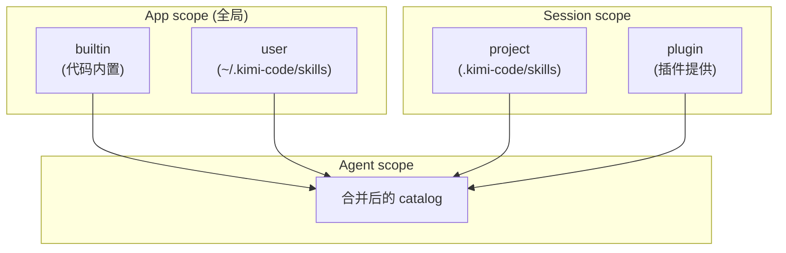
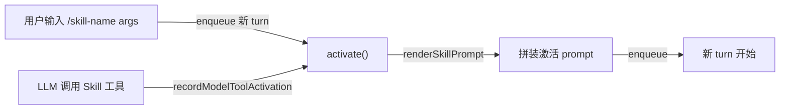
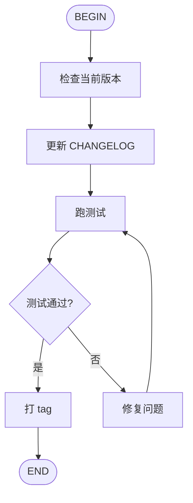

# Kimi Code · Skills 系统拆解

> 📁 **源码位置** · `packages/agent-core-v2/src/app/skillCatalog/` + `packages/agent-core-v2/src/session/sessionSkillCatalog/` + `packages/agent-core-v2/src/agent/skill/`
>
> 📄 **核心文件** · `registry.ts`(289 行)、`fileSkillDiscovery.ts`(235 行)、`parser.ts`(203 行)、`skillRoots.ts`(140 行)、`skillService.ts`(143 行)
>
> 🔌 **Scope 绑定** · Catalog 是 App scope;session 级合并是 Session scope;激活是 Agent scope


## 1. 这个模块要解决什么问题

**场景**:有些任务是**可复用的工作流**,例如:
- "做代码审查" → 多个固定步骤(读 diff → 找问题 → 报告)
- "写发布说明" → 读 CHANGELOG → 格式化 → 输出
- "配置 MCP" → 交互式问用户 → 改配置文件

每次都让 LLM 从零思考太浪费。**Skill** 把这些工作流封装成可复用的"剧本":
- 一段 **Markdown 写的指令**(SKILL.md)
- 可带 **frontmatter 元数据**(name/description/type/when-to-use)
- 可带 **流程图**(mermaid/d2,见 [kimi-cli KLIP-10](https://github.com/MoonshotAI/kimi-cli/blob/main/klips/klip-10-agent-flow.md))

用户通过 `/skill-name` 触发,或 LLM 自己判断"该用这个 skill"时主动激活。

**Skill 系统要回答**:
- 从哪里**发现** skill(项目级 / 用户级 / 内置 / 插件)
- 怎么**解析** SKILL.md
- 怎么**激活**(prompt 注入 / 模型调用)
- 怎么**隔离**(项目级覆盖用户级?同名冲突怎么办)

## 2. 四种 Skill 来源与优先级

### 2.1 四层来源



对应代码里的四个 `ISkillSource`:

| 来源 | 类 | 搜索位置 | scope |
|---|---|---|---|
| **builtin** | `BuiltinSkillSource` | 代码里硬编码(`src/app/skillCatalog/builtin/`) | App |
| **user** | `UserFileSkillSource` | `~/.kimi-code/skills/` + `~/.agents/skills/` | App |
| **project** | `WorkspaceFileSkillSource` | `<projectRoot>/.kimi-code/skills/` + `.agents/skills/` | Session |
| **extra** | `ExtraFileSkillSource` | `--add-skill-dir` 显式指定 | Session |
| **plugin** | `PluginSkillSource` | 插件注册时贡献 | Session |

### 2.2 Skill 根目录的解析

`skillRoots.ts` 定义了搜索路径,**品牌目录优先于通用目录**:

```typescript
// skillRoots.ts:15-19
const USER_BRAND_DIRS = ['skills'];                              // ~/.kimi-code/skills
const USER_GENERIC_DIRS = ['.agents/skills'];                    // ~/.agents/skills(兼容)
const PROJECT_BRAND_DIRS = ['.kimi-code/skills'];                // <proj>/.kimi-code/skills
const PROJECT_GENERIC_DIRS = ['.agents/skills'];                 // <proj>/.agents/skills(兼容)
```

**项目根的查找**:

```typescript
// skillRoots.ts:66-74
async function findProjectRoot(workDir: string): Promise<string> {
  const start = path.resolve(workDir);
  let current = start;
  while (true) {
    if (await exists(path.join(current, '.git'))) return current;    // 有 .git 就是项目根
    const parent = path.dirname(current);
    if (parent === current) return start;                            // 走到 / 还没找到
    current = parent;
  }
}
```

**向上找 `.git`** 作为项目根。这让 `cd packages/foo && kimi` 也能正确找到 `<repo>/.kimi-code/skills/`。

### 2.3 同名冲突与覆盖

后加载的 source **覆盖**先加载的(通过 `Map.set` 的语义)。加载顺序:

```
builtin → user → project → extra → plugin
```

所以**插件可以覆盖一切**,**项目级可以覆盖用户级和内置**。这是合理的设计:越靠近具体任务的位置,越应该赢。

## 3. SKILL.md 的解析

### 3.1 文件格式

```markdown
---
name: review-pr
description: 审查一个 PR,找问题
type: prompt                # 或 flow / inline / reference
when-to-use: 当用户请求代码审查时
arguments: pr_url branch    # 可选:声明参数名
disable-model-invocation: false  # 可选:禁止 LLM 自动调用
---

# Review PR

请按以下步骤审查 PR:
1. 读 diff
2. 找潜在 bug
3. 给出结构化反馈
```

### 3.2 解析流程

`parser.ts` 是**纯函数**(无 IO),调用方读文件后把文本传进来:

```typescript
// parser.ts:84-149
export function parseSkillText(options: ParseSkillTextOptions): SkillDefinition {
  // ① 必须有 frontmatter(目录式 skill)
  if (isDirectorySkill && firstLine !== FENCE) {
    throw new SkillParseError('Missing frontmatter');
  }

  // ② 解析 YAML frontmatter
  const parsed = parseFrontmatter(text);

  // ③ 规范化元数据(别名映射)
  const metadata = normalizeMetadata(frontmatter);
  if (!isSupportedSkillType(metadata.type)) {
    throw new UnsupportedSkillTypeError(metadata.type);
  }

  // ④ 必填字段校验
  if (isDirectorySkill && (name === undefined || description === undefined)) {
    throw new SkillParseError('Missing required field');
  }

  // ⑤ 提取流程图(如果有)
  return {
    name: name ?? options.skillDirName,
    description: description ?? descriptionFromBody(content),
    path, dir, content, metadata, source,
    mermaid: parseMermaidFlowchart(content),                       // ```mermaid 块
    d2: parseD2Flowchart(content),                                  // ```d2 块
  };
}
```

### 3.3 Frontmatter 别名

```typescript
// parser.ts:63-68
const METADATA_ALIASES: Readonly<Record<string, string>> = {
  'when-to-use': 'whenToUse',
  when_to_use: 'whenToUse',
  'disable-model-invocation': 'disableModelInvocation',
  disable_model_invocation: 'disableModelInvocation',
};
```

接受 kebab-case / snake_case / camelCase 三种写法,统一成 camelCase。这让 SKILL.md 作者不用纠结命名风格。

### 3.4 四种 Skill 类型

```typescript
// types.ts:72-85
export function isInlineSkillType(type: string | undefined): boolean {
  return type === undefined || type === 'prompt' || type === 'inline';
}

export function isUserActivatableSkillType(type: string | undefined): boolean {
  return isInlineSkillType(type) || type === 'flow';
}

export function isSupportedSkillType(type: string | undefined): boolean {
  return isUserActivatableSkillType(type) || type === 'reference';
}
```

| Type | 用户可激活? | LLM 可调用? | 用途 |
|---|---|---|---|
| `prompt` / `inline` /(undefined) | ✅ | ✅ | 普通文本 prompt |
| `flow` | ✅ | ✅ | 流程图驱动的多轮工作流 |
| `reference` | ❌ | ✅ | 只作为参考资料注入(用户不能 `/skill` 触发) |

**`reference`** 是个特别的类型:不暴露给用户 `/`,但 LLM 能看到它的描述并决定"我需要参考这个 skill"。适合写"项目约定"、"代码风格指南"这种被动参考资料。

## 4. Skill 激活:Agent 层

### 4.1 两种激活方式



**用户 slash 激活**(`activate`):开新 turn,把 skill 内容作为 prompt 注入。

**模型工具激活**(`recordModelToolActivation`):不开 turn,只记录事件 + 注入 prompt。模型已经在 turn 中,直接看到 skill 内容。

### 4.2 activate 的完整流程

```typescript
// skillService.ts:45-95(简化)
async activate(input: SkillActivationInput): Promise<Turn> {
  await this.skillCatalog.ready;                                    // ① 等 catalog 加载完
  const skill = this.skillCatalog.catalog.getSkill(input.name);
  if (skill === undefined) {
    throw new Error2(ErrorCodes.SKILL_NOT_FOUND, `Skill "${input.name}" was not found`);
  }
  if (!isUserActivatableSkillType(skill.metadata.type)) {
    throw new Error2(ErrorCodes.SKILL_TYPE_UNSUPPORTED, '...');    // reference 不能用户激活
  }

  const skillArgs = input.args ?? '';
  const skillContent = this.renderSkillPrompt(skill, skillArgs);   // ② 渲染 prompt(带 args)
  const content = [{
    type: 'text',
    text: renderUserSlashSkillPrompt({
      skillName: skill.name,
      skillArgs,
      skillContent,
      skillSource: skill.source,
      skillDir: skill.dir,
    }),
  }];

  // ③ 记录 origin + 派发 wire Op(可持久化)
  const turn = await this.recordActivation(
    {
      kind: 'skill_activation',
      activationId: randomUUID(),
      skillName: skill.name,
      trigger: 'user-slash',
      skillType: skill.metadata.type,
      skillPath: skill.path,
      skillSource: skill.source,
      skillArgs: input.args,
    },
    content,
  );
  return turn;
}
```

### 4.3 激活记录的持久化

```typescript
// skillService.ts:103-116
private async recordActivation(origin, input?): Promise<Turn | undefined> {
  this.wire.dispatch(skillActivate({ origin }));                    // ① wire Op
  this.publishActivation(origin);                                   // ② telemetry

  if (input === undefined) return undefined;                        // 模型激活:不开 turn
  const message: ContextMessage = {
    role: 'user',
    content: [...input],
    toolCalls: [],
    origin,                                                         // ③ context message 带 origin
  };
  return (await this.prompt.enqueue({ message })).launched;        // ④ 开 turn
}
```

**`skillActivate` 是 stateless Op**(apply 是 identity,不改变状态)。它的作用是**持久化激活事实**到 wire log,让 resume 时能重建事件。这是 wire 的"事件记录"用法的典型例子。

## 5. Registry:运行时的 skill 目录

`SkillCatalogRegistry`(289 行)是 App/Session scope 的**运行时目录**。

### 5.1 核心接口

```typescript
// types.ts:53-68
export interface SkillCatalog {
  getSkill(name: string): SkillDefinition | undefined;
  getPluginSkill(pluginId: string, name: string): SkillDefinition | undefined;
  renderSkillPrompt(skill, rawArgs, context?): string;
  listSkills(): readonly SkillDefinition[];
  listInvocableSkills(): readonly SkillDefinition[];            // ★ 排除 disableModelInvocation
  getSkillRoots(): readonly string[];
  getSkippedByPolicy(): readonly SkippedSkill[];                // 被策略跳过的(解析失败等)
  getModelSkillListing(): string;                                // ★ 给 LLM 看的 skill 列表文本
}
```

### 5.2 `getModelSkillListing`:给 LLM 的菜单

这是整个系统最关键的方法之一 —— 它生成**注入到 system prompt** 的 skill 列表:

```
Available skills:
- review-pr: 审查一个 PR,找问题
- write-release-notes: 根据 CHANGELOG 写发布说明
- mcp-config: 交互式配置 MCP server
...
```

LLM 看到这个列表后,可以主动调用 `Skill` 工具激活某个 skill。这让 skill 成为**LLM 的菜单**,而不是只有用户能用。

### 5.3 `disable-model-invocation` 标记

```typescript
// types.ts:66
listInvocableSkills(): readonly SkillDefinition[];   // 排除 disableModelInvocation=true
```

有些 skill 不希望 LLM 自己调(例如需要用户交互的),可以设 `disable-model-invocation: true`。这样它**只出现在用户的 `/` 补全里**,不进入 LLM 菜单。

## 6. Flow 类型:流程图驱动的多轮

`flow` 类型的 skill 带一个 mermaid/d2 流程图,定义多步工作流。

### 6.1 例子

```markdown
---
name: release-flow
type: flow
---


```

激活后,runtime 会按流程图**一步步推进**,每个节点是一个 prompt,分支节点由 LLM 决定。

### 6.2 解析流程图

```typescript
// parser.ts:152-157
export function parseMermaidFlowchart(markdown: string): string | undefined {
  return /```mermaid\r?\n([\s\S]*?)\r?\n```/.exec(markdown)?.[1];
}

export function parseD2Flowchart(markdown: string): string | undefined {
  return /```d2\r?\n([\s\S]*?)\r?\n```/.exec(markdown)?.[1];
}
```

解析就是找 mermaid/d2 代码块,内容留给 `FlowRunner` 处理(详见 kimi-cli 的 KLIP-10)。

### 6.3 Flow 的限制

来自 [kimi-cli KLIP-10 文档](https://github.com/MoonshotAI/kimi-cli/blob/main/klips/klip-10-agent-flow.md):

- 只支持 flowchart 的**最小子集**(节点 + 边 + label)
- 不支持 subgraph、classDef 等高级特性
- `max_moves = 1000` 防止死循环
- 分支节点要 LLM 输出 `<choice>值</choice>` 标签

## 7. Skill Prompt 的渲染

`renderSkillPrompt` 把 skill 内容 + 参数组装成最终 prompt:

### 7.1 模板替换

如果 skill 内容里有 `${arg_name}` 占位符,会用实际参数替换:

```markdown
---
name: review-pr
arguments: pr_url
---
请审查这个 PR: ${pr_url}
```

激活 `/review-pr https://github.com/foo/bar/pull/1` 后,`${pr_url}` 被替换成实际 URL。

### 7.2 上下文注入

渲染时还可以注入环境信息:

```typescript
// skillService.ts:118-122
private renderSkillPrompt(skill: SkillDefinition, rawArgs: string): string {
  return this.skillCatalog.catalog.renderSkillPrompt(skill, rawArgs, {
    sessionId: this.sessionContext.sessionId,                       // 注入 sessionId
  });
}
```

这让 skill 能引用当前 session 的信息(虽然实践中用得不多)。

## 8. Skill 发现的细节

### 8.1 FileSkillDiscovery

```typescript
// fileSkillDiscovery.ts(简化)
class FileSkillDiscovery implements ISkillDiscovery {
  async discover(roots: readonly SkillRoot[]): Promise<SkillDiscoveryResult> {
    const skills: SkillDefinition[] = [];
    const skipped: SkippedSkill[] = [];

    for (const root of roots) {
      const entries = await fs.readdir(root.path, { withFileTypes: true });
      for (const entry of entries) {
        try {
          if (entry.isDirectory()) {
            // 目录式 skill: <root>/<name>/SKILL.md
            const skillMd = path.join(root.path, entry.name, 'SKILL.md');
            const text = await fs.readFile(skillMd, 'utf-8');
            skills.push(parseSkillText({ text, skillMdPath: skillMd, ... }));
          } else if (entry.name.endsWith('.md')) {
            // 单文件 skill: <root>/<name>.md
            const text = await fs.readFile(path.join(root.path, entry.name), 'utf-8');
            skills.push(parseSkillText({ text, ... }));
          }
        } catch (error) {
          skipped.push({ path, type, reason: error.message });     // 解析失败不中断
        }
      }
    }

    return { skills, skipped };
  }
}
```

**两种 skill 文件布局**:
- **目录式**:`<root>/<name>/SKILL.md`(可以带脚本、references 等附加文件)
- **单文件式**:`<root>/<name>.md`(只有 markdown)

**容错**:单个 skill 解析失败不会中断整个发现过程,只记到 `skipped` 列表里。这让一个坏的 SKILL.md 不会让整个 agent 启动失败。

### 8.2 发现的缓存与刷新

`SessionSkillCatalogService` 在 session 创建时跑一次发现,然后缓存。如果用户编辑了 skill 文件,需要通过 `/refresh-skills` 或重启 session 来刷新。

没有**文件监听**(watch)—— 这是有意的简化。Skill 文件不会很频繁地改,监听会增加复杂度。

## 9. Sub-skill:skill 内部调用 skill

`builtin/sub-skill` 是一个特殊的内置 skill,让一个 skill 能激活另一个 skill:

```markdown
---
name: sub-skill
---
当你需要调用另一个 skill 时,使用 Skill 工具...
```

这让 skill 可以**组合**,例如"发布流程" skill 内部调用 "review-pr" + "write-release-notes"。

**约束**:防止无限递归 —— 目前靠 LLM 自己判断不再无限调用,没有硬性递归深度限制。

## 10. 边界条件与失败模式

| 触发条件 | 行为 | 源码位置 |
|---|---|---|
| 激活的 skill 不存在 | `SKILL_NOT_FOUND` 错误 | skillService.ts:51 |
| 激活 `reference` 类型 | `SKILL_TYPE_UNSUPPORTED` | skillService.ts:54 |
| SKILL.md 缺 frontmatter | `SkillParseError` | parser.ts:99 |
| Frontmatter 缺 `name` 或 `description` | `SkillParseError` | parser.ts:131 |
| Type 不支持 | `UnsupportedSkillTypeError` | parser.ts:124 |
| YAML 语法错 | `FrontmatterError` → `SkillParseError` | parser.ts:91 |
| 项目根找不到 .git | 用 cwd 作为项目根 | skillRoots.ts:74 |
| 同名 skill 在多个来源 | 后加载的覆盖(plugin > extra > project > user > builtin) | registry |
| Skill 文件解析失败 | 加入 `skipped` 列表,不中断 | fileSkillDiscovery |
| Skill 目录是 symlink | `realpath` 解析真实路径,避免重复 | skillRoots.ts:125 |
| 激活时 catalog 还没加载完 | `await skillCatalog.ready` | skillService.ts:46 |
| 当前已有 active turn | `TURN_AGENT_BUSY` 错误 | skillService.ts:88 |
| `disable-model-invocation=true` | 不出现在 LLM 菜单 | listInvocableSkills |
| Flow 的 mermaid 不合法 | 降级为普通 skill(不报错) | parser.ts |
| Resume 时重放 skillActivate | 不发事件、不跑 telemetry(identity apply) | skillOps |

## 11. 设计权衡

### 11.1 为什么用 Markdown 而不是 JSON/YAML?

- **人类可读**:skill 是给人写的,Markdown 比 JSON 友好
- **prompt 友好**:skill 内容本来就是给 LLM 看的 prompt,Markdown 是 LLM 最熟悉的格式
- **可组合**:frontmatter 表达元数据,body 是 prompt,各司其职

### 11.2 为什么 skill 文件加载用"发现"而不是显式注册?

- **零配置**:用户把 SKILL.md 丢到目录里就生效,不用改 config
- **可移植**:skill 目录可以 git 跟随项目走,团队成员自动共享
- **可扩展**:插件能贡献 skill,不需要改核心代码

代价:启动时要扫描目录,有 IO 开销。但 skill 目录通常很小(< 20 个文件),可以接受。

### 11.3 为什么没有文件监听?

- 复杂度 vs 收益不划算(skill 很少改)
- 文件监听跨平台不一致
- 用户可以通过 `/refresh-skills` 主动刷新

### 11.4 遗憾与可改进点

- **同名冲突不报错**:后加载的静默覆盖。应该至少 log warning。
- **Skill 没有版本概念**:同名 skill 改了内容,旧 session resume 时会用新内容(可能不兼容)。
- **没有 skill 间的依赖声明**:skill A 依赖 skill B 存在,做不到。
- **参数没有类型校验**:`arguments: pr_url branch` 只是名字列表,不校验用户传的 args 数量。
- **Sub-skill 没有递归深度限制**:理论上可以无限调用,靠 LLM 自律。
- **Flow 的 mermaid 解析太宽松**:解析失败静默降级,用户可能不知道自己的 flow 没生效。

## 12. 一句话总结

> Skills 系统是一个**四层来源(builtin/user/project/plugin)+ 文件发现 + frontmatter 解析 + 双向激活(用户 / 和 LLM 工具)**的可复用工作流框架。SKILL.md 用 Markdown 写 prompt + YAML 写元数据,`FileSkillDiscovery` 扫描目录,`parser.ts` 纯函数解析。激活时把 skill 内容作为 prompt 注入新 turn,同时通过 wire Op 持久化激活事实(用于 resume)。四种 type(prompt/inline/flow/reference)覆盖不同场景;`disable-model-invocation` 控制 LLM 是否能自动调用。整个系统**零配置、可组合、容错**(单个 skill 解析失败不影响整体)。

## 13. 本篇用到的核心源码索引

| 概念 | 文件 | 关键行 |
|---|---|---|
| `SkillDefinition` | `src/app/skillCatalog/types.ts` | 13-27 |
| `SkillMetadata` | `src/app/skillCatalog/types.ts` | 3-11 |
| `SkillSource` | `src/app/skillCatalog/types.ts` | 1 |
| `isUserActivatableSkillType` / `isSupportedSkillType` | `src/app/skillCatalog/types.ts` | 72-85 |
| `SkillCatalog` 接口 | `src/app/skillCatalog/types.ts` | 53-68 |
| `parseSkillText` | `src/app/skillCatalog/parser.ts` | 84-149 |
| `parseFrontmatter` | `src/app/skillCatalog/parser.ts` | 71-87 |
| `parseMermaidFlowchart` / `parseD2Flowchart` | `src/app/skillCatalog/parser.ts` | 152-157 |
| `METADATA_ALIASES` | `src/app/skillCatalog/parser.ts` | 63-68 |
| `userRoots` / `projectRoots` | `src/app/skillCatalog/skillRoots.ts` | 28-49 |
| `findProjectRoot` | `src/app/skillCatalog/skillRoots.ts` | 66-74 |
| `FileSkillDiscovery.discover` | `src/app/skillCatalog/fileSkillDiscovery.ts` | 27 |
| `SkillCatalogRegistry` | `src/app/skillCatalog/registry.ts` | 全文 289 行 |
| `IAgentSkillService.activate` | `src/agent/skill/skillService.ts` | 45-95 |
| `recordActivation` | `src/agent/skill/skillService.ts` | 103-116 |
| `BuiltinSkillSource` | `src/app/skillCatalog/builtinSkillSource.ts` | — |
| `WorkspaceFileSkillSource` | `src/session/sessionSkillCatalog/workspaceFileSkillSource.ts` | — |
| `PluginSkillSource` | `src/session/sessionSkillCatalog/pluginSkillSource.ts` | — |
| `skillActivate` Op | `src/agent/skill/skillOps.ts` | — |
| 内置 skill 列表 | `src/app/skillCatalog/builtin/` | — |

## 参考资料

- kimi-cli KLIP-10(Agent Flow 设计):https://github.com/MoonshotAI/kimi-cli/blob/main/klips/klip-10-agent-flow.md
- [01-architecture.md](01-architecture.md) —— Catalog 是 App scope
- [05-plan-mode.md](05-plan-mode.md) —— Plan mode 的 reminder 通过类似机制注入
- [07-wire-protocol.md](07-wire-protocol.md) —— skillActivate 是 stateless Op 的例子
- [08-context-memory.md](08-context-memory.md) —— Skill 激活的 origin 进入 context
- Claude Code 的 Skills 概念(对比):https://docs.claude.com/en/docs/claude-code/skills
