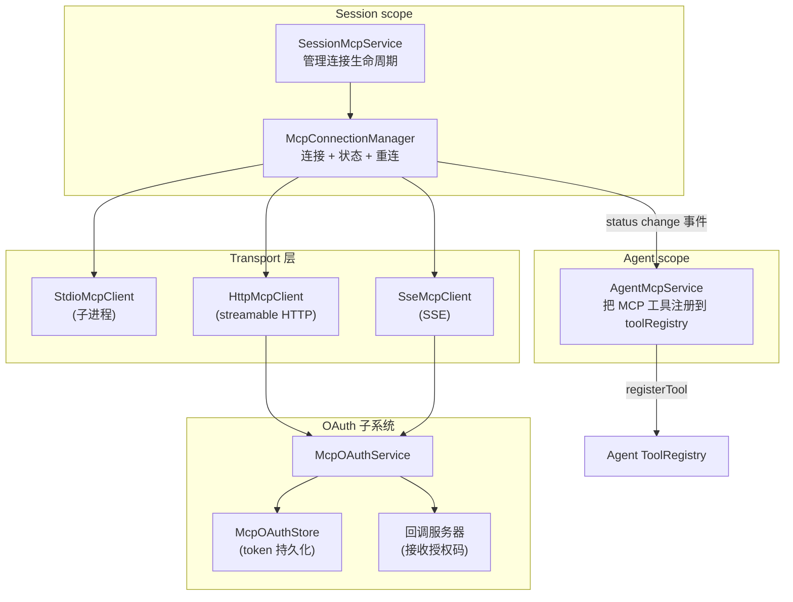
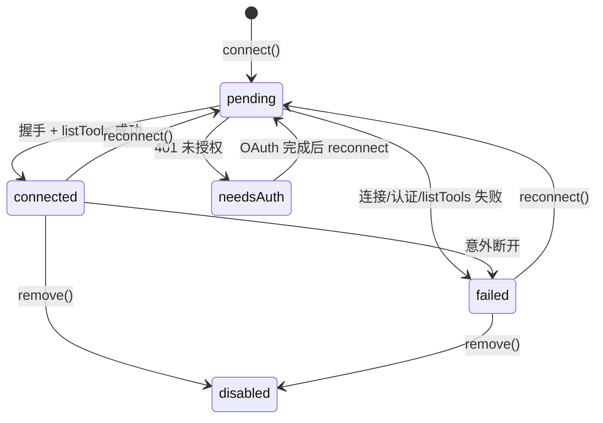
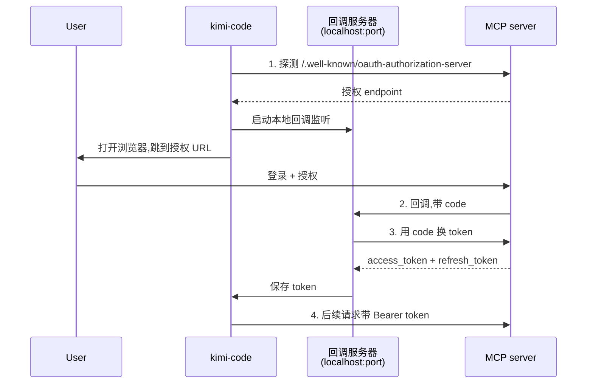

# Kimi Code · MCP 集成拆解

> 📁 **源码位置** · `packages/agent-core-v2/src/agent/mcp/` + `packages/agent-core-v2/src/session/mcp/`
>
> 📄 **核心文件** · `connection-manager.ts`(484 行,连接管理)、`mcpService.ts`(362 行,agent 层注册)、`client-stdio.ts`(182 行)、`client-http.ts`(153 行)、`client-sse.ts`(145 行)、`oauth/service.ts`
>
> 🔌 **Scope 绑定** · Session scope 管理连接;Agent scope 注册工具


## 1. 这个模块要解决什么问题

**场景**:Agent 不可能内置所有工具。用户可能想:
- 用 `filesystem` MCP 访问特定目录
- 用 `playwright` MCP 控制浏览器
- 用 `github` MCP 操作 PR
- 用 `slack` MCP 发消息

**MCP(Model Context Protocol)** 是一个开放协议,让第三方提供工具给 agent 用。kimi-code 作为 MCP 客户端,要:
- **连接**各种 transport(stdio / HTTP / SSE)的 MCP server
- **认证**(部分 server 需要 OAuth 或 API key)
- **发现工具**(连上后列出 server 提供的工具)
- **注册到 agent**(让 LLM 能看到、能调用)
- **处理故障**(server 崩溃、网络断开、认证过期)

## 2. 三层架构



三层职责:
- **Session 层**:管理连接(`McpConnectionManager`)
- **Agent 层**:把工具注册到 agent 的 tool registry
- **Transport 层**:具体的 stdio/HTTP/SSE 客户端

## 3. ConnectionManager:连接生命周期

这是 MCP 系统的核心,管理所有 server 的连接状态。

### 3.1 六种状态



| 状态 | 含义 |
|---|---|
| `pending` | 连接尝试中 |
| `connected` | 已连接,工具可用 |
| `failed` | 连接失败或意外断开 |
| `needs-auth` | 需要 OAuth 认证 |
| `disabled` | 被禁用(`enabled: false` 或 `remove()`) |

### 3.2 `connectAll`:并行启动所有 server

```typescript
// connection-manager.ts:196-213
private async connectAllNow(configs: Record<string, McpServerConfig>): Promise<void> {
  const tasks: Promise<unknown>[] = [];
  for (const [name, config] of Object.entries(configs)) {
    const disabled = config.enabled === false;
    const entry: InternalEntry = {
      name, config,
      attemptId: 0,
      status: disabled ? 'disabled' : 'pending',
    };
    this.entries.set(name, entry);
    this.emit(entry);
    if (!disabled) {
      tasks.push(this.connectOne(entry, this.beginConnectAttempt(entry)));
    }
  }
  await Promise.allSettled(tasks);      // ★ 并行,所有结果 settle 才返回
}
```

**并行连接**所有非 disabled 的 server,用 `Promise.allSettled` 等全部结束(不管成功失败)。这让启动 N 个 server 的时间约等于最慢的那个,而不是 N 个相加。

### 3.3 `connectOne`:单个 server 的连接流程

```typescript
// connection-manager.ts:242-287(简化)
private async connectOne(entry: InternalEntry, attemptId: number): Promise<void> {
  const timeoutMs = entry.config.startupTimeoutMs ?? DEFAULT_STARTUP_TIMEOUT_MS;

  try {
    // ① 创建合适的 client(stdio/http/sse)
    const client = await this.createClient(entry.config, entry.name);

    // ② 连接 + 发现工具,带超时
    const discovered = await withTimeout(
      this.connectAndDiscoverTools(client),
      timeoutMs,
      () => void this.closeRuntimeClient(client),
    );

    // ③ 检查 attemptId,防止并发竞态
    if (!this.isCurrent(entry, attemptId)) {
      await this.closeRuntimeClient(client);
      return;
    }

    // ④ 记录结果,注册意外关闭监听
    entry.tools = discovered.tools;
    entry.rawTools = discovered.rawTools;
    entry.enabledNames = computeEnabledNames(entry.config, discovered.tools);
    entry.status = 'connected';
    this.watchForUnexpectedClose(entry, client, attemptId);
  } catch (error) {
    // ⑤ 失败处理
    if (this.shouldMarkNeedsAuth(entry, error)) {
      entry.status = 'needs-auth';
      entry.error = `${entry.name} requires OAuth — run /mcp-config login ${entry.name}`;
    } else {
      entry.status = 'failed';
      entry.error = formatStartupError(error, client);
    }
    await this.closeClient(entry);
  }
  this.emit(entry);
}
```

**关键设计**:
- **`attemptId` 防竞态**:每次 reconnect 都 +1,旧 attempt 完成时检查 id,不匹配就丢弃结果。防止"A 失败 → 重连 B → A 慢慢成功 → 覆盖 B 的结果"。
- **超时保护**:默认超时(`DEFAULT_STARTUP_TIMEOUT_MS`),防止卡死的 server 阻塞 agent 启动。
- **意外关闭监听**:连接成功后注册 `onUnexpectedClose` callback,如果运行中崩溃,自动转为 `failed` 状态。

### 3.4 重连机制

```typescript
// connection-manager.ts:215-233
async reconnect(name: string): Promise<void> {
  const entry = this.entries.get(name);
  if (entry === undefined) throw new Error2(ErrorCodes.MCP_SERVER_NOT_FOUND);
  if (entry.config.enabled === false) throw new Error2(ErrorCodes.MCP_SERVER_DISABLED);

  const attemptId = this.beginConnectAttempt(entry);          // ① 新 attemptId
  await this.closeClient(entry);                              // ② 关闭旧连接

  if (!this.isCurrent(entry, attemptId)) return;              // ③ 竞态检查

  entry.status = 'pending';                                   // ④ 重置状态
  entry.tools = undefined;
  entry.error = undefined;
  this.emit(entry);

  await this.connectOne(entry, attemptId);                    // ⑤ 重新连接
}
```

**重连不会自动触发**(除了"意外关闭"会转 `failed`),需要用户显式调用 `reconnect` 或 `/mcp-config reconnect <name>`。这是有意的:避免无限重连循环消耗资源。

## 4. 三种 Transport

### 4.1 Stdio(子进程)

```typescript
// client-stdio.ts(简化)
class StdioMcpClient implements MCPClient {
  constructor(config, options) {
    this.process = spawn(config.command, config.args, {
      env: { ...process.env, ...config.env },
      stdio: ['pipe', 'pipe', 'pipe'],
      cwd: config.cwd ?? options.defaultCwd,
    });
    // 通过 stdin/stdout 用 JSON-RPC 通信
  }
}
```

**特点**:
- 跑一个本地子进程(`npx -y firecrawl-mcp` 等)
- 通过 stdin/stdout 的 JSON-RPC 通信
- 进程崩溃 = 连接断开
- 启动慢(要 npm install 等)

### 4.2 HTTP(streamable HTTP)

```typescript
// client-http.ts
class HttpMcpClient implements MCPClient {
  // 用 fetch POST 到 config.url,带 OAuth bearer 或 headers
}
```

**特点**:
- 连远程 server(例如 `https://mcp.excalidraw.com/mcp`)
- 可以走 OAuth
- 启动快(只是 HTTP 请求)
- 需要网络

### 4.3 SSE(Server-Sent Events)

类似 HTTP 但用 SSE 做长连接。主要是兼容老的 MCP server(新 server 推荐 streamable HTTP)。

## 5. OAuth 子系统

远程 MCP server 可能需要 OAuth 认证。

### 5.1 OAuth 流程



### 5.2 Token 存储

```typescript
// oauth/store.ts(简化)
class McpOAuthStore {
  async saveToken(serverName, url, token): Promise<void> {
    // 存到 ~/.kimi-code/mcp-oauth/<hash>.json
  }
  async getToken(serverName, url): Promise<Token | undefined> {
    // 读出来
  }
}
```

**持久化**:token 存到磁盘,session 重启不需要重新登录。

### 5.3 `needs-auth` 状态

如果连接时收到 401,转 `needs-auth` 状态,并自动注册一个 `mcp__<server>__auth` 工具让用户触发登录:

```typescript
// mcpService.ts:209-220
private registerNeedsAuthMcpServer(entry: McpServerEntry): void {
  this.unregisterMcpServer(entry.name);
  const oauthService = this.oauthService;
  const serverUrl = this.getRemoteServerUrl(entry.name);
  if (oauthService === undefined || serverUrl === undefined) return;
  const tool = createMcpAuthTool({
    serverName: entry.name,
    serverUrl,
    oauthService,
    reconnect: (signal) => this.reconnect(entry.name, signal),
  });
  // 注册 auth 工具
}
```

这让 LLM 看到"这个 server 没登录",可以**主动引导用户**完成 OAuth。

## 6. Agent 层:工具注册

`AgentMcpService` 把 MCP 工具注册到 agent 的 toolRegistry。

### 6.1 工具命名

```typescript
// tool-naming.ts
export function qualifyMcpToolName(serverName: string, toolName: string): string {
  return `mcp__${serverName}__${toolName}`;
}
```

**命名约定**:`mcp__<server>__<tool>`。这避免 MCP 工具和内置工具冲突,也让 UI 能识别"这是哪个 server 的工具"。

### 6.2 注册流程

```typescript
// mcpService.ts:194-208(简化)
private registerConnectedMcpServer(entry: McpServerEntry): void {
  const resolved = this.resolved(entry.name);
  if (resolved === undefined) return;

  const result = this.registerMcpServer(
    entry.name,
    resolved.client,
    resolved.tools,
    resolved.enabledNames,
  );

  // ① 工具名冲突检测
  this.emitMcpToolCollisions(entry.name, result.collisions);

  // ② 记录发现到 wire Op(可持久化、可重放)
  this.recordDiscovery(entry.name, resolved.rawTools, resolved.enabledNames, result.collisions);

  // ③ 广播 tool.list.updated 事件
  this.eventBus.publish({
    type: 'tool.list.updated',
    reason: 'mcp.connected',
    serverName: entry.name,
  });
}
```

### 6.3 工具冲突检测

如果两个 MCP server 提供同名工具,或 MCP 工具名和内置工具重名,会冲突:

```typescript
// 简化逻辑
const existing = registry.get(qualifiedName);
if (existing !== undefined) {
  collisions.push({ name: qualifiedName, existingServer, newServer });
}
```

冲突时**后注册的失败**,记入 `collisions` 列表。用户通过 `/mcp-config` 可以看到冲突详情。

### 6.4 工具数量上限

每个 MCP server 默认最多注册 100 个工具(防止恶意 server 撑爆 LLM 的 tool 列表)。超出部分被丢弃并 log warning。

## 7. 配置:三处来源

### 7.1 用户级配置

`~/.kimi-code/config.toml` 的 `[mcp]` 段:

```toml
[mcp.servers.filesystem]
command = "npx"
args = ["-y", "@modelcontextprotocol/server-filesystem", "/Users/me"]

[mcp.servers.github]
url = "https://api.githubcopilot.com/mcp/"
transport = "http"
```

### 7.2 项目级配置

`<project>/.kimi-code/mcp.json`:

```json
{
  "mcpServers": {
    "playwright": {
      "command": "npx",
      "args": ["-y", "@playwright/mcp"]
    }
  }
}
```

### 7.3 命令行 / API

通过 `kimi mcp add ...` 或 SDK 的 `registerTool` 动态添加。

## 8. 等待初始加载

Agent 不能在 MCP server 还没连上时就开始干活(那会漏掉工具)。但也不能无限等卡死的 server。

```typescript
// mcpService.ts:86-94
this._register(
  toolExecutor.hooks.onBeforeExecuteTool.register(
    'mcp-wait-for-initial-load',
    async (ctx, next) => {
      await this.waitForInitialLoad(ctx.signal);
      await next();
    },
  ),
);
```

**在工具执行前**等 initial load 完成。由于 `connectAll` 用 `Promise.allSettled`,不管 server 成功失败,initial load 都会结束 —— 不会因为一个卡死的 server 让 agent 永远阻塞。

## 9. 边界条件与失败模式

| 触发条件 | 行为 | 源码位置 |
|---|---|---|
| MCP server 子进程崩溃 | 意外关闭 → `failed` | watchForUnexpectedClose |
| 连接超时 | 超时 → `failed`,关闭 client | withTimeout |
| OAuth 401 | 转 `needs-auth`,注册 auth 工具 | shouldMarkNeedsAuth |
| 重新连接(reconnect) | 关旧连接 + 新 attemptId + 重新 connectOne | reconnect |
| 并发 reconnect 同一 server | attemptId 竞态检查,旧 attempt 结果被丢弃 | isCurrent |
| 工具名冲突 | 后注册失败,记录 collision | emitMcpToolCollisions |
| 工具数量超上限(100) | 丢弃多余工具,log warning | registerMcpServer |
| MCP server 返回错误 | 包装成 ExecutableToolResult.isError | createMcpTool |
| 网络抖动(HTTP) | 不自动重连(用户 /mcp reconnect) | 设计决策 |
| `enabled: false` 配置 | 状态 `disabled`,不连 | connectAllNow |
| Config 文件解析失败 | 跳过该 server,继续其他 | config-loader |
| Tool inputSchema 非法 | assertMcpInputSchema 抛错 | connectAndDiscoverTools |
| Resume 时 MCP 状态 | 通过 wire Op 重放 discovery | recordDiscovery |
| Session 销毁 | shutdown() 关闭所有 client | connection-manager |

## 10. 设计权衡

### 10.1 为什么 Session scope 而不是 App scope?

不同 session 可能用不同 MCP 配置(项目级配置)。Session scope 让每个 session 有独立的连接集,互不干扰。

### 10.2 为什么用 `Promise.allSettled` 而不是 `Promise.all`?

`Promise.all` 会让一个失败的 server 阻塞所有其他。`allSettled` 让每个独立完成,失败的记为 `failed`,不影响其他。

### 10.3 为什么不自动重连?

- 自动重连容易形成死循环(server 永远连不上)
- 重连会消耗资源(每次 OAuth 授权可能需要用户交互)
- 用户应该知道连接断了,而不是被静默重连掩盖

代价:用户要手动 `/mcp reconnect`,体验略差。

### 10.4 遗憾与可改进点

- **没有断线自动重连**:网络抖动很常见,应该支持指数退避的自动重连(可配置最大次数)。
- **工具数量上限 100 是硬编码**:不同 LLM 的 tool 上限不同,应该按模型配置。
- **OAuth token 刷新不主动**:access_token 过期后不会自动用 refresh_token 续期,要等 401 才触发。
- **Stdio server 没有 health check**:子进程可能"僵死"(没崩但也不响应),没有心跳检测。
- **工具冲突的解决策略单一**:只能"后注册失败",没有 rename、namespace 隔离等选项。
- **没有工具过滤**:不能"只注册 server 的前 5 个工具"或"按名字 pattern 过滤"。`enabledNames` 是基于 server 提供的列表,不是用户配置。

## 11. 一句话总结

> MCP 集成是**三层架构**:Session 层的 `McpConnectionManager` 管理所有连接的六种状态(pending/connected/failed/needs-auth/disabled);Agent 层的 `AgentMcpService` 监听状态变化,把工具按 `mcp__<server>__<tool>` 命名注册到 toolRegistry;Transport 层支持 stdio / HTTP / SSE 三种传输,远程 server 可走完整 OAuth 流程。启动时 `Promise.allSettled` 并行连接,`attemptId` 防止并发竞态,工具执行前等 initial load 完成,工具冲突和数量上限保护 tool list 不被撑爆。整个系统**容错优先**:单个 server 失败不影响其他,用户可手动重连。

## 12. 本篇用到的核心源码索引

| 概念 | 文件 | 关键行 |
|---|---|---|
| `McpConnectionManager` | `src/agent/mcp/connection-manager.ts` | 68-402 |
| `connectAll` / `connectAllNow` | `src/agent/mcp/connection-manager.ts` | 138-213 |
| `connectOne` | `src/agent/mcp/connection-manager.ts` | 242-287 |
| `reconnect` | `src/agent/mcp/connection-manager.ts` | 215-233 |
| `watchForUnexpectedClose` | `src/agent/mcp/connection-manager.ts` | 289-306 |
| `isCurrent`(竞态检查) | `src/agent/mcp/connection-manager.ts` | 381-383 |
| `createClient`(transport 选择) | `src/agent/mcp/connection-manager.ts` | 313-330 |
| `resolveOAuthProvider` | `src/agent/mcp/connection-manager.ts` | 332-342 |
| `shouldMarkNeedsAuth` | `src/agent/mcp/connection-manager.ts` | 344-350 |
| `StdioMcpClient` | `src/agent/mcp/client-stdio.ts` | — |
| `HttpMcpClient` | `src/agent/mcp/client-http.ts` | — |
| `SseMcpClient` | `src/agent/mcp/client-sse.ts` | — |
| `AgentMcpService` | `src/agent/mcp/mcpService.ts` | 全文 362 行 |
| `handleMcpServerStatusChange` | `src/agent/mcp/mcpService.ts` | 152-189 |
| `registerConnectedMcpServer` | `src/agent/mcp/mcpService.ts` | 194-208 |
| `registerNeedsAuthMcpServer` | `src/agent/mcp/mcpService.ts` | 209-220 |
| `qualifyMcpToolName` | `src/agent/mcp/tool-naming.ts` | — |
| `McpOAuthService` | `src/agent/mcp/oauth/service.ts` | — |
| `McpOAuthStore` | `src/agent/mcp/oauth/store.ts` | — |
| OAuth 回调服务器 | `src/agent/mcp/oauth/callback-server.ts` | — |
| `SessionMcpService` | `src/session/mcp/sessionMcpService.ts` | — |
| Config 加载 | `src/agent/mcp/config-loader.ts` | — |
| Config schema | `src/agent/mcp/config-schema.ts` | — |
| MCP 工具包装 | `src/agent/mcp/tools/mcp.ts` | — |

## 参考资料

- MCP 官方规范:https://modelcontextprotocol.io/
- [01-architecture.md](01-architecture.md) —— MCP 是 Session/Agent scope
- [06-tool-system.md](06-tool-system.md) —— MCP 工具走相同的 toolExecutor / 权限链
- [07-wire-protocol.md](07-wire-protocol.md) —— discovery 通过 wire Op 持久化
- [10-skills.md](10-skills.md) —— `mcp-config` 是一个内置 skill
