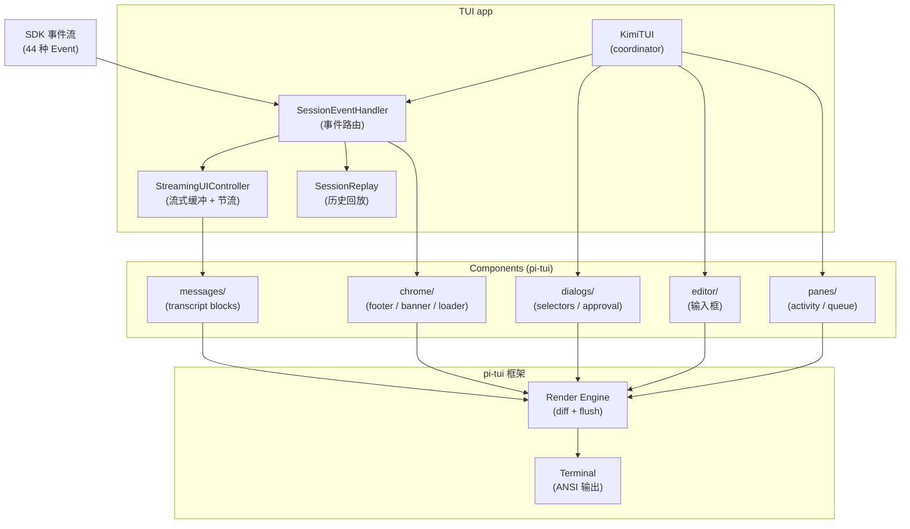
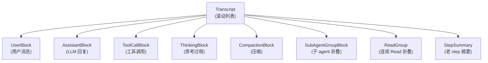
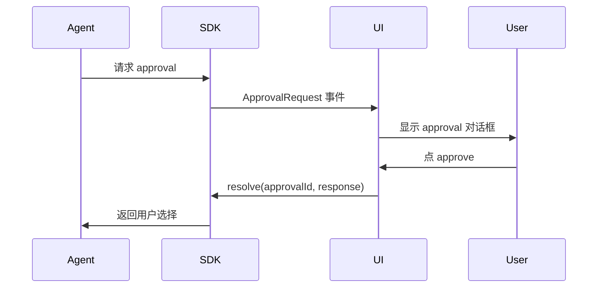

# Kimi Code · CLI/TUI 渲染系统拆解

**源码位置**:`apps/kimi-code/src/tui/` + `packages/pi-tui/`(自研底层 TUI 框架)
**核心文件**:`kimi-tui.ts`(coordinator)、`controllers/streaming-ui.ts`(流式渲染)、`controllers/session-event-handler.ts`(事件分发)
**配套 Skill**:`.agents/skills/write-tui/SKILL.md`(自己有专门 skill,说明这是核心能力)

## 1. 这个模块要解决什么问题

**场景**:Agent 输出的内容**复杂、多模态、流式**:
- LLM 一个 token 一个 token 流式返回(每秒几十个)
- 同时有 thinking、tool call、tool result 多种内容交错
- 用户随时可能按 Ctrl+C
- 长任务可能跑半小时,中间要显示进度
- 错误、警告、MCP 状态、子 agent 事件都要展示

**传统 CLI 工具**(jq/curl/git)的输出模式是"一次性打印",完全不适用。kimi-code 要做的是一个**响应式 TUI**(类似 lazygit / htop),但内容来源是异步事件流。

**核心挑战**:
- **流式渲染**:token 一来就显示,不能等整段
- **增量更新**:终端没有 DOM diff,要自己管"哪一行变了"
- **多源汇流**:LLM token、工具结果、用户输入、系统状态,要有序呈现
- **不闪烁**:rerender 不能让屏幕抖动
- **长任务可读**:几百个工具调用不能堆成天书

## 2. 整体架构:三层



**三层职责**:
- **KimiTUI**:coordinator,装配各控制器,不写业务逻辑
- **Controllers**:独立可测的责任切片(事件路由、流式渲染、回放)
- **Components**:pi-tui 组件,纯渲染

## 3. StreamingUIController:流式渲染的核心

这是整个 TUI 最复杂、最精妙的文件。

### 3.1 双缓冲 + 节流

LLM token 流速远高于终端可读速度。直接每个 token 都 rerender 会**卡死**。解法:

```typescript
// streaming-ui.ts:41-77
export class StreamingUIController {
  private flushTimer: ReturnType<typeof setTimeout> | undefined;
  private lastFlushAt: number | undefined;
  private pendingAssistantFlush = false;            // ★ 脏标记
  private pendingThinkingFlush = false;
  readonly pendingToolCallFlushIds = new Set<string>();

  // ... 双缓冲
  private _assistantDraft = '';                      // 累积的文本
  private _thinkingDraft = '';
  private _streamingBlock: { component; entry } | null = null;
}
```

**模式**:
1. token 到来 → `appendAssistantDelta(delta)` 把文本拼到 `_assistantDraft`
2. 设置 `pendingAssistantFlush = true`(脏标记)
3. flush timer 周期性检查脏标记,有就调 `onStreamingTextUpdate(整段文本)`
4. 渲染层拿到整段文本,做 diff,只重绘变化部分

**关键洞察**:**不是每个 delta 都触发渲染**,而是合并到下一个 flush tick。这把"每秒 60 次渲染请求"降到"每秒 ~30 次",对终端足够流畅。

### 3.2 appendAssistantDelta 的实现

```typescript
// streaming-ui.ts:104-115
appendThinkingDelta(delta: string): void {
  this._thinkingDraft += delta;
  this.pendingThinkingFlush = true;                 // 只标脏,不立即渲染
}

appendAssistantDelta(delta: string): void {
  if (this._streamingBlock === null) {
    this.onStreamingTextStart();                     // 第一次来,创建 block
  }
  this._assistantDraft += delta;
  this.pendingAssistantFlush = true;
}
```

注意 `onStreamingTextStart` 只在第一个 token 调用 —— 这是**懒初始化**,避免空 block 占屏幕。

### 3.3 flush 的实现

```typescript
// streaming-ui.ts:472-491
private flush(): void {
  if (!this.hasPending()) return;
  this.lastFlushAt = Date.now();

  const shouldFlushThinking = this.pendingThinkingFlush;
  const shouldFlushAssistant = this.pendingAssistantFlush;
  const toolCallIds = [...this.pendingToolCallFlushIds];

  this.pendingThinkingFlush = false;                 // 清脏标记
  this.pendingAssistantFlush = false;
  this.pendingToolCallFlushIds.clear();

  if (shouldFlushThinking && this._thinkingDraft.length > 0) {
    this.onThinkingUpdate(this._thinkingDraft);
  }
  if (shouldFlushAssistant) {
    this.onStreamingTextUpdate(this._assistantDraft);
  }
  for (const id of toolCallIds) {
    this.flushToolCallPreview(id);
  }
}
```

**单个 flush tick 处理所有待处理内容**(thinking + assistant + tool calls)。这避免了"渲染 thinking → 渲染 assistant → 渲染 tool"三次重绘,合并成一次。

### 3.4 resetToolUi:状态清理

多个时机要重置 tool UI 状态(防止上一个 step 的工具残留):

```typescript
// streaming-ui.ts:532-540
resetToolUi(): void {
  this.pendingToolCallFlushIds.clear();
  this.clearFlushTimerIfIdle();
  this._streamingToolCallArguments.clear();
  this.disposeAndClearPendingToolComponents();
  this._pendingAgentGroup = null;
  this._pendingReadGroup = null;
  this.resetToolCallState();
}
```

**调用时机**(来自 grep):
- `handleTurnBegin` —— 新 turn 开始
- `handleTurnEnd` —— turn 结束
- `handleStepBegin` —— 新 step 开始
- `handleStepInterrupted` —— step 被中断
- `handleSessionError` —— 错误后清理

**清理 ≠ 删除**:已完成的 tool call 会进入 transcript(永久记录),只是从"活动状态"里清掉。

## 4. SessionEventHandler:事件路由

44 种 SDK 事件要分门别类处理。`handleEvent` 是个巨型 switch:

```typescript
// session-event-handler.ts:235-282
handleEvent(event: Event, sendQueued: (item: QueuedMessage) => void): void {
  if (this.subAgentEventHandler.routeChildAgentEvent(event)) return;

  if ('turnId' in event && event.turnId !== undefined) {
    this.host.streamingUI.setTurnId(String(event.turnId));
  }

  switch (event.type) {
    case 'turn.started': this.handleTurnBegin(event); break;
    case 'turn.ended': this.handleTurnEnd(event, sendQueued); break;
    case 'turn.step.started': this.handleStepBegin(event); break;
    case 'turn.step.interrupted': this.handleStepInterrupted(event); break;
    case 'turn.step.completed': this.handleStepCompleted(event); break;
    case 'turn.step.retrying': break;                                 // ★ 静默(防止刷屏)
    case 'tool.progress': this.handleToolProgress(event); break;
    case 'shell.output': this.host.handleShellOutput(event); break;
    case 'shell.started': this.host.handleShellStarted(event); break;
    case 'assistant.delta': this.handleAssistantDelta(event); break;
    case 'hook.result': this.handleHookResult(event); break;
    case 'thinking.delta': this.handleThinkingDelta(event); break;
    case 'tool.call.started': this.handleToolCall(event); break;
    case 'tool.call.delta': this.handleToolCallDelta(event); break;
    case 'tool.result': this.handleToolResult(event); break;
    case 'agent.status.updated': this.handleStatusUpdate(event); break;
    case 'session.meta.updated': this.handleSessionMetaChanged(event); break;
    case 'goal.updated': this.handleGoalUpdated(event); break;
    case 'skill.activated': this.handleSkillActivated(event); break;
    case 'plugin_command.activated': this.handlePluginCommandActivated(event); break;
    case 'error': this.handleSessionError(event); break;
    case 'warning': this.handleSessionWarning(event); break;
    case 'compaction.started': this.handleCompactionBegin(event); break;
    case 'compaction.completed': this.handleCompactionEnd(event, sendQueued); break;
    case 'compaction.blocked': break;
    case 'compaction.cancelled': this.handleCompactionCancel(event, sendQueued); break;
    case 'subagent.spawned':
    case 'subagent.started':
    case 'subagent.suspended':
    case 'subagent.completed':
    case 'subagent.failed':
      this.subAgentEventHandler.handleLifecycleEvent(event); break;
    case 'background.task.started':
    case 'background.task.terminated':
      this.handleBackgroundTaskEvent(event); break;
    case 'cron.fired': this.handleCronFired(event); break;
    case 'mcp.server.status': this.renderMcpServerStatus(event.server); break;
    case 'tool.list.updated': break;                                 // ★ 静默
    default: break;
  }
}
```

**几个有意思的设计**:

### 4.1 子 agent 事件先拦截

```typescript
if (this.subAgentEventHandler.routeChildAgentEvent(event)) return;
```

子 agent 的事件先让 sub-agent handler 处理,它决定"是嵌套显示还是冒泡到主 agent"。这让 swarm 的 128 个子 agent 事件不会全部塞进主 transcript。

### 4.2 有些事件被故意忽略

- `turn.step.retrying` → 静默(重试很频繁,显示会刷屏)
- `compaction.blocked` → 静默(compaction 卡住时不想打扰用户)
- `tool.list.updated` → 静默(MCP 工具列表变化不打扰主对话)

这是**信息密度的取舍**:不是所有事件都值得用户看到。

### 4.3 MCP 状态的去重

```typescript
// session-event-handler.ts:874-877
private renderMcpServerStatus(server: McpServerStatusSnapshot): void {
  const key = mcpServerStatusKey(server);
  if (this.renderedMcpServerStatusKeys.get(server.name) === key) return;  // ★ 没变不渲染
  this.renderedMcpServerStatusKeys.set(server.name, key);
  ...
}
```

MCP 状态可能频繁发(pending → connected 的过程会发多次),用 key 去重避免刷屏。

## 5. Transcript:滚动消息列表

主区域是**transcript**(对话历史),由多个 block 组成:



### 5.1 折叠策略

长 turn 里几十个工具调用会撑爆屏幕。折叠机制:

- **`StepSummaryComponent`**:老 step 折叠成 `… thinking 5 times, call 50 tools` 一行
- **`ReadGroupComponent`**:连续的 Read 折叠成"读取了 5 个文件"
- **`AgentGroupComponent`**:swarm 的子 agent 折叠成"swarm 完成了 100/128"

```typescript
// step-summary.ts:10-31
export class StepSummaryComponent implements Component {
  private thinking = 0;
  private tool = 0;

  addCounts(thinking: number, tool: number): void {
    this.thinking += thinking;
    this.tool += tool;
  }

  render(_width: number): string[] {
    const parts: string[] = [];
    if (this.thinking > 0) parts.push(`thinking ${this.thinking} times`);
    if (this.tool > 0) parts.push(`call ${this.tool} tools`);
    if (parts.length === 0) return [];
    return [currentTheme.dim(`… ${parts.join(', ')}`)];   // dim 灰色
  }
}
```

**关键**:用 `currentTheme.dim`(灰色)显示,降低视觉优先级,让用户注意力集中在新内容。

## 6. 反向 RPC:同步交互的异步处理

agent 工作时可能要**问用户问题**(approval、question)。但 SDK 是事件流,怎么实现同步问答?



**反向 RPC 模式**:agent 发"问"事件 → UI 显示 → 用户答 → UI 通过 RPC 把答案送回去。

**对应源码**:`src/tui/reverse-rpc/`,分为:
- `approval/`:工具调用审批
- `question/`:AskUserQuestion 工具

这让 agent 看起来像"同步问用户",实际是异步事件。

## 7. 主题系统

```typescript
// theme/colors.ts(简化)
export interface ColorPalette {
  foreground: string;
  background: string;
  dim: string;
  // ... 大量语义色 token
}

export const darkColors: ColorPalette = { ... };
export const lightColors: ColorPalette = { ... };
```

**硬约束**(来自 AGENTS.md):
- **不能用 chalk 的命名色**(`chalk.red` 等)—— 必须用语义 token
- 所有颜色集中管理,加新色要先加 `ColorPalette` token
- 同步更新 4 处镜像(代码、JSON schema、英文文档、中文文档、内置 skill)

**为什么这么严**:
- 跨终端兼容(不同终端色域不同,语义 token 能降级)
- 支持自定义主题(`custom-theme` 内置 skill 让用户改色)
- 暗色/亮色自动切换(检测终端背景色)

## 8. Session Replay:历史回放

打开旧 session 时,要从 wire log 重放出 transcript。但**直接重放会刷屏**。

### 8.1 复用 live 渲染路径

`SessionReplay` 把历史 record 喂给**同一个** `StreamingUIController`,但跳过 timer(立即 flush)。这让回放和实时用同一套渲染逻辑,保证视觉一致。

### 8.2 限制策略

`utils/message-replay.ts` 实现:
- **limit**:最多回放 N 条(防止巨长 session 卡 UI)
- **projection**:某些事件类型在回放时跳过(例如 spinner 动画)

## 9. Spinner 与进度反馈

```typescript
// chrome/loader.ts(简化)
class LoaderComponent {
  private frameIndex = 0;
  private interval = setInterval(() => {
    this.frameIndex = (this.frameIndex + 1) % FRAMES.length;
    this.invalidate();                              // 标记需要重绘
  }, 80);                                           // 80ms 刷新一帧
}
```

**独立 setInterval**:spinner 不依赖事件流,自己跑。这避免了"agent 卡住 → spinner 也卡住"的问题。

## 10. pi-tui:自研 TUI 框架

kimi-code **不用 ink / blessed / tui-reddit**,而是自研了 `pi-tui`(`packages/pi-tui/`)。

### 10.1 为什么自研?

- **性能**:现有 TUI 框架基于 React,有 reconciler 开销,流式渲染跟不上 token 速度
- **终端兼容**:支持 Kitty 协议、SGR mouse、stdin paste detection 等高级特性
- **极简组件模型**:`Component` 接口只有 `render(width): string[]` 和 `invalidate()`,易学易扩展

### 10.2 Component 接口

```typescript
interface Component {
  invalidate(): void;                       // 标记需要重绘
  render(width: number): string[];          // 返回每一行的字符串
}
```

**纯函数式渲染**:`render` 输入是宽度,输出是字符串数组。状态变化通过 `invalidate` 触发重绘。这让组件易测试、易组合。

## 11. 边界条件与失败模式

| 触发条件 | 行为 |
|---|---|
| token 速度 > 渲染速度 | flush timer 合并,丢弃中间帧 |
| 终端 resize | 所有组件重新 render(width) |
| 终端不支持 256 色 | 主题降级到 16 色 |
| 用户按 Ctrl+C | 取消 turn + spinner 停止 + 错误提示 |
| 错误事件 | flushNow 强制刷新 + resetToolUi + showError |
| OAuth 错误 | 特殊提示("请 /login") |
| Compaction 开始 | 显示 CompactionComponent(进度) |
| Compaction 完成 | 把 CompactionComponent 写入 transcript |
| 子 agent spawned | 嵌套显示 / 折叠到 AgentGroup |
| MCP 状态频繁变化 | key 去重 |
| 长 turn(50+ steps) | 老 step 折叠成 StepSummary |
| 大量 Read 工具调用 | 连续的折叠成 ReadGroup |
| 用户输入(steer) | 显示到队列,turn 边界 flush |
| Replay 旧 session | 复用 live 渲染路径,跳过 spinner |
| 终端 stdout 被重定向 | 检测 TTY,降级到纯文本输出 |

## 12. 设计权衡

### 12.1 为什么自研 pi-tui 而不是用 ink?

- **性能**:流式 token 速度下,React reconciler 是瓶颈
- **控制权**:终端高级特性(kitty protocol、SGR mouse)需要底层控制
- **极简哲学**:`Component.render(width) → string[]` 比 React JSX 简单得多

代价:小众,招人难,生态薄。但对 kimi-code 这种 TUI 是核心场景的产品,值得。

### 12.2 为什么用 dirty flag + 定时 flush 而不是直接渲染?

- **性能**:合并多个 delta 到一次渲染
- **节流**:终端刷新率有限,80-120Hz 就够
- **可中断**:flush 之间可以响应中断

### 12.3 为什么 transcript 用 block 而不是字符流?

- **结构化**:每个 block 是一个语义单元(用户消息 / 工具调用 / 思考)
- **可折叠**:block 可以折叠、合并、跳过
- **可重放**:wire log 重放出的是 block,不是字符

### 12.4 遗憾与可改进点

- **`KimiTUI` 还是大**:虽然拆出了 controllers,主文件仍然几千行
- **`pi-tui` 没有文档**:外部开发者难复用
- **没有真正的"虚拟滚动"**:超长 transcript 还是会卡(目前靠折叠缓解)
- **Spinner 动画是硬编码帧**:不能根据终端刷新率自适应
- **多模态(图片)在终端展示很弱**:只能显示缩略图或路径
- **没有 ARIA / 无障碍**:视障用户完全无法用

## 13. 一句话总结

> TUI 渲染系统是**KimiTUI(coordinator)+ StreamingUIController(脏标记+定时 flush 节流)+ SessionEventHandler(44 种事件路由)+ pi-tui 组件树**的四层组合。流式 token 通过 `_assistantDraft` 累积 + `pendingAssistantFlush` 脏标记 + 定时 flush 合并,把高频事件降到可控的渲染频率;transcript 用 block 结构支持折叠(StepSummary/ReadGroup/AgentGroup);反向 RPC 模式让"agent 同步问用户"在事件流上实现;自研 pi-tui 用极简 `Component.render(width) → string[]` 接口换来流式场景下的极致性能。

## 14. 本篇用到的核心源码索引

| 概念 | 文件 | 关键行 |
|---|---|---|
| `KimiTUI` | `apps/kimi-code/src/tui/kimi-tui.ts` | 289 |
| `TUIState` | `apps/kimi-code/src/tui/tui-state.ts` | — |
| `StreamingUIController` | `apps/kimi-code/src/tui/controllers/streaming-ui.ts` | 41 |
| 双缓冲 + 脏标记 | `streaming-ui.ts` | 41-77 |
| `appendAssistantDelta` | `streaming-ui.ts` | 109-115 |
| `flush` | `streaming-ui.ts` | 472-491 |
| `resetToolUi` | `streaming-ui.ts` | 532-540 |
| `SessionEventHandler` | `controllers/session-event-handler.ts` | 120 |
| `handleEvent` | `session-event-handler.ts` | 235-282 |
| MCP 状态去重 | `session-event-handler.ts` | 874-877 |
| 子 agent 事件路由 | `session-event-handler.ts` | 236 |
| `SessionReplay` | `controllers/session-replay.ts` | — |
| `StepSummaryComponent` | `components/messages/step-summary.ts` | 全文 |
| `ThinkingComponent` | `components/messages/thinking.ts` | — |
| `ToolCallComponent` | `components/messages/tool-call.ts` | — |
| 反向 RPC | `src/tui/reverse-rpc/` | — |
| 主题系统 | `src/tui/theme/` | — |
| pi-tui Component 接口 | `packages/pi-tui/src/components/` | — |
| write-tui skill | `.agents/skills/write-tui/SKILL.md` | 必读 |
| apps/kimi-code/AGENTS.md | 硬约束(no chalk named colors 等) | 必读 |

## 参考资料

- [01-architecture.md](01-architecture.md) —— TUI 不在 agent-core-v2,是独立 app
- [04-subagent.md](04-subagent.md) —— 子 agent 事件的嵌套显示
- [07-wire-protocol.md](07-wire-protocol.md) —— wire log 是 replay 的数据源
- [08-context-memory.md](08-context-memory.md) —— Compaction 在 UI 的呈现
- [09-loop.md](09-loop.md) —— turn 事件是 TUI 的主要输入
- pi-tui(自研框架):`packages/pi-tui/`
