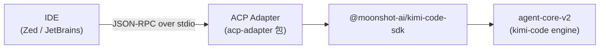

# Kimi Code · ACP / IDE 集成拆解

> 📁 **源码位置** · `packages/acp-adapter/`(独立包,适配 ACP 协议)
>
> 📄 **核心文件** · `packages/acp-adapter/src/session.ts`(780+ 行)、`packages/acp-adapter/src/auth.ts`


## 1. 为什么需要 ACP?

kimi-code 不只是 CLI,还能在 **Zed / JetBrains / VS Code** 里跑。每个 IDE 都有自己的 extension API,如果直接适配,要写 N 份代码。

**ACP(Agent Client Protocol)** 是一个开放协议(类似 LSP),定义"IDE 如何驱动一个 agent server"。只要 kimi-code 实现 ACP server,任何 ACP 客户端(IDE)都能驱动它。

## 2. ACP 的核心概念



**通信方式**:JSON-RPC 2.0 over stdio。IDE 启动 kimi-code 子进程,通过 stdin/stdout 通信。

## 3. ACP Adapter 的职责

`acp-adapter` 包是 IDE 和 SDK 之间的翻译层:

| ACP 协议概念 | kimi-code 概念 |
|---|---|
| `session/prompt` | `session.prompt(parts)` |
| `session/cancel` | `session.cancel()` |
| `ContentBlock` | `ContentPart` |
| `PromptPart` | (image compression 后转 ContentPart) |
| slash command | skill activation / builtin command |

### 3.1 图片压缩

ACP 客户端发来的图片可能很大(几 MB),adapter 在传给 engine 前先压缩:

```typescript
// session.ts:740-752
parts = await compressPromptImageParts(acpBlocksToPromptParts(blocks), {
  originalsDir: sessionMediaOriginalsDir(sessionDir),
  maxImageEdgePx: this.harness?.imageLimits?.maxEdgePx(),
  telemetry: ...,
});
```

**保留原图**:压缩前存到 `originals/` 目录,后续需要高清版时能找回。

### 3.2 Slash Command 拦截

ACP 客户端把 slash command 作为纯文本发:`/skill-name args`。adapter 要拦截:

```typescript
// session.ts:766-784
const intent = detectLeadingSlashIntent(blocks, this.skillCommandMap);
if (intent.kind === 'skill') {
  return this.runTurnBody(sessionId, conn, () =>
    this.session.activateSkill(intent.skillName, intent.args),
  );
}
if (intent.kind === 'builtin') {
  return this.runBuiltInCommand(intent.name, intent.args);
}
if (intent.kind === 'unknown') {
  return this.runUnknownSlashCommand(intent.name);
}
```

三种 slash:skill 激活 / 内置命令 / 未知命令(报错而不是发给模型)。

### 3.3 事件桥接

Engine 的事件流(SDK 的 44 种 Event)要翻译成 ACP 的 `PromptResponse`:

```typescript
// session.ts:786
return this.runTurnBody(sessionId, conn, () => this.session.prompt(parts));
```

`runTurnBody` 订阅 session 事件,边收到边 forward 给 IDE,turn 结束时返回 `PromptResponse`。

## 4. ACP 的优势

- **一份代码服务 N 个 IDE**:只要 IDE 支持 ACP,就能用 kimi-code
- **协议标准化**:不依赖具体 IDE 的 extension API
- **进程隔离**:kimi-code 崩溃不会拖死 IDE
- **语言无关**:ACP 是 JSON-RPC,任何语言都能实现客户端

## 5. 局限

- **协议限制**:ACP 的 ContentBlock 不如 kimi-code 内部的 ContentPart 丰富(例如没有 thinking part)
- **延迟**:stdio 通信有 ~10ms 延迟
- **没有 reverse RPC**:ACP 不支持 kimi-code 主动问 IDE(只在 prompt 响应里能问)
- **图片压缩损失**:adapter 压缩图片,精度有损

## 6. 一句话总结

> ACP 适配器是 IDE(Zed/JetBrains)和 kimi-code engine 之间的**翻译层**,通过 JSON-RPC over stdio 通信。它处理图片压缩、slash command 拦截、事件桥接,让一份 kimi-code 代码服务所有 ACP 兼容 IDE。

## 7. 源码索引

| 概念 | 文件 |
|---|---|
| ACP session | `packages/acp-adapter/src/session.ts` |
| 图片压缩 | `compressPromptImageParts` |
| Slash 拦截 | `detectLeadingSlashIntent` |
| Auth | `packages/acp-adapter/src/auth.ts` |

## 参考资料

- ACP 规范:https://agentclientprotocol.com/
- [13-tui-rendering.md](13-tui-rendering.md) —— TUI 是另一个前端
