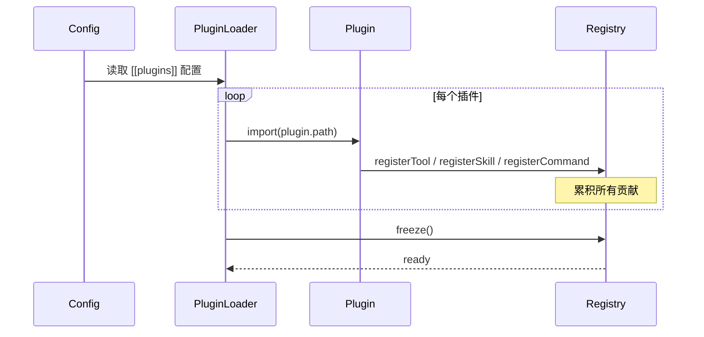

# Kimi Code · 插件系统拆解

> 📁 **源码位置** · `packages/agent-core-v2/src/app/plugin/` + `packages/agent-core-v2/src/agent/plugin/`
>
> 📄 **核心文件** · `pluginService.ts`、`pluginCatalog.ts`


## 1. 插件能贡献什么?

kimi-code 的插件可以贡献四种能力:

| 贡献点 | 用途 | 例子 |
|---|---|---|
| **Tools** | 自定义工具 | 一个 `JiraTool` 让 agent 能操作 Jira |
| **Skills** | 自定义 skill | 一个团队的工作流 skill |
| **Commands** | slash command | `/deploy` 触发部署 |
| **Guidance** | session 启动时的引导 | 注入"团队代码规范" |

## 2. 插件加载机制

### 2.1 配置声明

```toml
# ~/.kimi-code/config.toml
[[plugins]]
id = "my-team-tools"
path = "/path/to/plugin"
```

或运行时通过 SDK 注册:

```typescript
session.registerPlugin({ id: 'dynamic', source: '...' });
```

### 2.2 加载流程



**关键**:插件通过**同样的 `registerTool` / `registerSkill` API** 贡献能力(见 [06-tool-system.md](06-tool-system.md) 和 [10-skills.md](10-skills.md))。插件不是特殊机制,只是"自动调注册 API 的代码包"。

## 3. 隔离与失败处理

### 3.1 加载失败不阻塞

```typescript
// 简化
try {
  await loadPlugin(pluginConfig);
} catch (error) {
  log.error(`Plugin ${id} failed to load`, error);
  // 继续加载其他插件,不阻塞启动
}
```

### 3.2 工具调用失败隔离

插件的工具调用走**标准 toolExecutor + 权限链**(见 [06-tool-system.md](06-tool-system.md))。一个工具崩溃不会影响其他工具。

### 3.3 没有 sandbox

**重要限制**:插件和 agent 在**同一进程**,没有 sandbox。恶意插件可以任意访问文件系统、网络。这是 kimi-code 当前的**已知安全风险**。

## 4. Plugin vs Skill 的区别

| 维度 | Skill | Plugin |
|---|---|---|
| 形态 | 一个 SKILL.md 文件 | 一个代码包(可执行) |
| 贡献 | 只 prompt | 工具/skill/command/guidance |
| 加载 | 文件发现 | 配置声明 + import |
| 隔离 | 无(纯文本) | 无(同进程) |
| 复杂度 | 低 | 高 |
| 适用 | 工作流、约定 | 集成、自定义能力 |

**经验法则**:能用 skill 解决就别写 plugin。Plugin 是给"需要跑代码"的场景(例如调用内部 API)。

## 5. 一句话总结

> 插件系统让第三方代码包通过**标准 registerTool/registerSkill/registerCommand API** 贡献能力(工具/skill/command/guidance),不是特殊机制,只是自动调注册 API。加载失败不阻塞启动,工具调用走标准权限链,但**没有 sandbox**(同进程,已知风险)。

## 6. 源码索引

| 概念 | 文件 |
|---|---|
| App 级 plugin 加载 | `src/app/plugin/` |
| Agent 级 plugin 服务 | `src/agent/plugin/agentPluginService.ts` |
| Plugin session guidance | `src/agent/plugin/` |

## 参考资料

- [06-tool-system.md](06-tool-system.md) —— 插件通过 registerTool 贡献工具
- [10-skills.md](10-skills.md) —— PluginSkillSource 贡献 skill
