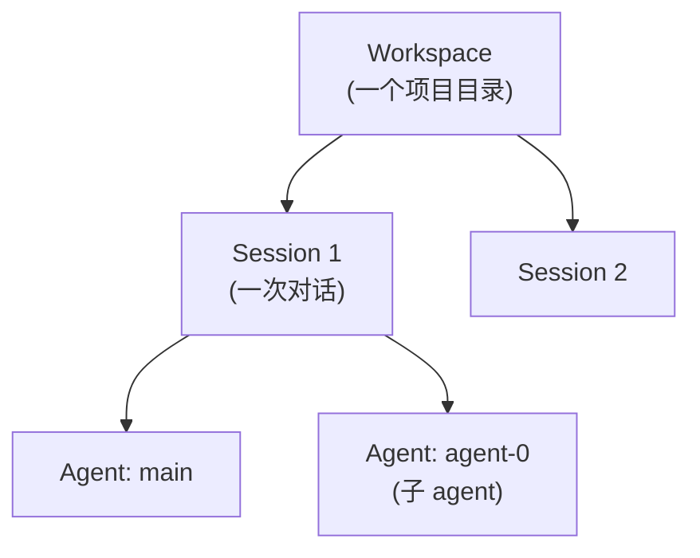
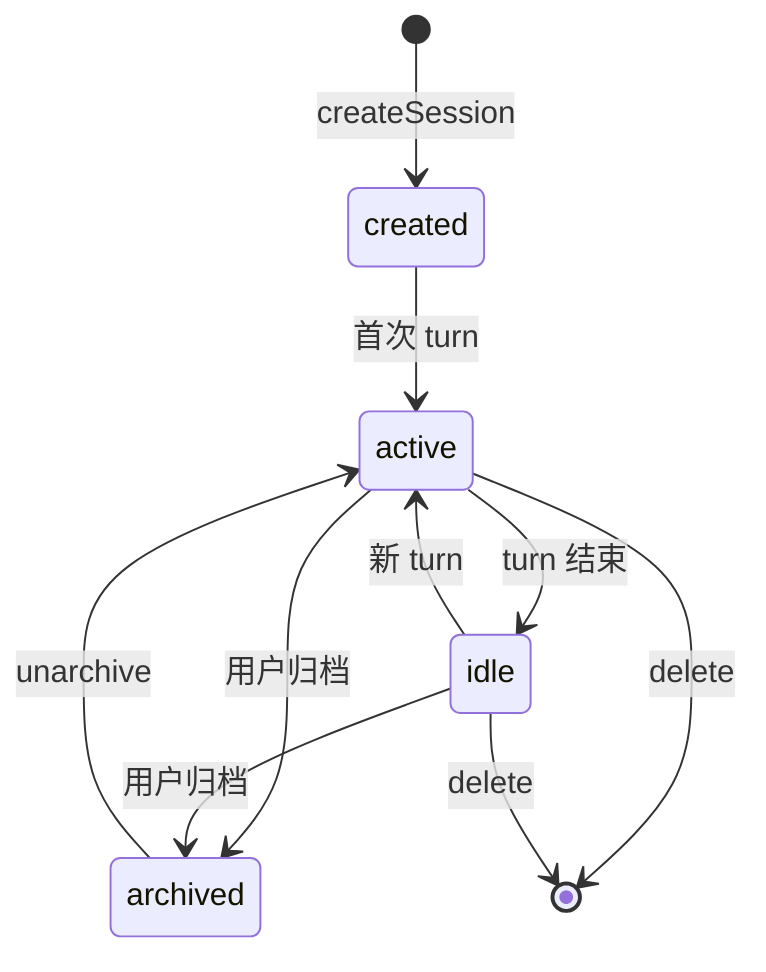

# Kimi Code · Workspace / Session 生命周期拆解

> 📁 **源码位置** · `packages/agent-core-v2/src/app/workspaceRegistry/` + `src/app/sessionLifecycle/` + `src/session/sessionLifecycle/`


## 1. 三层组织



| 层 | 对应 | 数量 |
|---|---|---|
| **Workspace** | 一个项目目录 + 配置 | 多个 |
| **Session** | 一次对话(从开始到结束) | 每 workspace 多个 |
| **Agent** | session 内的一个 agent | 每 session 多个(swarm 子 agent) |

## 2. Workspace

### 2.1 什么是 Workspace?

不是简单的"目录",而是**一组关联的 session + 共享配置**:

```typescript
interface Workspace {
  readonly id: string;
  readonly rootPath: string;                    // 项目根
  readonly createdAt: number;
  readonly customConfig?: Record<string, unknown>;
}
```

**同一个项目**的所有 session 归属同一个 workspace,共享:
- `.kimi-code/` 配置
- 项目级 skills
- 项目级 MCP 配置

### 2.2 文件布局

```
~/.kimi-code/
└── workspaces/
    └── <workspaceId>/                          ← workspace
        ├── config.json                         ← workspace 配置
        └── sessions/
            ├── <sessionId-1>/                  ← session
            │   ├── state.json
            │   └── agents/
            └── <sessionId-2>/
```

**workspaceId** 通过 `sha256(rootPath)[0:16]` 派生 —— 同一个目录永远是同一个 workspace。

## 3. Session 生命周期

### 3.1 五个状态



### 3.2 创建

```typescript
async create(input: CreateSessionInput): Promise<Session> {
  // ① 解析 workspace(用 rootPath 找或创建)
  const workspace = await this.workspaces.resolveOrCreate(input.workDir);

  // ② 派生 sessionId
  const sessionId = randomUUID();

  // ③ 创建 session scope(从 workspace 的 App scope 派生)
  const sessionScope = workspace.appScope.createChild(LifecycleScope.Session, sessionId);

  // ④ 创建 main agent
  const mainAgent = await sessionScope.accessor.get(IAgentLifecycleService).create({
    agentId: 'main',
    binding: { profile: 'default', model: input.model, cwd: input.workDir },
  });

  // ⑤ 持久化 session 元数据
  await sessionMetadata.initialize({...});

  return session;
}
```

### 3.3 Resume

Session 可以**关闭**(进程退出)后**恢复**。核心机制是 wire log 重放(见 [07-wire-protocol.md](07-wire-protocol.md)):

```typescript
async resume(sessionId: string): Promise<Session> {
  // ① 读 state.json 拿 session 信息
  const meta = await readSessionMetadata(sessionId);

  // ② 创建 session scope(同 create)
  const sessionScope = ...;

  // ③ 为每个 agent 创建 scope + restore wire log
  for (const agentId of Object.keys(meta.agents)) {
    const agent = await lifecycle.create({ agentId, ... });
    await agent.accessor.get(IWireService).restore();      // ★ 重放 wire log
  }

  return session;
}
```

### 3.4 Fork

Fork 创建一个**有相同历史但独立未来**的 session:

```typescript
async fork(sourceSessionId: string): Promise<Session> {
  // ① 创建新 session
  const newSession = await this.create(...);

  // ② 复制 source 的 wire log 到新 session
  for (const agentId of sourceAgents) {
    await appendLogStore.copy(
      sourceScope(agentId),
      newSessionScope(agentId),
    );
    // 插入 forked 标记
    await appendLogStore.append(newScope, { type: 'forked', from: sourceSessionId });
  }

  // ③ restore 让 fork 后的 session 能继续
  await newSession.restore();
}
```

**Fork 不继承 goal**(见 [03-goal-mode.md](03-goal-mode.md) §7.3)。

### 3.5 Archive / Delete

- **Archive**:标记 `archived: true`,不删除数据,从默认列表隐藏
- **Delete**:真正删除所有文件(wire log、state、blobs)

## 4. SessionIndex:跨 session 查询

见 [12-memory-and-injection.md](12-memory-and-injection.md) §4。`ISessionIndex` 提供 list/filter/sort,底层 MiniDB。

## 5. 边界条件

| 触发 | 行为 |
|---|---|
| 同一目录启动多个 kimi-code | 共享 workspace,各自独立 session |
| Session 目录被手动删除 | resume 时发现不存在,当新 session |
| Fork 时 source 正在运行 | 复制当前 wire log(可能不完整) |
| Delete 时 session 还在内存 | 先 dispose scope,再删文件 |
| Workspace config 损坏 | 用默认值 |
| 不同 OS 用户共享同一目录 | workspaceId 相同(用绝对路径 hash) |

## 6. 一句话总结

> 三层组织:Workspace(项目级,共享配置)→ Session(对话级,独立 wire log)→ Agent(agent 级,独立 scope)。Session 通过 wire log 重放实现 resume;fork 通过复制 wire log 创建分支;archive 软删除,delete 硬删除。workspaceId 通过 rootPath 的 sha256 派生,让同一目录永远是同一 workspace。

## 7. 源码索引

| 概念 | 文件 |
|---|---|
| `IWorkspaceRegistry` | `src/app/workspaceRegistry/workspaceRegistry.ts` |
| `ISessionLifecycleService` | `src/app/sessionLifecycle/sessionLifecycle.ts` |
| Session create/resume/fork | `src/app/sessionLifecycle/sessionLifecycleService.ts` |
| `ISessionIndex` | `src/app/sessionIndex/sessionIndex.ts` |

## 参考资料

- [01-architecture.md](01-architecture.md) —— Scope 树
- [04-subagent.md](04-subagent.md) —— Agent lifecycle
- [07-wire-protocol.md](07-wire-protocol.md) —— wire log 是 resume 的基础
