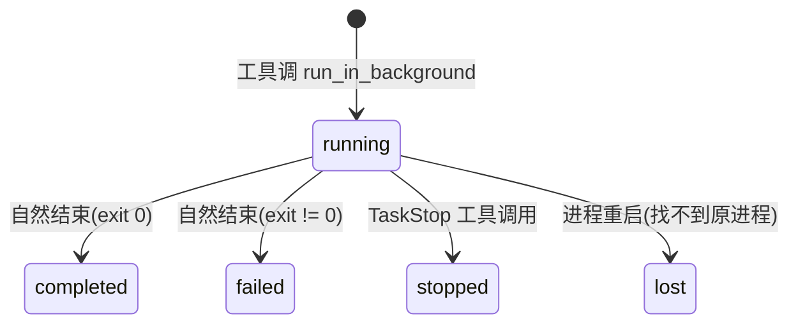

# Kimi Code · 后台 Task 系统拆解

> 📁 **源码位置** · `packages/agent-core-v2/src/agent/task/`(15 个文件)
>
> 📄 **核心文件** · `task.ts`、`taskService.ts`、`backgroundTask.ts`、`agentTask.ts`


## 1. 两种后台工作

kimi-code 的"后台"分两种,容易混淆:

| 类型 | 例子 | 管理 |
|---|---|---|
| **Shell background** | `Bash(run_in_background=true)` 跑 `npm test` | TaskService |
| **Agent background** | `Agent(run_in_background=true)` spawn 子 agent | 同上,但走 swarm 路径 |

## 2. 核心抽象

```typescript
interface Task {
  readonly id: string;
  readonly kind: 'shell' | 'agent';
  readonly description: string;
  readonly startedAt: number;
  status: 'running' | 'completed' | 'failed' | 'stopped';
  output?: string;
  exitCode?: number;
}
```

## 3. 生命周期



**`lost` 状态**:专门表示"上次进程留下来的后台任务,现在控制不了了"。UI 能看到但只能 acknowledge,不能 stop/output。

## 4. 通知机制

后台任务完成时**自动发通知**给 agent:

```typescript
// 工具描述里说
// "automatic_notification: true"
// "next_step: You will be automatically notified when it completes."
```

通知通过 **session 事件总线**走(见 [04-subagent.md](04-subagent.md) 的 `mirrorAgentRun`),以 `TaskOrigin` 注入到 context:

```typescript
origin: {
  kind: 'task',
  taskId: '...',
  status: 'completed',
  notificationId: '...',
}
```

这让 agent **被动收到通知**后能继续工作。

## 5. 输出读取

```typescript
// TaskOutput 工具
{
  task_id: "t-xxx",
  block: false,                    // 默认非阻塞
}
```

- **非阻塞**:返回当前快照(可能还在跑)
- **阻塞**(`block: true`):等到完成或 timeout

**输出截断**:大输出写到文件,TaskOutput 只返回预览 + 文件路径,让 agent 用 Read 分页读。

## 6. 与 swarm 的关系

`Agent(run_in_background=true)` 实际走的是 swarm 的 `AgentRunBatch` 调度器(见 [02-swarm.md](02-swarm.md))。区别是:
- swarm:**等所有**子 agent 完成
- background agent:**立即返回** task_id,后续通过 TaskOutput 查

## 7. 边界条件

| 触发 | 行为 |
|---|---|
| Agent 重启 | running 的 task 转 lost |
| TaskStop 已完成的 task | 返回当前状态(no-op) |
| 多个 TaskOutput 并发 | 各自拿快照,不互斥 |
| Task 输出超大 | 写文件,返回预览 |
| Session 销毁 | 等所有 task 优雅退出 |
| 超时(默认 86400s) | 自动 stop |

## 8. 一句话总结

> 后台 Task 系统支持 shell 和 agent 两类后台工作,通过 `run_in_background=true` 启动,完成时自动通知 agent。TaskOutput 非阻塞查询(默认),输出大时落盘 + 预览。进程重启后 running 转 lost。Agent background 底层走 swarm 调度器。

## 9. 源码索引

| 概念 | 文件 |
|---|---|
| `IAgentTaskService` | `src/agent/task/task.ts` |
| 实现 | `src/agent/task/taskService.ts` |
| Shell background task | `src/agent/task/backgroundTask.ts` |
| Agent background task | `src/agent/task/agentTask.ts` |

## 参考资料

- [02-swarm.md](02-swarm.md) —— Agent background 走 swarm 调度
- [06-tool-system.md](06-tool-system.md) —— Bash/Agent 工具的 run_in_background
- [09-loop.md](09-loop.md) —— steer 机制让后台通知不打断当前 turn
