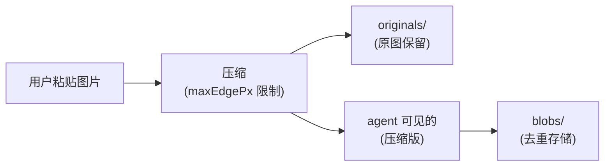

# Kimi Code · 媒体/图片处理拆解

**源码位置**:`packages/agent-core-v2/src/agent/media/`(13 个文件)
**核心文件**:`imageStore.ts`、`imageConfigBridge.ts`、`registerMediaTools.ts`、`image-originals.ts`

## 1. 处理的三种媒体

| 类型 | 来源 | 处理 |
|---|---|---|
| **截图** | 用户粘贴 | 压缩 + 存储 + LLM 可读 |
| **生成图** | image_gen 工具 | 存储 + 路径返回 |
| **视频** | 用户上传 | 路径处理(vision 模型才能读) |

## 2. 图片的三个存储层



### 2.1 压缩

```typescript
// 默认配置
maxEdgePx: 1568                       // 最长边 1568 像素
```

**为什么 1568**?这是 OpenAI / Anthropic vision API 的推荐值 —— 超过这个分辨率,模型识别能力不会提升,但 token 成本会暴涨。

### 2.2 原图保留

```typescript
// image-originals.ts
export function sessionMediaOriginalsDir(sessionDir: string): string {
  return path.join(sessionDir, 'agents', '<agentId>', 'media', 'originals');
}
```

**为什么保留原图**?压缩是有损的。后续如果用户要导出、或换更高清的模型,需要原图。

### 2.3 去重存储

压缩后的图片通过 `IAgentBlobService` 卸载到 blobs 目录(见 [12-memory-and-injection.md](12-memory-and-injection.md) §5)。相同内容只存一份。

## 3. 图片在 context 里的表示

```typescript
type ContentPart =
  | { type: 'text'; text: string }
  | { type: 'image_url'; image_url: { url: string } }    // url 是 data: 或 blobref:
  | ...;
```

**两种 URL 形式**:
- **`data:image/png;base64,...`**:内联(LLM 直接看到 base64)
- **`blobref:image/png;<sha256>`**:引用(发送给 LLM 前要 rehydrate 成 data URI)

**卸载策略**(见 [08-context-memory.md](08-context-memory.md) §7):
- < 4KB:data URI 内联(不值得卸载)
- \>= 4KB:卸载到 blob,context 里只存 blobref

## 4. ReadMediaFile 工具

让 agent 读图片/视频文件:

```typescript
// 工具参数
{
  path: "/path/to/image.png"
}

// 工具内部
const buffer = await fs.readFile(path);
const mimeType = detectMime(buffer);
const dataUri = `data:${mimeType};base64,${buffer.toString('base64')}`;
return {
  output: [{ type: 'image_url', image_url: { url: dataUri } }],
};
```

**100MB 上限**:超过拒绝读。

**敏感文件过滤**:和 Read 工具一样,拒绝 `.env`、SSH 私钥等(虽然图片理论上不会是这些,但防御性编程)。

## 5. 图片格式检测

```typescript
// 简化
function detectMime(buffer: Buffer): string {
  if (buffer.startsWith('\x89PNG')) return 'image/png';
  if (buffer.startsWith('\xFF\xD8\xFF')) return 'image/jpeg';
  if (buffer.startsWith('GIF8')) return 'image/gif';
  if (buffer.startsWith('RIFF') && buffer.slice(8, 12).equals('WEBP')) return 'image/webp';
  // ...
  return 'application/octet-stream';
}
```

**魔数检测**(不信任文件扩展名)。这让 agent 能正确读"扩展名是 .png 但实际是 jpeg"的文件。

## 6. Provider 兼容性

不同 provider 对图片格式的支持不同:
- OpenAI:支持 png/jpeg/webp/gif
- Anthropic:支持 png/jpeg/webp/gif
- Google:支持 png/jpeg/webp/heic/gif

**`gateImageFormatParts`**(在 turn 入口)过滤掉当前 provider 不支持的格式,转成文本提示:

```typescript
// turn/index.ts:155 (legacy)
const gated = gateImageFormatParts(input);
```

例如 AVIF 图片发给只支持 png/jpeg 的模型,会被替换成 `[image: avif, not supported by this model]`。

## 7. 视频

视频处理更简单 —— 大部分 provider 只支持**视频 URL**(不是 base64)。kimi-code:
- 接受视频文件路径
- 检测大小(< 100MB)
- 直接传 URL 给 LLM(LLM 自己 fetch 处理)

没有转码、压缩。如果视频太大,用户要自己处理。

## 8. 边界条件

| 触发 | 行为 |
|---|---|
| 图片 > 100MB | 拒绝读 |
| 不支持的格式 | 替换为文本提示 |
| 图片损坏 | 报错 |
| blob 文件丢失 | 替换为 `[media missing]` |
| 视频 > 100MB | 拒绝读 |
| 粘贴的图片在剪贴板 | 解码 + 压缩 + 存储 |
| 图片被 compaction 删除 | blob 也删(节省空间) |
| 多张图同时粘贴 | 各自独立处理 |

## 9. 一句话总结

> 媒体系统处理三种媒体(截图/生成图/视频),通过**三层存储**(原图 originals + 压缩版 agent 可见 + blob 去重)平衡保真和成本。图片压缩到 1568px 最长边(provider 推荐值),原图保留供后续导出。< 4KB 内联为 data URI,>= 4KB 卸载到 blob(sha256 内容寻址)。`gateImageFormatParts` 在 turn 入口过滤当前 provider 不支持的格式,避免发送失败。

## 10. 源码索引

| 概念 | 文件 |
|---|---|
| 图片工具注册 | `src/agent/media/registerMediaTools.ts` |
| `ImageConfigBridge` | `src/agent/media/imageConfigBridge.ts` |
| 原图目录 | `src/agent/media/image-originals.ts` |
| `ImageStore` | `src/agent/media/imageStore.ts` |
| `ReadMediaFile` 工具 | `src/tools/file.ts` (legacy) |
| 图片压缩 | `compressPromptImageParts` |
| `gateImageFormatParts` | turn 入口 |

## 参考资料

- [08-context-memory.md](08-context-memory.md) §7 —— Blob offload
- [12-memory-and-injection.md](12-memory-and-injection.md) §5 —— AgentBlobService
- [14-provider-llm.md](14-provider-llm.md) —— Provider vision 能力差异
