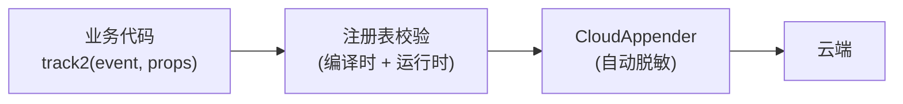
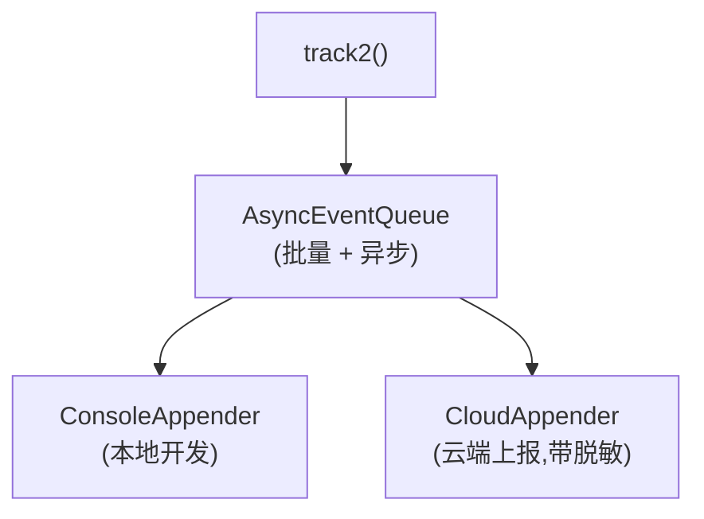

# Kimi Code · Telemetry 与隐私拆解

**源码位置**:`packages/agent-core-v2/src/app/telemetry/`
**核心文件**:`telemetry.ts`、`events.ts`(事件注册表)、`agentTelemetryContext.ts`、`cloudAppender.ts`

## 1. 为什么 Agent 框架需要 Telemetry?

不是"监控用户",而是**让自己变好**:
- 哪些功能用得多 / 用得少
- 哪里慢(p99 延迟)
- 哪里失败多(错误率)
- 用户用什么模型、什么 OS

没有 telemetry 的开源项目是"瞎子摸象",改进全靠 issue。有了 telemetry,能**数据驱动**地优化。

## 2. 核心抽象

### 2.1 `ITelemetryService`

```typescript
interface ITelemetryService {
  track(event: string, properties?: Record<string, unknown>): void;       // 底层,不推荐直接用
  track2<E extends keyof TelemetryEvents>(event: E, properties: TelemetryEvents[E]): void;  // ★ 类型安全
  withContext(context: TelemetryContext, fn: () => Promise<T>): Promise<T>;
}
```

**`track2` 是唯一推荐入口**。它在 `events.ts` 注册过的事件名 + 属性 schema,编译时检查。

### 2.2 事件注册表

所有事件必须在 `events.ts` 声明:

```typescript
// events.ts(简化)
export const telemetryEventDefinitions = {
  goal_created: defineTelemetryEvent<{
    actor: GoalActor;
    replace: boolean;
  }>({
    owner: 'goal',
    comment: 'Fired when a goal is created',
    properties: {
      actor: 'Who triggered the creation',
      replace: 'Whether this replaced an existing goal',
    },
  }),

  tool_call: defineTelemetryEvent<{
    tool_name: string;
    duration_ms: number;
    success: boolean;
    error_type?: string;
  }>({ ... }),

  // ... 几十个事件
};
```

**编译器强制**:未注册的事件名不能用,属性类型不匹配也报错。这让 telemetry 是**自文档化**的。

## 3. 命名规范(强制)

来自 `agent-core-v2/AGENTS.md`:

> - **Naming**: event names and property keys are snake_case (`tool_call`, `duration_ms`). Durations, counts, and sizes carry a unit suffix (`_ms` / `_count` / `_bytes`). Use specific names (`error_type`, not `error`).
> - **Privacy**: never register user content, prompts, or file paths as properties.

**强制 snake_case + 单位后缀**。`duration_ms` 而不是 `duration`,`error_type` 而不是 `error`。

**测试验证**:`test/app/telemetry/events.test.ts` 自动检查命名规范。

## 4. 隐私脱敏

### 4.1 三层防护



**第一层:注册表约束**。事件必须声明,业务代码不能临时加字段。

**第二层:业务自觉**。文档明确说"不要把用户内容、prompt、文件路径作为 properties"。这是**规范**,靠开发者遵守。

**第三层:CloudAppender 兜底**。即使业务失误,自动脱敏也会过滤:

```typescript
// cloudAppender.ts(简化)
function redactProperties(props: Record<string, unknown>): Record<string, unknown> {
  const out: Record<string, unknown> = {};
  for (const [key, value] of Object.entries(props)) {
    if (typeof value === 'string') {
      out[key] = redactString(value);           // URL/email/token/绝对路径
    } else {
      out[key] = value;
    }
  }
  return out;
}

function redactString(s: string): string {
  return s
    .replace(/https?:\/\/[^\s]+/g, '[URL]')           // URL
    .replace(/[\w.+-]+@[\w-]+\.[\w.-]+/g, '[EMAIL]')  // email
    .replace(/(?:sk-|Bearer )[A-Za-z0-9_-]+/g, '[TOKEN]')  // token
    .replace(/\/[^\s]+\.\w+/g, '[PATH]');             // 绝对路径
}
```

**这是 safety net,不是 license**:文档明确说"业务自觉 + 自动脱敏兜底",不能依赖兜底。

### 4.2 用户内容绝对不发

最严格的规则:

> never register user content, prompts, or file paths as properties.

**用户输入的 prompt、agent 的回复内容、文件路径** —— 这三类绝对不能进 telemetry。即使脱敏也不行(脱敏可能漏)。

要发的是**元数据**:
- ✅ `tool_name: 'Bash'`、`duration_ms: 1234`、`success: true`
- ❌ `command: 'rm -rf /'`(用户内容)
- ❌ `file_path: '/Users/me/secret.pem'`(隐私)
- ❌ `prompt: '帮我盗号'`(用户内容)

## 5. Telemetry Context

某些属性是**会话级 ambient**(无处不在),不用每次传:

```typescript
// agentTelemetryContext.ts
interface AgentTelemetryContext {
  mode: 'agent' | 'plan';     // 当前模式
  // ...
}

// 用法
this.telemetry.withContext({ mode: 'plan' }, async () => {
  await doSomething();
  // 这里面所有 track2 自动带 mode: 'plan'
});
```

这避免了"每个事件都要传 mode"的重复。

## 6. Appender 架构



- **AsyncEventQueue**:批量上报,不阻塞业务
- **ConsoleAppender**:本地开发时打日志
- **CloudAppender**:生产上报,带自动脱敏

**可关闭**:`KIMI_CODE_DISABLE_TELEMETRY=1` 完全关闭。用户有完全控制权。

## 7. 边界条件

| 触发 | 行为 |
|---|---|
| 未注册事件名 | 编译错 + 运行时 warn |
| 属性类型不匹配 | 编译错 |
| 属性含用户内容 | 文档禁止 + CloudAppender 兜底 |
| Telemetry 关闭 | track2 是 no-op |
| 网络上报失败 | 静默丢弃(不影响业务) |
| 队列满 | 丢弃最老的事件 |
| Restore 期间 | 不发(防止重复) |

## 8. 设计权衡

### 8.1 为什么强制注册表?

- **类型安全**:编译时发现错误
- **自文档化**:events.ts 就是所有事件的清单
- **稳定性**:事件名是 wire 数据,被 dashboard 消费,改名是 breaking change

### 8.2 为什么用 track2 而不是 track?

`track` 是底层 API,只用于 appender plumbing 和测试。业务必须用 `track2` 拿到类型检查。

### 8.3 遗憾

- **没有采样**:所有事件全发,高流量时可能影响性能
- **没有本地 aggregation**:不能"每分钟合并相同事件"
- **CloudAppender 的脱敏是字符串级**:结构化数据(例如嵌套对象)里的敏感信息可能漏

## 9. 一句话总结

> Telemetry 系统是**事件注册表 + 类型安全 track2 + 三层隐私防护**的组合。所有事件必须在 events.ts 声明(zod schema),编译时检查命名规范(snake_case + 单位后缀)和属性类型。三层隐私防护:注册表约束 + 业务自觉(不发用户内容/路径)+ CloudAppender 自动脱敏(URL/email/token/path)。AsyncEventQueue 批量异步上报,不阻塞业务,可一键关闭。

## 10. 源码索引

| 概念 | 文件 |
|---|---|
| `ITelemetryService` | `src/app/telemetry/telemetry.ts` |
| 事件注册表 | `src/app/telemetry/events.ts` |
| `defineTelemetryEvent` | `src/app/telemetry/events.ts` |
| `AgentTelemetryContext` | `src/app/telemetry/agentTelemetryContext.ts` |
| CloudAppender(脱敏) | `src/app/telemetry/cloudAppender.ts` |
| 命名规范测试 | `test/app/telemetry/events.test.ts` |

## 参考资料

- [03-goal-mode.md](03-goal-mode.md) —— `goal_created` 等事件
- [06-tool-system.md](06-tool-system.md) —— `tool_call` 事件
- [10-skills.md](10-skills.md) —— `skill_invoked` 事件
- `agent-core-v2/AGENTS.md` 的 Telemetry 章节(必读)
