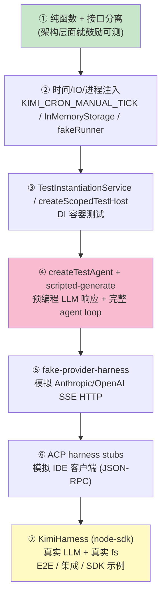
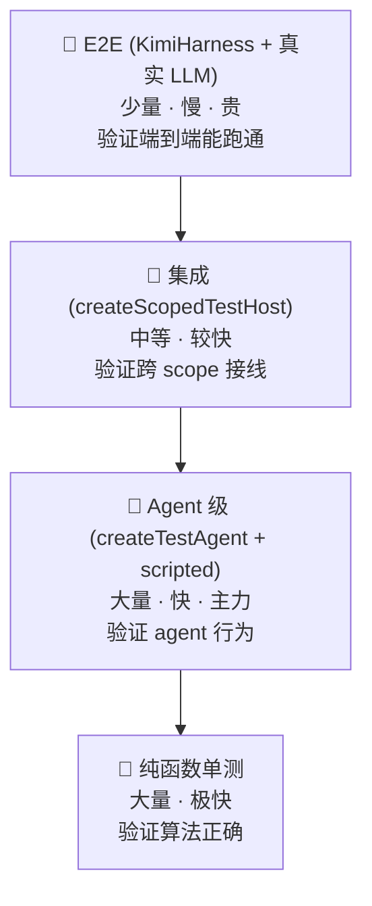

# Kimi Code · 测试 Harness 七层架构拆解

> 📁 **源码位置**
> - **核心** · `packages/agent-core-v2/test/harness/`(Agent 级)+ `test/snapshot/`(事件捕获)
> - **Provider** · `packages/kosong/test/e2e/fake-provider-harness.ts`
> - **ACP** · `packages/acp-adapter/test/_helpers/harness-stubs.ts`
> - **E2E** · `packages/node-sdk/src/kimi-harness.ts`(对外公开)
>
> 📄 **核心文件** · `test/harness/agent.ts`(createTestAgent,~1000 行) · `test/harness/scripted-generate.ts`(150 行,LLM mock) · `test/harness/snapshots.ts`(事件快照) · `packages/kosong/test/e2e/fake-provider-harness.ts`(HTTP/SSE mock)
>
> 🔌 **测试金字塔** · 纯函数单测(底)→ DI scope 测试 → Agent 级集成 → Provider fake → ACP stub → E2E harness(顶)

## 1. 这个模块要解决什么问题

Agent 框架的测试**极其困难**,因为它有三个不可控的依赖:

| 依赖 | 为什么难测 |
|---|---|
| **LLM** | 不可预测、贵、慢、有 side effect(花钱) |
| **文件系统** | 真实 IO 慢,污染开发环境 |
| **时间** | Cron 要等真实时间流逝,测试不能等 |

如果直接写测试,你会陷入:
- 每次测试都调真实 LLM API(几块钱一次,几秒延迟)
- 测试产生的 session 文件污染 `~/.kimi-code/`
- Cron 测试要等几分钟才能看结果
- LLM 每次返回不同内容,无法断言

**kimi-code 的解法**:**七层 harness**,每一层用一个可注入的"假货"替换一个不可控依赖。从底到顶,假货越来越少,真实度越来越高,测试越来越慢。

## 2. 七层全景



每一层解决的问题:
- **L1**:让大部分代码**本身就是纯函数**,不用 harness
- **L2**:把时间/IO/进程变成**可注入**的
- **L3**:把 DI scope 变成**可测试容器**
- **L4**:把 LLM 变成**可编程的演员** ← 精华层
- **L5**:把 HTTP 层变成**本地 mock server**
- **L6**:把 IDE 变成**假客户端**
- **L7**:接受真实世界,做**端到端验证**

## 3. 第 ① 层:纯函数 + 接口分离

最底层的"测试性"不在 test 目录,在**架构本身**。

### 3.1 纯函数

大量核心逻辑是纯函数,不需要任何 harness:

```typescript
// parser.ts(来自 10-skills.md)
export function parseSkillText(options: ParseSkillTextOptions): SkillDefinition {
  // 纯函数:输入文本 → 输出 SkillDefinition,无 side effect
}

// 测试
expect(parseSkillText({ text: '---\nname: x\n---\nbody' }).name).toBe('x');
```

类似的还有:
- Op 的 `apply` 函数(`(state, payload) → newState`)
- `resourceAccessesConflict`(冲突检测)
- `computeCompactCount`(compaction 窗口算法)
- `renderSystemPrompt`(模板渲染)

### 3.2 接口分离

所有 Service 都是 `IXxx` 接口 + `XxxServiceImpl` 实现:

```typescript
// 接口
export interface IAgentGoalService {
  readonly _serviceBrand: undefined;
  getGoal(): GoalToolResult;
  createGoal(input: CreateGoalInput): Promise<GoalSnapshot>;
  // ...
}

// 实现
export class AgentGoalService extends Disposable implements IAgentGoalService { ... }
```

测试时**按接口解析**,可以注入任何 stub。这让"换实现"零成本。

### 3.3 为什么这层最重要

**架构本身鼓励可测**,上层 harness 才能优雅。如果代码满屏副作用、紧耦合、没接口,harness 会变成噩梦。kimi-code 的 DI × Scope 架构(见 [01-architecture.md](01-architecture.md))是 harness 的**地基**。

## 4. 第 ② 层:时间 / IO / 进程注入

三个不可控的物理依赖,通过注入变成可控。

### 4.1 时间注入(Cron)

```typescript
// 来自 19-cron.md
constructor(agent: Agent, opts: CronManagerOptions = {}) {
  this.scheduler = createCronScheduler({
    clocks: opts.clocks ?? SYSTEM_CLOCKS,
    isKilled: () => process.env['KIMI_DISABLE_CRON'] === '1',
    pollIntervalMs: process.env['KIMI_CRON_MANUAL_TICK'] === '1'
      ? null                    // ★ 关闭 setInterval
      : opts.pollIntervalMs,
    // ...
  });
}
```

**环境变量驱动**:
- `KIMI_CRON_MANUAL_TICK=1`:关闭自动 tick,测试用 `tick()` 手动推进时间
- `KIMI_DISABLE_CRON=1`:完全关掉 cron(测试不依赖时间)
- `KIMI_CRON_NO_STALE=1`:不做 stale 检测(测试用旧 timestamp)

这让"5 分钟后触发的 cron"在测试里**毫秒级完成**。

### 4.2 文件系统注入

四种存储接口(见 [12-memory-and-injection.md](12-memory-and-injection.md))都有内存实现:

```typescript
// 生产:真实磁盘
const fs = new FileStorageService();

// 测试:内存 Map
const mem = new InMemoryStorageService();
```

接口相同(`IAtomicDocumentStore` / `IAppendLogStore` / `IBlobStore` / `IQueryStore`),替换零成本。

**InMemoryWireRecordPersistence**(test/harness/agent.ts):

```typescript
export class InMemoryWireRecordPersistence implements WireRecordPersistence {
  readonly records: WireRecord[];

  constructor(records: readonly WireRecord[] = []) {
    this.records = records.map(cloneRecord);
  }

  read(): AsyncIterable<WireRecord> {
    return this.records.values();           // 内存迭代
  }

  append(event: WireRecord): void {
    this.records.push(event);               // 不碰磁盘
  }

  rewrite(records: readonly WireRecord[]): void {
    this.records.length = 0;
    this.records.push(...records);
  }
}
```

这让 wire log 的测试完全不碰磁盘,毫秒级。

### 4.3 子进程注入

```typescript
// fakeRunner 实现 ISessionProcessRunner
const runner = createFakeProcessRunner({
  'ls': { stdout: 'file1\nfile2\n', exitCode: 0 },
  'git status': { stdout: 'nothing to commit', exitCode: 0 },
});
```

预设命令的输出,让 Bash 工具的测试不跑真实 shell。

### 4.4 虚拟文件系统

```typescript
// createFakeHostFs
const fs = createFakeHostFs({
  '/home/test/file.txt': 'content',
  '/home/test/empty': '',
});
```

让 ReadFile / WriteFile / Glob / Grep 工具在**虚拟文件系统**上跑,不碰真实磁盘。

## 5. 第 ③ 层:DI scope 测试容器

两个 harness,对应不同测试粒度(见 [01-architecture.md](01-architecture.md) §场景 10):

### 5.1 TestInstantiationService(扁平容器)

```typescript
// 测单个服务的行为
const ix = new TestInstantiationService();
ix.set(ISut, new SyncDescriptor(Sut));
ix.set(IDep, new SyncDescriptor(StubDep));   // 注入 stub 依赖
const sut = ix.get(ISut);

expect(sut.doSomething()).toBe(...);
```

**特点**:不构建 scope 树,扁平容器。适合**单域单测**。

### 5.2 createScopedTestHost(scope 树)

```typescript
// 测跨 scope 接线
const host = createScopedTestHost({
  appSeeds: [...],
  sessionSeeds: [...],
  agentSeeds: [...],
});

const sessionMeta = host.session.accessor.get(ISessionMetadata);
const goalService = host.agent.accessor.get(IAgentGoalService);
```

**特点**:构建完整的 App → Session → Agent 树。适合**跨 scope 集成测试**(例如"goal 改了之后,session 元数据是否更新")。

### 5.3 核心规则

> **按接口解析被测对象,绝不 `new` 带 `@IService` 依赖的实现类。**

否则 `registerScopedService(IX → Impl)` 这条绑定在测试里根本没跑过 —— 测了等于没测。

## 6. 第 ④ 层:Agent 级 harness(★ 精华)

这是 kimi-code 最核心、最有特色的 harness 层。三个组件协同:

### 6.1 createScriptedGenerate(预编程 LLM)

`test/harness/scripted-generate.ts` —— 把不可控的 LLM 变成可编程的"演员":

```typescript
export function createScriptedGenerate() {
  const calls: GenerateCall[] = [];
  const responses: ScriptedResponse[] = [];
  let assertedCallCount = 0;                          // ★ 追踪断言进度

  function mockNextResponse(...response: StreamedMessagePart[]) {
    responses.push({ parts: structuredClone(response) });
  }

  const generate: GenerateFn = async (_chat, systemPrompt, tools, history, callbacks, options) => {
    options?.signal?.throwIfAborted();

    const response = responses.shift();               // 取下一个预设响应
    if (response === undefined) {
      throw new Error(`Unexpected generate call #${String(calls.length + 1)}`);
    }

    // 记录 LLM 收到的输入(用于后续断言)
    const input = normalizeGenerateInput({
      systemPrompt,
      tools: tools.map(({ name, description, parameters }) => ({ name, description, parameters })),
      history: structuredClone(history),
    });
    calls.push(input);

    // 模拟流式回调
    for (const part of response.parts) {
      await callbacks?.onMessagePart?.(structuredClone(part));
      options?.signal?.throwIfAborted();              // 支持中途取消
    }

    // 返回完整结果
    return { id: `mock-${calls.length}`, message, usage: ..., finishReason, ... };
  };

  return {
    generate,
    calls,
    lastInput() { ... },          // ★ 断言最后一次调用,且只能断言一次
    inputs() { ... },             // 批量断言
    mockNextResponse,
    mockNextProviderResponse,
  };
}
```

**四个精妙设计**:

**① 预设响应序列**:

```typescript
gen.mockNextResponse({ type: 'tool_call', id: 'tc1', name: 'Bash', arguments: '{"command":"ls"}' });
gen.mockNextResponse({ type: 'text', text: 'Done' });
```

像排队一样,第 1 次调用返回工具调用,第 2 次返回文本。这让"多轮工具调用"完全可控。

**② 输入记录**:

```typescript
const input = gen.lastInput();
expect(input.tools).toContainEqual(expect.objectContaining({ name: 'Bash' }));
expect(input.history).toHaveLength(3);
```

测试可以断言"LLM 收到了什么",不只是"LLM 返回了什么"。这让"权限链是不是过滤了危险工具"这种测试成为可能。

**③ 未断言调用追踪**(`assertedCallCount`):

```typescript
lastInput() {
  const pendingCount = calls.length - assertedCallCount;
  if (pendingCount === 0) {
    throw new Error('No unasserted LLM input.');
  }
  if (pendingCount > 1) {
    throw new Error(`Expected one unasserted input, but ${pendingCount} were produced.`);
  }
  assertedCallCount = calls.length;
  return generateInputSnapshot(calls.at(-1)!, calls.at(-2));
}
```

**防止测试退化**:如果 agent 多调或少调了一次 LLM,`lastInput()` 会报错。这强制测试**每次调用都被断言**,不能偷偷多调一次。

**④ 真实的流式语义**:

```typescript
for (const part of response.parts) {
  await callbacks?.onMessagePart?.(structuredClone(part));   // 逐个 part 回调
  options?.signal?.throwIfAborted();                         // 中途可取消
}
```

虽然是 mock,但**保留了流式的语义**(逐 part 回调 + abort 检查)。这让 compaction、steer、取消等逻辑都能在 mock 下测试。

### 6.2 createTestAgent(组装 mini agent)

`test/harness/agent.ts`(~1000 行)—— 把所有 Agent scope 服务装进测试容器:

```typescript
// 简化伪代码
export function createTestAgent(options: TestAgentOptions): TestAgentContext {
  const generate = createScriptedGenerate();

  // 构建完整的 App → Session → Agent scope 树
  const scope = createAppScope({
    seeds: [
      [IConfigService, mockConfig(options.config)],
      [IHostFileSystem, createFakeHostFs(options.files)],
      [ISessionProcessRunner, createFakeProcessRunner(options.commands)],
      // ... 大量 stub
    ],
  });

  const sessionScope = scope.createChild(LifecycleScope.Session, 'test-session');
  const agentScope = sessionScope.createChild(LifecycleScope.Agent, 'main');

  // 用 scripted generate 替换真实的 LLM 调用
  const llmRequester = agentScope.accessor.get(IAgentLLMRequesterService);
  llmRequester.overrideGenerate(generate.generate);          // ★ 关键:注入 mock

  return {
    agent: agentScope,
    generate,                                                  // 暴露给测试断言
    events: recordAgentEvents(),                               // 事件捕获
    // ...
  };
}
```

**测试用法**:

```typescript
const ctx = createTestAgent({
  config: { defaultModel: 'mock-model', ... },
  files: { '/home/test/test.ts': 'export const x = 1;' },
});

// 预设 LLM 响应
ctx.generate.mockNextResponse(
  { type: 'tool_call', name: 'ReadFile', arguments: '{"path":"/home/test/test.ts"}' }
);
ctx.generate.mockNextResponse({ type: 'text', text: 'The file exports x = 1.' });

// 跑一个 prompt
await ctx.agent.accessor.get(IAgentPromptService).enqueue({
  message: { role: 'user', content: [{ type: 'text', text: 'What does test.ts export?' }] },
}).launched;

// 断言 LLM 收到了正确的 system prompt + tools
const input = ctx.generate.lastInput();
expect(input.systemPrompt).toContain('Kimi Code CLI');
expect(input.tools.map(t => t.name)).toContain('ReadFile');

// 断言事件流
const snapshot = ctx.events.snapshot();
expect(snapshot).toContainEqual({ type: 'turn.started' });
expect(snapshot).toContainEqual({ type: 'tool.call.started', name: 'ReadFile' });
```

**这是一个完整的 agent 跑在测试容器里**,LLM 可控、fs 可控、事件可捕获,但 loop/tool/permission/context 全是真的。

### 6.3 snapshots(事件 / wire 快照)

`test/harness/snapshots.ts` + `test/snapshot/events.ts`:

```typescript
// 事件捕获器
const events = recordAgentEvents();

// 订阅 agent 的事件流
agentScope.accessor.get(IEventBus).subscribe('*', (e) => events.record(e));

// 跑完 agent 后,生成快照
const snapshot = events.snapshot();
expect(snapshot).toMatchInlineSnapshot(`
  [
    { "type": "turn.started", "turnId": 0 },
    { "type": "tool.call.started", "toolCallId": "tc1", "name": "ReadFile" },
    { "type": "tool.result", "toolCallId": "tc1" },
    { "type": "turn.ended", "reason": "completed" },
  ]
`);
```

**三个能力**:

1. **`snapshot()`**:把事件流序列化成可 snapshot 的数组
2. **`waitFor(event)`**:异步等待某个事件(测试异步行为)
3. **`take(event)`**:拦截某个事件并 mock 其响应(测试 reverse RPC)

这让"agent 跑完应该产生这些事件"变成 `toMatchInlineSnapshot` 一行断言。改代码后 snapshot 变了,git diff 一眼看到行为变化。

### 6.4 TestAgentContext 完整接口

```typescript
interface TestAgentContext {
  readonly agent: IAgentScopeHandle;
  readonly generate: ReturnType<typeof createScriptedGenerate>;
  readonly events: ReturnType<typeof recordAgentEvents>;

  // 便捷方法
  lastLlmInput(): GenerateInputSnapshot;
  llmInputs(): GenerateInputsSnapshot;
  eventSnapshot(): EventSnapshot;
  wireSnapshot(): readonly WireSnapshotEntry[];

  // 异步等待
  waitForEvent(event: string): Promise<EventSnapshot>;
  waitForTurnEnd(): Promise<void>;
}
```

测试通常的模式:

```typescript
test('agent calls ReadFile then answers', async () => {
  ctx.generate.mockNextResponse(/* tool_call ReadFile */);
  ctx.generate.mockNextResponse(/* text answer */);

  await prompt(ctx, 'read test.ts');

  expect(ctx.lastLlmInput().history).toHaveLength(/* user + tool_result */);
  expect(ctx.eventSnapshot()).toMatchInlineSnapshot();
});
```

## 7. 第 ⑤ 层:Provider fake harness

`packages/kosong/test/e2e/fake-provider-harness.ts` —— 测试 provider 适配器本身。

### 7.1 为什么需要这一层?

`createScriptedGenerate` 替换的是 `generate()` 函数,跳过了 provider 适配器。但如果要测"Anthropic 的 SSE 解析对不对",需要让 provider **以为自己在和真实 API 通信**。

### 7.2 本地 mock HTTP server

```typescript
export async function startFakeProvider(): Promise<FakeProviderHarness> {
  const server = node_http.createServer(/* 路由处理 */);
  await new Promise(resolve => server.listen(0, '127.0.0.1', resolve));

  return {
    baseUrl: `http://127.0.0.1:${server.address().port}`,
    requests: [],                                   // ★ 记录所有请求
    route(method, pathname, handler) {
      // 注册路由处理
    },
    close() { return close(server); },
  };
}
```

**真实 HTTP server**,但跑在 localhost 随机端口。provider adapter 用 `baseUrl` 指向它,完全不知道是假的。

### 7.3 路由 + 响应

```typescript
const fake = await startFakeProvider();

fake.route('POST', '/v1/messages', (req, reply) => {
  // 模拟 Anthropic 的 SSE 响应
  reply.sseJson(200, [
    { type: 'message_start', message: { ... } },
    { type: 'content_block_start', index: 0, content_block: { type: 'text', text: '' } },
    { type: 'content_block_delta', index: 0, delta: { type: 'text_delta', text: 'Hello' } },
    { type: 'content_block_stop', index: 0 },
    { type: 'message_delta', delta: { stop_reason: 'end_turn' } },
    { type: 'message_stop' },
  ]);
});

// 用 fake.baseUrl 创建 provider
const provider = new AnthropicChatProvider({
  apiKey: 'test',
  baseUrl: fake.baseUrl,
  model: 'claude-3-5-sonnet',
});

// 跑 generate
const result = await generate(provider, sys, tools, history);
expect(result.message.content[0].text).toBe('Hello');

// 断言 provider 发出的请求
expect(fake.requests[0].bodyJson).toMatchObject({
  model: 'claude-3-5-sonnet',
  max_tokens: 4096,
});
```

**五种响应方式**:
- `json(status, body)`:普通 JSON
- `text(status, body)`:纯文本
- `raw(status, body)`:原始字节
- `sseLines(status, lines)`:SSE 文本行
- `sseJson(status, events)`:SSE JSON 事件序列

这让"OpenAI Responses 的 reasoning item 解析"这种测试**完全不依赖真实 API**。

## 8. 第 ⑥ 层:ACP / IDE harness

`packages/acp-adapter/test/_helpers/harness-stubs.ts` —— 测试 ACP adapter。

### 8.1 模拟 IDE 客户端

ACP adapter 是"IDE 和 engine 之间的翻译层"。测试它需要一个"假 IDE"发 JSON-RPC、接收事件。

```typescript
// harness-stubs.ts(简化)
export function createAcpHarnessStubs() {
  return {
    // 假的 session(模拟 engine 返回)
    session: createMockSession(),

    // 假的 connection(模拟 stdio)
    conn: createMockConnection(),

    // 事件捕获
    events: [] as Event[],

    // 模拟 IDE 发送的消息
    sendPrompt(blocks: ContentBlock[]): Promise<PromptResponse> { ... },
    sendCancel(): void { ... },
  };
}
```

### 8.2 测试场景

```typescript
test('ACP adapter translates slash command to skill activation', async () => {
  const harness = createAcpHarnessStubs();
  harness.session.skillCommandMap.set('review-pr', { name: 'review-pr', ... });

  const response = await harness.sendPrompt([
    { type: 'text', text: '/review-pr https://github.com/...' },
  ]);

  expect(harness.session.activatedSkill).toBe('review-pr');
});
```

这让"Zed 发的 slash 命令能不能正确激活 skill"在本地测试,不需要真装 Zed。

## 9. 第 ⑦ 层:KimiHarness(对外公开的 E2E)

`packages/node-sdk/src/kimi-harness.ts` —— **最顶层**的 harness,使用真实 LLM。

### 9.1 这是给外部用户用的

```typescript
import { createKimiHarness } from '@moonshot-ai/kimi-code-sdk';

const harness = await createKimiHarness({ identity: ... });

const session = await harness.createSession({ workDir: '/path/to/project', model: 'kimi-k2' });
await session.prompt('hello');

for await (const event of session.events) {
  console.log(event);
}
```

**这是 SDK 消费者的入口**。它:
- 跑真实的 agent-core-v2 engine
- 调真实的 LLM API
- 读写真实的文件系统

### 9.2 用途

- **SDK 示例代码**(`packages/node-sdk/examples/` 全是这种)
- **集成测试**(端到端验证,慢但真实)
- **Smoke test**(CI 里跑一遍"能不能 work")
- **第三方集成**(其他工具用 SDK 驱动 kimi-code)

### 9.3 Docker e2e

`packages/klient` 有 `docker:e2e` 脚本:

```bash
pnpm --filter @moonshot-ai/klient docker:e2e
```

在 Docker 里跑 kap-server + klient,做**完整的 HTTP/WebSocket 集成测试**。这验证了"server 模式下,跨进程通信对不对"。

## 10. 测试金字塔



**主力是 Agent 级**(`createTestAgent`),因为 agent 的很多行为只有在 loop 跑起来才能验证:
- 权限决策
- context 注入(reminder)
- 工具调度(并行/串行)
- goal continuation
- swarm 并发

纯函数单测覆盖底层(parser、op apply、冲突检测),E2E 覆盖端到端。

## 11. 边界条件与设计权衡

### 11.1 "断言驱动"防退化

`createScriptedGenerate` 的 `assertedCallCount` 是**最精妙的设计**。

如果测试只预设响应但不检查输入,agent 可能悄悄多调一次 LLM(例如 bug 导致重复调用)而测试还过。`lastInput()` 强制每次调用都要被断言:

```typescript
if (pendingCount > 1) {
  throw new Error(`Expected one unasserted input, but ${pendingCount} were produced.`);
}
```

这把"LLM 调用次数"变成了**强约束**,而不是"测试碰巧没检查就算了"。

### 11.2 为什么用内存后端而不是临时目录?

临时目录(tmpdir)的问题:
- 慢(真实 IO)
- 并发不安全(多个测试同时写)
- 残留(测试崩溃不清理)
- 跨平台路径差异

内存后端彻底解决这些问题。代价是不能测"真实 fs 的边缘行为"(例如权限、symlink),但这些是少数,可以用专门的集成测试覆盖。

### 11.3 为什么不直接 mock fetch?

可以 mock `fetch` 来模拟 provider 响应,但:
- mock fetch 是**全局**的,影响所有 HTTP 调用(包括 telemetry、MCP)
- SSE 流的 mock 很复杂(要模拟 chunked transfer)
- 不同 provider 的请求/响应格式不同,mock 代码会爆炸

`fake-provider-harness` 用**本地 HTTP server**更真实,且隔离(只影响指向它的 provider)。

### 11.4 为什么有七层,不是三层?

经典三层(单测/集成/E2E)对 agent 不够,因为 agent 有**特殊的不可控依赖**(LLM、provider SSE、fs、时间、IDE 协议)。每一层针对一个依赖,可以独立替换:

| 层 | 替换的依赖 |
|---|---|
| ② 时间注入 | 真实时间 |
| ② 内存 fs | 真实磁盘 |
| ② fakeRunner | 真实 shell |
| ③ DI 测试容器 | 真实 scope 树 |
| ④ scripted generate | 真实 LLM |
| ⑤ fake provider | 真实 HTTP API |
| ⑥ ACP stubs | 真实 IDE |

这种"**正交替换**"让测试可以精确控制真实度:只替换需要替换的,其他保持真实。

### 11.5 遗憾与可改进点

- **没有 snapshot fuzzing**:LLM 输入是结构化的,可以 fuzz(例如随机生成 tool_call 序列)
- **没有性能基准测试**:createTestAgent 可以做 benchmark,但当前没有标准化
- **E2E 太贵**:KimiHarness 调真实 LLM,CI 里跑又慢又贵。可以用 provider fake 替代部分 E2E
- **事件快照不稳定**:不同 OS/Node 版本可能产生略微不同的事件序列,snapshot 容易 flaky
- **没有可视化测试报告**:测试失败时只有 stack trace,没有"agent 跑到哪一步、LLM 说了什么"的可视化

## 12. 一句话总结

> kimi-code 的测试 harness 是**七层金字塔**:① 纯函数+接口分离(架构层就鼓励可测)→ ② 时间/IO/进程注入(`KIMI_CRON_MANUAL_TICK` / `InMemoryStorageService` / `fakeRunner`)→ ③ DI 测试容器(`TestInstantiationService` / `createScopedTestHost`)→ ④ Agent 级 harness(`createTestAgent` + `createScriptedGenerate` 把 LLM 变成可编程演员 + `assertedCallCount` 防退化 + 事件快照断言)→ ⑤ Provider fake harness(本地 HTTP server 模拟 Anthropic/OpenAI SSE)→ ⑥ ACP stubs(模拟 IDE 客户端)→ ⑦ KimiHarness(真实 LLM,公开 SDK,E2E)。**最精妙的是 `createScriptedGenerate`** —— 预设响应序列 + 记录 LLM 输入 + 强制每次调用被断言,把"不可控的 LLM"变成"可验证的演员"。整套设计的基石是**架构本身鼓励可测**(纯函数 + 接口分离 + DI + 存储接口统一),harness 只是顺势而为。

## 13. 本篇用到的核心源码索引

| 概念 | 文件 | 关键行 |
|---|---|---|
| Agent 级 harness 入口 | `test/harness/index.ts` | 全文 |
| `createTestAgent` | `test/harness/agent.ts` | 全文 ~1000 行 |
| `InMemoryWireRecordPersistence` | `test/harness/agent.ts` | 215+ |
| `createScriptedGenerate` | `test/harness/scripted-generate.ts` | 全文 150 行 |
| `mockNextResponse` | `test/harness/scripted-generate.ts` | 26-28 |
| `lastInput` / `inputs`(断言追踪) | `test/harness/scripted-generate.ts` | 100-128 |
| 事件/wire 快照 | `test/harness/snapshots.ts` | — |
| `recordAgentEvents` | `test/snapshot/events.ts` | 全文 |
| DI 测试容器 | `src/_base/di/test.ts` + `testInstantiationService.ts` | — |
| Provider fake harness | `packages/kosong/test/e2e/fake-provider-harness.ts` | 全文 |
| ACP harness stubs | `packages/acp-adapter/test/_helpers/harness-stubs.ts` | — |
| 公开 SDK harness | `packages/node-sdk/src/kimi-harness.ts` | 全文 375 行 |
| `KimiHarness.createSession` | `packages/node-sdk/src/kimi-harness.ts` | 112-135 |
| Docker e2e | `packages/klient/` | — |
| 时间注入 | `src/agent/cron/manager.ts` | 190-195 |
| 内存存储后端 | `src/persistence/backends/memory/inMemoryStorageService.ts` | — |
| 虚拟 fs | `test/tools/fixtures/fake-exec.ts` | — |
| fake process runner | `test/tools/fixtures/fake-exec.ts` | — |
| DI 测试文档 | `docs/di-testing.md` | 必读 |

## 14. 对自己项目的启示

### athena(量化)

- 用 `createScriptedGenerate` 类似机制测策略逻辑(不依赖真实行情)
- 用内存存储后端测数据持久化
- 用 `KIMI_CRON_MANUAL_TICK` 类似机制测定时任务
- 量化的"回测"本身就是一种 scripted generate —— 预设历史数据,验证策略行为

### vela-shopify(电商 AI)

- 用 fake provider 测 LLM 集成(不烧 API 配额)
- 用 createTestAgent 类似机制测"用户问问题 → agent 调工具 → 返回结果"
- 用 wire snapshot 测 agent 行为是否回归

### 通用启示

**harness 的好坏取决于架构**:
- 代码满屏副作用、紧耦合、没接口分离 → 写 harness 是噩梦
- 纯函数 + 接口分离 + DI + 统一存储接口 → harness 顺势而为

**先有可测的架构,才有优雅的 harness**。kimi-code 的七层 harness 不是"额外加的测试基础设施",而是架构设计的自然产物。

## 参考资料

- [01-architecture.md](01-architecture.md) —— DI × Scope 是 harness 的地基
- [07-wire-protocol.md](07-wire-protocol.md) —— InMemoryWireRecordPersistence
- [09-loop.md](09-loop.md) —— Agent loop 是 createTestAgent 测试的主体
- [14-provider-llm.md](14-provider-llm.md) —— fake-provider-harness 测试的对象
- [19-cron.md](19-cron.md) —— 时间注入
- `packages/agent-core-v2/docs/di-testing.md` —— DI 测试规范(必读)
