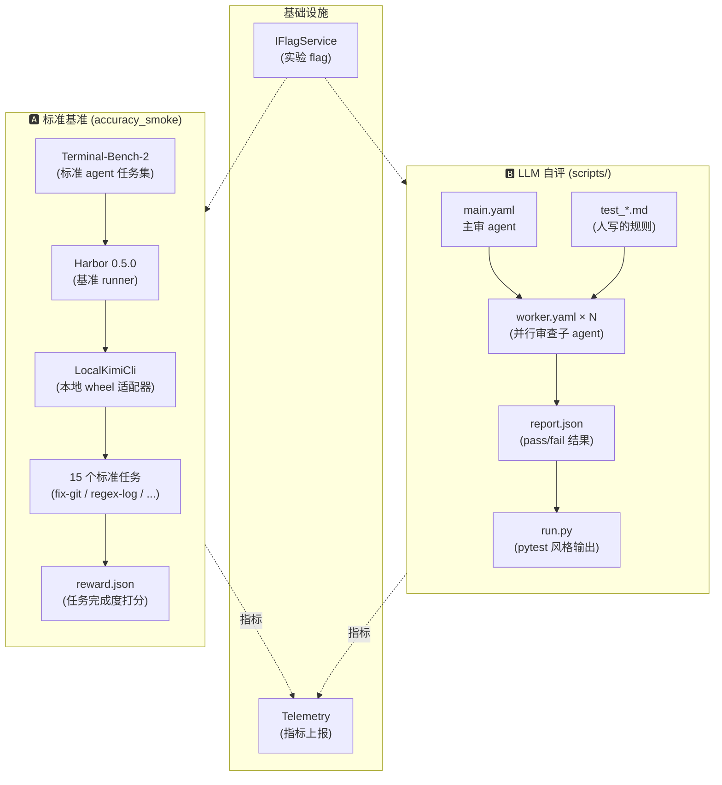
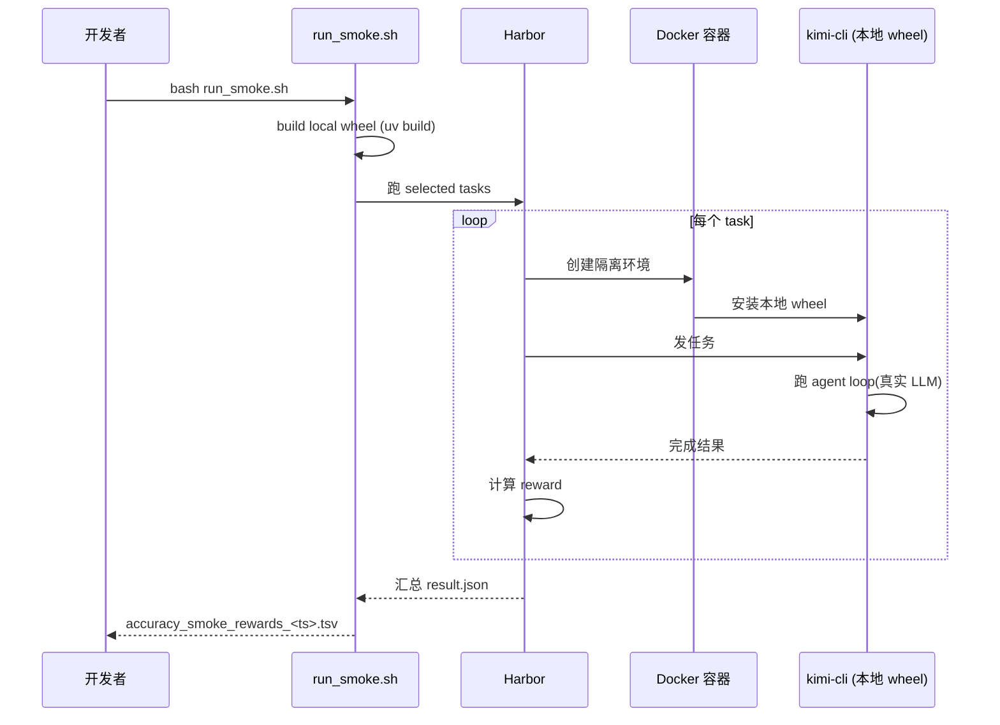

# Kimi Code · Agent 评测与基准测试拆解

> 📁 **源码位置**
> - **kimi-cli** · `tests_ai/`(Python 版,主仓库)
> - **kimi-code** · `packages/minidb/bench/`(底层性能基准)
> - **相关** · `packages/agent-core-v2/src/app/flag/`(实验 flag)
>
> 📄 **核心文件** · `tests_ai/accuracy_smoke/README.md`(评测文档) · `tests_ai/accuracy_smoke/local_kimi_cli_agent.py`(Harbor 适配器) · `tests_ai/scripts/main.yaml`(主审 agent 配置) · `tests_ai/scripts/worker.yaml`(worker 配置) · `tests_ai/scripts/run.py`(执行器)
>
> 🔌 **双轨道** · ① 标准 benchmark(Terminal-Bench-2 + Harbor)· ② LLM 自评(meta-agent + worker subagent)

## 1. 这个模块要解决什么问题

Agent 框架的"测试"比传统软件难得多:

| 测试类型 | 传统软件 | Agent 框架 |
|---|---|---|
| **单元测试** | 断言函数返回值 | ✅ 可以(vitest,见 [24-harness-testing.md](24-harness-testing.md)) |
| **集成测试** | 断言 API 响应 | ⚠️ 可以,但 LLM 不可控 |
| **能力评测** | 不需要 | ❌ **必须** —— "改了 prompt 后,agent 是不是变笨了?" |
| **代码规则** | 写断言 | ⚠️ 模糊规则难断言("是否所有错误处理都用了 Error2") |

**最关键的盲区**:**回归**。改一个 prompt 或调整一个 tool 描述,可能让 agent 在某个场景变笨,但传统测试完全感知不到。

**kimi-code 的解法**:**双轨道评测体系**:
- **轨道 A**:对接标准 benchmark(Terminal-Bench-2),测端到端能力
- **轨道 B**:LLM 自评,测代码规则符合度

## 2. 双轨道全景



## 3. 轨道 A:标准基准(accuracy_smoke)

### 3.1 这是什么

**Terminal-Bench-2** 是一个标准化的 agent 能力基准(类似 SWE-bench),包含一组真实的编码任务。kimi-cli 把自己接入这个 benchmark,跑 15 个精选任务,看完成率。

**Harbor** 是基准 runner(类似 pytest 之于单元测试),负责:
- 在容器里跑任务(隔离环境)
- 给 agent 发任务
- 收集结果(reward)

### 3.2 15 个精选任务

`terminal_bench_2_tasks_default.txt`:

```
fix-git                    # 修复 git 问题
regex-log                  # 正则处理日志
cancel-async-tasks         # 取消异步任务
sqlite-db-truncate         # SQLite 数据库操作
build-cython-ext           # 编译 Cython 扩展
git-leak-recovery          # git 泄露恢复
sanitize-git-repo          # 清理 git 仓库
fix-code-vulnerability     # 修复代码漏洞
configure-git-webserver    # 配置 git web 服务器
query-optimize             # 查询优化
polyglot-c-py              # C/Python 混合
polyglot-rust-c            # Rust/C 混合
nginx-request-logging      # nginx 配置
headless-terminal          # 无头终端
pypi-server                # 搭 PyPI 服务器
```

**精选标准**(来自 README):
- ✅ **不需要外部 API key**(任务逻辑自己能跑)
- ✅ **不需要 GPU**
- ✅ **中等运行时长**(适合 CI smoke)
- ✅ **可区分**(discriminative)—— 不是"全部都过"或"全部都挂",能看出能力变化

**为什么"可区分"很重要**:如果选 15 个超简单任务,改了 prompt 也不会挂,benchmark 没用。如果选 15 个超难任务,改了 prompt 也过不了,同样没用。**精选的任务必须在能力边界上**,才能捕捉到回归。

### 3.3 LocalKimiCli:本地 wheel 适配器

`tests_ai/accuracy_smoke/local_kimi_cli_agent.py`(整个文件只有 40 行):

```python
class LocalKimiCli(KimiCli):
    """Harbor Kimi agent that installs kimi-cli from a local wheel."""

    @staticmethod
    def name() -> str:
        return "kimi-cli-local'

    async def install(self, environment: BaseEnvironment) -> None:
        wheel_path = os.environ.get("KIMI_CLI_WHEEL_PATH")
        # ... 把本地 wheel 上传到容器,用 uv tool install 安装
        install_cmd = (
            "set -euo pipefail; "
            "curl -LsSf https://astral.sh/uv/install.sh | bash && "
            'export PATH="$HOME/.local/bin:$PATH" && '
            f"uv tool install --python 3.13 {shlex.quote(wheel_target)} && "
            "kimi --version"
        )
        await self.exec_as_agent(environment, command=install_cmd)
```

**这是整个轨道 A 最巧妙的设计**:

- 标准 Harbor 用**已发布的 kimi-cli**跑评测
- `LocalKimiCli` 用**当前 repo 的 commit 构建的 wheel**跑评测

这让"我改了 prompt / 工具描述 / loop 逻辑,**立刻**就能看评测结果变化"成为可能。不需要发版,不需要等 CI,本地就能跑。

### 3.4 执行流程



**结果格式**:每个任务跑完,生成 `jobs/<timestamp>/result.json`,run_smoke.sh 汇总成 TSV:

```
task_name           reward   duration
fix-git             1.0      45s
regex-log           0.5      30s
cancel-async-tasks  0.0      120s
...
```

`reward` 是 0-1 的连续值(不是简单的 pass/fail),反映**部分完成**(例如"改对了 3 个文件中的 2 个")。

### 3.5 版本固定

```bash
HARBOR_VERSION=0.5.0
TERMINAL_BENCH_2_REF=53ff2b87d621bdb97b455671f2bd9728b7d86c11
```

**两个都 pin 版本**。原因:
- Harbor 升级可能改变评测逻辑(怎么算 reward)
- Terminal-Bench-2 升级可能改任务定义

**稳定信号 > 最新版本**。benchmark 不稳定就没法做回归对比。

### 3.6 网络兼容

```bash
GH_MIRROR_PREFIX=http://ghfast.top/ \
  bash tests_ai/accuracy_smoke/scripts/prepare_env.sh
```

支持 GitHub 镜像(国内场景)。还有 `UV_PYTHON_INSTALL_MIRROR` 给 uv 的 Python 下载做镜像。这让评测**在中国也能跑**(Moonshot 是中国公司,这是实际需求)。

## 4. 轨道 B:LLM 自评(scripts/)

### 4.1 思路

**让 agent 自己审自己**:用一个主 agent 编排 N 个 worker subagent,每个 worker 读一份 Markdown 测试用例,审查代码,判定 pass/fail。

**和传统测试的区别**:

| 维度 | 传统断言 | LLM 自评 |
|---|---|---|
| 测试用例 | 代码(expect(x).toBe(y)) | **Markdown**(人话写的规则) |
| 判定 | 严格相等 | **LLM 判断**是否符合规则 |
| 表达力 | 低(只能断言确定值) | 高(可表达模糊规则) |
| 谁能写 | 程序员 | **任何人**(产品/PM 都行) |
| 可靠性 | 高(确定性) | 中(LLM 可能判错) |

### 4.2 测试用例格式

`tests_ai/test_utf8_encoding.md`(典型例子):

```markdown
# UTF-8 Encoding Handling

## Case 1: Read non-ASCII filename

Scope: src/kimi_cli/tools/file.py
Requirements:
- Reading a file with non-ASCII characters in its path should not raise
- The content should be returned verbatim

## Case 2: Write non-ASCII content

Scope: src/kimi_cli/tools/file.py
Requirements:
- Writing UTF-8 content should produce a file readable by `cat`
```

**结构化但人话**:
- **`# Test 名`**:测试名
- **`## Case N: 名字`**:子用例
- **`Scope`**:审查范围(具体文件/目录)
- **`Requirements`**:应该满足的规则

这让"测试用例"变成了**产品需求文档**,且 LLM 能直接消费。

### 4.3 主审 agent(main.yaml)

```yaml
agent:
  extend: default
  system_prompt_args:
    ROLE_ADDITIONAL: |
      你是一个代码审计员。目录里有 test_*.md 文件,每个是一个"测试"。
      每个 test 有多个 case(scope + requirements)。
      
      你要:
      1. glob 列出所有 test_*.md(不要直接读内容)
      2. 为每个 test 文件 spawn 一个 "worker" subagent(并行!)
      3. worker 读 test、审查代码、判 pass/fail
      4. 收集所有 worker 结果,汇总成 report.json
      
      report.json 格式:
      [
        { "file": "...", "name": "...", "cases": [{ "name": "...", "pass": true/false }] }
      ]
  tools:
    - "kimi_cli.tools.multiagent:Task"     # ★ spawn 子 agent
    - "kimi_cli.tools.think:Think"
    - "kimi_cli.tools.todo:SetTodoList"
    - "kimi_cli.tools.shell:Shell"
    - "kimi_cli.tools.file:Glob"
    - "kimi_cli.tools.file:WriteFile"      # 写最终 report
  subagents:
    worker:
      path: ./worker.yaml
      description: "The worker subagent to examine one test file."
```

**这是 swarm 模式**(见 [02-swarm.md](02-swarm.md))的经典应用:**主 agent 不审查代码,只负责编排**。每个 worker 独立审查一份测试文件,完全并行。

### 4.4 Worker agent(worker.yaml)

```yaml
agent:
  extend: default
  system_prompt_args:
    ROLE_ADDITIONAL: |
      你是主审 agent spawn 的 subagent。主 agent 会给你一个 test 文件。
      你要:
      - 读 test 文件,理解所有 case 的 scope + requirements
      - 仔细审查 scope 指定范围内的代码
      - 判定每个 case 是否 pass
      - 只审查指定 requirements,不要发散
      - case 之间不相关,完成一个后用 SendDMail 重置上下文(减少干扰)
      - 最后输出总结:test 名、所有 case 名、pass 状态、违规位置、修复建议
  tools:
    - "kimi_cli.tools.dmail:SendDMail"     # ★ 上下文重置(每审完一个 case 清空)
    - "kimi_cli.tools.think:Think"
    - "kimi_cli.tools.todo:SetTodoList"
    - "kimi_cli.tools.shell:Shell"
    - "kimi_cli.tools.file:ReadFile"
    - "kimi_cli.tools.file:Glob"
    - "kimi_cli.tools.file:Grep"
```

**两个精妙设计**:

**① SendDMail 重置上下文**:每审完一个 case,worker 用 SendDMail 工具重置上下文,防止上一个 case 的代码细节污染下一个 case 的判断。这是**减少 LLM 注意力分散**的工程手段。

**② 只读 + Grep,没有 Write**:worker 不能改代码,只能审查。这防止"worker 自作主张改了代码"导致主 agent 收集结果时混乱。

### 4.5 执行器(run.py)

`tests_ai/scripts/run.py` 把 LLM 自评包装成**pytest 风格输出**:

```python
def run_agent(script_dir: Path, tests_dir: Path) -> None:
    cmd = [
        "uv", "run", "kimi",
        "--yolo",                              # ★ 无人值守(自动批准所有工具调用)
        "--agent-file", str(script_dir / "main.yaml"),
        "-c", str(tests_dir),                  # 把测试目录作为 prompt 传给 agent
    ]
    subprocess.run(cmd, check=True)

# 跑完后,读 agent 生成的 report.json
report = load_report(report_path)
for test in report:
    for case in test["cases"]:
        outcome = "PASSED" if case["pass"] else "FAILED"
        print(f"{outcome}  {test['name']} :: {case['name']}")
```

**输出长这样**:

```
PASSED  UTF-8 Encoding Handling :: Read non-ASCII filename
PASSED  UTF-8 Encoding Handling :: Write non-ASCII content
FAILED  CLI Loading Time :: First-token latency
PASSED  Error Handling :: Encoding error recovery
```

这让 LLM 自评**看起来和 pytest 一样**,可以集成进 CI 的测试报告。

### 4.6 为什么要 --yolo?

`--yolo` 是 kimi-cli 的无人值守模式(对应 kimi-code 的 `permission.mode = 'yolo'`,见 [06-tool-system.md](06-tool-system.md))。在评测场景必须用,因为:
- 每个测试要 spawn N 个 worker(几十次工具调用)
- 没人能守着按 approve
- 测试用的代码是隔离的,不会破坏生产

**代价**:yolo 下 agent 能跑任意 shell / 写任意文件。所以必须在**容器或隔离环境**里跑,不能在开发机上裸跑。

## 5. 双轨道的分工

| 维度 | 轨道 A (accuracy_smoke) | 轨道 B (LLM 自评) |
|---|---|---|
| **测什么** | 端到端能力(改 bug、写代码) | 代码规则符合度 |
| **怎么判** | Terminal-Bench-2 标准 reward | LLM 读代码判 pass/fail |
| **测试用例** | 标准任务集(社区维护) | 自写 Markdown |
| **执行环境** | Docker 容器(Harbor) | 本地(--yolo) |
| **结果** | reward 统计(0-1 连续) | pass/fail(二元) |
| **频率** | nightly / smoke(慢) | 每次 PR(较快) |
| **成本** | 高(真实 LLM + 容器) | 中(真实 LLM) |
| **能测什么** | "agent 能不能完成任务" | "代码是否符合规则" |
| **不能测什么** | 内部规则(只看结果) | 端到端(只看代码) |

**互补**:
- 轨道 A 测"能力"—— 改 prompt 让 agent 变笨,能捕捉
- 轨道 B 测"规则"—— 团队约定"所有错误必须用 Error2",能验证

## 6. AB 测试:有地基,无框架

### 6.1 现有能力

**实验 flag**(`IFlagService`,见 [23-telemetry.md](23-telemetry.md)):

```toml
[experimental]
new_compaction_strategy = true
```

```typescript
if (flags.enabled('new_compaction_strategy')) {
  // 新逻辑
} else {
  // 老逻辑
}
```

**三层来源**(优先级从高到低):
1. 环境变量 `KIMI_CODE_EXPERIMENTAL_<NAME>`
2. 配置 `[experimental]` 段
3. 默认值

**Master switch**:`KIMI_CODE_EXPERIMENTAL_FLAG=1` 一键开所有实验。

### 6.2 Telemetry 上下文

```typescript
this.telemetry.track2('tool_call', {
  tool_name: 'Bash',
  duration_ms: 1234,
  // 实验分组可以塞这里
});
```

可以把 flag 状态作为 telemetry 属性,在 dashboard 里按 flag 分组对比指标(成功率、延迟、token 消耗)。

### 6.3 缺失的部分

要完整做 AB 测试,还需要:

| 能力 | 有/无 | 说明 |
|---|---|---|
| **分桶(cohort)** | ❌ | 按 user_id hash 分组,让一部分用户用新逻辑 |
| **流量比例** | ❌ | "10% 用户先试用" |
| **显著性计算** | ❌ | p-value、置信区间、样本量 |
| **实验生命周期** | ❌ | 起止时间、自动结束 |
| **guardrail 指标** | ❌ | 防止 AB 拉低关键指标(例如错误率) |
| **指标 dashboard** | ⚠️ 部分 | telemetry 上报了,但没专门的实验对比视图 |

**所以**:kimi-code **有 AB 测试的"地基"(flag + telemetry),但没有上层的"实验框架"**。做 AB 需要**人工**分析 dashboard 数据,不能自动得出"实验组比对照组好 X%,p-value = 0.03"这种结论。

## 7. 底层性能基准(minidb/bench)

不是 agent 评测,但值得提。`packages/minidb/bench/` 是**存储引擎的性能基准**:

```
packages/minidb/bench/
├── search-baseline.ts          ← 搜索性能基线(对比基准)
├── search-kimi-code.ts         ← 在真实 kimi-code session 上测搜索
├── message-composed.ts         ← 消息组合性能
├── message-range.ts            ← 范围查询性能
├── session-store.ts            ← session 存储 I/O 性能
├── query.ts                    ← 通用查询性能
├── session-children.ts         ← 子 session 遍历性能
├── reader-catchup.ts           ← reader 追赶(writer 领先时)性能
├── cluster.ts + cluster-worker.ts  ← 多 worker 并行性能
├── import-kimi-code.ts         ← 导入真实数据测性能
└── baseline.ts                 ← 基线工具
```

**用途**:测 minidb(嵌入式数据库)本身的性能,不是 agent 行为。和本篇主线关系不大,但说明 kimi-code 对性能有系统化的基准。

## 8. 边界条件与设计权衡

### 8.1 为什么用 Terminal-Bench-2 而不是自建任务?

- **标准化**:社区维护,任务定义稳定
- **可比性**:和其他 agent 框架(Claude Code、Cursor 等)对比
- **节省精力**:不用自己想 100 个任务

**代价**:任务选择不完全可控(如果 Terminal-Bench-2 的任务都不覆盖你的核心场景,benchmark 信号弱)。

### 8.2 为什么 LLM 自评用 swarm?

- **并行**:20 个测试文件,spawn 20 个 worker 并行审查,几秒完成
- **隔离**:每个 worker 只看自己的 test 文件,不会被其他 test 的代码干扰
- **上下文干净**:SendDMail 重置,每个 case 独立判断

**代价**:成本高(20 个 LLM 调用,真金白银)。所以只跑 PR 级别(改了代码才跑),不跑每次 commit。

### 8.3 为什么 reward 是 0-1 连续值?

不是简单的"完成/未完成",而是**部分完成度**:
- 1.0:完全正确
- 0.5:改对了 3 个文件中的 2 个
- 0.0:完全没做对

这让"能力变化"更精细 —— 改了 prompt 后 reward 从 0.8 降到 0.6,虽然都没全过,但能看出退化。

### 8.4 遗憾与可改进点

- **没有 prompt regression 检测**:改了 system prompt 后,只能靠 benchmark 看变化。没有"prompt diff 自动触发评测"的机制。
- **LLM 自评的可靠性**:LLM 可能判错(漏掉违规、误报违规)。没有"多 judge 投票"或"人工抽样校验"。
- **没有金标准(golden set)**:某些任务应该有"标准答案",但当前完全靠 LLM 判断。
- **AB 测试缺实验框架**:flag 只能开关,不能分桶、不能算显著性。
- **评测任务覆盖不全**:15 个任务都偏 git/shell/系统配置,没覆盖"和用户对话"这种交互式场景。

## 9. 一句话总结

> kimi-code 的 agent 评测是**双轨道体系**:**轨道 A(accuracy_smoke)** 对接 Terminal-Bench-2 标准 benchmark + Harbor runner,跑 15 个精选任务(版本固定保证稳定信号),用 `LocalKimiCli` 适配器让"改代码立刻看评测"成为可能,reward 是 0-1 连续值反映部分完成度。**轨道 B(LLM 自评)** 让主审 agent 用 swarm 模式 spawn N 个 worker subagent,每个 worker 读一份 Markdown 测试用例(scope + requirements),审查代码判 pass/fail,worker 用 SendDMail 重置上下文减少干扰,结果转成 pytest 风格输出集成进 CI。**AB 测试只有地基**(实验 flag + telemetry 上下文),缺分桶/流量比例/显著性计算等上层框架。整体设计**互补**:benchmark 管能力,自评管规则。

## 10. 本篇用到的核心源码索引

**轨道 A(标准基准)**:

| 概念 | 位置 |
|---|---|
| 评测文档 | `tests_ai/accuracy_smoke/README.md`(必读) |
| Harbor 适配器 | `tests_ai/accuracy_smoke/local_kimi_cli_agent.py` |
| 任务列表 | `tests_ai/accuracy_smoke/terminal_bench_2_tasks_default.txt` |
| 环境准备 | `tests_ai/accuracy_smoke/scripts/prepare_env.sh` |
| 跑评测 | `tests_ai/accuracy_smoke/scripts/run_smoke.sh` |

**轨道 B(LLM 自评)**:

| 概念 | 位置 |
|---|---|
| 主审 agent | `tests_ai/scripts/main.yaml` |
| Worker agent | `tests_ai/scripts/worker.yaml` |
| 执行器 | `tests_ai/scripts/run.py` |
| 测试用例 | `tests_ai/test_*.md` |

**AB 测试地基**:

| 概念 | 位置 |
|---|---|
| `IFlagService` | `src/app/flag/flagService.ts`(见 [23-telemetry.md](23-telemetry.md)) |
| Flag 注册表 | `src/app/flag/flagRegistry.ts` |
| Telemetry 上下文 | `src/app/telemetry/agentTelemetryContext.ts` |

**性能基准**:

| 概念 | 位置 |
|---|---|
| minidb bench | `packages/minidb/bench/` |

## 11. 对自己项目的启示

### athena(量化)

- **回测**本身就是"accuracy_smoke":固定一组历史行情,跑策略看收益
- 可以借鉴 kimi-cli 的**双轨道**:
  - 标准任务轨道:固定历史数据测策略
  - LLM 自评轨道:让 LLM 判断策略逻辑是否符合预期(例如"是否正确处理了停盘")
- **AB 测试**对量化极其重要(策略迭代),需要自己搭实验框架(分桶 + 显著性)

### vela-shopify(电商 AI)

- 可以用 **LLM 自评**测"用户问题 → agent 回答"的质量
- 用 **Terminal-Bench 类任务**测"agent 能不能正确操作 Shopify API"
- AB 测试对电商**生死攸关**(转化率),必须有实验框架

### 通用启示

**没有评测的 agent 改进 = 瞎子摸象**。kimi-code 的双轨道提供了**两个互补的反馈环**:
- benchmark:快速验证"是不是变笨了"
- 自评:验证"是不是违反了规则"

如果你的 agent 项目还没有评测,**第一件事**就是建一个 accuracy_smoke(哪怕只有 5 个任务)。

## 参考资料

- [02-swarm.md](02-swarm.md) —— LLM 自评用 swarm 模式编排 worker
- [03-goal-mode.md](03-goal-mode.md) —— Goal mode 可用于评测的多轮场景
- [06-tool-system.md](06-tool-system.md) —— yolo mode 是评测必须的
- [08-context-memory.md](08-context-memory.md) —— SendDMail 用作上下文重置
- [10-skills.md](10-skills.md) —— main.yaml / worker.yaml 是 agent profile
- [23-telemetry.md](23-telemetry.md) —— 实验 flag 和 telemetry 是 AB 测试地基
- [24-harness-testing.md](24-harness-testing.md) —— 单元/集成测试 vs 评测的区别
- Terminal-Bench-2:https://github.com/misclicked/terminal-bench-2
- Harbor:https://github.com/harbor/harbor
- SWE-bench(概念对照):https://www.swebench.com/
