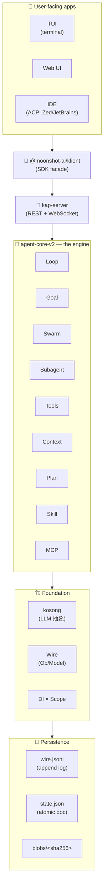
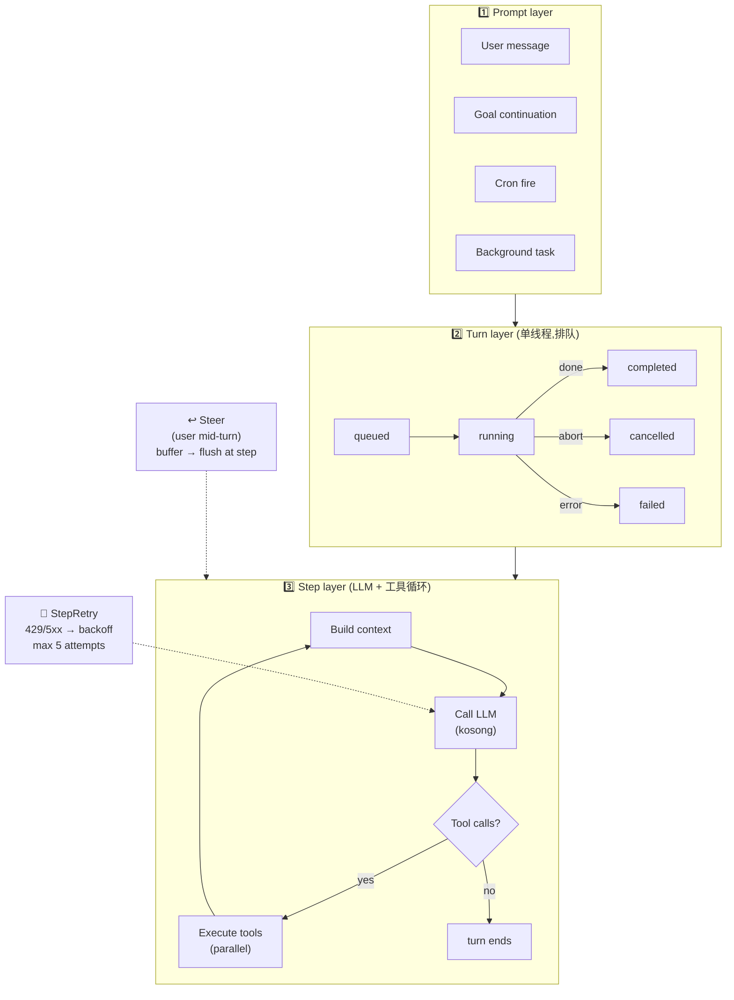
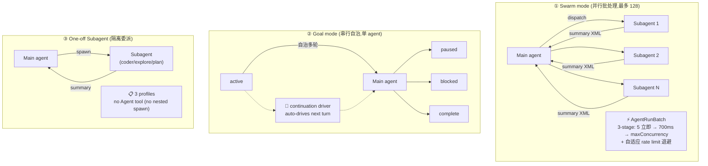
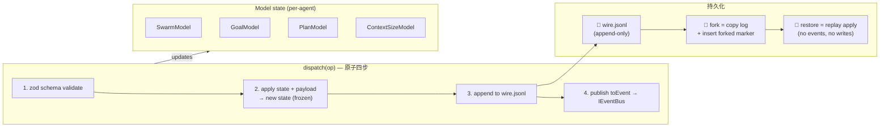
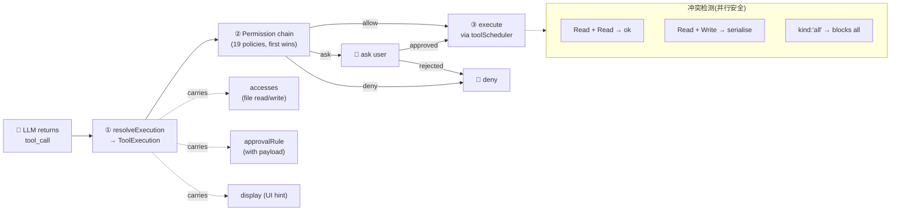
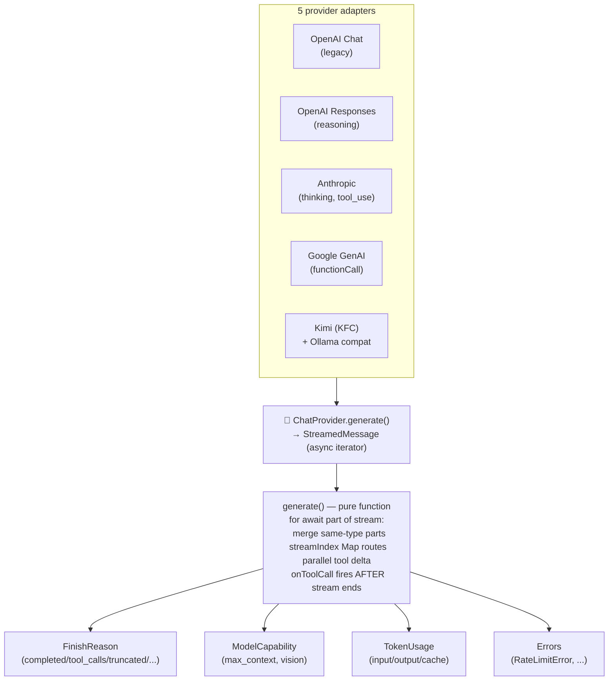

# kimi-code 架构图

6 张架构图,**两种格式**都提供:

| 用途 | 格式 | 怎么看 |
|---|---|---|
| **快速浏览**(GitHub 直接渲染) | Mermaid(本文件内嵌) | 往下滚就能看到 |
| **编辑/美化/导出 PNG** | Excalidraw(`.excalidraw` 文件) | 在 [excalidraw.com](https://excalidraw.com) 里 Open |

---

## ① 整体分层架构



**对应拆解**:[01-architecture.md](../01-architecture.md)

---

## ② Agent Loop(Prompt → Turn → Step)



**对应拆解**:[09-loop.md](../09-loop.md)

---

## ③ 三种多 Agent 模式对比



**对应拆解**:[02-swarm](../02-swarm.md) + [03-goal-mode](../03-goal-mode.md) + [04-subagent](../04-subagent.md)

---

## ④ Wire Op/Model(事件溯源)



**对应拆解**:[07-wire-protocol.md](../07-wire-protocol.md)

---

## ⑤ 工具调用全链路



**对应拆解**:[06-tool-system.md](../06-tool-system.md)

---

## ⑥ kosong · 五大 LLM Provider 统一



**对应拆解**:[14-provider-llm.md](../14-provider-llm.md)

---

## Excalidraw 版本(可编辑)

同目录下的 `.excalidraw` 文件是手绘风格的源文件,适合:

- **二次编辑**:改字、调位置、换色
- **导出 PNG/SVG**:做 PPT 或博客配图
- **自由布局**:不受 Mermaid 语法约束

**打开方式**:
1. 访问 https://excalidraw.com
2. 左上角菜单 → **Open** → 选择 `.excalidraw` 文件
3. 即可看到手绘风格渲染

## 重新生成 Excalidraw 版本

```bash
cd frameworks/kimi-code/diagrams
python3 gen_excalidraw.py .
```

纯 Python 标准库,无第三方依赖。
