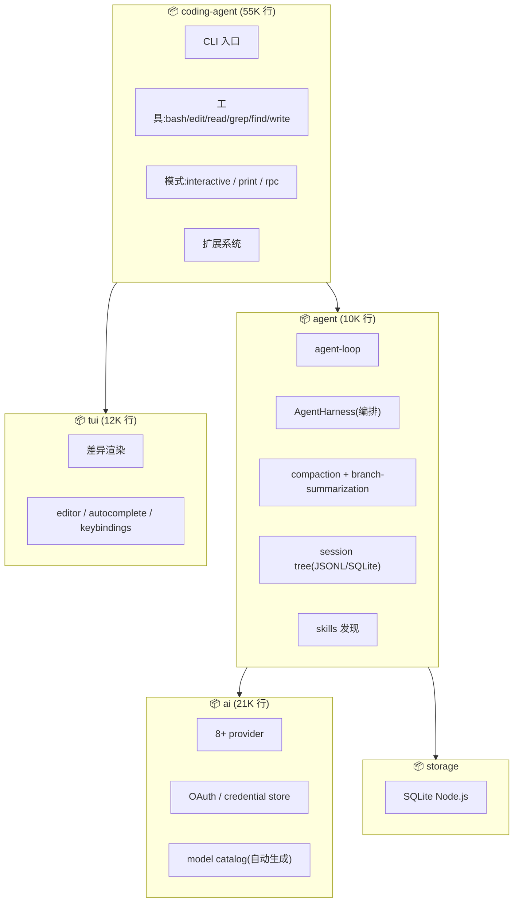

# Pi Agent · 架构拆解

> 📁 **源码位置** · `~/pi/`(GitHub: [earendil-works/pi](https://github.com/earendil-works/pi))
>
> 📄 **核心包** · `packages/coding-agent`(55K 行,交互 CLI) · `packages/agent`(10K 行,运行时) · `packages/ai`(21K 行,多 provider LLM) · `packages/tui`(12K 行,终端 UI) · `packages/storage`(SQLite)
>
> 🔌 **技术栈** · TypeScript · Node.js / Bun 双运行时 · Biome(lint) · Vitest(测试)

## 1. Pi 是什么

**Pi** 是一个"自扩展"（self-extensible）的 coding agent。和 kimi-code / grok-build 的区别：

| 维度 | kimi-code | grok-build | **Pi** |
|---|---|---|---|
| **定位** | CLI agent | CLI agent | **"Agent Harness"** + coding agent |
| **核心创新** | wire/Op 事件溯源 | doom loop + skeptic | **Session Tree + Branch Summarization** |
| **自扩展** | skills + plugins | skills + marketplace | **.pi/extensions/ + skills + prompts** |
| **权限** | 19 policy 责任链 | permission + sandbox | **无内置权限**(靠容器化) |
| **LLM 抽象** | kosong(5 provider) | sampler(3 API + xAI) | **pi-ai(8+ provider,最强)** |
| **TUI** | 自研 pi-tui | ratatui | **自研 pi-tui**(差异渲染) |
| **存储** | wire.jsonl | SQLite + JSONL | **Session Tree(JSONL + SQLite)** |

## 2. 包架构（7 个包）



## 3. 五个独特设计（和 kimi-code / grok-build 对比）

### ① Session Tree + Branch Summarization（最独特的创新）

kimi-code 和 grok-build 的 session 是**线性的**：消息按顺序追加，compaction 替换旧消息。

Pi 的 session 是一棵**树**：

```
session root
├── 用户消息 A
├── assistant 回复
├── 用户消息 B
├── compaction 摘要
├── 用户消息 C ──────────────┐
│   ├── assistant 回复       │ branch 1
│   └── 工具结果             │
├── 用户消息 C(重新尝试)─────┤
│   ├── assistant 回复       │ branch 2
│   └── 工具结果             │
└── 当前位置 ────────────────┘
```

**Branch Summarization**：当你从消息 C "回到" C 并重新尝试时，Pi 会把第一个分支（branch 1）**摘要**而不是删除。这让 agent 能：
- **回溯**到之前某个点重新尝试
- **保留探索历史**（不像其他框架直接覆盖）
- **摘要旧分支**（节省 context 但不丢失探索记录）

这在 kimi-code 和 grok-build 中都不存在 —— 它们都是"线性时间线"。

### ② Agent Harness（agent 编排器，不只是 loop）

Pi 不叫"agent framework"，叫 **"agent harness"**。Harness 是赛马的"马具/缰绳" —— 意思是这个包**控制** agent 怎么跑。

`AgentHarness` 管理：
- **system prompt** 动态拼装
- **tools** 注册和执行
- **compaction** 触发和执行
- **session** 读写
- **skills** 发现和调用
- **prompt templates** 模板化提示

和 kimi-code 的 DI × Scope / grok-build 的 Actor 模式相比，Pi 的 Harness 更**直接** —— 一个类管所有编排逻辑，不做 DI 分层。

### ③ 无内置权限系统（有意为之）

Pi 的 README 明确说：

> Pi does not include a built-in permission system for restricting filesystem, process, network, or credential access.

这和 kimi-code（19 policy）和 grok-build（permission + sandbox）截然相反。

**为什么？** Pi 的哲学是"**权限是运行环境的责任，不是 agent 的责任**"：

- 用 **Docker** 隔离
- 用 **Gondolin** 微 VM
- 用 **OpenShell** 策略沙箱

这是 Unix 哲学的"做一件事并做好" —— agent 只管做事，安全交给环境。

### ④ pi-ai（最强的 provider 抽象）

Pi 的 `pi-ai` 包支持 **8+ provider**（比 kimi-code 的 5 个、grok-build 的 3 个都多）：

- OpenAI Completions
- OpenAI Responses
- **OpenAI Codex Responses**（WebSocket!）
- Anthropic Messages
- **Google Generative AI**
- **Google Vertex**
- **AWS Bedrock Converse**
- **Mistral Conversations**
- **Azure OpenAI Responses**
- **Pi Messages**（自家的!）
- **Faux**（测试用）

还有：
- **OAuth credential store**（每个 provider 独立 OAuth 流程）
- **Model catalog 自动生成**（从各 provider API 拉取模型列表，自动更新）
- **Image models** 支持
- **Bedrock provider**（AWS 云端推理）

### ⑤ 自扩展系统（.pi/ 目录）

Pi 的 `.pi/` 目录（类似 Claude Code 的 `.claude/` 或 kimi-code 的 `.kimi-code/`）：

```
.pi/
├── extensions/      — TypeScript 扩展(运行时加载)
│   ├── redraws.ts
│   ├── import-repro.ts
│   ├── prompt-url-widget.ts
│   └── tps.ts       — tokens-per-second 显示
├── prompts/         — 自定义 slash 命令
│   ├── wr.md        — /wr = write review
│   ├── pr.md        — /pr = create PR
│   ├── sa.md        — /sa = security audit
│   ├── cl.md        — /cl = changelog
│   └── is.md        — /is = issue summary
└── skills/          — skill 文件
    └── add-llm-provider.md
```

**Extensions 是 TypeScript 文件**（不是纯文本 skill），可以在运行时被 agent 加载和执行。这让 Pi 能**动态添加 UI 组件、工具、hook**。

## 4. 和 kimi-code / grok-build 的全面对比

| 维度 | kimi-code | grok-build | **Pi** |
|---|---|---|---|
| **Session 模型** | 线性(wire.jsonl) | 线性(JSONL+SQLite) | **树形(Session Tree)** |
| **Compaction** | 单遍 | 两遍(pass1+pass2) | **单遍 + branch summarization** |
| **回溯能力** | fork session | checkpoint+rewind | **session tree 原生回溯** |
| **权限** | 19 policy | permission+sandbox | **无(靠容器)** |
| **Provider** | 5 | 3+xAI | **8+** |
| **Goal 验证** | 3 轮 blocked | skeptic panel | **无内置验证** |
| **Doom loop** | max_steps | 服务端检测 | **未见专用机制** |
| **TUI** | 自研 pi-tui | ratatui | **自研 pi-tui**(差异渲染) |
| **子 agent** | swarm(128) | coordinator | **未见 swarm** |
| **扩展** | skills+plugins | marketplace | **.pi/ extensions(最灵活)** |
| **OAuth** | MCP OAuth | MCP OAuth | **全 provider OAuth** |
| **Model catalog** | 手动 | 手动 | **自动生成** |
| **测试** | 7层harness | 有但未深拆 | **faux provider + harness** |
| **Eval** | 双轨道 | 未见 | **有 evals 包** |
| **代码量** | ~10万 | ~134万 | **~10万(和 kimi-code 接近)** |

## 5. Pi 的反熵措施（用反熵框架分析）

| 反熵策略 | Pi 怎么做 | 和 kimi-code/grok-build 比 |
|---|---|---|
| **压缩** | compaction(单遍) + branch summarization | branch summarization 是独有的(保留探索历史) |
| **隔离** | 靠容器(Docker/Gondolin/OpenShell) | 最弱(没有内置) |
| **验证** | 无 | 最弱(完全信任 LLM) |
| **恢复** | session tree(可回溯到任意节点) | **最强**(树形结构天然支持回溯) |
| **约束** | 工具集限制 + skills | 最轻(没有 goal 状态机/doom loop/max_steps) |

**Pi 是"信任 LLM + 最少约束"路线的代表**。和 grok-build（对抗性不信任）形成了**光谱的两端**：

```
Pi(最信任) ←─────────────────→ grok-build(最不信任)
  无权限        kimi-code          permission
  无验证        19 policy          +sandbox
  无 doom loop  3轮审计            +skeptic panel
                                   +doom loop
```

## 6. 一句话总结

> Pi Agent 是一个**自扩展的 agent harness**，核心创新是 **Session Tree + Branch Summarization**（允许回溯和保留探索历史）。它走了一条和 grok-build 完全相反的路线：**最少约束、最信任 LLM、无内置权限/验证**，靠容器化环境保障安全。它的 `pi-ai` 是三个框架中 provider 支持最广的（8+ provider + 自动 model catalog + 全 OAuth）。`.pi/extensions/` 的 TypeScript 扩展让它能动态加载新能力。**Pi 适合信任模型能力、追求灵活性的场景；grok-build 适合不信任模型、需要严格控制的场景。**

## 7. 源码索引

| 概念 | 文件 |
|---|---|
| Agent loop | `packages/agent/src/agent-loop.ts` |
| Agent harness(编排) | `packages/agent/src/harness/agent-harness.ts` |
| Compaction | `packages/agent/src/harness/compaction/compaction.ts` |
| Branch summarization(独有!) | `packages/agent/src/harness/compaction/branch-summarization.ts` |
| Session tree | `packages/agent/src/harness/session/session.ts` |
| Session storage(JSONL) | `packages/agent/src/harness/session/jsonl-storage.ts` |
| Session storage(SQLite) | `packages/storage/sqlite-node/src/sqlite/repo.ts` |
| Skills 发现 | `packages/agent/src/harness/skills.ts` |
| System prompt | `packages/agent/src/harness/system-prompt.ts` |
| 工具(bash/edit/read) | `packages/coding-agent/src/core/tools/` |
| 扩展系统 | `packages/coding-agent/src/core/extensions/` |
| LLM provider 抽象 | `packages/ai/src/index.ts` |
| Model catalog | `packages/ai/src/model-catalog.ts` |
| OAuth credential store | `packages/ai/src/auth/credential-store.ts` |
| TUI | `packages/tui/src/tui.ts` |
| 交互模式 | `packages/coding-agent/src/modes/interactive/interactive-mode.ts` |
| Print 模式(非交互) | `packages/coding-agent/src/modes/print-mode.ts` |
| RPC 模式 | `packages/coding-agent/src/modes/rpc/` |
