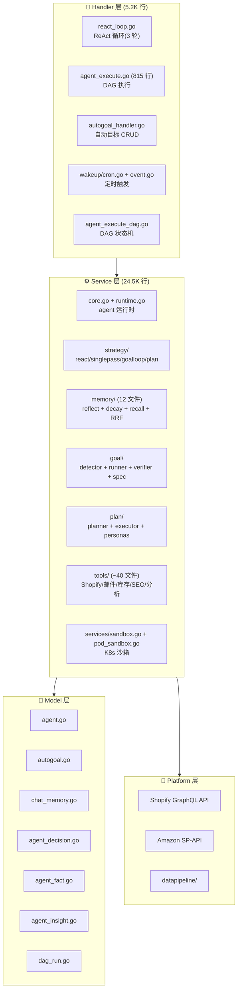

# Vela Shopify Agent · 架构拆解

> 📁 **源码位置** · `~/vela-shopify/api-server-go/`(Go,~145K 行)
>
> 📄 **核心目录** · `internal/handler/agent/`(5.2K 行,18 文件) · `internal/service/agent/`(24.5K 行,~100 文件) · `internal/model/`(数据模型) · `internal/platform/`(Shopify/Amazon 集成)
>
> 🔌 **技术栈** · Go(chi router + GORM + slog) · React/Remix 前端 · PostgreSQL · Redis · Docker · K8s

## 1. Vela 是什么

**Vela** 是一个 Shopify 电商 AI agent。不是 coding agent（写代码），是**电商运营 agent**（帮商家分析销售、管理库存、发邮件营销、恢复弃购、做 SEO）。

和拆过的六个框架的根本区别：

| 维度 | kimi-code/Codex/grok-build/Pi | Agents SDK/ADK | **Vela** |
|---|---|---|---|
| **用户** | 开发者 | 开发者 | **Shopify 商家**(非技术用户) |
| **场景** | 写代码 | 构建 agent | **电商运营** |
| **部署** | 本地 CLI | 库 | **SaaS(多租户)** |
| **工具** | bash/file/edit | 用户定义 | **Shopify API + 邮件营销 + 库存 + SEO** |
| **多租户** | ❌ | ❌ | **✅ 按 shop_id 隔离** |
| **7×24** | ❌ | ❌ | **✅ Cron + autogoal + wakeup** |

**Vela 是一个真正在生产环境 7×24 运行的 agent。**

## 2. 架构分层（~30K 行 agent 代码）



## 3. 独特设计（和其他六个框架对比）

### ① DAG 编排（不是简单的 ReAct 循环）

其他框架的 agent loop 是：**LLM → tool call → 结果 → LLM → ...**（线性）。

Vela 的 agent 是 **DAG（有向无环图）编排**：

```go
// react_loop.go (verbatim)
dag := orchestrator.BuildDAG(shopID, oracleResult.Stages)
h.injectContextIntoDAG(dag, uctx, ...)
gateResult := h.gate.Filter(dag)          // AutonomyGate 过滤
gatedDAG := h.gate.BuildExecutableDAG(dag, gateResult)
results := h.executeOracleStages(ctx, gatedDAG, ...)
```

**流程**：
1. Oracle（LLM）决定要执行哪些**阶段（stages）**
2. `BuildDAG` 把阶段构建成**有依赖关系的 DAG**
3. `AutonomyGate` 过滤需要确认的工具 + 剪掉被阻止的依赖
4. `executeOracleStages` 并行/串行执行 DAG 节点
5. LLM 审查结果完整性 → 如果不完整，扩展 DAG → 再跑一轮（最多 3 轮）

**这比 kimi-code 的 swarm 或 grok-build 的 skeptic 更复杂** —— 它不是简单的并行批处理，是**有依赖关系的任务图**。

### ② Memory 系统（带衰减 + 反思 + RRF）

12 个文件的完整记忆系统：

| 文件 | 作用 | 对标 |
|---|---|---|
| `store.go` (1024 行) | 记忆存储（PostgreSQL） | Codex MemoryStore |
| `reflect.go` (387 行) | **冷路径反思**：从决策中提取事实+洞察 | Codex Stage 2 |
| `decay.go` | **记忆衰减**：hash 去重 + 过期清理 | 独有！ |
| `recall.go` | 记忆检索 | Codex list/read/search |
| `rrf.go` | **Reciprocal Rank Fusion**：多路召回融合 | 独有！ |
| `enrich.go` | 记忆增强 | — |
| `estimation.go` | token 估算 | — |
| `keyword.go` | 关键词提取 | — |
| `conflict.go` | 冲突检测 | — |
| `decisions.go` | 决策记录 | Codex agent_decision |
| `registry.go` | 记忆注册 | — |

**反思机制**（`reflect.go`）：

```go
// 冷路径 Reflect：从 agent 决策中提取持久事实和洞察
// 异步运行(cron),批量处理未反思的决策
// 单次 LLM 调用提取 facts + insights + L0 摘要
// 通过 hash 去重,UPSERT 持久化
```

**触发条件**：`unreflectedCount >= 10`（至少 10 条未反思的决策才触发）。

**这和 Codex 的双阶段记忆是同一个思路**（从决策中提取知识），但 Vela 多了**记忆衰减**（decay）—— 过期的记忆会被清理。

### ③ AutoGoal（自动目标系统）

```go
// autogoal_handler.go
type AutoGoalHandler struct {
    store     *autogoal.DBGoalStore
    engine    *autogoal.GoalEngine
    canceller GoalCanceller  // P1: 实时中断 steering
}
```

**自动目标 = 7×24 自治 agent**：
- 商家创建目标（"提高转化率 10%"）
- GoalEngine **自动规划 + 执行 + 验证**
- 支持取消（`GoalCanceller`）
- 有进度面板

**Goal 验证器**（`goal/verifier.go`）：

```go
type Verdict struct {
    Achieved    bool     `json:"achieved"`
    Score       float64  `json:"score"`
    Reasoning   string   `json:"reasoning"`
    Suggestions []string `json:"suggestions"`
}
```

LLM 验证目标是否达成（类似 grok-build 的 skeptic panel，但用单 agent 而非 panel）。

### ④ AutonomyGate（自治权限门）

```go
// react_loop.go
gateResult := h.gate.Filter(dag)
// 过滤 CONFIRM 工具 + 剪掉被阻止的依赖
```

**不是简单的 allow/deny**，是在 DAG 级别做**权限过滤**：
- 某些工具需要确认（`CONFIRM`）
- 如果一个 DAG 节点被阻止，依赖它的节点也会被剪掉
- 如果所有节点都被阻止，整个循环停止

### ⑤ K8s Sandbox（容器级沙箱）

```go
// services/pod_sandbox.go (344 行)
// services/k8s_sandbox.go
```

Vela 可以在 **K8s Pod** 里执行代码。这比 grok-build 的 nono（OS 级）和 Codex 的四平台沙箱更**云原生** —— 适合 SaaS 多租户场景。

### ⑥ 多策略执行（strategy/ 目录）

```go
// strategy/ 目录
strategy.go       // 策略接口
react.go          // ReAct 策略(对话式)
singlepass.go     // 单次策略(简单问题)
goalloop.go       // 目标循环策略(autogoal)
plan.go           // 计划策略
chat.go           // 纯聊天
budgets.go        // 预算管理
```

**agent 根据场景自动选择策略**：简单问题用 singlepass，复杂任务用 plan，自治目标用 goalloop。

### ⑦ Cron + Event 唤醒（7×24 核心）

```go
// wakeup/cron.go + wakeup/event.go
// agent_wakeup.go (521 行)
```

Vela 通过 **cron 定时 + 事件驱动** 实现 7×24：
- Cron：定时检查"该不该做某事"（例如每天检查库存）
- Event：外部事件触发（例如新订单 → 触发弃购恢复）

## 4. 反熵分析

| 反熵策略 | Vela 怎么做 | 和六框架比 |
|---|---|---|
| **压缩** | chat_memory + L0 摘要 | 基础（无 compaction） |
| **隔离** | K8s Pod 沙箱 + 多租户 shop_id | 云原生（独有） |
| **验证** | goal Verifier（LLM 判定） | 类似 grok-build skeptic（单 agent 版） |
| **恢复** | DAG 状态持久化（dag_run model） | 类似 Codex rollout |
| **约束** | AutonomyGate（DAG 级权限） | 独有（图级过滤） |
| **记忆** | reflect + decay + RRF | **比 Codex 更丰富**（有衰减和 RRF） |
| **7×24** | cron + event + autogoal | **独有**（唯一生产 7×24） |

## 5. 和六个框架的定位对比

```
Pi          Agents SDK    kimi-code      Codex          ADK        grok-build   **Vela**
(最信任)    (最小抽象)    (平衡)        (结构性约束)   (全栈)      (对抗不信任)  (生产 7×24)
    │              │             │              │             │             │            │
 无权限      Guardrail     19 policy     ExecPolicy    图结构       permission   AutonomyGate
 无验证      Sandbox       3轮审计       无 skeptic    Evaluation   +sandbox     +Goal Verifier
 无拓扑      Handoff       扁平 swarm    树形+通信      Sub-agent    +skeptic     DAG 编排
 无记忆      Session       wire.jsonl    双阶段记忆    Memory       +doom loop   reflect+decay
 无7×24      无            cron(基础)    cloud-tasks   Cloud Run    无           cron+event+autogoal
 无沙箱      Modal/E2B     无            4平台原生     Code Exec    nono         K8s Pod
```

**Vela 是七个框架中唯一真正在生产环境 7×24 运行的 agent。** 其他六个都是"工具"或"框架"，Vela 是"产品"。

## 6. 设计洞察

### 6.1 为什么用 DAG 而不是线性循环？

电商场景的特点：**任务之间有依赖关系**。
- "先查库存 → 再决定是否发促销邮件"
- "先分析销售数据 → 再生成报告"
- "先恢复弃购 → 再发满意度调查"

线性循环（LLM → tool → LLM）不能表达这种依赖。DAG 可以。

### 6.2 为什么有记忆衰减？

电商数据有时效性：
- 一个月前的库存数据没用了
- 上个月的促销效果不该影响这个月的决策
- 客户偏好会变化

所以 Vela 不只存储记忆，还**主动遗忘**过期记忆（`decay.go` + `PurgeExpired`）。这是 Codex 和其他框架都没有的。

### 6.3 为什么用 RRF（Reciprocal Rank Fusion）？

记忆检索时，可能从多个来源（关键词匹配 + 语义匹配 + 时间排序）得到结果。RRF 把多路结果**融合**成一个排名。这是搜索引擎的标准技术，用在 agent 记忆上很聪明。

## 7. 一句话总结

> Vela 是一个**生产级 7×24 电商 AI agent**，核心创新是 **DAG 任务编排 + 多策略执行 + 带衰减和反思的记忆系统 + AutonomyGate 图级权限 + K8s 沙箱 + AutoGoal 自治目标**。它是七个框架中**唯一真正在生产环境运行的 agent**（不是工具/框架/SDK）。它的记忆系统（reflect + decay + RRF）在某些方面**比 Codex 更丰富**（有衰减和多路融合）。它的 DAG 编排比 kimi-code 的 swarm 或 grok-build 的 skeptic 更适合**有依赖关系的电商任务**。**Vela 证明了我们论文里提的 7×24 能力不仅被 OpenAI（Codex）在实现，也被独立开发者（你）在生产环境中实现。**

## 8. 源码索引

| 概念 | 文件 | 行数 |
|---|---|---|
| ReAct 循环 | `handler/agent/react_loop.go` | 464 |
| Agent 执行 | `handler/agent/agent_execute.go` | 815 |
| DAG 执行 | `handler/agent/agent_execute_dag.go` | 314 |
| Phase 执行 | `handler/agent/agent_execute_phase.go` | 677 |
| AutoGoal handler | `handler/agent/autogoal_handler.go` | 235 |
| AutoGoal 控制 | `handler/agent/autogoal_control.go` | 112 |
| AutoGoal 检测 | `handler/agent/autogoal_detector.go` | 77 |
| 唤醒 | `handler/agent/agent_wakeup.go` | 521 |
| AutonomyGate | `handler/agent/agent_autonomy.go` | 144 |
| 决策 | `handler/agent/agent_decision.go` | 110 |
| Agent 核心 | `service/agent/core.go` | — |
| Agent 运行时 | `service/agent/runtime.go` | — |
| 策略接口 | `service/agent/strategy/strategy.go` | — |
| ReAct 策略 | `service/agent/strategy/react.go` | 334 |
| 目标循环策略 | `service/agent/strategy/goalloop.go` | — |
| 单次策略 | `service/agent/strategy/singlepass.go` | 341 |
| 记忆存储 | `service/agent/memory/store.go` | 1024 |
| 记忆反思 | `service/agent/memory/reflect.go` | 387 |
| 记忆衰减 | `service/agent/memory/decay.go` | — |
| 记忆检索 | `service/agent/memory/recall.go` | — |
| RRF 融合 | `service/agent/memory/rrf.go` | — |
| Goal 验证器 | `service/agent/goal/verifier.go` | — |
| Goal 检测器 | `service/agent/goal/detector.go` | — |
| Goal 运行器 | `service/agent/goal/runner.go` | — |
| Plan 执行器 | `service/agent/plan/executor.go` | 477 |
| Plan 分解器 | `service/agent/plan/planner_decompose.go` | 343 |
| Prompt 提供者 | `service/agent/prompt/provider.go` | 522 |
| 工具注册 | `service/agent/tools/registry.go` | 397 |
| K8s 沙箱 | `service/agent/services/pod_sandbox.go` | 344 |
| 沙箱接口 | `service/agent/services/sandbox.go` | — |
| 唤醒 Cron | `service/agent/wakeup/cron.go` | — |
| 唤醒事件 | `service/agent/wakeup/event.go` | — |
