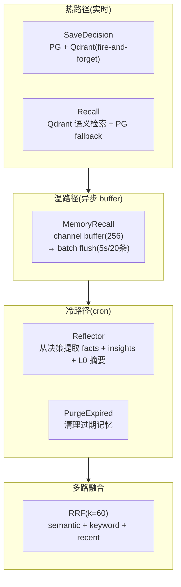

# Vela Shopify Agent · 深度模块拆解

> 本篇涵盖 Vela 的四个核心子系统，全部基于源码 verbatim。

---

## ① ReAct 循环 + DAG 编排 + AutonomyGate + Decision Guard

### ReAct 三轮循环

```go
// react_loop.go (verbatim)
const maxRounds = 3

for round := 0; round < maxRounds; round++ {
    // 1. Oracle 决定 stages → 构建 DAG
    dag := orchestrator.BuildDAG(shopID, oracleResult.Stages)
    h.injectContextIntoDAG(dag, uctx, ...)

    // 2. AutonomyGate 过滤
    gateResult := h.gate.Filter(dag)
    if gateResult.ExecutableCount() == 0 {
        // 所有工具被阻止 → 停止
    }
    gatedDAG := h.gate.BuildExecutableDAG(dag, gateResult)

    // 3. 执行 DAG
    results := h.executeOracleStages(ctx, gatedDAG, ...)

    // 4. Task Review Checkpoint（LLM 判定是否完成）
    review := h.taskReviewCheckpoint(ctx, shopUUID, message, accumulatedResults, round+1)
    switch review {
    case "done":  return  // 完成
    case "more":          // 需要更多工具 → 扩展
        expandedCtx := buildExpandedContext(message, accumulatedResults)
        newResult, _ := h.oracle.Route(ctx, shopUUID, expandedCtx, ...)
        oracleResult = newResult
    case "ask":   return  // 需要用户澄清
    default:      return  // abort
    }
}
```

**三层决策**：
1. **Oracle**（LLM）：决定要做哪些事（stages）
2. **AutonomyGate**：过滤不允许自动执行的（CONFIRM 工具 + 依赖剪枝）
3. **Task Review**（LLM）：判定结果是否充分（done/more/ask/abort）

### AutonomyGate：DAG 级权限

```go
// agent_autonomy.go
// 商家可以按类别开关自治:
// AutoSEO / AutoContent / AutoCampaigns / AutoReviews / AutoInventory
```

这不是命令级别的 allow/deny，是**按业务类别**的自治开关。商家说"不要自动发邮件营销"，所有邮件相关工具就被 gate 过滤。

### Decision Guard：工具名修复（防幻觉）

```go
// decision/guard.go (verbatim)
// 四级修复策略(从便宜到贵):
// 1. 大小写不敏感精确匹配
// 2. Levenshtein 距离 ≤ 3(修拼写错误)
// 3. Token-set Jaccard 相似度 ≥ 0.6(修组合幻觉)
// 4. 子串包含(修缩写/后缀)
```

**这是所有七个框架中最精细的工具名修复**。其他框架（kimi-code / Codex / grok-build）要么不修复（直接报错），要么只有简单的前缀匹配。

### DAG 构建

```go
// orchestrator.BuildDAG(shopID, stages)
// 把 Oracle 的 stages 构建成有依赖关系的 DAG
// 节点 = 工具调用, 边 = 依赖关系
```

每个 stage 可以是：
- **并行组**：多个工具同时跑（如"查库存 + 查销售 + 查评论"）
- **串行链**：A 完成后 B 才能跑（如"先分析 → 再生成报告"）

---

## ② 记忆系统（12 文件的完整体系）

### 架构



### 双写路径

**PG（权威）+ Qdrant（语义索引）**：

```go
// store.go (verbatim)
// 写路径: PG 先写(权威) → Qdrant 异步索引(fire-and-forget)
// 读路径: Qdrant 语义检索 → PG fallback(如果 Qdrant 不可用)
```

### Reflect（冷路径反思）

```go
// reflect.go (verbatim)
// 触发条件: unreflectedCount >= 10
// 处理: 单次 LLM 调用提取 facts + insights + L0 summaries
// 去重: sha256 hash → UPSERT
```

**和 Codex Stage 2 的对比**：

| 维度 | Codex Stage 2 | Vela Reflect |
|---|---|---|
| 触发 | 6h 冷却 | 10 条未反思决策 |
| 提取 | 全局合并 | 事实 + 洞察 + L0 摘要 |
| 去重 | 无 | **sha256 hash** |
| 衰减 | ❌ | **✅ PurgeExpired** |
| 多路融合 | ❌ | **✅ RRF(k=60)** |

### RRF（Reciprocal Rank Fusion）

```go
// rrf.go (verbatim)
// score = Σ 1/(k+rank), k=60
// 三路: semantic(Qdrant) + keyword(PG ts_rank) + recent(PG time)
// 用 RRF 是因为三路分数不可比(Qdrant cosine 0-1, ts_rank 无界, time 无分数)
```

**这是搜索引擎的标准技术**（Google 用它融合 web 搜索结果），Vela 用它融合记忆检索。七个框架中**唯一**这样做的。

### Decay（记忆衰减）

```go
// reflect.go (verbatim)
// PurgeExpired: 清理过期 facts
// 按 halflife 或 scope 过期
```

电商场景的记忆有时效性（上个月的促销策略可能不适用于这个月）。Vela 主动**遗忘**过期记忆，保持知识库新鲜。

---

## ③ AutoGoal 系统（7×24 自治）

### GoalRunner 循环

```go
// goal/runner.go (verbatim)
func (r *GoalRunner) Run(ctx context.Context, shopID uuid.UUID, goal GoalSpec, ...) {
    for state.Round = 1; state.Round <= goal.MaxRounds; state.Round++ {
        // 1. 构建反思 prompt
        // 2. 执行一轮(通过注入的 AgentExecutor)
        // 3. 验证(Verifier)
        // 4. 检查终止条件
    }
}
```

### Goal Verifier

```go
// goal/verifier.go (verbatim)
type Verdict struct {
    Achieved    bool     `json:"achieved"`
    Score       float64  `json:"score"`        // 0-1 量化达成度
    Reasoning   string   `json:"reasoning"`
    Suggestions []string `json:"suggestions"`
}
```

**和 grok-build skeptic panel 的对比**：

| 维度 | grok-build | Vela |
|---|---|---|
| 验证方式 | N 个 agent 对抗投票 | **单 agent LLM 判定** |
| 输出 | pass/fail | **Achieved + Score + Reasoning + Suggestions** |
| 成本 | 高(N 次 LLM) | 低(1 次 LLM) |
| 适合 | coding(对错明确) | **电商(模糊目标,如"提高转化率")** |

### Cron + Event 唤醒

```go
// wakeup/cron.go + wakeup/event.go
// 定时触发: cron 表达式(每天检查库存)
// 事件触发: 外部事件(新订单 → 弃购恢复)
```

**七个框架中唯一真正在生产环境实现 7×24 的**。

---

## ④ 多策略 + Plan + 工具 + Circuit Breaker + K8s

### 五种执行策略

```go
// strategy/strategy.go (verbatim)
const (
    ModeAuto     Mode = "auto"       // Oracle 选择
    ModeChat     Mode = "chat"       // 纯聊天(无工具)
    ModeReact    Mode = "react"      // ReAct 循环(3轮)
    ModePlan     Mode = "plan"       // 多步规划分解
    ModeGoalLoop Mode = "goal_loop"  // 目标循环(验证→反思→重试)
)
```

**Agent 根据场景自动选择策略**：简单问题 chat，中等任务 react，复杂任务 plan，长期目标 goal_loop。

### Circuit Breaker

```go
// execute/retry.go (verbatim)
// 三态: CLOSED → OPEN → HALF_OPEN → CLOSED
// Threshold: 5 次连续失败跳闸
// Timeout: 30s 后允许一次探针
// Decay: 2min 无失败重置计数
```

**和 grok-build 的 circuit breaker 对比**：

| 维度 | grok-build | Vela |
|---|---|---|
| 算法 | 滑动窗口(error_rate) | **连续失败计数** |
| 状态 | CLOSED/OPEN | CLOSED/OPEN/**HALF_OPEN** |
| 配置 | BreakerConfig | Threshold/Timeout/Decay |
| 场景 | HTTP(provider) | **工具执行** |

### K8s Pod Sandbox

```go
// services/pod_sandbox.go (344 行)
// 在 K8s Pod 里执行代码
// 适合 SaaS 多租户(每个 shop 隔离)
```

### 工具系统（~40 文件）

按业务域组织：
- **Shopify 操作**：shopify_ops / merchant_sales / merchant_inventory / merchant_marketing
- **邮件营销**：email_marketing_ops / draft_email
- **客户分析**：customer_tools / merchant_customer / merchant_attribution
- **SEO**：seo_tools / geo_tools
- **内容**：content_ops / content_tools
- **购物车恢复**：cart_recovery_ops
- **分析**：tools_analytics
- **记忆**：memory_tools
- **MCP**：mcp_management_ops

---

## 总结：Vela 的反熵 vs 六框架

| 反熵策略 | Vela | 最强的框架 |
|---|---|---|
| **压缩** | chat_memory + L0 摘要 | grok-build(两遍) / Codex(服务端) |
| **隔离** | K8s Pod | Codex(4 平台) |
| **验证** | Goal Verifier(Score+Reasoning) | grok-build(skeptic panel) |
| **恢复** | DAG 持久化 | Codex(rollout+search) |
| **约束** | AutonomyGate + Decision Guard | Codex(ExecPolicy DSL) |
| **记忆** | **reflect + decay + RRF(最丰富)** | Codex(双阶段) |
| **7×24** | **cron + event + autogoal(唯一生产)** | Codex(有基础) |
| **成本控制** | strategy/budgets.go | Codex(token 追踪) |

**Vela 在记忆系统和 7×24 运行上领先所有六个框架。**
