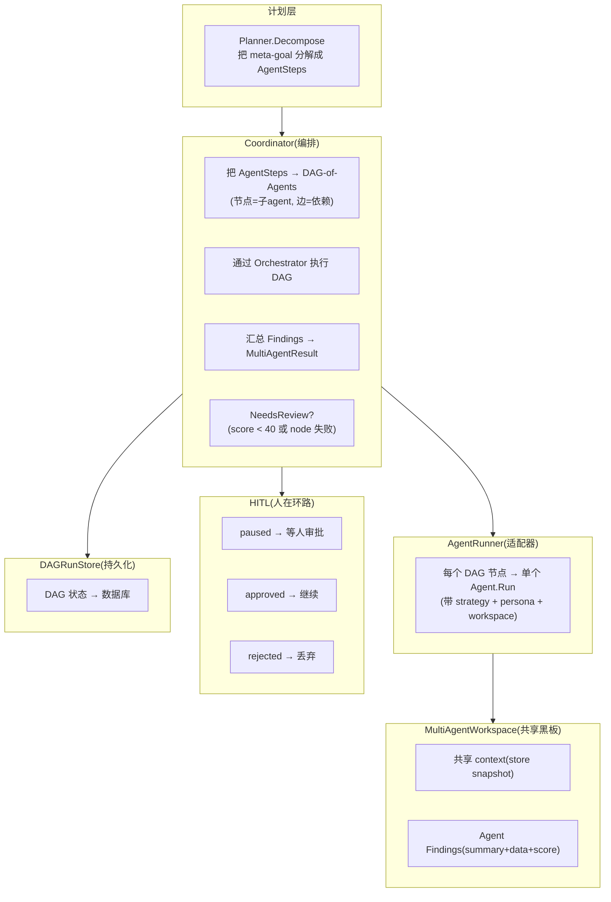

# Vela Shopify Agent · 多 Agent 系统拆解（修正）

> **修正说明**:01-architecture.md 说"Vela 没有子 agent"。这是错误的。Vela 有完整的多 agent 系统（`service/multiagent/`，1,332 行，5 个文件），实现了 DAG-of-Agents 架构（ADR 0003）。
>
> 本篇是对 01 的**修正和补充**。

## 架构



## 五个核心组件

### ① AgentStep（计划单元）

```go
// coordinator.go (verbatim)
type AgentStep struct {
    Goal     string     // 子目标(如"分析 SEO 问题")
    GoalID   *uuid.UUID // 关联的长周期目标
    Strategy string     // "react" | "plan" | "goal_loop" | "chat"
    Persona  string     // "seo" | "content" | "inventory"
    Deps     []int      // 依赖的其他 step(DAG 边)
}
```

每个 step 是一个**子 agent 的任务定义**：做什么（Goal）、怎么做（Strategy）、扮演谁（Persona）、等谁完成（Deps）。

### ② Coordinator（编排器）

```go
// coordinator.go (verbatim)
type Coordinator struct {
    agent          singleAgentRunner      // 共享的单 agent
    orchestrator   *orchestrator.Orchestrator
    defaultTimeout time.Duration           // 120s per agent node
    bus            eventPublisher          // 事件总线
    registry       agentResolver           // persistent agent ID
    hitl           *HITLRegistry           // 人在环路
    dagStore       *DAGRunStore            // DAG 状态持久化
    serviceBundle  services.ServiceBundle  // 可插拔服务
    toolRegistry   *tools.ToolRegistry    // 工具白名单
}
```

**职责**：把 `[]AgentStep` 变成 DAG → 通过 Orchestrator 执行 → 汇总结果 → 判定是否需要人工审批。

### ③ MultiAgentWorkspace（共享黑板）

```go
// workspace.go (verbatim)
type MultiAgentWorkspace struct {
    mu       sync.RWMutex
    metaGoal string
    context  map[string]any       // 共享 context(所有 agent 可读)
    findings []AgentFinding       // 各 agent 的产出
}

type AgentFinding struct {
    AgentID   string         // 哪个 agent 产出的
    Persona   string         // 角色
    Goal      string         // 子目标
    Summary   string         // 人类可读摘要
    Data      map[string]any // 结构化输出(给下游 agent 用)
    Score     int            // 0-100 自评置信度
    Timestamp time.Time
}
```

**goroutine 安全**（orchestrator 并行跑 agent 节点）。读操作返回**副本**（agent 可以在长时间运行中自由使用，不持锁）。

**这是七个框架中最接近"真正协作"的设计**：
- kimi-code swarm：agent 之间**不共享**任何状态
- Codex InterAgentCommunication：有通信但**没有共享黑板**
- Vela Workspace：**共享 context + findings**，下游 agent 能看到上游 agent 的结构化输出

### ④ AgentRunner（适配器）

```go
// runner.go (verbatim)
type AgentRunner struct {
    runner        singleAgentRunner      // 底层的单个 agent
    workspace     *MultiAgentWorkspace   // 共享黑板
    shopID        uuid.UUID
    bus           eventPublisher         // 生命周期事件
    registry      agentResolver          // persistent agent ID
    dagStore      *DAGRunStore           // DAG 状态
    serviceBundle services.ServiceBundle // 可插拔服务
    toolRegistry  *tools.ToolRegistry   // 工具白名单
}
```

**职责**：把 orchestrator 的 agent 节点 spec 转换成一次完整的 `Agent.Run`，注入 workspace context + goal + persona。

### ⑤ HITL（Human-in-the-Loop）

```go
// hitl.go (verbatim)
// 状态机:
// running → completed (NeedsReview=false → 结果是最终的)
// running → paused    (NeedsReview=true  → 暂停等人审批)
// paused  → approved  (人批准 → 下游动作可以继续)
// paused  → rejected  (人拒绝 → 结果丢弃)
```

**触发条件**（`NeedsReview`）：
- 任何 agent 节点没干净完成（error / skipped / cancelled）
- 任何 agent finding 的 score < 40

**七个框架中独有**。其他六个都没有"低置信度自动暂停"的机制。

## 和其他框架对比

| 维度 | kimi-code | grok-build | Codex | **Vela** |
|---|---|---|---|---|
| 拓扑 | 扁平 swarm | 扁平 skeptic | 树形+graph store | **DAG-of-Agents** |
| 共享状态 | ❌ | ❌ | InterAgentComm | **✅ Workspace 黑板** |
| 依赖建模 | ❌ | ❌ | depth limit | **✅ Deps[] DAG 边** |
| 并行 | ✅(128) | ✅(skeptic) | ✅(tree) | **✅(orchestrator batch)** |
| 持久化 | ❌ | ❌ | agent graph store | **✅ DAGRunStore** |
| 人在环路 | ❌ | ❌ | ❌ | **✅ HITL 状态机** |
| 角色系统 | profile(coder/explore/plan) | skeptic/planner/strategist | collaboration mask | **✅ Persona(seo/content/inventory)** |
| 策略选择 | swarm template | 各角色独立 | mask preset | **✅ 每个 step 可选 strategy** |

**Vela 的多 agent 系统在共享状态和人在环路两个维度上是七个框架中最强的。**
