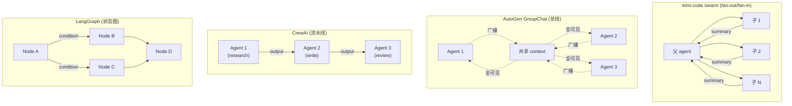
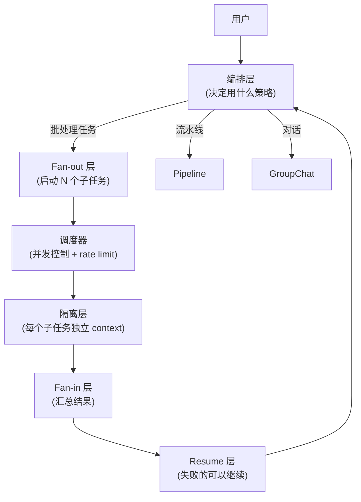

# Insights · 多 Agent 调度策略对比

> 本篇是跨框架对比的第一篇。基于 [kimi-code 的 9 篇拆解](../frameworks/kimi-code/),对比其他主流 agent 框架在"多 agent 调度"上的设计差异,抽象出通用模式。

## 问题陈述

当一个 agent 任务可以切分成多个子任务时,**如何调度这些子任务**?这是所有"多 agent 系统"要回答的核心问题。不同选择决定了:
- 能利用多少并行度
- 子任务之间能不能协作
- 失败如何传播
- 资源(provider 配额、内存)如何控制

## 各方案速览

| 框架 | 模型 | 并行度 | 子任务通信 | 失败传播 |
|---|---|---|---|---|
| **kimi-code swarm** | 批处理(模板 + items) | 高(最多 128) | ❌ 完全隔离 | 单个 fail 不影响其他 |
| **kimi-code goal mode** | 单 agent 自治多轮 | ❌ 串行 | N/A | 整个 goal paused/blocked |
| **AutoGen GroupChat** | 多 agent 对话 | 低(轮流发言) | ✅ 共享 context | 中断整个对话 |
| **CrewAI** | 顺序/流水线 | 中(流水线) | ✅ task 间传递 | 中断整个 crew |
| **LangGraph** | 图(state graph) | 可配置 | ✅ 共享 state | 节点级 error handler |
| **Claude Code subagent** | 类 kimi-code | 中(显式 spawn) | ❌ 隔离 | 单个 fail 不影响 |

## 维度对比

### 1. 拓扑结构



### 2. 状态共享

| 框架 | 子任务能否看到彼此的中间状态? | 机制 |
|---|---|---|
| kimi-code swarm | ❌ | 完全隔离,只通过最终 summary 通信 |
| kimi-code goal | N/A | 单 agent,没有"彼此" |
| AutoGen | ✅ | 共享 context bus,所有 agent 看到所有消息 |
| CrewAI | ⚠️ 部分 | 通过 task output 显式传递,不共享中间状态 |
| LangGraph | ✅ | 共享 state dict,节点读写 |

**kimi-code 的选择**(完全隔离)的代价和收益:

**收益**:
- 上下文干净(子 agent 不会被其他子 agent 的废话污染)
- 可预测(每个子 agent 只关心自己的 prompt)
- 成本可控(O(N) 而不是 O(N²))
- 并行友好(没有共享状态,不需要锁)

**代价**:
- 不能协作(子 agent A 发现问题,不能直接告诉子 agent B)
- 父 agent 要做所有整合工作
- 复杂的交叉任务做不了(例如"A 找到的线索让 B 改变策略")

### 3. 失败处理

| 框架 | 单个子任务失败时 |
|---|---|
| kimi-code swarm | 标记 failed,其他继续;父 agent 看到失败结果,可以 resume |
| AutoGen | 通常中断整个对话(除非显式配置 handler) |
| CrewAI | 默认中断整个 crew |
| LangGraph | 节点级 error handler,可以重试或跳过 |

**kimi-code swarm 的设计**最**容错**:

```
父 agent 发起 swarm → 128 个子 agent
  ├─ 100 个 completed
  ├─ 20 个 failed (非 429 错误)
  ├─ 8 个被 requeue 后成功
  └─ 父 agent 拿到所有结果(含失败的),自己决定下一步
```

父 agent 可以再次调用 `AgentSwarm(resume_agent_ids=...)` 让失败的子 agent 继续。这种"**批处理 + resume**"模式非常适合 LLM agent 场景(失败是常态)。

### 4. 资源控制

| 框架 | 并发上限 | Rate limit 处理 |
|---|---|---|
| kimi-code swarm | 128(硬上限)+ 可配 maxConcurrency | 自适应容量退避(见 02-swarm.md §3.3) |
| AutoGen | 无内置限制 | 依赖上层 |
| CrewAI | 串行为主 | N/A |
| LangGraph | 可配置 | 节点级 retry |

**kimi-code 的 rate limit 退避是本文最强的工程实践**:
- 三阶段并发控制(立即 5 个 → 700ms 间隔 → 自适应容量)
- 容量自适应(用历史成功数作为新上限)
- 退避后容量只缩不涨,3 分钟无事故才恢复

这套机制是**专门为 LLM provider 的 rate limit 行为**设计的,其他框架没有同等深度的方案。

## 取舍分析:什么场景适合什么方案?

### 场景 A:批量代码审查(30 个文件各自审查)

**最佳**:kimi-code swarm 模式
- 任务天然可切分(每个文件独立)
- 不需要子任务通信
- 容忍个别失败
- 需要 rate limit 退避

### 场景 B:研究 → 写作 → 审校(三阶段流水线)

**最佳**:CrewAI 或 LangGraph
- 有明确的阶段依赖
- 上游输出是下游输入
- 不需要大量并行

### 场景 C:多角色讨论(产品经理 + 工程师 + 设计师辩论)

**最佳**:AutoGen GroupChat
- 需要"对话"语义
- 每个角色看到所有其他角色的发言
- 动态决定谁下一个发言

### 场景 D:复杂工作流(条件分支、循环、人工审批)

**最佳**:LangGraph
- 显式的图结构
- 支持 condition、cycle
- 节点级 state 和 error handler

### 场景 E:自治大任务(一个复杂目标,多轮推进)

**最佳**:kimi-code goal mode
- 不是多 agent,是单 agent 多轮
- 需要暂停/恢复/预算控制
- 需要明确的"完成"判断

## 通用模式抽象

基于以上对比,可以抽象出一个 **"reference design"**:



**六个正交维度**:
1. **编排策略**(批处理 / 流水线 / 对话 / 图)—— 应该可插拔
2. **并发控制**(固定上限 / 自适应 / 无限制)—— 应该按 provider 配置
3. **Rate limit 退避**(固定退避 / 自适应容量 / 无)—— 应该学习 kimi-code
4. **隔离级别**(完全隔离 / 共享 state / 共享 context)—— 应该按任务配置
5. **失败处理**(中断 / 标记继续 / resume)—— 应该默认容错
6. **资源声明**(显式 / 隐式 / 无)—— 应该用于冲突检测

目前没有任何框架在所有 6 个维度都做到位。kimi-code 在 1/2/3/4/5 上很强,但 1(编排策略)是写死的批处理,不支持流水线或对话。

## 给 kimi-code 的建议

基于这个对比,kimi-code 如果要增强,可以:

1. **支持 pipeline 模式**:让 swarm 的 items 可以定义依赖关系(`item B depends on item A's output`)。这覆盖 CrewAI 的场景。
2. **支持 agent 对话模式**:让两个 agent 能来回讨论 N 轮(不是 swarm 的批处理)。这覆盖 AutoGen 的场景。
3. **暴露 rate limit 参数**:`INITIAL_LAUNCH_LIMIT`、`RATE_LIMIT_RETRY_BASE_MS` 这些应该可配。
4. **子 agent 间的事件总线**(可选):让子 agent A 能发事件,子 agent B 能订阅。这开启真正的协作(但要小心复杂度爆炸)。

## 参考资料

- kimi-code 的拆解(本仓库):
  - [02-swarm.md](../frameworks/kimi-code/02-swarm.md) —— 批处理调度
  - [03-goal-mode.md](../frameworks/kimi-code/03-goal-mode.md) —— 自治多轮
  - [04-subagent.md](../frameworks/kimi-code/04-subagent.md) —— 隔离机制
- 对比框架(外部):
  - AutoGen: https://microsoft.github.io/autogen/
  - CrewAI: https://docs.crewai.com/
  - LangGraph: https://langchain-ai.github.io/langgraph/
