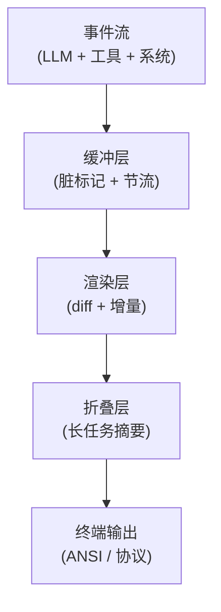

# Insights · CLI 渲染跨框架对比

> 本篇基于 [kimi-code 的 TUI 拆解](../frameworks/kimi-code/13-tui-rendering.md),对比其他 CLI agent 框架在终端渲染上的设计差异。

## 问题陈述

Agent 输出是**多源、流式、多模态**的,远比传统 CLI 工具复杂。不同框架的渲染策略决定了用户体验的好坏。

## 各方案对比

| 框架 | 渲染框架 | 流式策略 | 折叠 | 多模态 |
|---|---|---|---|---|
| **kimi-code** | 自研 pi-tui | 脏标记 + 定时 flush | StepSummary / ReadGroup / AgentGroup | 图片缩略图、视频路径 |
| **Claude Code** | 自研(基于 React + ink) | React reconciler | turn 边界折叠 | 图片缩略图 |
| **Aider** | rich(Python) | 直接 print | 无 | 图片 base64 |
| **Cursor** | Electron(VS Code 内核) | VS Code tree view | 完整 IDE 体验 | 完整 |
| **OpenAI Codex CLI** | 自研(简单) | 字符流 | 无 | 无 |

## 关键差异

### 1. 渲染框架选择

**kimi-code 选择自研 pi-tui**:
- 性能优先(流式 token 速度)
- 极简 `Component.render(width) → string[]`
- 不依赖 React

**Claude Code 选择 ink(React for CLI)**:
- 复用 React 生态
- 熟悉的 JSX 模式
- 代价:reconciler 开销

**Aider 选择 rich**:
- Python 生态成熟
- 开箱即用的格式化(表格、语法高亮、markdown)
- 代价:没有组件模型,扩展难

### 2. 流式渲染策略

**kimi-code 的"脏标记 + 定时 flush"**:
```
token 来 → 标脏 → 30Hz flush → 一次渲染处理所有 pending
```

**Aider 的"直接 print"**:
```
token 来 → print(delta) → stdout
```

**对比**:
- kimi-code:支持**增量重绘**(只改变化的行),不闪烁
- Aider:**追加式**(只能往下加,不能改之前的),简单但限制大

kimi-code 的策略让"修正之前的输出"成为可能(例如工具结果回来后更新 spinner 行)。

### 3. 折叠策略

长任务的折叠是**可用性的关键**:

| 框架 | 折叠 |
|---|---|
| kimi-code | StepSummary + ReadGroup + AgentGroup(三层折叠) |
| Claude Code | turn 边界折叠(简单) |
| Aider | 无(全部展开) |
| Cursor | IDE 原生(代码折叠) |

**kimi-code 最激进**:把老的 step、连续的 read、swarm 的子 agent 都折叠成一行。这让 100+ step 的长任务也能看清主线索。

### 4. 多模态

终端展示图片/视频是**所有 CLI agent 的弱项**:

- kimi-code:用 ANSI 图形协议(iTerm2 / Kitty)显示缩略图
- Claude Code:类似
- Aider:base64 字符串(基本不可看)
- Cursor:VS Code 内核,完整图片支持

**结论**:CLI 的多模态永远比不上 GUI(Cursor 的方向是对的,但放弃了"终端原生"的优势)。

## 抽象出的通用模式

一个成熟的 agent CLI 渲染系统应该有:



**四层是正交的**:
1. 缓冲层:决定 token 速度 vs 渲染频率的平衡
2. 渲染层:决定是否增量重绘
3. 折叠层:决定长任务的可读性
4. 终端层:决定多模态能力

**kimi-code 在 1-3 都做得最好**,但 4(多模态)受限于 CLI 形态。

## 给其他框架的建议

- **Aider 应该加折叠**:长任务完全展开不可读
- **Claude Code 应该把 ink 换成更轻量**:流式性能瓶颈
- **所有 CLI agent 应该统一图片协议**:目前 iTerm2 / Kitty / Sixel 各搞各的

## 参考资料

- [kimi-code TUI 拆解](../frameworks/kimi-code/13-tui-rendering.md)
- ink:https://github.com/vadimdemedes/ink
- rich:https://github.com/Textualize/rich
- ACD(Agent Client Protocol):https://agentclientprotocol.com/
