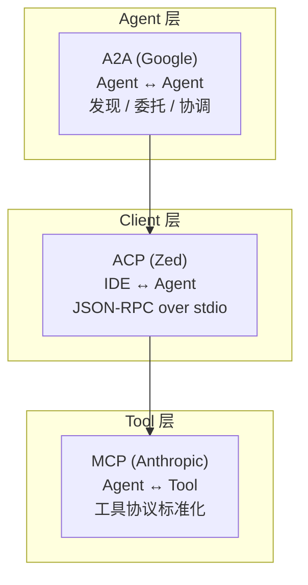

# Insights · Agent 本质 —— 行业全景与设计哲学

> 本篇综合 Anthropic / OpenAI / Google / Kimi / 智谱 / DeepSeek 等大厂在 agent 领域的公开探索,提炼出他们对"agent 是什么"的本质理解。基于公开文档、技术博客、SDK 设计,不是猜测。

## 1. 大厂对 Agent 的定义(高度一致)

### Anthropic(最清晰)

> **Workflows** are systems where LLMs and tools are orchestrated through **predefined code paths**.
>
> **Agents**, on the other hand, are systems where LLMs **dynamically direct their own processes** and tool usage, maintaining control over how they accomplish tasks.

—— [Building Effective Agents](https://www.anthropic.com/engineering/building-effective-agents)

**关键区分**:路径是预定义的(workflow)还是 LLM 自己决定的(agent)。

### OpenAI

> An **Agent** is an instance of an LLM guided by specific instructions and capable of utilizing various _tools_.
>
> The **agent loop**: agent first attempts to respond; if it lacks information or requires external action, it calls the appropriate tool, processes the result, and tries again.

—— [OpenAI Agents SDK](https://developers.openai.com/api/docs/guides/agents)

**关键词**:loop、tools、instructions。

### Google

> Agent design patterns offer a distinct framework for organizing a system's components, integrating the model, and **orchestrating** a single agent or multiple agents to accomplish a workflow.

—— [Choose a design pattern for your agentic AI system](https://docs.cloud.google.com/architecture/choose-design-pattern-agentic-ai-system)

Google 把 agent 看作**设计模式的组合**(single / sequential / parallel / loop / review-critique / iterative-refinement / coordinator / hierarchical / swarm / ReAct / human-in-the-loop)。

### Kimi(Moonshot)

从 kimi-code 源码推断:Moonshot 的观点是 **"agentic systems = LLM + 持久化状态机 + 工程化约束"**。他们的 wire 协议、goal 状态机、权限责任链都是"工程化约束"的体现。

### 智谱(GLM)

> 2025 年是 AI Agent 的爆发之年。智谱将搭建 Agentic 大模型平台。
>
> AutoGLM 沉思模型:全球首个集**深度研究与实际操作能力**于一体的 Agent。

—— 张鹏,智谱 CEO

智谱的方向是**研究 + 操作一体化**(DeepResearch + 操作执行)。

### DeepSeek

DeepSeek 的核心贡献是**混合推理架构**(Hybrid-Inference),把"快思考"和"慢思考"统一在一个模型里。对 agent 的意义:**推理能力本身是 agent 的基础**,DeepSeek 让推理更便宜,降低了 agent 的成本。

## 2. 六家厂商的探索方向对比

| 厂商 | 核心贡献 | 对 Agent 本质的理解 |
|---|---|---|
| **Anthropic** | MCP 协议 + Building Effective Agents(五种 workflow 模式) | 简单优先,workflow 和 agent 是光谱的两端 |
| **OpenAI** | Agents SDK + Swarm(演进版)+ Codex | Python-first,最小抽象,handoff 是核心 |
| **Google** | A2A 协议 + ADK + 设计模式分类法 | Agent 是设计模式的组合,标准化互操作 |
| **Kimi(Moonshot)** | kimi-code(wire/Op/goal/swarm) | 工程化约束 > LLM 能力,持久化状态是关键 |
| **智谱** | AutoGLM 沉思 + GLM-4.5 MoE | 研究 + 操作一体化,自我反思能力 |
| **DeepSeek** | R1 推理模型 + V3.1 混合推理 | 推理是 agent 的基础,降本增效 |

## 3. 行业共识:Agent 的五个本质特征

综合六家观点,提炼出 **agent 的五个本质特征**(不是"LLM + 工具 + 记忆"这种描述,而是更深层的):

### ① 自主性(Autonomy)—— 决策权的让渡

**Anthropic 的定义核心**:

> Agents are systems where LLMs **dynamically direct their own processes**.

传统软件:程序员写 if-else,所有路径确定。
Agent:**LLM 决定下一步做什么**,路径是运行时动态产生的。

但**自主性不是非黑即白**,是一个**光谱**:

```
完全预定义 ←————————————————————→ 完全自主
  prompt chaining    routing    orchestrator-workers    autonomous agent
  (workflow)         (workflow)  (workflow)               (agent)
```

**Anthropic 的五种模式**就是这个光谱上的刻度:

| 模式 | 自主性 | 谁决定路径 |
|---|---|---|
| Prompt chaining | 最低 | 代码(固定序列) |
| Routing | 低 | 代码 + LLM 分类 |
| Parallelization | 低 | 代码(并行结构) |
| Orchestrator-workers | 中 | LLM(动态分解任务) |
| Evaluator-optimizer | 中 | LLM(迭代改进) |
| **Autonomous agent** | **最高** | **LLM(完全自主)** |

**kimi-code 的对应**:
- Plan mode = prompt chaining(workflow)
- Swarm = parallelization(workflow)
- Goal mode = autonomous agent(agent)
- Subagent = orchestrator-workers(workflow)

### ② 反馈环(Feedback Loop)—— 行动 → 观察 → 再行动

**OpenAI 的定义核心**:

> The agent loop: respond → if needs tool → call tool → process result → try again.

这不是简单的"调用一次",是**循环**。循环的质量决定 agent 的好坏:

- **及时性**:流式渲染让 LLM 不等
- **准确性**:工具结果可靠
- **丰富度**:多模态反馈
- **不污染**:错误不传播

**kimi-code 的整个架构都在优化这个循环**:
- 流式渲染(13-tui)
- 错误归一化(15-errors)
- 子 agent 隔离(04-subagent)
- wire 持久化(07-wire)

### ③ 持久性(Persistence)—— 意图不会因技术原因丢失

这是 **kimi-code 最强调但其他厂商较少讨论**的特征。

**Chatbot**:用户发 → 软件回 → 结束。意图不持久。
**Agent**:意图被**持久化**,即使进程崩溃、context 满了、用户走开。

kimi-code 的体现:
- Wire log restore(进程崩溃后恢复)
- Compaction handoff(context 满了不丢关键信息)
- Goal paused/blocked(用户走开了意图不消失)
- Cron(用户不在线时 agent 主动工作)

**Google 的 A2A 协议**也有类似概念:Task 有完整的生命周期(created/submitted/working/completed/failed),跨 agent 传递。

### ④ 约束(Constraint)—— 给不可靠的 LLM 套上可靠的壳

**这是 Anthropic 和 kimi-code 最一致的观点**。

Anthropic:

> Maintain **simplicity** in your agent's design.
> Prioritize **transparency** by explicitly showing the agent's planning steps.
> **When more complexity is warranted**, workflows offer predictability and consistency.

kimi-code 的整个权限系统(19 个 policy)+ 状态机(goal 四状态)+ 边界检查(max_steps、minChars、3 轮 blocked)都是**约束**。

**约束的本质**:LLM 越不可靠,约束越重。Agent 框架不是"让 LLM 更聪明",是**给不可靠的 LLM 套上可靠的壳**。

**OpenAI 的 guardrails** 也是约束:

> Guardrails can ensure that parameters passed to an agent conform to a specific format, terminating the agent loop early if they don't.

### ⑤ 可组合性(Composability)—— 从单体到群体

**所有大厂都在朝这个方向走**:

- **Anthropic**:MCP 让工具可组合
- **OpenAI**:handoff 让 agent 可组合
- **Google**:A2A 让 agent 跨厂商可组合
- **kimi-code**:swarm 让 agent 并行可组合

**Google 的 A2A 是最大胆的愿景**:

> A2A enables AI agents from different vendors to discover each other, delegate tasks, and coordinate work across enterprise systems.

这是**互联网级的 agent 协作** —— 一个公司的招聘 agent 和另一个公司的日历 agent 自动协调面试时间。

## 4. 三大协议:Agent 的 TCP/IP 时刻

2025 年出现的三大协议,正在形成 agent 互操作的"TCP/IP 栈":



| 协议 | 谁提出 | 解决什么 | 类比 |
|---|---|---|---|
| **MCP** | Anthropic | Agent 怎么调工具 | HTTP(应用层) |
| **ACP** | Zed 社区 | IDE 怎么驱动 Agent | WebSocket(双向通信) |
| **A2A** | Google | Agent 之间怎么协作 | TCP(传输层) |

**kimi-code 全部实现了**:MCP(11-mcp.md)+ ACP(16-acp-ide.md),只是没实现 A2A(那需要跨厂商协调)。

## 5. Agent 的设计模式分类法

**Google 的分类法最系统**(10 种模式):

| 模式 | 结构 | 何时用 |
|---|---|---|
| **Single agent** | 一个 agent + 工具 | 简单任务 |
| **Sequential** | A → B → C 流水线 | 有明确阶段 |
| **Parallel** | A ‖ B ‖ C → 汇总 | 独立子任务 |
| **Loop** | A → 检查 → 再 A | 迭代改进 |
| **Review-critique** | A 做 → B 审 → A 改 | 需要质量控制 |
| **Iterative refinement** | A → 评分 → 改 → 评分 → ... | 追求最优 |
| **Coordinator** | 调度器 → 专家 A/B/C | 需要路由 |
| **Hierarchical** | 经理 → 组长 → 员工 | 复杂分解 |
| **Swarm** | 对等协作(共享 context) | 创造性任务 |
| **ReAct** | 推理 → 行动 → 观察 → 推理 | 通用 |

**kimi-code 的 swarm ≠ Google 的 swarm**:
- kimi-code swarm = Google 的 **Parallel**(独立子任务,不通信)
- Google swarm = 对等协作,agent 之间共享 context、互相 critique

## 6. 最前沿的探索方向

### 6.1 自我反思(Self-Reflection)

**智谱的 AutoGLM 沉思**和 **Anthropic 的 evaluator-optimizer 模式**都在朝这个方向走。

**当前 kimi-code 缺失的**:agent 不会"事后想想自己做错了什么,下次改进"。所有"学习"都靠人改 prompt。

**前沿方向**:
- Agent 跑完后自动复盘
- 把经验存入长期记忆
- 下次遇到类似任务时调用历史经验

### 6.2 跨 Agent 互操作(A2A)

**Google 的 A2A 协议**正在推动"agent 互联网":

> A2A enables AI agents from different vendors to discover each other, delegate tasks, and coordinate work.

**Agent Card**:每个 agent 发布一个"能力卡片"(类似 web 的 DNS),其他 agent 可以发现并委托任务。

**愿景**:一个公司的 agent 可以安全地调用另一个公司的 agent,不需要人工对接。

### 6.3 具身智能(Embodied AI)

> 从数字世界到物理世界:Agent 的"行动"将不再局限于调用 API 和操作软件,而是能够控制机器人、无人机等物理实体。

这是 agent 从"软件"变成"实体"的方向。当前的 coding agent 都是纯数字的,但未来可能控制物理设备。

### 6.4 边缘化与去中心化

> 为了保护用户隐私和降低延迟,越来越多的轻量级 Agent 将被部署在边缘设备上(如手机、汽车、智能眼镜)。

手机上的 agent 不需要云端,本地跑。这对模型大小和框架轻量化提出新要求。

## 7. 重新定义 Agent 的本质

综合以上所有信息,我给出一个**比"LLM + 工具 + 记忆"更深**的定义:

> **Agent 是一个系统,它把不可靠的 LLM,通过工程约束和反馈环,变成能持续追求目标、能从环境中获取信息、能根据反馈调整行为的自主实体。**

五个关键词:
1. **不可靠 → 可信赖**:工程约束的核心
2. **持续追求目标**:区别于 chatbot
3. **从环境获取信息**:感知
4. **根据反馈调整行为**:学习(即使是 prompt 级别的)
5. **自主实体**:决策权的让渡

**Agent 不是"更聪明的 LLM",是"给 LLM 加了一套让它可信赖的工程系统"**。

## 8. 六框架定位光谱

> **2026-07-25 更新**:从 kimi-code 单框架定位扩展为六框架全景。

基于拆解的六个框架,agent 设计的**信任度光谱**:

```
Pi(最信任)    OpenAI Agents SDK    kimi-code      Codex          Google ADK    grok-build(最不信任)
    │               │                   │              │               │              │
 无权限          Guardrail           19 policy     ExecPolicy     图结构        permission
 无验证          Sandbox             3轮审计       无 skeptic     Evaluation    +sandbox
 无拓扑          Handoff             扁平 swarm    树形+通信      Sub-agent树   +skeptic panel
 无记忆          Session             wire.jsonl    双阶段记忆     Memory        +doom loop
 无身份          Tracing             无            ed25519+JWT    A2A           +circuit breaker
 无云            无                  无            cloud-tasks    Cloud Run     无
    │               │                   │              │               │              │
 最灵活          最小抽象            最平衡         结构性约束      企业级全栈    最安全
```

**六框架的独特贡献**:

| 框架 | 独有设计 | 在光谱上的位置 |
|---|---|---|
| **kimi-code** | wire/Op 事件溯源 + 七层 harness + 双轨道 eval | 平衡(DI 深度) |
| **grok-build** | doom loop 检测 + skeptic panel + circuit breaker + 两遍压缩 | 最不信任 |
| **Pi** | Session Tree + branch summarization + 8+ provider | 最信任 |
| **Codex** | 云任务 + agent identity + 双阶段记忆 + 4 平台沙箱 + ExecPolicy DSL | 结构性约束 |
| **Agents SDK** | Handoff(控制权交接)+ Guardrail(并行中止)+ Tracing | 最小抽象 |
| **Google ADK** | A2A 原生 + Memory + Evaluation + Web UI | 企业级全栈 |

**六框架全部能归入五种反熵策略**(压缩/隔离/验证/恢复/约束),跨三种语言(TS/Rust/Python)、两种形态(CLI/库)、四个组织。详见 [04 反熵增](04-anti-entropy.md)。

## 9. 参考资料

---

## 参考资料

完整的参考文献（论文、博客、书籍）已集中维护在 [REFERENCES.md](REFERENCES.md)，所有链接均已验证。本篇涉及的核心参考：

- Anthropic / OpenAI / Google 官方文档
- ReAct / Reflexion / Generative Agents 论文
- 智谱 / DeepSeek / Kimi 国内大厂

> 完整链接见 [REFERENCES.md](REFERENCES.md)。
