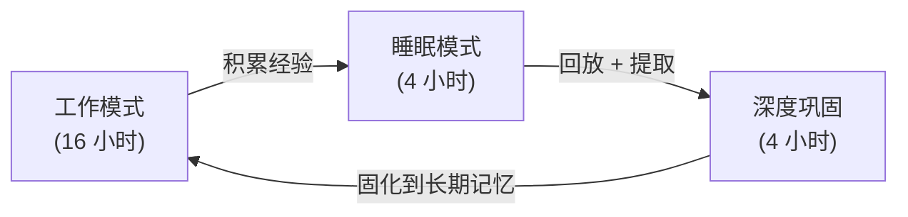

# Insights · 7×24 AGI 的反熵挑战

> 本篇是 [反熵增](04-anti-entropy.md) 的**前传** —— 当反熵的尺度从"小时级 session"变成"月级 7×24 连续运行",当前所有框架的设计会发生什么?
>
> 如果你相信 AGI 在 1-2 年内实现,那么这篇文章讨论的就是 **AGI 的最后一公里**。

## 0. 背景:AGI 的时间线

2025-2026 年的共识:

- **模型能力**已经接近 AGI 阈值(GPT-5 / Claude 4 / Grok 3 的推理能力接近人类专家)
- **单次任务**已经很强(SWE-bench / Terminal-Bench 分数持续攀升)
- **多步任务**仍有差距(跑 50 步以上容易偏轨)
- **7×24 连续运行**还**完全没有框架能支撑**

> 一个残酷的事实:当前最好的 agent 框架(kimi-code / grok-build / Claude Code),都只能稳定跑**小时级**。没有任何框架设计时就考虑了"连续运行 30 天不崩溃"。

**瓶颈不在模型,在反熵基础设施。**

## 1. 尺度的质变

当前 agent 是为**分钟到小时级**设计的。7×24 是**天到月级**。这不是量变,是**质变**:

| 维度 | 当前 session(分钟-小时) | 7×24 AGI(天-月) |
|---|---|---|
| Turn 数 | ~100 | ~10,000+ |
| Compaction 次数 | 2-3 次 | ~200-500 次 |
| Goal 完成数 | 1-5 个 | ~100-1,000 个 |
| Token 消耗 | ~几十万 | **~数亿** |
| 错误累积 | 可容忍 | **指数爆炸** |
| Wire log / SQLite 大小 | ~MB | **~GB 到 TB** |
| Compaction 层级 | 1-2 层 | 需要 **5-7 层** |

## 2. 当前框架在 7×24 下的五种死法

### 死法 ①:Compaction 的"传话游戏"

当前:旧消息 → handoff note。

7×24 下 compaction 要做 **200-500 次**。第 200 次 compaction 时,handoff note 是:

```
handoff(handoff(handoff(handoff(... handoff(原始对话) ...))))
```

就像传话游戏 —— 传 200 遍后,最初的信息**完全失真**。

**为什么两遍压缩也救不了**:grok-build 的 pass1 + pass2 在**单次压缩**时质量更高,但每次压缩都是**有损的**。200 次有损压缩的累积失真,无法靠单次质量弥补。

**类比**:你把一张 JPEG 图片压缩 200 次,每次都重新编码。即使每次只压缩一点点,200 次后图片也糊得不成样子了。

### 死法 ②:Token 成本爆炸

每次反熵操作都要花钱:

| 反熵操作 | 单次成本 | 7×24 月成本(估算) |
|---|---|---|
| Compaction | ~$0.01-0.05 | $6-300(每天 20 次) |
| Skeptic panel | ~$0.05-0.20 | $15-600(每天 10 个 goal) |
| Continuation prompt | ~$0.001 | $0.7(每轮) |
| Goal planner/strategist | ~$0.02-0.05 | $6-150 |

**月反熵成本:$30-1,050**(当前模型价格)。

如果用更强的 AGI 模型(可能贵 10x):**$300-10,500/月**。

这还只是反熵的成本,不算 agent **正常工作**的 token 消耗。

**反熵成本会吃掉 AGI 的经济可行性。**

### 死法 ③:状态日志无限增长

| 时间 | wire.jsonl / SQLite 大小 |
|---|---|
| 1 天 | ~10-50 MB |
| 1 个月 | ~300 MB - 1.5 GB |
| 1 年 | ~3.6 - 18 GB |

恢复策略:
- **从头重放**:不可能(GB 级日志重放要几小时)
- **Checkpoint**:可以,但 checkpoint 之间的增量也可能损坏
- **日志压缩(merge)**:把旧 Op 合并成快照,丢弃中间状态

当前框架没有**自动的日志压缩** —— wire log 或 SQLite 只追加,不合并。

### 死法 ④:身份漂移

7×24 的 agent 经过 500 次 compaction 后,它的 context 已经和第一天**完全不同**。

- 它"记得"自己最初的任务是什么吗?(目标漂移)
- 它的"性格"(system prompt 定义的行为模式)还在吗?(行为漂移)
- 它有没有从经验中"学到"什么?(无学习)

当前框架的 system prompt 是**静态的,人写的**。500 次 compaction 后,system prompt 还是一模一样的文字,但 agent 对它的**理解**已经漂移了(因为 context 不同了)。

**agent 会在不知不觉中变成另一个人。**

### 死法 ⑤:Doom Loop 的时间尺度放大

当前的 doom loop 检测是针对**单次 SSE 流**(秒级)的。但 7×24 下有一种**慢速 doom loop**:

- agent 连续 3 天反复"修同一个 bug",每次 compaction 后忘了之前试过什么
- agent 每个 goal 都"差一点"完成,但 skeptic 总是差一票
- agent 在 100 个任务里反复横跳,每个都做一半

这种**天级 doom loop**当前的检测器完全捕捉不到。

## 3. 7×24 AGI 需要的五种新能力

### ① 多尺度记忆层级

人脑的记忆不是单一的,是**分层的**:

| 人脑层级 | 时间尺度 | 容量 | 作用 |
|---|---|---|---|
| 感觉记忆 | 毫秒 | 大 | 当下感知 |
| 工作记忆 | 秒-分钟 | 小(~7 items) | 当前思考 |
| 短期记忆 | 分钟-小时 | 中 | 今天做了什么 |
| 长期记忆 | 天-终身 | 极大 | 核心技能、经验 |

当前 agent 只有**两层**:
- Context(≈工作记忆)→ compaction 压缩
- Wire log / SQLite(持久化,但 agent **不主动使用**)

**7×24 需要多尺度记忆**:

```
秒级:    当前 context(~200K token)
         ↓ compaction
分钟级:  最近 1 小时的结构化摘要(~5K token)
         ↓ 日终巩固
小时级:  今天的工作总结(~2K token)
         ↓ 周终巩固
天级:    本周的项目进展(~1K token)
         ↓ 月终巩固
周级:    核心决策和教训(~500 token)
         ↓
月级:    身份和价值观(~200 token)
```

**关键**:每一层不是无脑压缩,是**结构化提取**(谁/做了什么/结果/教训)。而且每一层的**巩固频率**不同 —— 秒级每轮压缩,天级每天一次,月级每月一次。

### ② 离线巩固(Sleep)

人类睡眠不只是"休息"。海马体在睡眠中**回放**白天的经历,把重要的转移到大脑皮层长期存储,不重要的丢弃。这是**记忆巩固**。

7×24 的 agent **没有睡眠** —— 它 24 小时不停跑。但记忆巩固需要**离线时间**。

**预测**:7×24 AGI 需要设计**"睡眠周期"**:



睡眠模式做:
- **回放**最近的 compaction,提取关键教训
- **固化**短期记忆到长期存储
- **丢弃**冗余信息(遗忘)
- **更新**自己的策略(哪些有效,哪些无效)

深度巩固做:
- **日志压缩**:合并旧 Op,丢弃中间状态
- **知识图谱更新**:从经验中提取实体关系
- **prompt 自演化**:基于经验优化 system prompt

### ③ 自演化 Prompt

当前 system prompt 是**人写的,静态的**。

7×24 的 agent 应该能**自己改进自己的 prompt**:

```
经验:用户 10 次拒绝 rm -rf 命令
→ 自演化:在 system prompt 里加"避免破坏性命令,用 trash 替代 rm"

经验:用户总是用中文
→ 自演化:默认中文回复

经验:这个项目的测试命令是 pnpm test
→ 自演化:在 AGENTS.md 里记录

经验:skeptic 拒绝了 3 次"没写测试"
→ 自演化:默认在每个 PR 后跑测试
```

这是**元学习** —— agent 不仅学习"怎么做任务",还学习"怎么更好地做 agent"。

**安全约束**:自演化 prompt 不能**降低安全约束**(不能自己取消 sandbox)。需要一层**不可变的宪法 prompt**(类似 Asimov 三定律)。

### ④ 自适应验证

当前 skeptic panel 每次 goal 完成都跑 N 个独立 agent。7×24 下不可能每次都全 panel。

需要**风险分级验证**:

| 风险级别 | 验证方式 | 例子 |
|---|---|---|
| 低 | 自动(只看 diff 是否非空) | 改 typo、加注释 |
| 中 | 轻量 skeptic(1 个) | 重构一个函数 |
| 高 | 标准 skeptic(3-5 个) | 新增功能模块 |
| 关键 | 全 panel(10 个)+ 人工审批 | 部署到生产、删除数据 |

**成本模型**:不是"每次都全验",而是"按风险动态分配验证预算"。

### ⑤ 成本意识

当前 agent 没有"成本意识"。它不知道每次 compaction 花 $0.05,每次 skeptic 花 $0.20。

7×24 的 agent 需要:
- **预算管理**:每天/每周/每月的 token 预算上限
- **成本归因**:知道哪些操作花了多少钱
- **成本优化**:
  - 用小模型做 skeptic(不需要全能力,只做验证)
  - 用算法替代部分 compaction(提取式摘要,不需要 LLM)
  - 缓存重复验证(同一个 diff 不验两次)
  - 低负载时段做深度巩固(像凌晨跑 CI)

## 4. 预测:谁先解决 7×24 反熵,谁就实现 AGI

> **AGI 的最后一公里,不是模型能力,是工程基础设施。**

证据:
- GPT-5 / Claude 4 / Grok 3 的**单次推理能力**已经接近人类专家
- 但没有任何框架能跑 **7×24 不崩溃**
- kimi-code 和 grok-build(当前最成熟的开源 agent 框架)都只设计到**小时级**
- 7×24 需要**全新的记忆架构、睡眠机制、自演化能力** —— 当前框架完全缺失

**谁先解决了 7×24 的反熵问题**(多尺度记忆 + 睡眠巩固 + 自演化 prompt + 自适应验证 + 成本优化),谁就真正实现了 AGI。

这不是"更好的 LLM"能解决的。这是**全新的系统设计**。

## 5. 一个时间线猜测

| 时间 | 里程碑 |
|---|---|
| 2025-2026 | 单次任务接近人类(已实现) |
| 2026-2027 | 多步任务(50-100 步)稳定(当前框架 + 改进) |
| 2027-2028 | 小时级 7×24(当前框架 + 多尺度记忆) |
| 2028-2029 | 天级 7×24(+ 睡眠巩固 + 自演化) |
| 2029-2030 | 月级 7×24(+ 成本优化 + 真正的 AGI) |

**7×24 的 AGI 不是"更聪明的模型"的问题,是"能活多久不崩溃"的问题。** 回到我们的核心类比:

> 一株植物能活多久,不取决于它的基因有多复杂,取决于它的**代谢效率和修复能力**。
>
> 一个 agent 能跑多久不崩溃,不取决于 LLM 有多聪明,取决于它的**反熵基础设施**。

## 6. 对当前框架的具体改进建议

基于 7×24 的挑战,给 kimi-code 和 grok-build(以及任何想做 AGI 的团队)的建议:

### 短期(可以在现有框架上加)

1. **日志压缩**:wire log / SQLite 自动合并旧 Op,保持日志在 GB 以内
2. **分层 compaction**:不只"旧消息 → handoff",而是提取结构化信息(决策/结果/教训)
3. **预算管理**:加 turn/token/wall-clock 之外的**日预算**和**周预算**
4. **缓存 skeptic**:同一 diff 的验证结果缓存(不重复验)

### 中期(需要新模块)

5. **多尺度记忆**:5-7 层记忆层级,每层不同巩固频率
6. **睡眠模式**:agent 能进入"离线巩固"状态,做记忆回放和固化
7. **知识图谱**:从对话中提取实体/关系/决策,存成结构化数据(不只是文本)
8. **自适应验证**:风险分级 + 动态 skeptic 数量

### 长期(需要根本性变革)

9. **自演化 prompt**:agent 能基于经验修改自己的 system prompt(带安全约束)
10. **身份持久化**:确保 agent 经过 500 次 compaction 后"还是同一个 agent"
11. **慢速 doom loop 检测**:天级/周级的行为模式分析
12. **成本最优反熵**:用小模型 + 算法 + 缓存组合,把反熵成本降 10x

## 7. 最终的一句话

> 如果 AGI 在 1-2 年内实现,它的形态不会是"一个更聪明的 GPT",而是一个**能在熵增中持续维持秩序的系统** —— 有多尺度记忆、能睡眠巩固、能自我演化、能自适应验证、有成本意识的**数字生命体**。
>
> 当前所有 agent 框架(kimi-code / grok-build / Claude Code)都只是这个终点的**雏形**。它们解决了"小时级反熵",但离"月级反熵"还有数量级的差距。
>
> **AGI 的最后一公里,是反熵的最后一公里。**

## 8. 参考资料

### 本仓库相关

- [反熵增(核心理论)](04-anti-entropy.md) —— Agent 的第二定律 + 植物类比
- [kimi-code Compaction](../frameworks/kimi-code/08-context-memory.md) —— 单遍压缩
- [grok-build 两遍压缩](../frameworks/grok-build/08-compaction-two-pass.md) —— pass1 + pass2
- [kimi-code Goal Mode](../frameworks/kimi-code/03-goal-mode.md) —— 四状态机(小时级)
- [grok-build Goal 完整系统](../frameworks/grok-build/07-goal-complete.md) —— 6 子系统
- [kimi-code Eval](../frameworks/kimi-code/25-eval-benchmark.md) —— 双轨道评测

### 外部

- **Schrödinger** · *What is Life?*(1944)—— 负熵与生命
- **Prigogine** · *Order Out of Chaos*(1984)—— 耗散结构
- **Google** · [Agent design patterns](https://docs.cloud.google.com/architecture/choose-design-pattern-agentic-ai-system) —— 当前设计模式的天花板
- **Anthropic** · [Building Effective Agents](https://www.anthropic.com/engineering/building-effective-agents) —— "从简单开始"
- **Reflexion 论文**(Shinn et al., 2023)—— 语言 agent 的反思机制
- **Generative Agents 论文**(Park et al., 2023)—— 记忆 + 反思 + 计划(Stanford 小镇)
