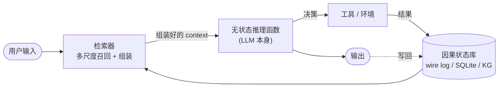

# Insights · LLM 是无状态函数 —— 7×24 AGI 的物理基础

> 本篇是 [05-agi-7x24.md](05-agi-7x24.md) 的**底层重写**,也是 [04-anti-entropy.md](04-anti-entropy.md) 的**信息论重构**。
>
> 起点不是类比,不是隐喻,是一个被整个 agent 圈绕开的数学事实:**LLM 是一个无状态的纯函数**。这一句话,把 05 里散落的"多尺度记忆 / 睡眠巩固 / 身份持久化"全部统一成同一件事,也把幻觉、长上下文竞赛、memory framework 热潮全部归位。
>
> 这篇不靠植物类比,不靠热力学,只靠一个函数签名。**它是整个 insights 系列里论点最硬、最难被反驳的一篇** —— 因为它建立在接口契约上,不是建立在修辞上。

## 0. 起点:被忽略的函数签名

LLM 的调用接口,写成 TypeScript 是:

```typescript
// 任何 agent 框架对 LLM 的调用,逻辑上都是这个签名
function llm(
  systemPrompt: string,
  context: Message[],
  userMessage: Message
): Message
```

**没有 `state` 参数,没有 `memory` 参数,没有 `lastResult`。**

你每次按回车,模型都从 `context` 这一堆 token 出发,做一次完整的推理。推理结束后,函数返回,**所有中间状态全部丢弃**。下一次调用,模型对上一次调用**一无所知**(除非你把它写进新的 context)。

这是 7×24 AGI 讨论的真正起点。但整个 agent 圈都在用"记忆"、"长期记忆"、"工作记忆"、"经验积累"这些词绕开它。**先把这件事说穿,后面的一切才有根基。**

## 1. 核心命题:Context 之外,皆不存在

形式化成一个命题:

> **对模型而言,它的宇宙 = 当前 context。**

context 里没写的东西,对模型来说**不存在**。不是"忘了"(忘了一个东西说明它曾经存在过),是**根本无从知道**。模型只能在训练数据的先验里,从那个被截断的 context 往下续写。

这句话的杀伤力在于它**取消了"记忆"这个概念在 LLM 语境下的合法性**。当你说"模型记得昨天我们讨论过 X",你的真实意思是"昨天的 X 被写进了今天的 context"。如果没被写进去,那 X 这个事实就在模型的宇宙里被抹掉了 —— 和从来没有过 X 没有区别。

## 2. 推论一:幻觉的物理定义

幻觉不是 bug,是**信息不足时的数学必然**。

```
幻觉  =  context 不足以约束输出空间时,
        模型从训练先验里采样的结果
```

context 是模型的唯一现实。context 缺一块,那一块所代表的事实就在模型的宇宙里被抹掉。模型不能说"我不知道"(它的训练目标里没有"拒绝回答"这一项的强约束),它只能用训练先验去**填补这个空缺** —— 这个填补动作就是幻觉。

### 幻觉的第一性分类

基于这个定义,幻觉可以按"缺的是什么"分成三类(对应 context 组装的三个失败模式):

| 幻觉类型 | context 缺什么 | 先验填补的表现 | 例子 |
|---|---|---|---|
| **事实性幻觉** | 事实(API 签名、论文标题) | 编造看似合理的细节 | "React 的 `useEffect` 接受第三个参数 `dependencies`" |
| **状态性幻觉** | 当前任务状态 | 假设任务还在初始状态 | 改了 20 轮后,忘了已经在用方案 B,又回到方案 A |
| **目标性幻觉** | 用户的真实目标 | 用最常见的目标替代 | 用户要"重构",agent 理解成"重写并加功能 |

**三种幻觉,同一个根因:context 组装时的信息缺失。**

### 这个定义对 [06-open-questions.md](06-open-questions.md) 问题①的回应

06 问"agent 犯错时是哪个环节的锅"。这个定义给出了**归因的第一刀**:先看 context 组装环节缺了什么。

- 缺事实 → 检索系统没召回(RAG / 知识图谱的问题)
- 缺状态 → compaction 压掉了状态(compaction 策略的问题)
- 缺目标 → system prompt / goal 注入不足(prompt 工程的问题)

这一刀比 06 原文(把所有失败都归为"熵")**精细得多**,而且**可操作** —— 每一类缺失都有对应的工程手段。

## 3. 推论二:所有"记忆"都是检索 + 注入

agent 圈在说"给模型加记忆"。但只要 LLM 还是无状态,**"记忆"这个词就是误导**。

物理上发生的只有一件事:**每轮推理前,从模型外部的某个存储里,选一部分信息注入 context**。所有"记忆方案"都是这个动作的不同策略:

| 策略 | 检索方式 | 有损程度 | 代表 |
|---|---|---|---|
| 完整 context(理想态) | 全部塞进去 | 无损 | 短 session(初始态) |
| Compaction handoff | LLM 压缩后塞进去 | **高**(JPEG 式失真) | kimi-code、grok-build |
| 向量库 RAG | 相似度召回片段 | 低(召回不全) | Letta、MemGPT |
| 知识图谱 | 结构化查询 | 低(建模不全) | (尚未普及) |
| 05 提的"多尺度记忆" | 按时间尺度分层召回 | 各层不同 | (尚未实现) |

**这五件事在物理上是同一件事**:都是从模型外的某个存储里,选一部分信息塞进 context。

> **2026-07 更新**:[10-memory-frameworks.md](10-memory-frameworks.md) 用真实公司填了这张表 —— Mem0 填了"向量库 RAG"格,Zep 填了"知识图谱"格(而且加了时间维度),Letta 超出了五种分类(agent 自管理,是第六种 meta 策略)。详见 [10](10-memory-frameworks.md) §2 的映射表。

### 这个重定向把 05 的五种能力统一了

05 散落地提了五种 7×24 需要的能力。用"检索 + 注入"的视角重新看,它们全是同一件事的不同侧面:

| 05 的说法 | 检索视角的精确表述 |
|---|---|
| 多尺度记忆 | **多尺度检索**:不同时间尺度的信息用不同召回策略 |
| 睡眠巩固 | **离线压缩外部状态库**,让下一轮检索更精准、更省 token |
| 身份持久化 | **每轮都能被检索并注入的、不可压缩的核心信息** |
| 自演化 prompt | **基于历史检索失败的模式,优化未来的检索策略** |
| 自适应验证 | **按风险动态分配检索预算**(高风险任务多召回) |

**记忆不是一种"能力",是一种"架构"。** 所有 memory framework 本质上都在做**检索 + 注入**这一件事。这件事在 LLM 变得真正有状态(见 §8)之前,不会改变。

### 7×24 AGI 的物理分解

把上面接起来,7×24 AGI 在物理上只有四个部件:



```
7×24 AGI = 无状态函数
         + 不断增长的因果状态库
         + 高召回高精度的检索器
         + 不断优化检索策略的元学习循环
```

**四个部件里,只有第一个(LLM 本身)已经接近 AGI 阈值。剩下三个,当前没有任何框架做对了。**

## 4. 推论三:长上下文是检索问题的逃生舱

上一轮讨论里我们提到大模型公司拼命做长上下文(4K → 32K → 200K → 1M → 2M)。这件事的本质是什么?

> **长上下文 = 把检索需求消解在模型容量里。**

如果 context 窗口无穷大,就不需要检索了,全塞进去。这是**模型侧**对检索问题的解法 —— 把框架侧的检索工程,搬回模型侧的容量扩容。

但它撞三堵墙:

### 墙一:注意力是 O(n²)

虽然 sparse attention / ring attention / Mamba 都在救,但推理成本随上下文超线性增长。Gemini 的 2M 上下文推理单价比 200K 贵得多。**模型侧反熵的成本曲线比框架侧陡。**

### 墙二:Lost in the middle

Liu et al. (2023) 等多篇论文证明:长上下文中间的信息召回率显著低于头尾。

```
召回率
  ↑
  █                          █      ← 头尾:高
   █                        █
    █ ██ ██ ██ ██ ██ ██ ██ ██       ← 中间:低(可能低至 50%)
  ──────────────────────────────→  context 位置
```

**长 context ≠ 用好长 context**。你把 1M token 全塞进去,模型也只"看见"了一部分。这是 [04-anti-entropy.md](04-anti-entropy.md) 说的"上下文熵"在**模型内部**的复现 —— 模型侧并没有真正消灭熵,只是把它从"塞不下"变成了"看不见"。

### 墙三:经济性

把全部历史塞进 context,意味着每一轮推理都要为那些**这一轮根本用不到**的历史 token 付费。session 越长,这个浪费比例越高。

### 结论

长上下文是**逃生舱,不是终点**。窗口撞墙之后,检索架构是唯一出路。这也是为什么 Anthropic / OpenAI 一边把 context 做到 200K+,一边在 agent 框架里仍然必须做 compaction 和 memory —— **它们自己都知道长上下文救不了 7×24**。

## 5. 推论四:7×24 的真正瓶颈是检索架构

把 §3 和 §4 接起来,7×24 AGI 的瓶颈不在模型能力(GPT-5 / Claude 4 单次推理已接近人类专家),而在:

> **检索架构的召回率(能找到该找的)和精度(别塞进噪音)。**

7×24 的每一轮推理,检索器都要回答三个问题:

| 问题 | 含义 | 失败的后果 |
|---|---|---|
| **该注入什么** | 30 天的工作里,这一轮需要哪几条信息? | 召回失败 → 幻觉(§2 的事实性/状态性幻觉) |
| **该注入多少** | 塞多少会爆 context、会冲淡信号? | 精度失败 → 注意力分散、Lost in the middle |
| **该以什么形态注入** | 原文?摘要?结构化? | 压缩失败 → 信息失真、JPEG 式退化 |

### 当前框架的回答都很粗糙

| 框架 | 召回策略 | 精度策略 | 压缩策略 |
|---|---|---|---|
| kimi-code compaction | 无差别全要 | 低 | LLM 单遍压缩(高有损) |
| grok-build two-pass | 无差别全要 | 中 | LLM 两遍压缩(略好) |
| Codex dual-stage | thread 内全要 + global 摘要 | 中 | 分层压缩(两层) |
| 通用 RAG | embedding 相似度 | 看 embedding 质量 | 原文片段(无损但召回不全) |

**没有一个框架做了"按当前任务动态决定召回什么"。** 它们要么无差别全塞,要么按相似度盲召回。7×24 需要的检索器,必须**理解当前这一轮在做什么,然后从外部状态库里精准拉取相关上下文**。

### 这才是真正的工程难题

> **7×24 需要的不是"更大的模型"或"更长的 context",而是更聪明的检索架构。**

而这个检索架构本身就需要 LLM 来做(理解当前任务 → 决定召回什么)。这是一个**递归问题**:用 LLM 决定给 LLM 注入什么 context。当前框架都绕开了这个递归(用规则、用相似度、用无差别压缩),这正是它们走不到 7×24 的根本原因。

## 6. 推论五:熵在 context 的组装过程里

回到 [04-anti-entropy.md](04-anti-entropy.md) 的反熵增。反熵之所以必要,恰恰**因为 LLM 无状态**:

```
每一轮的 context 都要靠外部系统重新组装
→ 组装过程必然有损(召回不全 / 压缩失真 / 注入格式不对)
→ 这个"损"就是熵的来源
```

**熵不在模型里,熵在 context 的组装过程里。**

### 这个定位把 04 从"热力学类比"升级为"信息论的必然"

[08-self-rebuttal.md](08-self-rebuttal.md) 反驳 1 驳的是 04 的热力学偷换(热力学熵 ≠ 信息熵)。那个反驳是对的。但这篇给出了 **Shannon 信息熵的精确物理位置**:

- 04 说"agent 对抗熵增" → 修正:agent 对抗的是 **context 组装过程的信息损失**
- 08 说"该用 Shannon 信息熵" → 这篇回答:**Shannon 熵的物理位置就是组装过程**
- 06 说"失败归因太粗糙" → 失败可以归因到组装过程的**三个环节**(召回 / 精度 / 压缩)的哪一个

### 反熵策略在这个视角下的重新分类

把 04 的五种反熵策略,映射到组装过程的三个环节:

| 反熵策略 | 保护哪个环节 | 做什么 |
|---|---|---|
| Compaction(压缩) | 注入形态 | 把外部状态压成 context 能装下的形态 |
| Sandbox(隔离) | 召回范围 | 隔离无关状态,不让它污染召回 |
| Skeptic(验证) | 召回质量 | 检查组装出的 context 是否导致正确输出 |
| Recovery(恢复) | 状态库完整性 | 修复损坏的因果状态库 |
| Constraint(约束) | 注入内容 | 限制 context 里能出现什么 |

**五种策略,本质上都是在保护组装过程的某一个环节。** 这给了 04 那个框架一个比"五种熵"更精确的骨架 —— 熵只有一种(组装过程的信息损失),五种策略是从五个角度保护这一件事。

## 7. 这篇如何回应 [08-self-rebuttal.md](08-self-rebuttal.md) 的五个反驳

| 08 的反驳 | 这篇的回应 |
|---|---|
| **反驳 1**:热力学熵 ≠ 信息熵,偷换概念 | ✅ 这篇完全不用热力学,只用函数语义。Shannon 熵的物理位置被精确定位到组装过程 |
| **反驳 2**:五种熵归类太牵强,doom loop 反而是熵减 | ✅ 这篇只有一种"熵"(组装损失),doom loop 是**召回策略失败**(反复召回同一段失败 context),不是"行为熵" |
| **反驳 3**:植物类比是修辞 | ✅ 这篇没有类比,只有函数签名 |
| **反驳 4**:反熵解释不了"创造性" | ✅ **被 [12-generativity.md](12-generativity.md) 解决**:Agent = 反退化(框架) + 生成(LLM)。生成来自 `f`(LLM 推理),不在框架代码里。两者边界划清,失败归因分两类。反退化有理论(Shannon),生成性没有理论 —— 这是最大的理论空白 |
| **反驳 5**:"五种策略穷尽"不可证伪 | ✅ 这篇不依赖"穷尽性"。它只说"组装过程有三个环节",至于有多少策略保护这三个环节,是开放问题 |

**五个反驳里,四个被这篇化解,一个(反驳 4)被更清晰地框定但未解决。** 反驳 4 的未解决是诚实的 —— 生成性确实不在这篇的覆盖范围内,它需要另一篇(可能是 10)来处理。

## 8. 唯一的反驳路径:LLM 会变成有状态的吗?

这篇靠的是接口契约:`llm(context) -> output` 没有 state 参数。**只要这个签名不变,核心命题就不会被驳倒。**

唯一的反驳路径是:**未来 LLM 会变成有状态的**。可能的形态:

1. **Persistent KV cache 跨 session 复用** —— 同一个用户的多次调用共享一份底层的 attention cache,不再每轮重算
2. **Continual learning / 在线微调** —— 模型权重本身在运行时更新,把"记忆"写进参数
3. **隐式 working memory** —— 模型架构层面引入一个跨调用的隐藏状态(类似 RNN 的 hidden state,但跨 session)

这三条都在研究中有雏形(prompt caching 是第 1 条的工程化版本,in-context learning 的极限化接近第 1 条,continual learning 是活跃领域)。但:

- **第 1 条**只是把"组装 context"的成本降低,不改变逻辑架构 —— 你还是要决定哪些信息进 context,只是底层缓存命中率提高了
- **第 2 条**会改变架构,但当前没有任何生产级 agent 在用(训练成本、灾难性遗忘、安全风险都没解决)
- **第 3 条**是真正的架构变革,但尚无成熟方案

**所以:在可见的未来(2-3 年),这篇的核心命题成立。** 如果第 2 或第 3 条成熟了,这篇需要重写 —— 但那时候整个 agent 框架的设计前提都变了,不止这篇。

## 9. 对当前框架的具体含义

### 给 kimi-code / grok-build / Claude Code 的诊断

基于这篇的诊断,当前框架的 7×24 瓶颈**不在 LLM,不在 compaction 算法本身,而在检索策略**:

| 框架 | 检索策略的问题 |
|---|---|
| kimi-code | 无差别压缩旧消息 → 召回精度低,状态性幻觉高 |
| grok-build | 两遍压缩质量更高,但仍是**无差别**的 → 召回精度中,但没解决"按需召回" |
| Codex | 两层记忆(thread + global)→ 是分层检索的雏形,但 global 层仍是摘要式,精度有限 |
| Claude Code | 靠 200K+ 上下文 + 强模型硬扛 → 用模型容量绕开检索,撞 §4 三堵墙 |

**没有一个框架做了"理解当前任务 → 决定召回什么"。**

### 7×24 的真正研发方向

基于这篇,7×24 的研发重点应该是:

1. **任务感知的检索器**:用一个轻量 LLM(或专门的检索模型)在每轮推理前,根据当前任务从外部状态库里精准召回相关上下文
2. **因果状态库的结构化**:把 wire log / SQLite 从"事件流"升级成"因果图"(哪些决策导致了哪些结果),让检索能按因果关系而非时间或相似度召回
3. **检索策略的元学习**:记录"哪些召回失败了 → 导致了幻觉",用这个信号优化未来的检索策略(这是 05 说的"自演化 prompt"的真实形态)
4. **分层压缩的精度优化**:不同时间尺度的信息用不同压缩策略(近期原文、中期结构化摘要、远期因果教训),而不是一刀切

**这四条,比"更大的模型"和"更长的 context"都更接近 7×24 AGI。**

## 10. 最终的一句话

> **7×24 AGI 不是"一个更聪明的模型",而是"一个无状态函数 + 一个不断增长的因果状态库 + 一个高召回高精度的检索器 + 一个不断优化检索策略的元学习循环"。**
>
> 模型已经够聪明了。它每次按回车都从零开始 —— 问题不在它的脑子,在**你每次按回车之前,有没有把它需要的东西塞进 context**。
>
> 所谓幻觉,是 context 组装失败时,模型从训练先验里采样的必然结果。所谓记忆,是每轮重新组装 context 的检索系统。所谓 7×24 连续性,是外部因果状态库的因果链不断。所谓反熵,是对抗组装过程的信息损失。
>
> **AGI 的最后一公里,不在模型里,在检索架构里。**

---

## 参考资料

完整的参考文献（论文、博客、书籍）已集中维护在 [REFERENCES.md](REFERENCES.md)，所有链接均已验证。本篇涉及的核心参考：

- **Shannon, C.E.** (1948) · *A Mathematical Theory of Communication* —— 信息熵的正确定义,本篇用它替代 04 的热力学类比
- **Liu, N.F. et al.** (2023) · *Lost in the Middle: How Language Models Use Long Contexts* —— 长 context 中间召回率衰减的实证,§4 墙二的依据
- **Parfit, D.** (1984) · *Reasons and Persons* —— 身份的因果连续性,§3 身份持久化的哲学基础
- **Anthropic** · *Building Effective Agents* —— 当前 agent 设计的工程实践参照

> 完整链接见 [REFERENCES.md](REFERENCES.md)。
