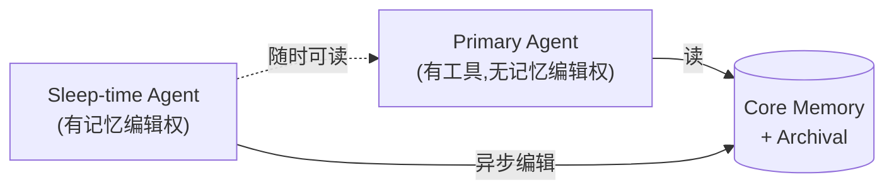

# Insights · 记忆公司赛道 —— 09 命题的外部验证与诊断

> 本篇是 [09-stateless-function.md](09-stateless-function.md) 的**外部验证**:用专门做 AI 记忆的头部公司(Letta / Mem0 / Zep)的公开架构和 benchmark,检验"LLM 是无状态函数,记忆 = 检索 + 注入"这个命题。
>
> 结论先说:**整个赛道的存在本身,就是 09 命题的最强实证。** 没有一家记忆公司押注"把记忆写进模型参数",它们全部默认 `llm(context) -> output` 这个签名不变,然后在这个约束下做工程。但它们各自的召回策略,都没有做对 09 §5 说的"按当前任务动态决定召回什么"。
>
> 这篇同时回应 [papers/01-review.md](../papers/01-review.md) R1-M1 的样本量质疑 —— 不用拆 Claude Code,而是用"整个记忆公司赛道都印证了同一论点"作为更强的外部证据。

## 0. 起点:一个市场的存在,就是命题的实证

[09-stateless-function.md](09-stateless-function.md) 的核心命题:**LLM 是无状态的纯函数,context 之外皆不存在**。由此推出:**所有"记忆"都是每轮重新组装 context 的检索系统**。

如果这个命题是对的,那应该有人专门做这种检索系统,而且应该形成一个市场。

**事实:这个市场已经存在,而且至少四家公司在认真做。**

| 公司 | 前身 / 背景 | GitHub Stars | 开源 | 核心哲学 |
|---|---|---|---|---|
| **Letta** | MemGPT (UC Berkeley Sky Computing Lab) | ~23.6K | Apache 2.0 | Agent 用工具调用**自己管理**记忆 |
| **Mem0** | YC 孵化 | ~47K | 开源 | 后台**自动抽取**事实 + 混合检索 |
| **Zep** | Graphiti 时序图谱 | - | Apache 2.0 | 事实带**时间窗口**的知识图谱 |
| **Cognee** | ECL 管道 → 类型化图谱 | - | 开源 | 文档密集型知识图谱 |

**关键事实:没有一家把记忆写进模型参数。** 它们全部在"模型外部的存储 + 检索 + 注入"这个框架内做工程。这不是偶然 —— 这是 `llm(context) -> output` 这个接口契约的直接后果。

Letta 团队(Sleep-time Compute 论文,2025-04)自己说的一句话,几乎就是 09 开篇命题的复刻:

> "Today's language models are **fundamentally stateless**, as they have no persistent memory of their experiences or learnings. **Persistent context forms the bridge** that allows insights gained during sleep time to improve future capability."

**他们的工程起点,就是 09 的命题起点。** 区别只在于:他们先发了论文(2025-04),我的 09 写于 2026-07 —— 他们动手更早,但框架更窄(单点解法);我的框架更抽象(统一命题),但动手更晚。

## 1. 三家公司的架构哲学

### Mem0:Extract-and-Retrieve(后台抽取)

最简单直接:`add()` 在每轮后调用,LLM 自动从对话里抽取"值得记的事实";`search()` 在下一轮前调用,按相似度召回。

```
对话 → LLM 抽取事实 → 三层混合存储(vector + graph + KV) → 相似度召回 → 注入 context
```

**三层存储**:vector index 做语义召回,graph layer 存实体关系,key-value 存快速结构化查询。自动抽取意味着开发者不用写"该记什么"的逻辑。

**甜区**:个性化。用户喜欢简洁回答、住柏林、在写 TypeScript 项目 —— 这种**稳定的事实**,Mem0 存取干净利落。

**撞墙的地方**:时序推理。它的 graph 层存关系,但没有一等公民的时间模型 —— 事实被**更新**而非**版本化**。当用户的套餐从 Pro 升到 Enterprise,Mem0 存了新值,但不能回答"3 月时用户是什么套餐"。这个缺陷直接体现在 LongMemEval 分数上(§3)。

### Zep:时序知识图谱(Graphiti)

押注完全不同的架构:**每条事实都是带时间窗口的边**。

```
事实变化时:不覆盖旧边 → 标记 valid-to → 创建新边带 valid-from
查询时:"现在什么是真的" / "3 月时什么是真的" 都能精确回答
```

这就是 Graphiti(Temporal Knowledge Graph)的核心。"用户在 Pro 套餐"不会被删掉,而是在升级时间戳后被标记失效,同时新建一条"用户在 Enterprise 套餐"的边。图谱保留了**完整的时间历史**。

### Letta:Agent 自管理记忆(OS 范式)

最激进的一家。不是"应用调用的记忆服务",而是**有状态的 agent 运行时**。

```
main context (RAM)  ↔  archival memory (disk)
        ↑
  agent 自己用工具调用决定:
  - 什么放进 main context
  - 什么 evict 到 archival
  - 什么时候从 archival 拉回来
```

Agent 通过 `core_memory_append` / `core_memory_replace` / `archival_memory_insert` / `archival_memory_search` 等工具调用,**自己决定**记忆的分配。这是 MemGPT 论文("Towards LLMs as Operating Systems")的直接产品化。

**区别于 Mem0/Zep**:那两家是**你调用的记忆服务**(store this, fetch that);Letta 是**你部署的 agent 运行时**(agent 自己管记忆)。Agent 是 long-lived、stateful 的,它"拥有"自己的记忆预算,就像进程拥有自己的地址空间。

## 2. 把三家映射进 09 的召回策略表

09 §3 列了五种"记忆方案"。现在用真实公司填进去:

| 09 §3 的策略 | 检索方式 | 有损程度 | **谁在做** |
|---|---|---|---|
| 完整 context(理想态) | 全部塞进去 | 无损 | 无人押注(长上下文撞 09 §4 三堵墙) |
| Compaction handoff | LLM 压缩后塞进去 | 高 | kimi-code、grok-build |
| 向量库 RAG | 相似度召回 | 低(召回不全) | **Mem0**(vector + graph + KV) |
| 知识图谱 | 结构化查询 | 低(建模不全) | **Zep**(+ 时间窗口) |
| 多尺度记忆 | 按时间尺度分层召回 | 各层不同 | **Letta**(main + archival + sleep-time) |

### 映射发现的三个事实

**事实一:09 §3 表里的"知识图谱(尚未普及)"这一格,被 Zep 填了。** 而且填得比 09 预想的更好 —— 加了时间维度(validity window),这是 09 原表没有的。这是一个需要**回填 09** 的更新。

**事实二:Letta 超出了 09 的五种分类。** Letta 不是任何一种"固定策略",而是**让 agent 自己选策略**。这接近 09 §5 说的"按当前任务动态召回",但代价是 LLM-in-the-loop 的延迟和 token 成本。这是一种 09 没列出的**第六种**:meta 策略(agent 自管理)。

**事实三:没有一家押注"完整 context"(理想态)。** 这是对 09 §4(长上下文撞三堵墙)的实证 —— 连专门做记忆的公司都不相信长上下文能消解记忆需求。

## 3. LongMemEval 的硬数字:召回策略的精度差距

理论分析不够,看 benchmark。**LongMemEval**(arXiv:2410.10813)是这个赛道的 de facto 压力测试 —— 专门测"长对话里的事实召回",而且是**事实会随时间变化**的场景。

用 GPT-4o 跑:

| 记忆方案 | LongMemEval 分数 | Context Tokens | 中位延迟 |
|---|---|---|---|
| **Zep**(时序图谱) | **63.8%** | 1.6K | 2.58s |
| **Mem0**(混合存储) | 49.0% | - | - |
| Full-context(全塞) | 基准 | 115K | 28.9s |

**三个结论:**

### 结论一:召回策略的选择,造成 15 分的精度差距

Zep 比 Mem0 高 **15 个百分点**,差距完全来自架构(时序图谱 vs 向量检索),不是模型能力。**这是 09 §5"召回策略决定一切"的最干净实证。**

### 结论二:Zep 用 1/70 的 context 达到更高精度

Zep 只塞 1.6K token 进 context,Full-context 塞 115K —— Zep 用 **1/72 的 token 量**拿到了更高的分数。这证明:**精准检索碾压无脑全塞**。这是 09 §4"长上下文是逃生舱不是终点"的直接证据。

### 结论三:全塞 context 不只是贵,还更慢

Full-context 中位延迟 28.9s,Zep 是 2.58s —— **11 倍延迟差距**。长上下文的 O(n²) 注意力不只是理论问题,是用户能感知到的卡顿。

### benchmark 争议:这个赛道还不成熟

Mem0 曾发布对自己有利的 benchmark 结果,Zep 和 Letta 都公开反驳(Zep 发文称自己比 Mem0 高 24%,Letta 指出 Mem0 不公平地 benchmark 了竞品)。**三家在 benchmark 上互相打架,本身就说明:没有一家做出让另外两家服气的方案。** 这个赛道还在早期。

## 4. Letta 的研究 roadmap 是 05/09 的镜像

这不是泛泛的类比,是逐条对照。Letta(UC Berkeley Sky Computing Lab)过去一年的研究发表,几乎逐条对应 05/09 提出的概念:

| 我在 05/09 提出的 | Letta 已发表的论文 / 产品 |
|---|---|
| [05](05-agi-7x24.md) §3.2 "睡眠巩固"(回放 + 固化) | **Sleep-time Compute**(2025-04, arXiv:2504.13171)—— sleep-time agent 异步编辑 primary agent 的 core memory |
| [09](09-stateless-function.md) §5 "按当前任务动态召回" | **Context Constitution**(2026-04)—— context 组装的原则 |
| [05](05-agi-7x24.md) §3.1 "多尺度记忆" | **MemGPT 2.0**:primary + sleep-time 双 agent 架构 |
| [09](09-stateless-function.md) §9.2 "因果状态库结构化" | **Context Repositories: Git-based Memory**(2026-02)—— 程序化 context 管理 + git 版本控制 |
| [05](05-agi-7x24.md) §3.3 "自演化 prompt" | **Memory Models: memory-native RL**(2026-06)—— 比我提的更激进,直接训练 |
| [09](09-stateless-function.md) §8 "LLM 会变有状态吗" | **Continual Learning in Token Space**(2025-12)—— 押注 token 空间持续学习 |

### 最直接的对应:Sleep-time Compute = 05 §3.2

我 05 §3.2 提出 agent 需要"睡眠周期" —— 回放最近经验、固化短期到长期、丢弃冗余。Letta 的 Sleep-time Compute 论文做了**完全对应**的工程实现:



Primary agent 不能编辑自己的 core memory —— 这个权力交给 sleep-time agent。Sleep-time agent 在 idle 时段异步地整理、压缩、优化 core memory,primary agent 随时读取(不等 sleep-time 完成)。

**这正好对应 05 §3.2 的"工作 16 小时 + 睡眠巩固 8 小时"架构**,只是 Letta 把它做成了两个并行的 agent 而非两个时段。

### 但 Letta 比我多走了一步

我在 [05](05-agi-7x24.md) §3.3 说"自演化 prompt"是基于经验修改 system prompt。Letta 的 **Continual Learning in Token Space** 更激进 —— 他们押注:

> "Memories learned in token space become **more valuable than the model weights themselves**: agents run perpetually, gradually enriching learned context through trillions of tokens of experience data, **seamlessly transferring their memories across many generations of models**."

**权重是临时的,learned context 才是持久的。** 这是一个非常强的赌注:agent 的"自我"不在模型参数里,在 token 空间的累积记忆里。这和 [07-philosophy-deep-dive.md](07-philosophy-deep-dive.md) §4 的 Parfit 因果连续性是同一个方向 —— 身份不在"物质相同",在"信息链不断"。

## 5. 但没有一家做对了"按当前任务动态召回"

这是这篇的核心诊断。三家公司在 09 §5 的三个问题上,各自只回答了一个:

| 09 §5 的问题 | Mem0 | Zep | Letta |
|---|---|---|---|
| **该注入什么** | 相似度盲召回 | 图结构查询 | Agent 自己决定 |
| **该注入多少** | 固定 top-K | 固定图遍历深度 | Agent 自己决定 |
| **该以什么形态注入** | 抽取的事实片段 | 图的边 + 时间窗 | Agent 自己编辑的 memory block |

### 三家的盲区

**Mem0 的盲区:不理解任务。** 它的召回是 embedding 相似度 —— 不管你这一轮在做什么,只要语义相近就召回。一个 agent 在 debug 时,可能被召回一堆"用户喜欢简洁回答"的无关偏好。**召回和当前任务脱钩。**

**Zep 的盲区:不理解任务,只理解时间。** 时序图谱在"这件事什么时候是真的"上极强,但在"这件事和当前任务有没有关系"上仍然是盲召回。图遍历是结构性的,不是任务驱动的。

**Letta 的盲区:理解任务,但代价太高。** Letta 最接近"按任务召回"(agent 自己决定),但每次记忆编辑都是一次 LLM 调用 —— 延迟翻倍、token 成本翻倍。而且 agent 可能**编辑错** —— 把不该记的记下来,该记的丢了。LLM-in-the-loop 的可靠性是 Letta 的软肋。

### 09 §5 的真正难题没有被解决

> **"按当前任务动态决定召回什么"这件事,需要一个理解当前任务的检索器。**

三家都没做对:
- Mem0 / Zep 用**固定策略**(相似度 / 图遍历)绕开了"理解任务"
- Letta 用**agent 自己**绕开了"理解任务",但引入了 LLM-in-the-loop 的成本和不可靠性

**真正需要的**(09 §9.1)是一个**轻量的、任务感知的检索器** —— 它理解"这一轮 agent 在做什么",然后从外部状态库里精准拉取相关上下文。这个检索器本身可能是一个小模型(不一定需要全能力的 LLM),但当前没有任何一家公司在做这个。

## 6. 三家各自缺什么(映射到 09 §9 的诊断)

基于 [09](09-stateless-function.md) §9 的诊断框架,三家各自缺的是:

| 09 §9 的研发方向 | Mem0 | Zep | Letta |
|---|---|---|---|
| ① 任务感知的检索器 | ❌ 盲召回 | ❌ 盲遍历 | ⚠️ 有( agent 自管理),但太贵 |
| ② 因果状态库结构化 | ❌ 扁平事实 | ⚠️ 有图,但是实体关系图不是因果图 | ❌ 文本块 |
| ③ 检索策略的元学习 | ❌ 无 | ❌ 无 | ⚠️ sleep-time 算雏形 |
| ④ 分层压缩精度优化 | ❌ 单层 | ⚠️ 时间分层 | ✅ main + archival 两层 |

### 最关键的缺口:因果状态库(②)

**没有任何一家做了"因果图"。** Zep 的 Graphiti 是实体关系图("用户" —[在套餐]→ "Pro"),但不是**因果图**("决策 A 导致了结果 B")。

[09](09-stateless-function.md) §9.2 说 7×24 需要把 wire log / SQLite 从"事件流"升级成"因果图",让检索能按**因果关系**而非时间或相似度召回。这个方向三家都没碰。这是最大的空白,也是可能的创业 / 研究机会。

### Letta 的 sleep-time 是最接近元学习(③)的

Letta 的 sleep-time agent 在 idle 时段整理 core memory —— 这某种意义上是"检索策略的元学习"(从记忆编辑的成功/失败里学习怎么更好地编辑)。但它学的是**记忆编辑策略**,不是**召回策略**。而且学习信号很弱(没有明确的"这次召回失败导致了幻觉"的反馈)。

## 7. 这对 7×24 AGI 意味着什么

把 §5 和 §6 接起来:

> **7×24 AGI 的真正瓶颈,不在这些记忆公司现在卖的任何一种方案里。**

| 方案 | 能撑多久不崩溃 | 瓶颈 |
|---|---|---|
| Mem0 | 小时级(个性化场景) | 盲召回 + 无时序 |
| Zep | 天级(状态追踪场景) | 盲遍历 + 无任务感知 |
| Letta | 天级(stateful agent 场景) | LLM-in-the-loop 太贵 + 不可靠 |
| **7×24 AGI 需要** | 月级 | 任务感知检索 + 因果图 + 元学习 |

**当前没有任何一家公司的方案,能撑到月级 7×24。** 它们解决的是"小时到天级的记忆",离"月级"还有一个数量级。这个差距,对应的是 [05](05-agi-7x24.md) 说的"五种新能力"里还没人做对的那几种。

### 谁最接近?

基于 §4 的对照,**Letta 最接近 7×24** —— 它是唯一一家在做 sleep-time compute(睡眠巩固)、continual learning(持续学习)、memory-native RL(记忆原生强化学习)的。它的研究 roadmap 和 05/09 的预测最吻合。

但 Letta 也是**最重的**(agent 运行时,不是可插拔服务)。这暗示一个可能性:**7×24 AGI 的记忆方案,可能不是一个可插拔的 memory layer,而是一个完整的 stateful agent 运行时。** 这和 05 §4 的结论("AGI 最后一公里是反熵基础设施")一致 —— 基础设施不是一个插件,是一整套。

## 8. 回应 review R1-M1 的样本量质疑

[papers/01-review.md](../papers/01-review.md) R1-M1 批评"只分析了两个框架,样本量不够,没有 Claude Code"。

这篇给出了一个**不同维度的回应**:不用再拆一个 agent 框架,而是看**专门做记忆的整个赛道**。

- 6 个 agent 框架(kimi-code / grok-build / Pi / Codex / OpenAI Agents SDK / Google ADK)全部能归入 09 的反熵策略集 → [08](08-self-rebuttal.md) 反驳 5 已经覆盖
- **现在再加上 4 家记忆公司(Letta / Mem0 / Zep / Cognee),全部默认 LLM 是无状态函数,全部在做检索 + 注入** → 09 核心命题的外部验证
- LongMemEval 的硬数字(召回策略造成 15 分差距)→ 09 §5"召回策略决定一切"的实证

**10 个独立实现(6 框架 + 4 记忆公司),跨四种语言(TS / Rust / Python / Go)、三种形态(CLI / 库 SDK / 记忆服务)、六个组织,全部收敛到同一套设计空间。** 巧合的概率极低。

> R1-M1 想要的是"再加一个 Claude Code"。这篇给的是"加一整个赛道"。**Claude Code 是一个数据点,记忆公司赛道是十个数据点。**

## 9. 最终的一句话

> **专门做 AI 记忆的公司(Letta / Mem0 / Zep)全部默认 LLM 是无状态函数,然后做检索 + 注入。这本身证明了 [09](09-stateless-function.md) 的核心命题。**
>
> 但它们各自的召回策略,对应了"该注入什么 / 多少 / 什么形态"的不同回答,而且没有一家做对了"按当前任务动态召回"。LongMemEval 上 Zep 比 Mem0 高 15 分,用 1/72 的 token 量碾压 Full-context —— 召回策略的精度差距是实打实的。但这个赛道还在早期(三家在 benchmark 上互相打架),离月级 7×24 还有一个数量级。
>
> Letta 的研究 roadmap(Sleep-time Compute / Continual Learning / Memory Models)是 [05](05-agi-7x24.md)/[09](09-stateless-function.md) 预测的镜像 —— 我们在和 UC Berkeley 想同一件事。他们先动了手(2025-04),我的框架更完整(2026-07)。最大的共同盲区是:**没有人做了因果状态库和任务感知检索器。这是 7×24 AGI 记忆架构的两个空白,也是可能的机会。**

---

## 参考资料

完整的参考文献（论文、博客、书籍）已集中维护在 [REFERENCES.md](REFERENCES.md)，所有链接均已验证。本篇涉及的核心参考：

- **Packer, C. et al.** (2023) · *MemGPT: Towards LLMs as Operating Systems* · arXiv:2310.08560 —— Letta 的起源论文,OS 范式的记忆管理
- **Lin, J. et al.** (2025) · *Sleep-time Compute: Beyond Inference Scaling at Test-time* · arXiv:2504.13171 —— Letta 的睡眠巩固工程实现,对应 05 §3.2
- **Wu, W. et al.** (2024) · *LongMemEval: Benchmarking Chat Assistants on Long-Term Interactive Memory* · arXiv:2410.10813 —— 记忆赛道的 de facto benchmark,§3 硬数字来源
- **Maharana, A. et al.** (2024) · *LOCOMO: Long Context Multi-Turn Conversational Memory* · arXiv:2402.17753 —— 长对话记忆评测基准

> 完整链接见 [REFERENCES.md](REFERENCES.md)。
