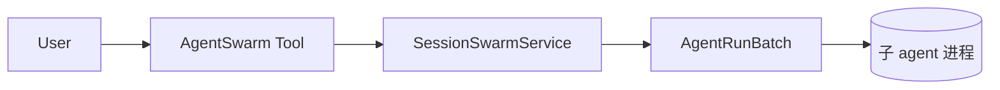
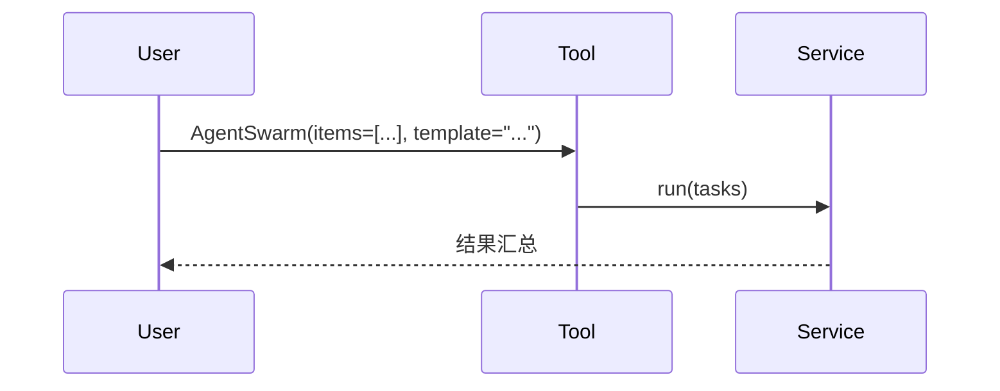

# 拆解模板

> 复制此模板开始一篇新的拆解。方括号 `[...]` 是占位符,写完删掉。

---

# [框架名] · [模块名] 拆解

> 例如:Kimi Code · Swarm Mode 拆解

**版本/Commit**:[填具体的 commit hash 或 tag,保证可复现]
**源码位置**:[框架仓库 URL]
**拆解日期**:YYYY-MM-DD

## 1. 这个模块要解决什么问题

用一两段话讲清楚:
- 用户/系统的什么场景需要它
- 没有它会怎样(退化成什么)
- 它在框架整体架构中的位置

不要直接抄 README,用你自己的话复述。

## 2. 架构概览

### 2.1 模块边界

用 mermaid 画出这个模块与外部世界的边界:



### 2.2 核心抽象

列出模块内最关键的几个概念/类,每个一句话说职责:

| 抽象 | 文件 | 职责 |
|---|---|---|
| `AgentRunBatch` | `agentRunBatch.ts` | 一次群体调度的批处理器 |
| `SessionSwarmService` | `sessionSwarmService.ts` | Session 级别的 swarm 入口 |

## 3. 关键流程

按用户视角的 happy path 拆,每一步都画图 + 配源码片段。

### 3.1 [流程名,例如 "启动一次 swarm"]



**源码追踪**:

```
agent-swarm.ts:130  execution(args)
  → sessionSwarmService.ts:100  run(args)
    → agentRunBatch.ts:156  AgentRunBatch.run()
      → agentRunBatch.ts:181  schedule()
        → agentRunBatch.ts:254  startAttempt(state)
```

关键代码(带行号):

```typescript
// agentRunBatch.ts:195-200
while (
  this.normalLaunchCount < INITIAL_LAUNCH_LIMIT &&
  this.pending.length > 0 &&
  !this.rateLimitMode &&
  !this.isAtConcurrencyLimit()
) {
  this.startAttempt(this.pending.shift()!);
```

## 4. 边界条件与失败模式

这是拆解最有价值的部分。每个边界条件都列清楚:

| 触发条件 | 行为 | 源码位置 |
|---|---|---|
| 并发超过 `maxConcurrency` | 暂停启动新任务 | `isAtConcurrencyLimit()` |
| Provider 返回 rate limit | 任务 requeue,进入退避模式 | `requeueRateLimited()` |
| 用户 abort | 所有在飞任务取消 | `batchAbortListener` |

## 5. 硬编码参数表

把所有 magic number 列出来,标注默认值和配置入口:

| 参数 | 默认值 | 配置方式 | 含义 |
|---|---|---|---|
| `INITIAL_LAUNCH_LIMIT` | 5 | 硬编码 | 启动阶段的最大并发 |
| `KIMI_CODE_AGENT_SWARM_MAX_CONCURRENCY` | 无上限 | 环境变量 | 整体并发上限 |

## 6. 设计权衡

这一章是你自己观点的发挥:

- 为什么这么设计?(猜测 + 证据)
- 有什么遗憾/可以改进的地方?
- 对比同类框架(Claude Code / Cursor)怎么做的?

## 7. 一句话总结

> 用一句话让读者带走核心洞察。
> 例如:"kimi-code 的群体智能本质是一个带 rate limit 退避的批处理调度器,不是真正的多 agent 协作。"

## 参考资料

- [相关 KLIP/RFC/设计文档]
- [对比框架的对应实现]
